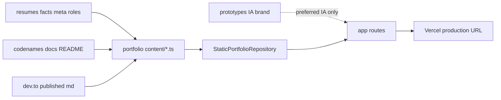

# LinkedIn-ready portfolio MVP

## Recommended execution authority

| Slice              | Recommended authority | Agent instruction                                      |
| ------------------ | --------------------- | ------------------------------------------------------ |
| plan-review        | Plan-only PR          | Do not implement. Stop after opening the plan-only PR. |
| content-foundation | Open PR only          | Do not merge. Stop after opening the PR.               |
| linkedin-surfaces  | Open PR only          | Do not merge. Stop after opening the PR.               |
| plan-closure       | Open PR only          | Do not merge. Stop after opening the PR.               |

Repo default: **Open PR only** ([planning-standards.md](../standards/planning-standards.md#repo-default-when-no-plan-slice-applies)).

## Repository topology (default)

This invariant prevents accidental stacked PRs. Multi-slice plans stack execution order, not Git branches.

The repository integration branch is `main`. Implementation slices start from and target `main` by default.

**Before implementation:** start this slice from the latest integration branch (`git fetch` then a fresh branch from `origin/main`).

**Before opening the PR:** verify the branch represents only this slice — previous-slice work is present through the integration branch, not through branch ancestry.

**After opening the PR:** verify the GitHub PR base branch is `main` and the diff does not include previous-slice work except through merged `main`.

## Locked decisions

- **Ship path:** Production Next.js routes under [`app/`](../../app/), fed by typed modules under [`content/`](../../content/) via [`StaticPortfolioRepository`](../../repositories/static-portfolio-repository.ts). Do **not** serve or import [`prototypes/`](../../prototypes/) into the build ([architecture](../../docs/architecture/overview.md)).
- **Case studies (exactly two):** **Codenames AI** and **Renovate governance ladder**.
- **Visual bar:** Brand-close to the prototype (tokens, Newsreader / Source Sans 3 / IBM Plex Mono, shared top nav) — not a pixel port. Skip system map, search/filter chrome, and contact form.
- **Contact:** Mailto + LinkedIn + GitHub + DEV blog (no form). Identity from sibling workspace `resumes/meta/profile.yml`.
- **Articles:** Index entries that link out to published DEV.to posts (canonical markdown in sibling `codenames-ai-guesser`). No full article detail routes in this plan.
- **Out of scope:** `/ecosystem` map, remaining prototype project pages, chatbot, Supabase, Atlassian case-study pages (facts may appear lightly on About only).
- **Project section model:** Flexible typed sections (see below). The prototype’s case-study sequence is the **preferred pattern**, not a mandatory schema. Include only sections supported by evidence.

## Project section model (flexible)

Do **not** lock every project into a fixed ordered list such as `problem → role → overview → decisions → outcomes → evidence`. That shape fits product case studies (Codenames AI) but can force operational / governance work (Renovate ladder) into weak or invented “outcomes” prose.

**Preferred case-study sequence** (prototype IA — use when evidence supports it):

`problem → role → overview → decisions → outcomes → evidence`

**Domain shape** (content-foundation):

```ts
type ProjectSectionKind =
  | "context"
  | "problem"
  | "role"
  | "system"
  | "decisions"
  | "constraints"
  | "operation"
  | "outcomes"
  | "lessons"
  | "evidence";

interface ProjectSection {
  id: string;
  kind: ProjectSectionKind;
  title: string;
  body: string;
}
```

**Inclusion rules:**

- Include **only** sections supported by workspace evidence. Do not invent section bodies to satisfy a template.
- Every project must include: **context or system**, **contribution or role**, and **evidence**.
- **Outcomes are optional** when no defensible outcome claim exists (prefer linking field reports / public artifacts over invented KPIs).
- Renovate may emphasize `system` / `operation` / `constraints` / `decisions` (governance, automation layers, authority boundaries, stop conditions) rather than a conventional product-outcomes arc.
- Codenames may follow the preferred product case-study sequence when evidence supports each section.

## Content authority (workspace sources)

Claims must follow this stack. Prototype copy is **IA / brand preference only**, never evidence and never a mandatory section checklist.

Sibling repos are local workspace checkouts next to this repository (not imported at build time). Manual transcription into `content/*.ts` for MVP.

| Layer                                 | Workspace path                                                                            | Role                                                                                                      |
| ------------------------------------- | ----------------------------------------------------------------------------------------- | --------------------------------------------------------------------------------------------------------- |
| **Career facts (canonical)**          | `resumes/facts/`, `resumes/meta/`, `resumes/roles/`                                       | Only source for titles, employers, metrics, product claims, contact                                       |
| **Project systems / ops**             | `codenames-ai-guesser/docs/`, `codenames-ai-guesser/README.md`                            | Case-study depth: pipeline, Renovate ladder, editorial runbooks                                           |
| **Published writing**                 | `codenames-ai-guesser/docs/dev.to/published/`                                             | Article index titles/summaries + live DEV URLs                                                            |
| **Application prose (optional tone)** | `resumes/applications/riot-sydney-2026/` (`brief.yml` / `include.yml` / generated `out/`) | Selection/emphasis hints only — do not invent facts; do not use `research.md`                             |
| **IA / brand (design-only)**          | `prototypes/ai-engineering-portfolio/` (this repo)                                        | Preferred section pattern, nav, visual tokens — replace placeholder email/KPIs; omit unsupported sections |
| **Secondary (not MVP case studies)**  | `ai-learning/`                                                                            | Optional later lab link; not one of the two shipped case studies                                          |

**Stop rules (same spirit as resumes facts-vs-prose):**

- Missing required fact for a selected claim → stop and ask; do not invent metrics or outcomes.
- Do not strengthen causality/ownership beyond inventory facts.
- Prototype “outcomes” and placeholder contact (`hello@example.com`) are not evidence.
- Do not invent an “outcomes” section (or fill any section with weak/repetitive prose) merely because the preferred sequence lists it — omit the section instead.
- Codenames inventory is strong on qualitative/system claims and **light on hard product KPIs** — do not invent Active-player numbers; prefer linking field reports.



## User-facing acceptance (done when true)

A hiring manager opening the production URL can:

1. Land on a real homepage (not “under construction”)
2. Browse `/projects` and open **two** case studies grounded in workspace evidence
3. Browse `/articles` with links to real published posts
4. Reach `/about` with email + LinkedIn + GitHub (+ blog)

Nav: Home · Projects · Articles · About (no System). Keep `/ecosystem` unlinked in primary nav.

## Content source map (by surface)

### About / contact / homepage identity

| Need                                   | Canonical source                                                                                                 |
| -------------------------------------- | ---------------------------------------------------------------------------------------------------------------- |
| Name, location, email, links           | `resumes/meta/profile.yml` — email `michael@multipliers.dev`; LinkedIn / GitHub / `https://dev.to/michaeltruong` |
| Skills clusters (optional About)       | `resumes/meta/skills.yml`                                                                                        |
| Education / awards (optional About)    | `resumes/meta/education.yml`, `resumes/meta/awards.yml`                                                          |
| Role timeline flavor (optional, short) | `resumes/roles/` — Atlassian SWE/EM/AIM titles & dates                                                           |
| Homepage positioning IA                | Prototype [`index.html`](../../prototypes/ai-engineering-portfolio/index.html) — rewrite claims from facts below |
| Brand tokens / type                    | Prototype [`brand-spec.md`](../../prototypes/ai-engineering-portfolio/brand-spec.md)                             |

### Case study 1 — Codenames AI

| Need                                       | Canonical source                                                                                                                                                |
| ------------------------------------------ | --------------------------------------------------------------------------------------------------------------------------------------------------------------- |
| Product claims / stack / production scope  | `resumes/facts/codenames-ai-e2e.yml`, `resumes/facts/codenames-ai-telemetry.yml`                                                                                |
| Live product + modes                       | `codenames-ai-guesser/README.md` (`codenames-ai.com`)                                                                                                           |
| Engineering depth (validation / outcomes)  | `codenames-ai-guesser/docs/ai-pipeline-outcome.md` (analytics/CI docs as needed)                                                                                |
| Preferred section IA (omit if unsupported) | Prototype [`project-codenames-ai.html`](../../prototypes/ai-engineering-portfolio/project-codenames-ai.html) — product case-study arc when evidence supports it |
| Related writing                            | `codenames-ai-guesser/docs/dev.to/published/` — schema-first Zod, model experiments, active-players sessions                                                    |

### Case study 2 — Renovate governance ladder

Treat as an **operational / governance system** (automation layers, failure controls, authority boundaries), not a conventional “project with outcomes.” Prefer `system` / `operation` / `constraints` / `decisions` / `evidence` over inventing product-style outcomes.

| Need                                       | Canonical source                                                                                                                                                                                   |
| ------------------------------------------ | -------------------------------------------------------------------------------------------------------------------------------------------------------------------------------------------------- |
| Ladder / authority / stop causes           | `codenames-ai-guesser/docs/renovate-workflow.md`                                                                                                                                                   |
| Cross-cutting agent workflow facts         | `resumes/facts/ai-engineering-workflows.yml`                                                                                                                                                       |
| Public narrative                           | `codenames-ai-guesser/docs/dev.to/published/evidence-driven-dependency-upgrades.md`, `agent-plans-authority-handoffs.md`                                                                           |
| Preferred section IA (omit if unsupported) | Prototype [`project-renovate-governance.html`](../../prototypes/ai-engineering-portfolio/project-renovate-governance.html) — reshape to governance/ops kinds as evidence allows; outcomes optional |

### Articles index (link out)

Populate from published markdown (title + short summary + canonical DEV URL). Prefer posts tied to the two case studies; 4–6 entries is enough for MVP:

- Schema-first / Zod guardrails
- Model experiments as architectural stress test
- Active players / session counting
- Evidence-driven dependency upgrades
- Agent plans & authority handoffs

Optional extras later: editorial critique posts, cloud-agent post (ai-learning tagged).

### Production targets

| Surface        | Route                                                                                |
| -------------- | ------------------------------------------------------------------------------------ |
| Home           | [`app/page.tsx`](../../app/page.tsx)                                                 |
| Projects index | [`app/projects/page.tsx`](../../app/projects/page.tsx)                               |
| Case studies   | `app/projects/[slug]/page.tsx`                                                       |
| Articles       | [`app/articles/page.tsx`](../../app/articles/page.tsx)                               |
| About          | [`app/about/page.tsx`](../../app/about/page.tsx)                                     |
| Brand / fonts  | [`app/globals.css`](../../app/globals.css), [`app/layout.tsx`](../../app/layout.tsx) |

---

## Plan review

**Recommended authority:** Plan-only PR

**Rationale:**

- Plan must be reviewed before implementation slices begin
- Expected diff is plan artifact only

**Agent instruction:** Do not implement. Stop after opening the plan-only PR.

**Goal:** Land this plan under `.cursor/plans/` for review.

**Acceptance:**

- Only `.cursor/plans/2026-08-04-linkedin-ready-portfolio-mvp.plan.md` (plus planning-standard alignment) is in the PR diff
- `plan-review` todo marked `completed` in frontmatter
- PR base is `main`

---

## Slice — content-foundation

**Recommended authority:** Open PR only

**Rationale:**

- Data/domain only; pages may remain placeholders
- Merge-safe without changing recruiter-facing chrome yet
- Needs review of claim fidelity vs resumes inventory

**Agent instruction:** Do not merge. Stop after opening the PR.

**Goal:** Extend domain types and populate static content from workspace evidence.

**Work:**

- Extend [`domain/project.ts`](../../domain/project.ts) / [`domain/article.ts`](../../domain/article.ts):
  - **Project:** `slug`, `title`, `summary`, `tags`, `kind`/`eyebrow`, ordered `sections: ProjectSection[]` using the flexible `ProjectSectionKind` model above (preferred prototype sequence when evidence supports it — **not** a fixed required list), related links. Evidence via [`domain/evidence.ts`](../../domain/evidence.ts).
  - **Article:** `slug`, `title`, `summary`, `year`, `tags`, `url` (external DEV), optional `relatedProjectSlug`.
  - **Profile:** `domain/profile.ts` + `content/profile.ts` from `resumes/meta/profile.yml` (+ short bio composed from facts). Add `getProfile()` on [`PortfolioRepository`](../../repositories/portfolio-repository.ts).
- Populate [`content/projects.ts`](../../content/projects.ts) and [`content/articles.ts`](../../content/articles.ts) by transcribing/compressing workspace evidence (manual copy; no YAML import at build time). Audit evidence **before** choosing which section kinds to include; omit unsupported kinds (especially Renovate `outcomes`).
- Update [`tests/static-portfolio-repository.test.ts`](../../tests/static-portfolio-repository.test.ts).

**Acceptance:**

- Two projects (Codenames AI, Renovate governance) and 4–6 articles load via repository
- Each project includes context/system, contribution/role, and evidence; outcomes only when defensible
- Claims do not invent metrics beyond inventory; evidence URLs point at real public artifacts where possible
- `npm run typecheck`, `npm test`, `npm run lint` pass
- Mark `content-foundation` completed in plan frontmatter in the same PR

**Verify:** `npm run typecheck && npm test && npm run lint`

---

## Slice — linkedin-surfaces

**Recommended authority:** Open PR only

**Rationale:**

- User-facing LinkedIn URL replacement; needs visual/content review on Vercel preview
- Depends on content-foundation merged to `main`

**Agent instruction:** Do not merge. Stop after opening the PR.

**Prerequisite:** `content-foundation` merged to `main`.

**Goal:** Replace under-construction UX with brand-close pages wired to the repository.

**Work:**

- Shared `SiteHeader` / `SiteFooter` (mobile nav clears open state on widen)
- Next font loaders for Newsreader, Source Sans 3, IBM Plex Mono; brand-spec CSS variables
- Pages: home, `/projects`, `/projects/[slug]`, `/articles`, `/about` via repository
- Case study: render each project’s `sections` in order + desktop TOC (section set may differ per project); `notFound()` for unknown slugs
- Article rows link out to DEV.to
- Metadata suitable for LinkedIn link previews
- Update [`README.md`](../../README.md): LinkedIn-ready static MVP + production URL note
- Nav: Home · Projects · Articles · About (no System / ecosystem)

**Acceptance:**

- User-facing acceptance checklist above is true on local `npm run dev` and Vercel preview
- Desktop intentionally changed (full shell); verify mobile nav at ~375px as well
- Mark `linkedin-surfaces` completed in plan frontmatter in the same PR

**Verify:** `npm run typecheck && npm test && npm run lint && npm run build`; manual check of five surfaces + mobile nav

---

## Plan closure (docs-only PR)

**Recommended authority:** Open PR only

**Rationale:**

- Docs-only archival; human review of closure checklist

**Agent instruction:** Do not merge. Stop after opening the PR.

After the last implementation slice merges, open a final docs-only closure PR:

1. Verify all implementation todos are already `completed` (or `cancelled` if deferred); fix stragglers only
2. Add a `# Shipped` closure note at the top of the plan body
3. Move this file to `.cursor/plans/archive/YYYY-MM-DD-linkedin-ready-portfolio-mvp.plan.md`
4. Mark `plan-closure` `completed` and update agent prompt references to the archived path

Do not archive inside implementation PRs.

## Explicit non-goals (defer)

- Ecosystem / system map
- Contact form / server actions
- Hosting full article bodies in Next.js / MDX blog
- Search/tag filters
- Editorial / MCP / portfolio-as-project case studies (evidence exists; not in this MVP)
- Atlassian growth/AIM deep case studies (facts stay in resumes for About flavor only)
- Pixel-perfect CSS port of `site.css`
- Automated sync from resumes YAML into portfolio `content/` (manual port for MVP)

---

## Agent prompts (copy/paste for Cursor)

Use a **fresh Agent-mode chat** per slice.

- **Plan review — plan-review**
  - "Execute plan-review from `@.cursor/plans/2026-08-04-linkedin-ready-portfolio-mvp.plan.md` only. Redraft or commit the plan artifact per repo planning standards. Start from latest `origin/main`, open the PR targeting `main`, and verify the GitHub PR base branch is `main` after creation. **Agent instruction:** Do not implement. Stop after opening the plan-only PR. Mark `plan-review` completed in plan frontmatter. Do not start implementation slices."

- **Slice — content-foundation**
  - "Implement content-foundation from `@.cursor/plans/2026-08-04-linkedin-ready-portfolio-mvp.plan.md` only. Prerequisite: plan-review merged. Start this slice from the latest `origin/main`, implement only this slice, verify the branch represents only this slice before opening the PR, open the PR targeting `main`, and verify the GitHub PR base branch is `main` after creation. Populate content from sibling workspace resumes + codenames-ai-guesser evidence (not prototype KPIs). Use the flexible `ProjectSection` model — preferred prototype sequence is not mandatory; include only evidence-backed sections; Renovate may omit outcomes. **Agent instruction:** Do not merge. Stop after opening the PR. Mark `content-foundation` completed in plan frontmatter. Do not start linkedin-surfaces or later slices. Do not archive the plan."

- **Slice — linkedin-surfaces**
  - "Implement linkedin-surfaces from `@.cursor/plans/2026-08-04-linkedin-ready-portfolio-mvp.plan.md` only. Prerequisite: content-foundation merged. Start this slice from the latest `origin/main`, implement only this slice, verify the branch represents only this slice before opening the PR, open the PR targeting `main`, and verify the GitHub PR base branch is `main` after creation. **Agent instruction:** Do not merge. Stop after opening the PR. Mark `linkedin-surfaces` completed in plan frontmatter. Do not start plan closure. Do not archive the plan."

- **Plan closure — plan-closure**
  - "Execute plan-closure from `@.cursor/plans/2026-08-04-linkedin-ready-portfolio-mvp.plan.md` only. Prerequisites: all implementation slices merged and already marked completed in frontmatter. Start this slice from the latest `origin/main`, verify the branch represents only this slice before opening the PR, open the PR targeting `main`, and verify the GitHub PR base branch is `main` after creation. Docs-only PR: verify slice todos, add `# Shipped` note, move plan to `.cursor/plans/archive/YYYY-MM-DD-linkedin-ready-portfolio-mvp.plan.md`, mark `plan-closure` completed, update references. **Agent instruction:** Do not merge. Stop after opening the PR."
