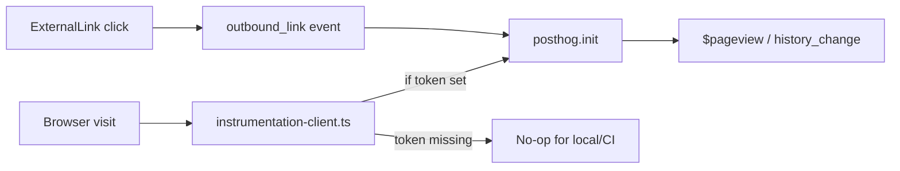

# Portfolio PostHog analytics

## Recommended execution authority

| Slice             | Recommended authority | Agent instruction                                      |
| ----------------- | --------------------- | ------------------------------------------------------ |
| plan-review       | Plan-only PR          | Do not implement. Stop after opening the plan-only PR. |
| posthog-analytics | Open PR only          | Do not merge. Stop after opening the PR.               |
| plan-closure      | Open PR only          | Do not merge. Stop after opening the PR.               |

Repo default: **Open PR only** ([planning-standards.md](../standards/planning-standards.md#repo-default-when-no-plan-slice-applies)).

## Repository topology (default)

This invariant prevents accidental stacked PRs. Multi-slice plans stack execution order, not Git branches.

The repository integration branch is `main`. Implementation slices start from and target `main` by default.

**Before implementation:** start this slice from the latest integration branch (`git fetch` then a fresh branch from `origin/main`).

**Before opening the PR:** verify the branch represents only this slice — previous-slice work is present through the integration branch, not through branch ancestry.

**After opening the PR:** verify the GitHub PR base branch is `main` and the diff does not include previous-slice work except through merged `main`.

---

## Context

The portfolio is Next.js **16.3** App Router, RSC-first, with **no analytics today** and no `.env.example`. PostHog already has a **Portfolio Projects** project (`423501`, US cloud).

Per [PostHog Next.js docs](https://posthog.com/docs/libraries/next-js), Next 15.3+ should init via root `instrumentation-client.ts` (not a layout provider). SPA navigations are covered by `defaults: '2026-05-30'` (`capture_pageview: 'history_change'`).

**Chosen scope (implementation PR):** pageviews + outbound link clicks. No cookie banner, privacy page, reverse proxy, session replay, or server-side `posthog-node`.



Mirror the Codenames pattern of **env-gated init** and an `analytics_environment` super-property, but keep portfolio instrumentation lighter (no game-session plumbing).

---

## Plan review (pre-slice)

**Recommended authority:** Plan-only PR

**Rationale:**

- Plan must be reviewed before implementation begins
- Expected diff is plan artifact only

**Agent instruction:** Do not implement. Stop after opening the plan-only PR.

---

## Slice — posthog-analytics

**Recommended authority:** Open PR only

**Rationale:**

- One merge-safe concern: client analytics wiring + thin outbound instrumentation + docs/env scaffolding
- Env-gated so local/CI remain no-op without secrets
- Human review of privacy posture (no replay/autocapture) and event naming before merge

**Agent instruction:** Do not merge. Stop after opening the PR.

**Goal:** Ship client-side PostHog pageviews and outbound-link tracking, gated by public env vars.

### 1. Dependencies and env scaffolding

- Add `posthog-js` dependency.
- Add [`.env.example`](../../.env.example):

```bash
NEXT_PUBLIC_POSTHOG_PROJECT_TOKEN=
NEXT_PUBLIC_POSTHOG_HOST=https://us.i.posthog.com
```

- Document in [`README.md`](../../README.md) / [`AGENTS.md`](../../AGENTS.md): optional PostHog env; unset = no tracking; set the same vars on Vercel for preview/production.
- Wire `VERCEL_ENV` into the client bundle via [`next.config.ts`](../../next.config.ts) `env` (same idea as Codenames’ `VITE_VERCEL_ENV`) so preview vs production can be filtered in PostHog.

### 2. Client init

Add root [`instrumentation-client.ts`](../../instrumentation-client.ts):

- Read `NEXT_PUBLIC_POSTHOG_PROJECT_TOKEN`; **return early** if missing/blank.
- `posthog.init(token, { api_host, defaults: '2026-05-30', autocapture: false, disable_session_recording: true })`.
- Register `analytics_environment` (`local` | `preview` | `production` | `e2e`) from a small helper under `lib/analyticsEnvironment.ts` (Playwright / `127.0.0.1` → `e2e` so test traffic is filterable).

No layout changes required for pageviews when using `instrumentation-client` + recent defaults.

### 3. Outbound link events

Convert [`components/ExternalLink.tsx`](../../components/ExternalLink.tsx) to a client component and on click capture:

- event: `outbound_link`
- properties: `href`, optional `link_label` (from `aria-label` or text when cheap)

Keep `target="_blank"` / `rel="noopener noreferrer"`. Missing PostHog init remains a safe no-op via a tiny `lib/posthog.ts` capture guard.

### 4. Tests and docs

- Unit tests for `resolveAnalyticsEnvironment` and init/capture guards (Vitest + `posthog-js` mock).
- Do **not** assert PostHog in Playwright e2e; env-gated no-op keeps CI green.
- Short note that analytics is client-only and orthogonal to `PortfolioRepository`.

### 5. Deploy / verify (human after merge or on preview)

- Set Vercel env vars for the Portfolio Projects token + `https://us.i.posthog.com`.
- Confirm Live events: `$pageview` on route changes, `outbound_link` from Articles/GitHub/case-study links.
- Filter dashboards with `analytics_environment = production`.

**Acceptance:**

- Missing token → no PostHog init / no events in local and CI
- With token → `$pageview` on first load and client navigations; `outbound_link` on `ExternalLink` click
- `analytics_environment` registered for filtering
- Autocapture and session recording remain off
- lint, typecheck, test, build green

**Out of scope for this slice:**

- Cookie consent / privacy route
- Reverse proxy / ad-block hardening
- Session replay, heatmaps config, feature flags
- `@posthog/next` pre-release package
- Server-side Node SDK

**Verify:**

- `npm run lint`
- `npm run typecheck`
- `npm run test`
- `npm run build`
- Manual: with `.env.local` token, navigate routes + click an `ExternalLink`; confirm events in PostHog Live

---

## Plan closure (docs-only PR)

**Recommended authority:** Open PR only

**Rationale:**

- Docs-only archival; human review of closure checklist

**Agent instruction:** Do not merge. Stop after opening the PR.

After the last implementation slice merges, open a final docs-only closure PR:

1. Verify all implementation todos are already `completed` (or `cancelled` if deferred); fix stragglers only
2. Add a `# Shipped` closure note at the top of the plan body
3. Move this file to `.cursor/plans/archive/2026-08-10-portfolio-posthog-analytics.plan.md`
4. Mark `plan-closure` `completed` and update agent prompt references to the archived path

Do not archive inside implementation PRs. Implementation PRs mark their own slice `completed` in frontmatter in the same PR as the code.

---

## Agent prompts (copy/paste for Cursor)

Use a **fresh Agent-mode chat** per slice.

- **Plan review — plan-review**
  - "Execute plan-review from `@.cursor/plans/2026-08-10-portfolio-posthog-analytics.plan.md` only. Redraft or commit the plan artifact per repo planning standards. Start from the latest `origin/main`, open the PR targeting `main`, and verify the GitHub PR base branch is `main` after creation. **Agent instruction:** Do not implement. Stop after opening the plan-only PR. Mark `plan-review` completed in plan frontmatter. Do not start implementation slices."

- **Slice — posthog-analytics**
  - "Implement slice posthog-analytics from `@.cursor/plans/2026-08-10-portfolio-posthog-analytics.plan.md` only. Prerequisite: plan-review merged. Start this slice from the latest `origin/main`, implement only this slice, verify the branch represents only this slice before opening the PR, open the PR targeting `main`, and verify the GitHub PR base branch is `main` after creation. **Agent instruction:** Do not merge. Stop after opening the PR. Mark `posthog-analytics` completed in plan frontmatter. Do not start plan closure. Do not archive the plan."

- **Plan closure — plan-closure**
  - "Execute plan-closure from `@.cursor/plans/2026-08-10-portfolio-posthog-analytics.plan.md` only. Prerequisites: all implementation slices merged and already marked completed in frontmatter. Start this slice from the latest `origin/main`, verify the branch represents only this slice before opening the PR, open the PR targeting `main`, and verify the GitHub PR base branch is `main` after creation. Docs-only PR: verify slice todos, add `# Shipped` note, move plan to `.cursor/plans/archive/2026-08-10-portfolio-posthog-analytics.plan.md`, mark `plan-closure` completed, update references. **Agent instruction:** Do not merge. Stop after opening the PR."
