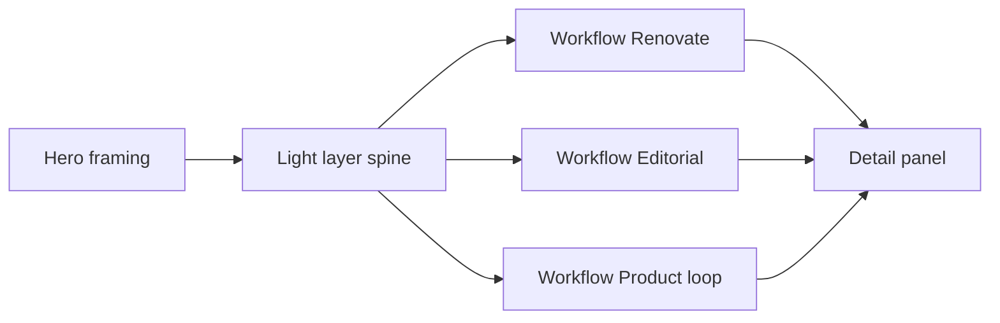

# Ecosystem explorer (read-only product page)

## Recommended execution authority

| Slice                      | Recommended authority | Agent instruction                                      |
| -------------------------- | --------------------- | ------------------------------------------------------ |
| plan-review                | Plan-only PR          | Do not implement. Stop after opening the plan-only PR. |
| ecosystem-domain-content   | Open PR only          | Do not merge. Stop after opening the PR.               |
| ecosystem-canvas-page      | Open PR only          | Do not merge. Stop after opening the PR.               |
| ecosystem-interview-polish | Open PR only          | Do not merge. Stop after opening the PR.               |
| plan-closure               | Open PR only          | Do not merge. Stop after opening the PR.               |

Repo default: **Open PR only** ([planning-standards.md](../standards/planning-standards.md#repo-default-when-no-plan-slice-applies)).

## Repository topology (default)

This invariant prevents accidental stacked PRs. Multi-slice plans stack execution order, not Git branches.

The repository integration branch is `main`. Implementation slices start from and target `main` by default.

**Before implementation:** start this slice from the latest integration branch (`git fetch` then a fresh branch from `origin/main`).

**Before opening the PR:** verify the branch represents only this slice — previous-slice work is present through the integration branch, not through branch ancestry.

**After opening the PR:** verify the GitHub PR base branch is `main` and the diff does not include previous-slice work except through merged `main`.

---

## Decisions (locked)

- **Shape:** 1A — product page with curated workflow canvases (not a mega-graph). Do **not** ship A + half of B in v1.
- **Overview (v1):** a **light orientation spine** only — a small set of high-level layer nodes (e.g. Projects → AI workflows → governance/feedback → evidence/outputs), not the full entity inventory as a graph. May still use React Flow, but must stay thinner than the three operational canvases.
- **Deferred:** full entity/relationship synthesis map (the “how every node connects” view) until relationships survive real interview use.
- **Interaction:** read-only — pan, zoom, fit, select node → detail panel. No edit, drag-to-rewire, or persistence.
- **Stack:** `@xyflow/react` for canvases (n8n/Relevance-like nodes/edges). Style with existing portfolio tokens ([`docs/design-system.md`](../../docs/design-system.md)) — warm neutrals + sage accent, not a purple Relevance clone.
- **Data:** static modules under `content/`, served only via [`PortfolioRepository`](../../repositories/portfolio-repository.ts). Extend the empty stubs in [`content/ecosystem.ts`](../../content/ecosystem.ts), [`domain/entities.ts`](../../domain/entities.ts), [`domain/relationships.ts`](../../domain/relationships.ts).
- **Claims:** evidence-backed only (portfolio projects + sibling runbooks/facts already used for case studies). No invented metrics or Savepoints-as-shipped.
- **Nav:** keep `/ecosystem` unlinked until the canvases ship; add to [`lib/nav.ts`](../../lib/nav.ts) in the UI slice.
- **Presentation vs knowledge:** evidence belongs on the knowledge model (`Entity`); interview talk tracks are view-level presentation metadata on `WorkflowView`, not Entity fields.

## Target UX

Inspired by [Relevance product](https://relevanceai.com/product) sections (orchestration + n8n-style workflow), adapted for interview prep: the three operational canvases are the **stories you talk through**; the overview only orients “how the whole thing hangs together.”

**v1 canvases (fixed set):**

1. **System overview (light spine)** — ~4 high-level layer nodes, e.g. Projects → AI workflows → governance/feedback → evidence/outputs. Not the entity inventory graph.
2. **Renovate governance ladder** — classify → investigate / maintainer → merge gates (from codenames Renovate runbook).
3. **Editorial field-report pipeline** — inbox → draft → critique → publish (from editorial runbook).
4. **Product improvement loop** — Codenames → PostHog → analytics review → DEV field reports → product decisions.

Homepage [`SystemsDiagram`](../../components/SystemsDiagram.tsx) stays decorative. Operational detail lives in canvases 2–4; canvas 1 is orientation only.

## Domain model

Keep `PortfolioRepository` as a long-lived storage boundary. Do not tailor `Entity` to one UI’s interview chrome.

- **Entity** — `id`, `name`, `kind` (`project | workflow | agent | skill | governance | knowledge | output | integration`), `summary`, optional `relatedProjectSlug`, optional `evidence[]` (knowledge/evidence only — **no** talk-track / talking-point fields).
- **Relationship** — `id`, `fromId`, `toId`, `type` (e.g. `feeds`, `governs`, `produces`, `uses`), optional label. Seeded for future synthesis / text index; **not** rendered as a full graph canvas in v1.
- **WorkflowView** (new) — composition/layout: `id`, `title`, `summary`, `nodes[]` (id, label, subtitle, kind, position `{x,y}`, optional `entityId` / `relatedProjectSlug`), `edges[]` (id, source, target, optional label like `Yes` / `Done`). Include a dedicated overview view (`system-overview`) with only the layer-spine nodes. Optional `talkTrack` (or equivalent view-level presentation field) for interview narration — filled in slice 3; keep off `Entity`.

Repository additions: `listWorkflowViews()`, `getWorkflowView(id)` (or list-only if get unused). Keep pages depending on the interface, not `content/`.

---

## Plan review (pre-slice)

**Recommended authority:** Plan-only PR

**Rationale:**

- Plan must be reviewed before implementation begins
- Expected diff is plan artifact only

**Agent instruction:** Do not implement. Stop after opening the plan-only PR.

---

## Slice 1 — ecosystem-domain-content

**Recommended authority:** Open PR only

**Rationale:**

- Data model and seeded content must be merge-safe without a canvas dependency
- `/ecosystem` becomes a useful text system map for interview prep even before React Flow

**Agent instruction:** Do not merge. Stop after opening the PR.

**Goal:** Flesh out domain types + `content/ecosystem.ts`: entities + relationships (for inventory / future synthesis), and **four** workflow views with fixed positions — light `system-overview` spine plus three operational workflows. Wire static repository + unit tests (existing [`tests/static-portfolio-repository.test.ts`](../../tests/static-portfolio-repository.test.ts) pattern). Replace placeholder copy on [`app/ecosystem/page.tsx`](../../app/ecosystem/page.tsx) with a **non-canvas** readable index: entity list by kind + workflow section summaries (cards/sections using existing CSS patterns). Still **unlinked** from primary nav. Do not put talk tracks on `Entity`.

**Acceptance:**

- Repository returns seeded entities, relationships, and workflow views (including light overview spine)
- `Entity` has no talk-track / talking-point fields; optional `WorkflowView.talkTrack` may be absent until slice 3
- `/ecosystem` renders the text index (no React Flow yet)
- Unit tests cover new repository methods
- Lint, typecheck, and unit/coverage gates green

---

## Slice 2 — ecosystem-canvas-page

**Recommended authority:** Open PR only

**Rationale:**

- Canvas UI and nav inclusion are the user-visible product leap; depends on seeded content from slice 1
- E2E belongs with the interactive surface this PR introduces

**Agent instruction:** Do not merge. Stop after opening the PR.

**Goal:** Add `@xyflow/react`; client `EcosystemCanvas` (nodesDraggable/connectable false; pan/zoom/fit; selection → detail panel). Custom node chrome in portfolio CSS (token-based cards, Trigger/condition edge labels). Compose `/ecosystem` as product page: hero → **light layer-spine overview** → three **operational** workflow canvases → panel. Overview must not render the full entity/relationship inventory. Add **Ecosystem** to primary nav; update README / architecture milestone note that map is live. Light project cross-link: related project slug in panel → `/projects/[slug]`.

**Acceptance:**

- Four canvases ship, but overview stays a small layer spine; operational detail is only in the three workflow views
- No full entity/relationship mega-graph UI
- Desktop + mobile usable (mobile: stack panel below canvas; pinch/pan)
- Design tokens only (no Relevance purple theme)
- Unit tests for selection/mapping helpers
- Playwright happy path: open `/ecosystem`, select a node, assert panel text
- Lint, typecheck, unit, and e2e gates green

---

## Slice 3 — ecosystem-interview-polish

**Recommended authority:** Open PR only

**Rationale:**

- Interview affordances (deep links, talk tracks, keyboard) layer cleanly after canvases exist
- Must not strengthen claims beyond slice-1 content

**Agent instruction:** Do not merge. Stop after opening the PR.

**Goal:** Deep links `/ecosystem#workflow-renovate` (and overview) scroll/focus. Fill `WorkflowView.talkTrack` (view-level presentation only — not `Entity`) with short evidence-safe blurbs for screen prep. Keyboard: focusable nodes / Escape clears selection where practical with React Flow. Outbound evidence links use existing `ExternalLink` analytics pattern.

**Acceptance:**

- Talk tracks live on `WorkflowView` (or equivalent view presentation field), not on `Entity`
- E2E covers hash navigation
- No claim strengthening vs slice-1 content
- Lint, typecheck, unit, and e2e gates green

---

## Plan closure (docs-only PR)

**Recommended authority:** Open PR only

**Rationale:**

- Docs-only archival; human review of closure checklist

**Agent instruction:** Do not merge. Stop after opening the PR.

After the last implementation slice merges, open a final docs-only closure PR:

1. Verify all implementation todos are already `completed` (or `cancelled` if deferred); fix stragglers only
2. Add a `# Shipped` closure note at the top of the plan body
3. Move this file to `.cursor/plans/archive/2026-08-11-ecosystem-explorer.plan.md`
4. Mark `plan-closure` `completed` and update agent prompt references to the archived path

Do not archive inside implementation PRs. Implementation PRs mark their own slice `completed` in frontmatter in the same PR as the code.

---

## Out of scope (explicit)

- Editable builder, save/load layouts, Supabase, chatbot grounding
- Full entity/relationship synthesis canvas (deferred past v1; seed data may exist for text index / later use)
- Savepoints / ai-learning spikes as first-class shipped nodes
- Auto-sync from sibling repos (manual transcription continues)
- Replacing homepage decorative diagram with live React Flow
- Talk-track / interview narration fields on `Entity`

## Key files

| Area     | Paths                                                                                                                                                                       |
| -------- | --------------------------------------------------------------------------------------------------------------------------------------------------------------------------- |
| Domain   | [`domain/entities.ts`](../../domain/entities.ts), [`domain/relationships.ts`](../../domain/relationships.ts), new `domain/workflow-view.ts`                                 |
| Content  | [`content/ecosystem.ts`](../../content/ecosystem.ts)                                                                                                                        |
| Repo     | [`repositories/portfolio-repository.ts`](../../repositories/portfolio-repository.ts), [`static-portfolio-repository.ts`](../../repositories/static-portfolio-repository.ts) |
| UI       | [`app/ecosystem/page.tsx`](../../app/ecosystem/page.tsx), new `components/ecosystem/*`                                                                                      |
| Nav/docs | [`lib/nav.ts`](../../lib/nav.ts), [`docs/architecture/overview.md`](../../docs/architecture/overview.md), `README.md`                                                       |

## Verification (each implementation PR)

- `npm run lint`, `typecheck`, `test` / coverage as required by CI
- Slice 2+: `npm run test:e2e` for ecosystem happy path
- Manual: 375px + desktop on `/ecosystem` (canvas usable, panel readable)

---

## Agent prompts (copy/paste for Cursor)

Use a **fresh Agent-mode chat** per slice.

- **Plan review — plan-review**
  - "Execute plan-review from `@.cursor/plans/2026-08-11-ecosystem-explorer.plan.md` only. Redraft or commit the plan artifact per repo planning standards. Start from the latest `origin/main`, verify the branch represents only this slice before opening the PR, open the PR targeting `main`, and verify the GitHub PR base branch is `main` after creation. **Agent instruction:** Do not implement. Stop after opening the plan-only PR. Mark `plan-review` completed in plan frontmatter. Do not start implementation slices."

- **Slice 1 — ecosystem-domain-content**
  - "Implement slice 1 (`ecosystem-domain-content`) from `@.cursor/plans/2026-08-11-ecosystem-explorer.plan.md` only. Prerequisite: plan-review merged. Start this slice from the latest `origin/main`, implement only this slice, verify the branch represents only this slice before opening the PR, open the PR targeting `main`, and verify the GitHub PR base branch is `main` after creation. Deliver domain types (Entity without talk tracks; WorkflowView for composition + optional talkTrack), seeded `content/ecosystem.ts` (entities/relationships + light system-overview spine + three operational workflows), repository wiring + tests, and a non-canvas `/ecosystem` text index; keep Ecosystem out of primary nav. **Agent instruction:** Do not merge. Stop after opening the PR. Mark `ecosystem-domain-content` completed in plan frontmatter. Do not start slice 2 or later slices. Do not archive the plan."

- **Slice 2 — ecosystem-canvas-page**
  - "Implement slice 2 (`ecosystem-canvas-page`) from `@.cursor/plans/2026-08-11-ecosystem-explorer.plan.md` only. Prerequisite: `ecosystem-domain-content` merged. Start this slice from the latest `origin/main`, implement only this slice, verify the branch represents only this slice before opening the PR, open the PR targeting `main`, and verify the GitHub PR base branch is `main` after creation. Deliver `@xyflow/react` read-only canvases (light layer-spine overview + three operational workflows — no full entity/relationship mega-graph), detail panel, product page composition, nav link, docs note, unit helpers, and Playwright happy path. **Agent instruction:** Do not merge. Stop after opening the PR. Mark `ecosystem-canvas-page` completed in plan frontmatter. Do not start slice 3 or plan closure. Do not archive the plan."

- **Slice 3 — ecosystem-interview-polish**
  - "Implement slice 3 (`ecosystem-interview-polish`) from `@.cursor/plans/2026-08-11-ecosystem-explorer.plan.md` only. Prerequisite: `ecosystem-canvas-page` merged. Start this slice from the latest `origin/main`, implement only this slice, verify the branch represents only this slice before opening the PR, open the PR targeting `main`, and verify the GitHub PR base branch is `main` after creation. Deliver hash deep links, `WorkflowView.talkTrack` presentation fields (not Entity), keyboard/selection polish, and ExternalLink consistency without strengthening claims. **Agent instruction:** Do not merge. Stop after opening the PR. Mark `ecosystem-interview-polish` completed in plan frontmatter. Do not start plan closure. Do not archive the plan."

- **Plan closure — plan-closure**
  - "Execute plan-closure from `@.cursor/plans/2026-08-11-ecosystem-explorer.plan.md` only. Prerequisites: all implementation slices merged and already marked completed in frontmatter. Start this slice from the latest `origin/main`, verify the branch represents only this slice before opening the PR, open the PR targeting `main`, and verify the GitHub PR base branch is `main` after creation. Docs-only PR: verify slice todos, add `# Shipped` note, move plan to `.cursor/plans/archive/2026-08-11-ecosystem-explorer.plan.md`, mark `plan-closure` completed, update references. **Agent instruction:** Do not merge. Stop after opening the PR."
