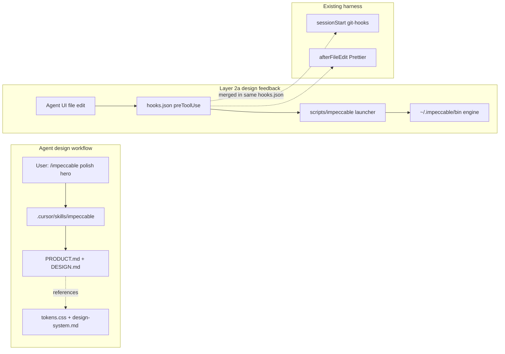

# Impeccable setup

## Recommended execution authority

| Slice            | Recommended authority | Agent instruction                        |
| ---------------- | --------------------- | ---------------------------------------- |
| impeccable-setup | Open PR only          | Do not merge. Stop after opening the PR. |
| plan-closure     | Open PR only          | Do not merge. Stop after opening the PR. |

Repo default: **Open PR only** ([planning-standards.md](../standards/planning-standards.md#repo-default-when-no-plan-slice-applies)).

## Repository topology (default)

The integration branch is `main`. Start the implementation slice from latest `origin/main`. The PR branch must represent only this slice; previous work arrives through merged `main`, not branch ancestry. PR base must be `main`.

---

## Goal

Give Cursor agents a first-class design review/refinement path via `/impeccable` (audit, critique, polish, distill, etc.) and a deterministic pre-edit detector hook, without changing production UI in the implementation PR.

**Implementation PR boundary:** capability installed + context seeded + hooks proven. First real design exercise (e.g. `/impeccable audit home`) is a **post-merge task**, not part of the implementation PR.

## Current state

- Portfolio styling is documented in [docs/design-system.md](../../docs/design-system.md) with normative token **values** in [app/styles/tokens.css](../../app/styles/tokens.css).
- Cursor hooks today are Layer 1 + Layer 2a in [.cursor/hooks.json](../hooks.json) (`sessionStart` → git-hooks, `afterFileEdit` → Prettier).
- No Impeccable files are present yet.

## What Impeccable adds

Running `npx impeccable@4.1.0 install --providers=cursor --scope=project -y` from repo root produces:

| Path                             | Purpose                                                                                         |
| -------------------------------- | ----------------------------------------------------------------------------------------------- |
| `.cursor/skills/impeccable/`     | Single `/impeccable` skill (launcher at `scripts/impeccable`, reference docs, scripts)          |
| `.cursor/agents/impeccable-*.md` | Supporting subagents                                                                            |
| `.cursor/hooks.json`             | Adds `preToolUse` hook while **preserving** existing `sessionStart` and `afterFileEdit` entries |

**Engine binary model (do not commit):** The launcher lives at `scripts/impeccable`. Without a sibling binary it downloads the pinned engine into `~/.impeccable/bin/...` on first run. Upstream Impeccable gitignores `**/skills/impeccable/scripts/bin/`.

**Hook verification (installer is source of truth):** After install, verify `.cursor/hooks.json` still has `sessionStart` and `afterFileEdit` unchanged and adds a `preToolUse` entry **written by the installer**. Do **not** rewrite `preToolUse` to match documentation, an older plan snippet, or a different command shape — accept the installer's command verbatim. Command format may vary by Impeccable version (e.g. shell launcher vs `hook-before-edit.mjs`).

Impeccable reads root-level `PRODUCT.md` (product truth) and `DESIGN.md` (visual/interaction contract).

## Hook taxonomy (aligned with existing harness)

```text
Layer 1     — Hook availability (sessionStart → git-hooks)
Layer 2a    — Agent feedback
              • afterFileEdit → formatting (Prettier)
              • preToolUse    → Impeccable design detector (can block flagged proposed UI writes)
Layer 2b    — Commit correctness (Husky pre-commit)
Layer 3     — Authoritative enforcement (CI)
```

Document both Layer 2a entries under one heading in AGENTS.md.

---

## Slice — impeccable-setup

**Recommended authority:** Open PR only

**Rationale:**

- Agent harness + context files only; no production UI changes
- Merge-safe on its own; first design audit is post-merge

**Agent instruction:** Do not merge. Stop after opening the PR.

**Goal:** Install Impeccable for Cursor, seed semantic context files, document operator setup.

### Steps

1. **Branch:** `git fetch origin && git checkout -b chore/impeccable-setup origin/main`

2. **Install:**

   ```bash
   npx impeccable@4.1.0 install --providers=cursor --scope=project -y
   ```

   - Do **not** pass `--no-hooks`.
   - Commit skill payload and `.cursor/agents/`, **excluding** `scripts/bin/**`.
   - Add `.cursor/skills/impeccable/scripts/bin/` to `.gitignore`.
   - Verify hooks merge: `sessionStart` and `afterFileEdit` preserved; installer-added `preToolUse` present unchanged.
   - Post-install smoke: verify launcher resolves/downloads pinned engine without committed `scripts/bin/`, using an officially supported non-mutating command from installed v4.1.0 CLI/help output.

3. **`.gitignore`:** Add engine binary path plus Impeccable ephemeral block (`# impeccable-ignore-start` / `# impeccable-ignore-end` from upstream docs).

4. **`PRODUCT.md`:** Product truth only — audience, purpose, visitor outcomes, Experience posture. No visual or accessibility rules.

5. **`DESIGN.md`:** Semantic contract referencing `docs/design-system.md` and `app/styles/tokens.css`. No literal token duplication unless Impeccable schema requires it and requirement is proven. Portfolio anti-patterns only — not Impeccable's generic anti-slop catalogue.

6. **`AGENTS.md`:** Impeccable subsection with Nightly + Agent Skills prerequisites, commands, update path, Layer 2a agent-feedback framing.

7. **Verify:**

   ```bash
   npm run lint && npm run typecheck && npm run format:check
   ```

   - `git status` — no `scripts/bin/**` staged
   - Do **not** run `/impeccable audit` or other design commands in this PR

**Acceptance:**

- Impeccable skill + agents committed; `scripts/bin/**` untracked and gitignored
- Hooks merged without losing git-hooks or format entries
- `PRODUCT.md` and `DESIGN.md` seeded (semantic; no token-value drift)
- AGENTS.md documents operator setup and Layer 2a hooks
- No production route/component/CSS changes
- CI `verify` passes
- **Implementation PR CI:** e2e **runs** — `.gitignore`, root `PRODUCT.md`, and `DESIGN.md` are not on the docs-only allowlist in [`.github/workflows/ci.yml`](../../.github/workflows/ci.yml) (only `.cursor/*`, `docs/*`, `README.md`, `AGENTS.md`, etc.). Plan-only PRs that touch `.cursor/**` only may skip e2e.

## Architecture



## Out of scope (implementation PR)

- Production UI/CSS changes
- First design exercise (`/impeccable audit`, polish, etc.)
- `npx impeccable detect` CI gate
- Interactive `/impeccable init` session
- `package.json` dependency on `impeccable`

## Risk notes

| Risk                                  | Mitigation                                                                 |
| ------------------------------------- | -------------------------------------------------------------------------- |
| Engine binary accidentally committed  | Do not commit `scripts/bin/**`; launcher downloads to `~/.impeccable/bin/` |
| Cursor Stable lacks Agent Skills      | Document Nightly + Agent Skills in PR + AGENTS.md                          |
| `DESIGN.md` drifts from canonical CSS | Semantic roles; reference `tokens.css` / `docs/design-system.md`           |
| Hook config overwritten               | Verify all three hook types remain; accept installer `preToolUse` verbatim |
| Noisy skill upgrades                  | Review diffs on `npx impeccable update`                                    |
| Product/design overlap                | PRODUCT = audience/purpose; DESIGN = visual contract                       |

---

## Plan closure (docs-only PR)

**Recommended authority:** Open PR only

**Agent instruction:** Do not merge. Stop after opening the PR.

After `impeccable-setup` merges:

1. Verify `impeccable-setup` todo is `completed`
2. Add `# Shipped` closure note at top of plan body
3. Move to `.cursor/plans/archive/2026-09-10-impeccable-setup.plan.md`
4. Mark `plan-closure` `completed`; update agent prompt paths

---

## Agent prompts (copy/paste for Cursor)

### impeccable-setup

```text
@.cursor/plans/2026-09-10-impeccable-setup.plan.md

Implement slice impeccable-setup only. Do not start plan-closure. Do not archive the plan.

Authority: Open PR only — implement and open the PR; do not merge.

Topology: start from latest origin/main; branch represents only this slice; PR base must be main.

Deliverables: Impeccable Cursor install (exclude scripts/bin/**), .gitignore updates, PRODUCT.md, DESIGN.md, AGENTS.md subsection. Mark impeccable-setup completed in plan frontmatter in this PR.

Verification: npm run lint, typecheck, format:check; hooks merge verified; no scripts/bin/** committed; no production UI changes; no /impeccable design exercise in this PR.
```

### plan-closure

```text
@.cursor/plans/2026-09-10-impeccable-setup.plan.md

Execute only plan-closure.

Authority: Open PR only — docs-only archive PR; do not merge.

Prerequisites: impeccable-setup merged and marked completed in frontmatter.

Topology: start from latest origin/main; branch represents only this slice; PR base must be main.

Deliverables: verify slice todo, add # Shipped note, move plan to .cursor/plans/archive/2026-09-10-impeccable-setup.plan.md, mark plan-closure completed, update agent prompt references.

Verification: impeccable-setup PR merged; slice todo completed before archiving.
```
