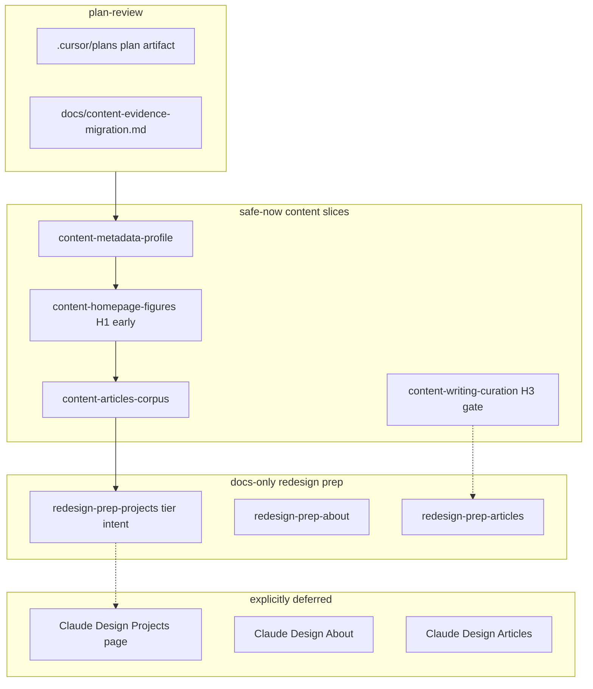

# Content evidence migration

## Recommended execution authority

| Slice                    | Recommended authority | Agent instruction                                      |
| ------------------------ | --------------------- | ------------------------------------------------------ |
| plan-review              | Plan-only PR          | Do not implement. Stop after opening the plan-only PR. |
| content-metadata-profile | Open PR only          | Do not merge. Stop after opening the PR.               |
| content-homepage-figures | Open PR only          | Do not merge. Stop after opening the PR.               |
| content-articles-corpus  | Open PR only          | Do not merge. Stop after opening the PR.               |
| redesign-prep-projects   | Open PR only          | Do not merge. Stop after opening the PR.               |
| content-writing-curation | Open PR only          | Do not merge. Stop after opening the PR.               |
| redesign-prep-about      | Open PR only          | Do not merge. Stop after opening the PR.               |
| redesign-prep-articles   | Open PR only          | Do not merge. Stop after opening the PR.               |
| plan-closure             | Open PR only          | Do not merge. Stop after opening the PR.               |

Repo default: **Open PR only** ([planning-standards.md](../standards/planning-standards.md#repo-default-when-no-plan-slice-applies)).

## Repository topology (default)

This invariant prevents accidental stacked PRs. Multi-slice plans stack execution order, not Git branches.

The repository integration branch is `main`. Each slice starts from latest `origin/main`. The PR branch must represent only that slice; previous work arrives through merged `main`, not branch ancestry. PR base must be `main`.

**Before implementation:** start this slice from the latest integration branch (typically `git fetch` then a fresh branch from `origin/main`).

**Before opening the PR:** verify the branch represents only this slice — previous-slice work is present through the integration branch, not through branch ancestry.

**After opening the PR:** verify the GitHub PR base branch is `main` and the diff does not include previous-slice work except through merged `main`.

---

## Post-merge execution order

After this plan merges, run implementation slices in this order (each from latest `origin/main`, Open PR only):

1. `content-metadata-profile` — continuity framing in metadata + bio
2. **`content-homepage-figures`** — **H1 early correction** (do not leave possibly unsupported `175+` on the live homepage)
3. `content-articles-corpus` — DEV post inventory sync
4. `redesign-prep-projects` — Claude Design handoff + tier/`featured` intent (no incumbent Projects model churn)
5. `content-writing-curation` — after **H3** human decision
6. `redesign-prep-about`, `redesign-prep-articles` — docs-only (may parallelize after prerequisites)
7. `plan-closure` — after all slices complete

**Removed from safe-now:** `content-project-tiers` — see [Runtime audit: `projects.featured`](#runtime-audit-projectsfeatured) below.

---

## Goal

Bring the portfolio **content model and public positioning** into alignment with [`docs/redesign-baseline.md`](../../docs/redesign-baseline.md) and the sibling `resumes/` inventory — **without** redesigning `/projects`, `/about`, `/articles`, or `/ecosystem`, and **without** altering the Instrument 1b visual system ([`DESIGN.md`](../../DESIGN.md), merged [#47](https://github.com/mastermichaelt/portfolio/pull/47)).

**Homepage thesis (preserve):** _Making uncertain systems dependable._

**Supporting audit:** [`docs/content-evidence-migration.md`](../../docs/content-evidence-migration.md) — gap tables, migration map, Claude Design handoff brief, human-review register (H1–H12). The **executable slice list lives in this plan**, not in the audit doc.

**Evidence rule:** Do not invent, extrapolate, round upward, or strengthen claims. Re-read live `resumes/facts/*.yml` before publishing copy. Prefer omission over unsupported claims. Preserve figure value + name + scope per `DESIGN.md`.



### Runtime audit: `projects.featured`

Audited 2026-09-11 (on-portfolio):

| Consumer                           | Uses `projects.featured`?                                                                       |
| ---------------------------------- | ----------------------------------------------------------------------------------------------- |
| Homepage (`app/page.tsx`)          | **No** — uses `content/homepage.ts` (`channels`, `supporting`; Editorial already demoted there) |
| `/projects` index                  | **No** — `listProjects()` renders all four projects in a grid; no featured filter               |
| Case-study routes                  | **No**                                                                                          |
| Ecosystem                          | **No**                                                                                          |
| `tests/content-foundation.test.ts` | **Yes** — asserts two featured slugs (`codenames-ai`, `editorial-workflow`)                     |

**Conclusion:** No current runtime outside the incumbent `/projects` content model and its test assertion depends on `editorial-workflow.featured`. Flipping the flag now is churn on a model Claude Design will replace. **Fold tier/`featured` intent into `redesign-prep-projects`** (Editorial is supporting, not co-equal with Codenames/Atlassian).

### Human-review gates (not decided — do not pretend resolved)

| Id     | Decision                                                 | Resolution                                                                                                                                                                                                                                  |
| ------ | -------------------------------------------------------- | ------------------------------------------------------------------------------------------------------------------------------------------------------------------------------------------------------------------------------------------- |
| **H1** | MAU figure: `175+` vs `150+` vs omit                     | **Resolved by `content-homepage-figures`** (second slice after plan merge) — see [H1 decision rule](#h1-decision-rule-mau-figure) below. Leaving `175+` published while deferring this slice is **unacceptable** once the plan is approved. |
| H2     | Public post count: 14 vs 15 vs qualified wording         | `redesign-prep-articles`                                                                                                                                                                                                                    |
| H3     | Writing curation rule (homepage vs featured vs DEV pins) | `content-writing-curation` — agent stops if unresolved                                                                                                                                                                                      |
| H4     | DEV profile tagline sync                                 | External — not in-repo                                                                                                                                                                                                                      |
| H5     | Atlassian case-study slug/title                          | Claude Design Projects (deferred)                                                                                                                                                                                                           |
| H6     | Ledger “Informed Pull Requests” verify                   | About prep, off-home reuse                                                                                                                                                                                                                  |
| H7–H12 | See audit doc §7                                         | Various redesign / optional promotions                                                                                                                                                                                                      |

Agents executing **H3** must **stop and escalate** if the gate is unresolved. **H1** is not deferred — the `content-homepage-figures` agent applies the decision rule after re-reading live inventory.

#### H1 decision rule (MAU figure)

The private `resumes` repo may be unreadable from the agent VM (GitHub API 404). The **`content-homepage-figures` slice must re-read** live `resumes/facts/codenames-ai-telemetry.yml` before publishing.

| Outcome                                                                                | Action                                                                                                     |
| -------------------------------------------------------------------------------------- | ---------------------------------------------------------------------------------------------------------- |
| Live inventory documents **`175+` as a durable floor** (fact ID + qualifier in source) | Keep `175+`; update `source` fields to match live fact ID/metricId; scope line must quote source qualifier |
| Live inventory supports only **`150+` floor** (`telemetry-model-experiments`)          | **Revert promptly** to `150+` with durable-floor scope (baseline §2)                                       |
| Neither value is supportable as public copy                                            | **Omit** the MAU figure (empty figures array entry removed; keep `#1` branded search if still valid)       |
| Exact snapshot **`165`** (`monthly-active-players`)                                    | **Never publish** — fact comment forbids pasting into prose                                                |

Baseline reference (2026-09-11): `telemetry-model-experiments` action text uses **150+**; `175+` from [#46](https://github.com/mastermichaelt/portfolio/pull/46) is **not** in the baseline table until live inventory confirms it.

### Explicitly deferred (out of this plan’s implementation slices)

- Visual / IA redesign of `/projects`, `/projects/[slug]`, `/articles`, `/about`, `/ecosystem`
- Route renames (`/work`, `/writing`)
- Full Atlassian `/projects/experiment-measurement` case-study page (Claude Design)
- Canonical domain `michaeltruong.dev`
- `tier` schema on `Project`, `content/ledger.ts`, deleting `timeline.ts`
- Savepoints as a portfolio project
- Optional `content-project-figures` (Codenames figures on case-study page) — only after Projects redesign or explicit type addition
- Optional `content-related-writing` (wire `relatedProjectSlug` on case-study pages) — only if existing template supports it without layout redesign
- **`content-project-tiers`** (standalone `featured` flip) — folded into `redesign-prep-projects`; homepage uses `content/homepage.ts`, not `projects.featured`

---

## Slice — plan-review

**Recommended authority:** Plan-only PR

**Rationale:**

- Cross-cutting content migration spans metadata, inventory, homepage figures, and redesign prep; plan must be reviewed before `content/*` edits
- Expected diff is plan artifact + supporting audit doc only

**Agent instruction:** Do not implement. Stop after opening the plan-only PR.

**Goal:** Land standards-compliant staged plan and supporting audit for human review.

**Deliverables:**

- This file: `.cursor/plans/2026-09-11-content-evidence-migration.plan.md`
- Supporting audit: [`docs/content-evidence-migration.md`](../../docs/content-evidence-migration.md)
- Roadmap pointer: [`docs/plans/portfolio-roadmap.plan.md`](../../docs/plans/portfolio-roadmap.plan.md)

**Acceptance:**

- Plan matches [planning-standards.md](../standards/planning-standards.md) shape (frontmatter, authority table, per-slice blocks, agent prompts, `plan-closure`)
- Zero production `content/*` or page implementation edits
- Audit retained as supporting material; executable control surface is this plan

**Verification:** Plan review only; no npm gates required for plan artifact beyond Prettier on committed markdown.

---

## Slice — content-metadata-profile

**Recommended authority:** Open PR only

**Rationale:**

- Metadata and bio are safe-now copy; existing pages consume `profile` and layout metadata without redesign
- Subordinates “AI engineering systems” framing to continuity-of-practice positioning

**Agent instruction:** Do not merge. Stop after opening the PR.

**Prerequisite:** `plan-review` merged.

**Goal:** Align public positioning strings with homepage continuity framing.

**Scope (only):**

- `app/layout.tsx`, `app/page.tsx` — metadata title/description (and OG/Twitter if copy-only)
- `content/profile.ts` — `bio` aligned with `content/homepage.ts` `hero.lead` / `leadEmphasis` without strengthening claims
- Optional: one-line `PRODUCT.md` positioning tweak if needed for consistency (same PR only if touched)

**Evidence:**

- Identity: `resumes/meta/profile.yml` → existing `profile.ts` fields
- Framing: homepage hero in `content/homepage.ts`; baseline §3 product truth

**Out of scope:** Homepage layout, ledger, figures, `/about` layout.

**Acceptance:**

- No “AI retraining” or career-restart framing introduced
- Bio and metadata readable as measurement/verification continuity, not side-project portfolio only
- `tests/content-foundation.test.ts` profile assertions still pass (adjust bio length bound only if needed)

**Verification:** `npm run lint`, `format:check`, `typecheck`, `test`, `test:coverage`, `build`; `test:e2e` home hero visible.

---

## Slice — content-homepage-figures

**Recommended authority:** Open PR only

**Rationale:**

- **H1 early correction** — `175+` MAU may be unsupported; leaving it on the live homepage until a late slice is unacceptable once this plan is approved
- Figure/scope integrity is a `DESIGN.md` requirement; this is the **second slice** after `content-metadata-profile`

**Agent instruction:** Do not merge. Stop after opening the PR.

**Prerequisite:** `plan-review` merged; `content-metadata-profile` merged (recommended — may run in parallel only if metadata PR is already on `main`).

**Goal:** Apply [H1 decision rule](#h1-decision-rule-mau-figure) to homepage CH 01 MAU figure after re-reading live inventory.

**Scope (only):**

- `content/homepage.ts` — CH 01 `figures[0]` value, name, scope, and `source` fields
- `tests/content-foundation.test.ts`, `e2e/happy-path.spec.ts` — expect approved value and scope line

**Out of scope:** Other CH 01/02 figures (`#1`, `>10%`, `9%–41%`) unless inventory drift found on re-read.

**Acceptance:**

- MAU figure matches H1 decision rule outcome (keep `175+` only with live fact backing, else `150+` or omit)
- Every remaining figure retains value + name + scope; scope never truncated
- No `game_started` event name in homepage JSON (existing test)

**Verification:** `npm run lint`, `format:check`, `typecheck`, `test`, `test:coverage`, `build`, `test:e2e` (375px figure scope visible).

---

## Slice — content-articles-corpus

**Recommended authority:** Open PR only

**Rationale:**

- Inventory sync is merge-safe; `/articles` page already renders `listArticles()` rows
- Closes 9 vs 15 corpus gap without changing page design

**Agent instruction:** Do not merge. Stop after opening the PR.

**Prerequisite:** `plan-review` merged; `content-homepage-figures` merged (H1 corrected before corpus expansion).

**Goal:** Fix provenance comment and add missing DEV posts as non-featured articles.

**Scope (only):**

- `content/articles.ts` — header comment; add 6 rows from baseline §2 hub table (titles/URLs/summaries from frontmatter only — no invented claims)
- Do **not** change `featured` flags (H3 blocked slice owns that)

**Missing posts (baseline §2):**

| Hub slug topic                                                         | Source                                      |
| ---------------------------------------------------------------------- | ------------------------------------------- |
| persist-game-state-not-ephemeral-ui-intent                             | `editorial-workflow/docs/dev.to/published/` |
| agent-portability-does-not-require-centralizing-methodology-behind-mcp | same                                        |
| experiment-repos-need-first-class-retirement-semantics                 | same                                        |
| ai-changed-the-build-vs-buy-threshold                                  | same                                        |
| ai-workflows-need-a-requirements-qa-stage                              | same                                        |
| skills-should-own-capabilities-not-individual-actions                  | same                                        |

Assign `relatedProjectSlug` where evidence supports it; leave unset rather than guess.

**Acceptance:**

- Comment references `editorial-workflow/docs/dev.to/published/`
- Article count increases by 6; slugs unique; URLs valid `https://dev.to/…`
- Featured count unchanged until `content-writing-curation`

**Verification:** `npm run lint`, `format:check`, `typecheck`, `test`, `test:coverage`, `build`; content-foundation article tests.

---

## Slice — content-writing-curation

**Recommended authority:** Open PR only

**Rationale:**

- Unifies two curation layers currently diverging (`homepage.writing` vs `articles.featured`)
- Requires explicit human rule — not inferable from evidence alone

**Agent instruction:** Do not merge. Stop after opening the PR.

**Prerequisite:** `plan-review` merged; `content-articles-corpus` merged; **H3 resolved by human** (agent stops if not).

**Goal:** Apply agreed writing curation rule across homepage and article inventory.

**Scope (only):**

- `content/homepage.ts` `writing[]` — slugs + `argument` strings per H3 outcome
- `content/articles.ts` — set `featured: true` on exactly the homepage slugs; clear featured from others
- Update tests enforcing featured uniqueness (≤3, distinct `relatedProjectSlug` rule may relax if H3 chooses — document in PR)

**H3 options (human picks one):**

1. Homepage-aligned (current slugs: active-players, agent-plans-authority-handoffs, ai-reviewer-kinds-of-reasoning)
2. Flagship-paired (Codenames + measurement + agent-native — may not 1:1 map to posts)
3. DEV-pin-aligned (5 titles — homepage may still show 3; archive holds 5)

**Acceptance:**

- Homepage writing slugs ⊆ `articles.ts`
- Featured set matches H3 decision; no orphaned featured posts off-home

**Verification:** `npm run lint`, `format:check`, `typecheck`, `test`, `test:coverage`, `build`, `test:e2e` selected writing rows.

---

## Slice — redesign-prep-projects

**Recommended authority:** Open PR only

**Rationale:**

- Claude Design session needs curated Atlassian + Codenames + supporting brief without forcing content into incumbent `/projects` layout
- Docs-only; no page implementation

**Agent instruction:** Do not merge. Stop after opening the PR.

**Prerequisite:** `content-metadata-profile`, `content-homepage-figures`, and `content-articles-corpus` merged.

**Goal:** Refresh Projects Claude Design handoff and document tier/`featured` intent for the upcoming Projects redesign — **without** flipping `projects.ts` flags on the incumbent model.

**Scope (only):**

- `docs/content-evidence-migration.md` — § Claude Design handoff + §3 Projects prep
- No `content/*`, no `app/*`

**Must include (curated, provenance-backed):**

- Atlassian experiment measurement thesis + fact IDs (`cross-flow-experiment-measurement.yml`, `statsig-reliability.yml`, `loom-event-pipeline.yml`, `loom-acquisition.yml`, `admin-hub-experimentation.yml`, `post-office-ml-surfaces.yml`, `em-growth-delivery.yml`, AIM facts)
- Codenames thesis + fact IDs (`codenames-ai-telemetry.yml`, `codenames-ai-e2e.yml`)
- Supporting tier: editorial, renovate, agent-native, resume-generator
- **Tier / `featured` intent (folded from removed `content-project-tiers`):**
  - Editorial workflow is **supporting**, not co-equal with Codenames or Atlassian
  - Homepage already demotes Editorial via `content/homepage.ts` `supporting[]` — independent of `projects.featured`
  - **`featured` semantics will be redesigned with Claude Design Projects** — do not pre-flip `editorial-workflow.featured: false` on the incumbent four-card `/projects` model
  - Runtime audit: `/projects` lists all projects equally; only `tests/content-foundation.test.ts` asserts two featured — update that test **with** Projects redesign, not in a standalone safe-now slice
- Explicit non-goals from this plan’s deferred list

**Acceptance:**

- Handoff readable standalone for Claude Design agent
- No new quantitative claims without fact IDs

**Verification:** Docs-only — `npm run format:check`; CI docs path allowlist.

---

## Slice — redesign-prep-about

**Recommended authority:** Open PR only

**Rationale:**

- About redesign is deferred; curated evidence brief prevents inventory dump later

**Agent instruction:** Do not merge. Stop after opening the PR.

**Prerequisite:** `plan-review` merged; recommend after safe-now content slices.

**Goal:** Curate About-page evidence brief in audit doc §4.

**Scope (only):** `docs/content-evidence-migration.md` §4 — refine curated sections (identity, arc, AIM, EM scope, omit list); resolve H6 note on Informed Pull Requests if fact verified.

**Acceptance:** No `app/about/*` or `content/profile.ts` changes in this slice.

**Verification:** Docs-only — `npm run format:check`.

---

## Slice — redesign-prep-articles

**Recommended authority:** Open PR only

**Rationale:**

- Articles redesign deferred; H2 post-count tension must be documented before Writing IA pass

**Agent instruction:** Do not merge. Stop after opening the PR.

**Prerequisite:** `content-articles-corpus` merged; **H2 resolved by human** for any public count wording added to docs.

**Goal:** Curate Articles/Writing redesign brief in audit doc §5.

**Scope (only):** `docs/content-evidence-migration.md` §5 — corpus rules, pin set, `argument` field note, Trusted Member / follower promotion options.

**Acceptance:** No `app/articles/*` layout changes; no new posts invented.

**Verification:** Docs-only — `npm run format:check`.

---

## Plan closure (docs-only PR)

**Recommended authority:** Open PR only

**Rationale:**

- Docs-only archival after all planned slices complete or explicitly cancelled
- Human review of closure checklist

**Agent instruction:** Do not merge. Stop after opening the PR.

After the last implementation or prep slice merges, open a final docs-only closure PR:

1. Verify all slice todos are `completed` or `cancelled`; fix stragglers only
2. Add a `# Shipped` closure note at the top of the plan body with merged PR links
3. Move this file to `.cursor/plans/archive/2026-09-11-content-evidence-migration.plan.md`
4. Mark `plan-closure` `completed` and update agent prompt references to the archived path
5. Update roadmap pointer if needed

Do not archive inside implementation PRs. Implementation PRs mark their own slice `completed` in frontmatter in the same PR as the code or doc edits for that slice.

---

## Agent prompts (copy/paste for Cursor)

Use a **fresh Agent-mode chat** per slice. Each default frontmatter todo has exactly one `### <todo-id>` heading copied from that todo’s `id` — do not rename ids to match prose.

### plan-review

```text
@.cursor/plans/2026-09-11-content-evidence-migration.plan.md

Execute only plan-review. Do not start implementation slices.

Authority: Plan-only PR — commit the plan artifact and supporting audit only; do not implement content. Stop after opening the plan-only PR.

Topology: start from latest origin/main; branch represents only the plan artifact; PR base must be main.

Deliverables: .cursor/plans/2026-09-11-content-evidence-migration.plan.md; docs/content-evidence-migration.md (supporting audit); roadmap pointer; mark plan-review completed in frontmatter in the same PR.

Verification: plan satisfies repo planning standards; no production content/* or page implementation edits.
```

### content-metadata-profile

```text
@.cursor/plans/2026-09-11-content-evidence-migration.plan.md

Implement slice content-metadata-profile only. Prerequisite: plan-review merged. Do not start later slices. Do not archive the plan.

Authority: Open PR only — implement and open the PR; do not merge.

Topology: start from latest origin/main; branch represents only this slice; PR base must be main.

Deliverables: align app/layout.tsx and app/page.tsx metadata plus content/profile.ts bio with continuity framing (see plan slice). Mark content-metadata-profile completed in plan frontmatter in this PR.

Verification: npm run lint, format:check, typecheck, test, test:coverage, build, test:e2e home hero.
```

### content-homepage-figures

```text
@.cursor/plans/2026-09-11-content-evidence-migration.plan.md

Implement slice content-homepage-figures only (H1 early correction). Prerequisites: plan-review merged; content-metadata-profile merged (or on main). Do not start later slices. Do not archive the plan.

Authority: Open PR only — implement and open the PR; do not merge.

Topology: start from latest origin/main; branch represents only this slice; PR base must be main.

Deliverables: re-read live resumes/facts/codenames-ai-telemetry.yml; apply H1 decision rule to content/homepage.ts CH 01 MAU figure (keep 175+ only with live fact backing, else revert to 150+ or omit); update tests. Mark content-homepage-figures completed in plan frontmatter in this PR.

Verification: npm run lint, format:check, typecheck, test, test:coverage, build, test:e2e figure scope at 375px.
```

### content-articles-corpus

```text
@.cursor/plans/2026-09-11-content-evidence-migration.plan.md

Implement slice content-articles-corpus only. Prerequisites: plan-review merged; content-homepage-figures merged. Do not start later slices. Do not archive the plan.

Authority: Open PR only — implement and open the PR; do not merge.

Topology: start from latest origin/main; branch represents only this slice; PR base must be main.

Deliverables: fix content/articles.ts corpus comment; add 6 missing DEV posts as non-featured rows from baseline hub list. Do not change featured flags. Mark content-articles-corpus completed in plan frontmatter in this PR.

Verification: npm run lint, format:check, typecheck, test, test:coverage, build; content-foundation article tests.
```

### content-writing-curation

```text
@.cursor/plans/2026-09-11-content-evidence-migration.plan.md

Implement slice content-writing-curation only. Prerequisites: plan-review and content-articles-corpus merged; H3 human gate resolved (stop and escalate if not). Do not start later slices. Do not archive the plan.

Authority: Open PR only — implement and open the PR; do not merge.

Topology: start from latest origin/main; branch represents only this slice; PR base must be main.

Deliverables: unify content/homepage.ts writing[] and content/articles.ts featured flags per H3 decision. Mark content-writing-curation completed in plan frontmatter in this PR.

Verification: npm run lint, format:check, typecheck, test, test:coverage, build, test:e2e selected writing rows.
```

### redesign-prep-projects

```text
@.cursor/plans/2026-09-11-content-evidence-migration.plan.md

Implement slice redesign-prep-projects only. Prerequisites: content-metadata-profile, content-homepage-figures, and content-articles-corpus merged. Do not start plan-closure. Do not archive the plan.

Authority: Open PR only — docs-only PR; do not merge.

Topology: start from latest origin/main; branch represents only this slice; PR base must be main.

Deliverables: refresh Projects Claude Design handoff in docs/content-evidence-migration.md; document tier/featured intent (Editorial supporting; featured semantics redesigned with Projects — do not pre-flip projects.ts featured flags). No content/* or app/* edits. Mark redesign-prep-projects completed in plan frontmatter in this PR.

Verification: npm run format:check.
```

### redesign-prep-about

```text
@.cursor/plans/2026-09-11-content-evidence-migration.plan.md

Implement slice redesign-prep-about only. Prerequisite: plan-review merged. Do not start plan-closure. Do not archive the plan.

Authority: Open PR only — docs-only PR; do not merge.

Topology: start from latest origin/main; branch represents only this slice; PR base must be main.

Deliverables: curate About redesign evidence brief in docs/content-evidence-migration.md §4. No About page edits. Mark redesign-prep-about completed in plan frontmatter in this PR.

Verification: npm run format:check.
```

### redesign-prep-articles

```text
@.cursor/plans/2026-09-11-content-evidence-migration.plan.md

Implement slice redesign-prep-articles only. Prerequisites: content-articles-corpus merged; H2 resolved for any count wording. Do not start plan-closure. Do not archive the plan.

Authority: Open PR only — docs-only PR; do not merge.

Topology: start from latest origin/main; branch represents only this slice; PR base must be main.

Deliverables: curate Articles/Writing redesign brief in docs/content-evidence-migration.md §5. No Articles page edits. Mark redesign-prep-articles completed in plan frontmatter in this PR.

Verification: npm run format:check.
```

### plan-closure

```text
@.cursor/plans/2026-09-11-content-evidence-migration.plan.md

Execute only plan-closure.

Authority: Open PR only — docs-only archive PR; do not merge.

Prerequisites: all implementation and prep slices merged and already marked completed in frontmatter.

Topology: start from latest origin/main; branch represents only this slice; PR base must be main.

Deliverables: verify slice todos, add # Shipped note, move plan to .cursor/plans/archive/2026-09-11-content-evidence-migration.plan.md, mark plan-closure completed, update references.

Verification: confirm all prerequisite PRs are merged and slice todos are completed before archiving.
```
