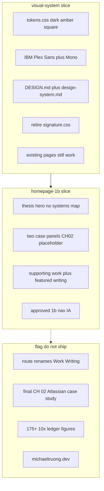

# Instrument 1b visual direction

## Recommended execution authority

| Slice         | Recommended authority | Agent instruction                                      |
| ------------- | --------------------- | ------------------------------------------------------ |
| plan-review   | Plan-only PR          | Do not implement. Stop after opening the plan-only PR. |
| visual-system | Open PR only          | Do not merge. Stop after opening the PR.               |
| homepage-1b   | Open PR only          | Do not merge. Stop after opening the PR.               |
| plan-closure  | Open PR only          | Do not merge. Stop after opening the PR.               |

Repo default: **Open PR only** ([planning-standards.md](../standards/planning-standards.md#repo-default-when-no-plan-slice-applies)).

## Repository topology (default)

This invariant prevents accidental stacked PRs. Multi-slice plans stack execution order, not Git branches.

The repository integration branch is `main`. Each slice starts from latest `origin/main`. The PR branch must represent only that slice; previous work arrives through merged `main`, not branch ancestry. PR base must be `main`.

**Before implementation:** start this slice from the latest integration branch (typically `git fetch` then a fresh branch from `origin/main`).

**Before opening the PR:** verify the branch represents only this slice — previous-slice work is present through the integration branch, not through branch ancestry.

**After opening the PR:** verify the GitHub PR base branch is `main` and the diff does not include previous-slice work except through merged `main`.

---

## Design

Source of truth for this plan: local Claude Design handoff at `~/Downloads/design_handoff_verification_discipline/` (project `dd82dab0-878d-4d8d-a390-7563fd955997`). The Claude Design MCP (`https://api.anthropic.com/v1/design/mcp`) was not connected in the planning session. `Homepage Explorations.dc.html` is not in that zip; the handoff README identifies **1b — Instrument** as the second option in the lower row.

Do not transplant `homepage-reference.html` wholesale. Recreate 1b in the existing App Router, semantic CSS layers, `next/font`, and `PortfolioRepository` seam. Generated CSS is an implementation reference: `css/tokens.css` is a wholesale replacement for [`app/styles/tokens.css`](../../app/styles/tokens.css); `css/verification.css` is annotated for split into `base.css` / `layout.css` / `components.css`.



### Evidence-safe vs approved-final (do not collapse)

- **CH 01** = Codenames AI from existing `featured` inventory. Intended first-class system for this visual pass.
- **CH 02** = Editorial Workflow as an **evidence-safe temporary placeholder** used only to establish 1b’s two-column case-study composition. Its content and relative prominence are **not** approved final homepage IA. Do not encode Editorial as a durable first-class peer of Codenames (no `tier`, comments, or tests that treat the pair as the intended evidence hierarchy). The intended Atlassian / current-work evidence hierarchy remains a **deferred content decision**.
- Prefer a short panel over filling 1b with résumé facts that are not yet on-portfolio. Do not invent or strengthen claims.

### Approved 1b shell/IA (homepage-1b only)

These are explicit IA decisions required by the selected 1b direction — not “purely visual”:

- Logo is Home (wordmark links `/`).
- Ecosystem leaves **primary navigation**. Keep `/ecosystem` as a real, deep-linkable route; link it from supporting-work and/or About, not the first viewport. Keep [`components/SystemsDiagram.tsx`](../../components/SystemsDiagram.tsx) for `/ecosystem` (demote, do not delete).
- Primary nav membership becomes Projects / Articles / About at **existing** hrefs (`/projects`, `/articles`, `/about`).
- Contact CTA in the header is replaced by the amber `mailto:` address (1b shell).

**Still deferred:** `/projects` → `/work`, `/articles` → `/writing`, and the Work / Writing **labels**. Do not rename routes or nav labels in this plan.

`visual-system` must **not** change nav membership. Current five-item nav stays until `homepage-1b` so token migration can be reviewed separately from shell IA.

---

## Slice — plan-review

**Recommended authority:** Plan-only PR

**Rationale:**

- Cross-cutting visual + homepage + explicit IA deferrals; plan must be reviewed before tokens or routes move
- Expected diff is plan artifact only

**Agent instruction:** Do not implement. Stop after opening the plan-only PR.

**Deliverable:** this plan file only.

---

## Slice — visual-system

**Recommended authority:** Open PR only

**Rationale:**

- Token/font/docs/signature retirement is merge-safe without homepage IA
- An intentionally in-between home (old composition on new tokens) isolates chrome/token breakage on `/about`, `/articles`, `/projects/[slug]`, `/ecosystem` from the homepage rewrite

**Agent instruction:** Do not merge. Stop after opening the PR.

**Goal:** Site-wide 1b identity. Do **not** rebuild homepage composition. Do **not** change primary nav membership. Existing routes must remain coherent on the new tokens.

**Tokens** — replace [`app/styles/tokens.css`](../../app/styles/tokens.css) with the handoff values: near-black `--bg` `#121110`, `--surface` / `--surface-2`, warm off-white `--fg` / `--fg-2`, `--muted` as contrast floor (5.26:1), `--accent` `#d9a441`, `--accent-ink`, `--radius: 0`, `--shadow: none`, new type/spacing/container scales. Keep the Tailwind `@theme inline` bridge unchanged in scope.

**Type** — in [`app/layout.tsx`](../../app/layout.tsx) load IBM Plex Sans (400/500/600) and IBM Plex Mono (400/500). Retire Newsreader and Source Sans. `--font-display-stack` aliases the sans stack.

**Docs** — replace [`DESIGN.md`](../../DESIGN.md) with the handoff contract (Document mode, dark-only, amber-only signal, no elevation, square, evidence qualification, restrained instrument vocabulary). Rewrite [`docs/design-system.md`](../../docs/design-system.md) to match: colour roles, typography roles, component posture, delete **Signature — systems map**. Do not duplicate hex tables in DESIGN.md.

**Retire signature motif** — remove [`app/styles/signature.css`](../../app/styles/signature.css) from [`app/globals.css`](../../app/globals.css); delete ambient sage gradients in [`app/styles/base.css`](../../app/styles/base.css); drop `--edge-live` / `--signal` once unused. Keep [`components/SystemsDiagram.tsx`](../../components/SystemsDiagram.tsx) for `/ecosystem` only (unstick it from signature CSS). Replace [`tests/signature-motion.test.ts`](../../tests/signature-motion.test.ts) with a reduced-motion assertion against remaining transitions (or delete if none remain besides the global `prefers-reduced-motion` block).

**Port verification CSS into existing layers** — not a new stylesheet. Apply handoff `base`/`layout`/`components` rules that affect **shared** chrome: hairline borders, square surfaces, no blur on `.topnav`, focus ring 2px amber / 3px offset, hover to amber, `color-scheme: dark`. Existing `.card` / `.pill` / `.btn*` keep their class names so inner pages do not break; they become square, unshadowed, and dark. Primary fill text uses `--accent-ink`, not light-theme `--surface`.

**OG / Twitter** — restyle [`app/opengraph-image.tsx`](../../app/opengraph-image.tsx) and [`app/twitter-image.tsx`](../../app/twitter-image.tsx) off paper/sage/serif onto the dark/amber/sans system. Do not change positioning copy here beyond colours/type.

**Inner pages** — `/projects`, `/projects/[slug]`, `/articles`, `/about`, `/ecosystem` stay on current IA and copy. They pick up tokens automatically; fix any contrast or chrome breakage this PR introduces (do not defer).

**Acceptance:**

- Dark-only tokens live in production CSS
- DESIGN.md + design-system.md match 1b
- Signature layer gone; SystemsDiagram remains for `/ecosystem`
- Existing routes pass CI
- Homepage composition still the current hero + cards + log rows (restyled)
- Primary nav still Home / Projects / Articles / Ecosystem / About

**Verification:** `npm run lint`, `format:check`, `typecheck`, `test`/`test:coverage`, `build`; e2e still expects current nav and homepage headings (do not change those assertions yet). Manual: desktop + ~375px on an existing inner page and home-as-is, confirm no sage/paper leftovers and no glow/blur.

---

## Slice — homepage-1b

**Recommended authority:** Open PR only

**Rationale:**

- Homepage and approved 1b shell IA are a second concern; depends on tokens already on `main`
- Nav membership change is approved here so it is reviewable as IA, not smuggled in as “visual”

**Agent instruction:** Do not merge. Stop after opening the PR.

**Goal:** Rebuild [`app/page.tsx`](../../app/page.tsx) to 1b composition using **existing repository data only**. Keep `/projects` and `/articles` hrefs and **Projects / Articles** labels.

**Header / footer (approved 1b shell/IA)**

- Wordmark: mono uppercase name; logo is Home. Drop `· systems`.
- Primary nav: three items at existing routes — Projects → `/projects`, Articles → `/articles`, About → `/about`. Remove Home and Ecosystem from [`lib/nav.ts`](../../lib/nav.ts). Keep `/ecosystem` routed and deep-linkable; link it from the supporting-work note and/or About, not the first viewport.
- Replace Contact button with amber `mailto:` from `profile.email`. Mobile: same three items + address (drop `mobileNav` filter in [`components/SiteHeader.tsx`](../../components/SiteHeader.tsx)). Keep existing 921px close-on-widen / close-on-route logic; restyle toggle to the handoff `Menu` control.
- Footer: three-cell handoff layout using `profile.email`, `profile.location`, and existing DEV / GitHub / LinkedIn links. Do **not** add “open to senior engineering roles” unless that string is already on-site (it is not).

**Homepage sections, mapped to current content**

1. **Position** — Remove `SystemsDiagram` from the hero. Equal-weight `.anchor-pair` to the two current `featured` projects (`codenames-ai`, `editorial-workflow`) at `/projects/[slug]`, with `CH 01` / `CH 02` as visual channel ids only. Editorial as CH 02 is a **placeholder** (see Design). Do not add comments, domain fields, or tests that treat Editorial as the approved final second system.
2. **Two systems, one method** — Balanced two-column `.case-grid` / `.case-panel` (1px gap over `--border`, `border-top: none` under the section-head rule). Channel id + title from project fields. Spine labels `Uncertain` / `Made checkable` / `Contract` are **visual structure**; body text must be selected from existing `project.sections` / `summary` without strengthening. Omit dates (no date field on [`domain/project.ts`](../../domain/project.ts)).
3. **Figures** — **Omit** in this slice. Do not render `175+`, `#1`, `>10%`, `9–41%`, or any number not already stored in `content/` with its qualifier. Empty/short panels are correct. If a later content slice adds `{ value, name, scope }` on the project, the `.figure-value` / `.figure-name` / `.figure-scope` CSS from this slice should already exist so figures can land without a visual rewrite.
4. **Career ledger** — **Omit** the seven-row ledger. No ledger module exists; mockup rows invent tenure detail and metrics not in `content/`.
5. **Supporting work + Selected writing** — Two-column hairline lists. Supporting = non-featured projects (Renovate, resume-generator) using existing titles/summaries — do not invent a third “agent-native engineering systems” row. Writing = current `featured` articles (model-experiments, evidence-driven-upgrades, reviewers-23/25), not the mockup’s different three. Keep DEV outbound via [`ExternalLink`](../../components/ExternalLink.tsx).
6. **Hero copy** — H1 may use the visual-contract thesis from handoff DESIGN.md (“Making uncertain systems dependable.”). Lead stays [`content/profile.ts`](../../content/profile.ts) `bio` (or a non-strengthening subset). Do not ship the mockup lead (“2014–2025… measure it, validate it…”) until copy is an approved product decision.

**CSS** — Add homepage-only classes from verification.css (`.section-head`, `.anchor-pair`, `.case-grid`, `.spine`, `.figures`, `.list-head`, `.list-row`, responsive 1100 / 920 / 700 / 600) into the existing layered files. Honor figure/scope integrity in CSS even while figures are unused.

**Tests** — Update [`e2e/happy-path.spec.ts`](../../e2e/happy-path.spec.ts) for three-item nav, no Home/Ecosystem in primary nav, `/ecosystem` still reachable, no `h1` “Michael Truong” on home (name is the wordmark), flagships as case panels/anchors, writing rows (not necessarily `.log-row`). Leave [`tests/content-foundation.test.ts`](../../tests/content-foundation.test.ts) featured-flag assertions in place — do not add a new “two first-class systems” invariant that would freeze Editorial as CH 02.

**Acceptance:**

- Six-section 1b _structure_ as scoped above (hero, two case panels, supporting+writing, footer) with existing evidence only
- Editorial Workflow is visibly/structurally a temporary CH 02 fill, not approved final equal weighting with Codenames
- Logo = Home; Ecosystem absent from primary nav; `/ecosystem` still deep-linkable
- No ledger, no figures, no `/work` or `/writing` paths, no Atlassian case study, no Work/Writing labels

**Verification:** same npm gates + e2e; browser-check home at desktop and 375px: two-column panels → stacked, anchors 44px min, no systems map in the first viewport, no invented metrics.

---

## Content / IA decisions to remain deferred

Do not implement the rest of the handoff `IA-and-content-changes.md` in these PRs. Flag only:

- Route renames `/projects` → `/work`, `/articles` → `/writing`, and label change Work / Writing
- New Atlassian experiment-measurement case study, stub page, or **final** CH 02 swap away from the Editorial placeholder
- Exact metric selection (`175+` MAU floor vs rolling 165, `#1` branded search, `>10%`, `9–41%`, `3,552`, `10×`) and storing figures on content modules
- Career ledger as a typed `content/ledger.ts` (and deleting `timeline.ts`)
- Article inventory curation, `argument` field, dropping `featured`, changing the three homepage posts
- `tier: first-class | supporting`, dropping resume-generator from `/work`
- Canonical host `michaeltruong.dev` (metadataBase, analytics hostname, Vercel domain)
- PRODUCT.md IA rewrite; About rewrite; ecosystem entity-inventory removal
- Mockup spine/contract one-liners and hero biographical reframing
- Expanding restrained instrument vocabulary (gauges, terminal chrome, etc.)

Not deferred (approved in `homepage-1b`): logo as Home; Ecosystem leaving primary nav while remaining a deep-linkable route.

Evidence rule: do not invent or strengthen claims. Prefer a short panel over filling 1b with résumé facts that are not yet on-portfolio. A visually quieter 1b than the mockup is correct until a later content pass models qualified evidence.

---

## Plan closure (docs-only PR)

**Recommended authority:** Open PR only

**Rationale:**

- Docs-only archival; human review of closure checklist

**Agent instruction:** Do not merge. Stop after opening the PR.

After the last implementation slice merges, open a final docs-only closure PR:

1. Verify all implementation todos are already `completed` (or `cancelled` if deferred); fix stragglers only
2. Add a `# Shipped` closure note at the top of the plan body
3. Move this file to `.cursor/plans/archive/2026-09-11-instrument-1b.plan.md`
4. Mark `plan-closure` `completed` and update agent prompt references to the archived path

Do not archive inside implementation PRs. Implementation PRs mark their own slice `completed` in frontmatter in the same PR as the code.

---

## Agent prompts (copy/paste for Cursor)

Use a **fresh Agent-mode chat** per slice. Each default frontmatter todo has exactly one `### <todo-id>` heading copied from that todo’s `id` — do not rename ids to match prose.

### plan-review

```text
@.cursor/plans/2026-09-11-instrument-1b.plan.md

Execute only plan-review. Do not start implementation slices.

Authority: Plan-only PR — commit the plan artifact only; do not implement. Stop after opening the plan-only PR.

Topology: start from latest origin/main; branch represents only the plan artifact; PR base must be main.

Deliverables: plan file under .cursor/plans/; mark plan-review completed in frontmatter in the same PR.

Verification: plan satisfies repo planning standards; no implementation changes included.
```

### visual-system

```text
@.cursor/plans/2026-09-11-instrument-1b.plan.md

Implement slice visual-system only. Do not start homepage-1b or later slices. Do not archive the plan.

Authority: Open PR only — implement and open the PR; do not merge.

Topology: start from latest origin/main; branch represents only this slice; PR base must be main.

Deliverables: dark/amber tokens, IBM Plex, DESIGN.md + design-system.md, retire signature motif, restyle shared chrome so existing routes stay coherent. Do not rebuild homepage composition. Do not change primary nav membership. Mark visual-system completed in plan frontmatter in this PR.

Verification: npm run lint, format:check, typecheck, test/test:coverage, build; e2e still expects current nav and homepage headings; manual desktop + ~375px on an inner page and home-as-is for no sage/paper leftovers.
```

### homepage-1b

```text
@.cursor/plans/2026-09-11-instrument-1b.plan.md

Implement slice homepage-1b only. Prerequisite: visual-system merged. Do not start plan-closure. Do not archive the plan.

Authority: Open PR only — implement and open the PR; do not merge.

Topology: start from latest origin/main; branch represents only this slice; PR base must be main.

Deliverables: rebuild homepage + header/footer to 1b composition using existing content only. Editorial Workflow is an evidence-safe temporary CH 02 placeholder — do not treat equal weighting with Codenames as approved final IA. Logo is Home; Ecosystem leaves primary nav but stays a deep-linkable /ecosystem route. Do not rename Projects/Articles routes or labels. Omit ledger, figures, Atlassian case study. Mark homepage-1b completed in plan frontmatter in this PR.

Verification: npm run lint, format:check, typecheck, test/test:coverage, build, test:e2e; browser-check home at desktop and 375px.
```

### plan-closure

```text
@.cursor/plans/2026-09-11-instrument-1b.plan.md

Execute only plan-closure.

Authority: Open PR only — docs-only archive PR; do not merge.

Prerequisites: all implementation slices merged and already marked completed in frontmatter.

Topology: start from latest origin/main; branch represents only this slice; PR base must be main.

Deliverables: verify slice todos, add # Shipped note, move plan to .cursor/plans/archive/2026-09-11-instrument-1b.plan.md, mark plan-closure completed, update agent prompt references to the archived path.

Verification: confirm all prerequisite implementation PRs are merged and slice todos are completed before archiving.
```
