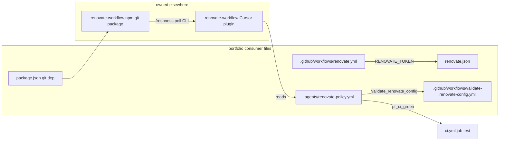

# Renovate workflow adoption for portfolio

## Recommended execution authority

| Slice                   | Recommended authority | Agent instruction                                      |
| ----------------------- | --------------------- | ------------------------------------------------------ |
| plan-review             | Plan-only PR          | Do not implement. Stop after opening the plan-only PR. |
| renovate-implementation | Open PR only          | Do not merge. Stop after opening the PR.               |
| plan-closure            | Open PR only          | Do not merge. Stop after opening the PR.               |

Repo default: **Open PR only** ([planning-standards.md](../standards/planning-standards.md#repo-default-when-no-plan-slice-applies)).

## Repository topology (default)

The repository integration branch is `main`. Each slice starts from and targets `main`.

**Before implementation:** `git fetch` then a fresh branch from `origin/main`.

**Before opening the PR:** verify the branch represents only the current slice.

**After opening the PR:** verify the GitHub PR base branch is `main`.

---

**Prerequisite:** CI consolidation merged on `main` ([PR #22](https://github.com/mastermichaelt/portfolio/pull/22)). Single CI job `test` in [`.github/workflows/ci.yml`](../../.github/workflows/ci.yml). Required status check: **`CI / test`**.

## Plan review (pre-slice)

**Recommended authority:** Plan-only PR

**Rationale:**

- Cross-cutting adoption (policy, Renovate bot, CI workflows, npm git dep) needs reviewed plan before implementation
- Expected diff is plan artifact only

**Agent instruction:** Do not implement. Stop after opening the plan-only PR.

---

## Slice — renovate-implementation

**Recommended authority:** Open PR only

**Rationale:**

- Consumer files are merge-safe together; no plugin vendoring
- Branch protection and human review gate merge

**Agent instruction:** Do not merge. Stop after opening the PR.

### Scope

Consumer-only changes. No vendoring of plugin skills, agents, rubric, scripts, or runbook from [multipliers-dev/renovate-workflow](https://github.com/multipliers-dev/renovate-workflow).

**New files**

| File                                                                                                     | Purpose                                                |
| -------------------------------------------------------------------------------------------------------- | ------------------------------------------------------ |
| [`.agents/renovate-policy.yml`](../../.agents/renovate-policy.yml)                                       | Repo facts, package buckets, path rules, CI bindings   |
| [`renovate.json`](../../renovate.json)                                                                   | Renovate bot config (`pat_branch`, `renovate/` prefix) |
| [`.github/workflows/renovate.yml`](../../.github/workflows/renovate.yml)                                 | Scheduled + manual self-hosted Renovate                |
| [`.github/workflows/validate-renovate-config.yml`](../../.github/workflows/validate-renovate-config.yml) | Conditional gate referenced by policy                  |

**Modified files**

| File                                           | Change                                                                  |
| ---------------------------------------------- | ----------------------------------------------------------------------- |
| [`package.json`](../../package.json)           | `renovate-workflow` git devDep, `tsx`, `renovate:freshness-poll` script |
| [`package-lock.json`](../../package-lock.json) | Regenerated via `npm install`                                           |

**Unchanged**

- [`.gitignore`](../../.gitignore) — `.agent-runs/` already covers `.agent-runs/renovate/`
- [`.github/workflows/ci.yml`](../../.github/workflows/ci.yml) — no restructuring
- No AGENTS.md / Cursor skill changes unless explicitly requested later

### Architecture



### `.agents/renovate-policy.yml`

Base on upstream [`.agents/renovate-policy.template.yml`](https://github.com/multipliers-dev/renovate-workflow/blob/main/.agents/renovate-policy.template.yml). Preserve `version: "3"`, risk classes, merge authority, investigation-approved mode, check assembly, lockfile thresholds, `deployment.mode: pat_branch`.

**Repo facts:**

```yaml
repo:
  owner: mastermichaelt
  name: portfolio
  renovate_branch_prefix: renovate/
  workspace_roots:
    - package.json
```

**CI bindings:**

```yaml
checks:
  pr_ci_green:
    when: pre_merge
    workflow: .github/workflows/ci.yml
    job: test
  post_merge_main_ci_green:
    when: post_merge
    workflow: .github/workflows/ci.yml
    job: test
    branch: main
```

Branch protection: **`CI / test`** only.

**Package classification** ([policy-rubric.base.md](https://github.com/multipliers-dev/renovate-workflow/blob/main/.agents/policy-rubric.base.md)):

- Production `dependencies` (`next`, `react`, `react-dom`, `gsap`, `@gsap/react`, `posthog-js`) — **no explicit bucket**; derive `runtime_dependency`
- `packages.high_touch`: `typescript`, `eslint`, `eslint-config-next`, `@playwright/test`, `vitest`, `@vitest/coverage-v8`, `tailwindcss`, `@tailwindcss/postcss`
- `packages.low_risk_tooling`: `prettier`, `husky`, `lint-staged`, `eslint-config-prettier`, `@types/*`
- Deliberately unlisted: `@google/genai` (dev-only media scripts)

Do **not** put production runtime packages in `high_touch` — that incorrectly enables investigation-approved path instead of `runtime_dependency`.

**Path rules:**

| Section           | Paths                                                                                                                                                                                                                                                  |
| ----------------- | ------------------------------------------------------------------------------------------------------------------------------------------------------------------------------------------------------------------------------------------------------ |
| `sensitive_paths` | `app/**`, `components/**`, `domain/**`, `content/**`, `repositories/**`, `lib/**`, `e2e/**`, `tests/**`, `playwright.config.ts`, `next.config.ts`, `postcss.config.mjs`, `eslint.config.mjs`, `tsconfig.json`, `.github/workflows/**`, `renovate.json` |
| `analytics_paths` | `lib/posthog.ts`, `lib/analyticsEnvironment.ts`, `instrumentation-client.ts`                                                                                                                                                                           |
| `auth_paths`      | `[]`                                                                                                                                                                                                                                                   |

### `renovate.json`

**Topology** from [example-repo](https://github.com/multipliers-dev/renovate-workflow/blob/main/examples/example-repo/renovate.json): individual npm PRs; GitHub Actions group only (`pinDigests: true`).

**Operational controls** from [dogfood](https://github.com/multipliers-dev/renovate-workflow/blob/main/renovate.json): `timezone: Australia/Sydney`, `dependencyDashboard: true`, `prHourlyLimit: 2`, `prConcurrentLimit: 5`, `lockFileMaintenance` before 6am Monday.

**Do not** copy [codenames-ai-guesser](https://github.com/multipliers-dev/codenames-ai-guesser/blob/main/renovate.json) npm groups — policy buckets ≠ Renovate topology.

```json
{
  "$schema": "https://docs.renovatebot.com/renovate-schema.json",
  "extends": ["config:recommended"],
  "branchPrefix": "renovate/",
  "timezone": "Australia/Sydney",
  "labels": ["dependencies"],
  "rangeStrategy": "bump",
  "dependencyDashboard": true,
  "prHourlyLimit": 2,
  "prConcurrentLimit": 5,
  "lockFileMaintenance": {
    "enabled": true,
    "schedule": ["before 6am on Monday"]
  },
  "packageRules": [
    {
      "matchManagers": ["github-actions"],
      "groupName": "GitHub Actions",
      "pinDigests": true
    }
  ]
}
```

### `.github/workflows/renovate.yml`

Follow upstream dogfood: `workflow_dispatch` + `cron: "0 18 * * 0"`, `permissions: contents: read`, `RENOVATE_TOKEN`, digest-pinned `renovatebot/github-action` (re-check upstream `main` at implementation).

### `.github/workflows/validate-renovate-config.yml`

Path-scoped to `renovate.json`; `renovate-config-validator --strict`; Node 24 via `.nvmrc`.

### `package.json` babysit integration

Per [adopt.md](https://github.com/multipliers-dev/renovate-workflow/blob/main/docs/adopt.md):

```json
"renovate-workflow": "github:multipliers-dev/renovate-workflow",
"tsx": "^4.23.12",
"renovate:freshness-poll": "tsx node_modules/renovate-workflow/scripts/renovate-freshness-poll.ts"
```

### Acceptance

- `npm install` succeeds; `npm run renovate:freshness-poll --` prints usage
- `renovate.json` validates; lint/typecheck/test/build pass
- Policy `job: test` matches CI; branch prefix matches `renovate.json`
- No plugin-owned skills/agents/scripts vendored

### Manual GitHub setup (document in implementation PR)

1. Repository secret `RENOVATE_TOKEN`
2. Branch protection requires `CI / test`
3. Cursor plugin: import `https://github.com/multipliers-dev/renovate-workflow`, install **renovate-workflow**

---

## Agent prompts (copy/paste for Cursor)

### Plan review (completed)

```text
Execute plan-review from @.cursor/plans/2026-10-07-renovate-workflow-setup.plan.md only. Commit the plan artifact and open a PR targeting main. Do not implement consumer Renovate files. Mark plan-review completed in frontmatter. Stop after opening the plan-only PR.
```

### Implementation slice

```text
Implement slice renovate-implementation from @.cursor/plans/2026-10-07-renovate-workflow-setup.plan.md only. Prerequisite: plan-review merged. Start from latest origin/main. Add only consumer files in the plan. Do not vendor plugin skills/agents/scripts. Production dependencies derive as runtime_dependency — do not list them in packages.high_touch. Bind CI to job: test. Run verification from the plan. Mark renovate-implementation completed in frontmatter. Open PR targeting main. Do not merge. Do not start plan-closure.
```

### Plan closure

```text
Execute plan-closure from @.cursor/plans/2026-10-07-renovate-workflow-setup.plan.md only. Prerequisite: renovate-implementation merged. Docs-only PR: verify slice todos, add # Shipped note, move plan to .cursor/plans/archive/2026-10-07-renovate-workflow-setup.plan.md, mark plan-closure completed. Stop after opening the PR. Do not merge.
```
