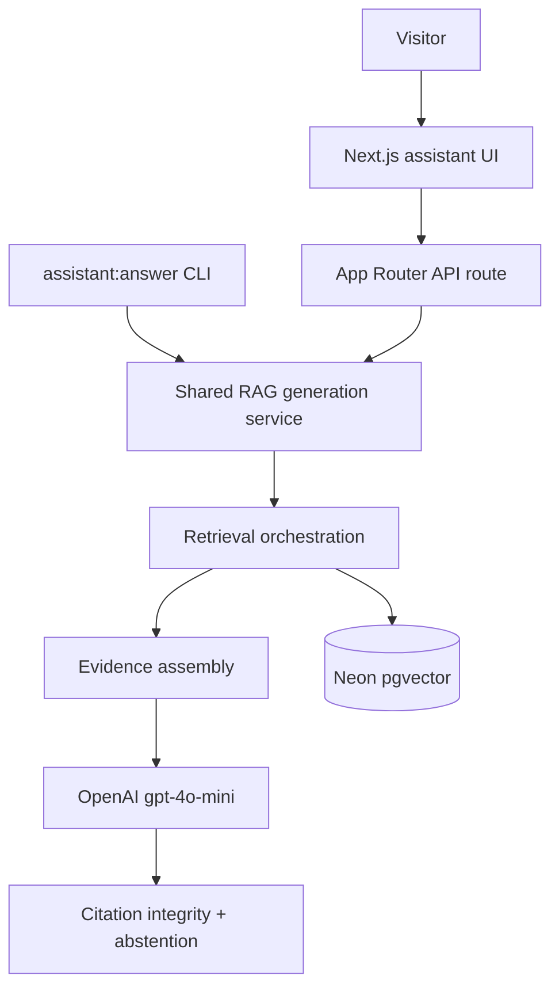

# Assistant grounded RAG generation

**Goal:** Deliver a **working portfolio assistant on [michaeltruong.ai](https://michaeltruong.ai)** — visitor questions answered with **grounded, attributable** responses from the indexed OKF corpus (101 concepts; retrieval-eval baseline on current index). **Generation quality and correctness first**; UI stays minimal.

**Plan amendment (2026-10-08):** Milestone scope expanded from dev-only `assistant:answer` to **server-backed deployment**. PR #55 (plan) and PR #56 (`generation-contract`) are merged. This document amends the active plan in place; do not fork a competing plan.

**Direction (design background):** [rag-generation-direction.md](../../docs/assistant/rag-generation-direction.md)

**Prerequisites (shipped):** OKF + structure-aware derive/ingest/retrieve; cross-repository corpus + retrieval-eval — [cross-repository-corpus-eval-findings.md](../../docs/assistant/cross-repository-corpus-eval-findings.md); **generation contract** (`scripts/assistant/generation/*`, `tests/assistant-generation-contract.test.ts`).

**Non-goals (milestone):** corpus expansion, retrieval-eval baseline changes, streaming, LangChain/LlamaIndex, automatic corpus updates, live web search, elaborate chat product (threads, memory, tool use), neighbour ±1 expansion, tokenizer-exact budgets, LLM-as-judge in required CI.

## Locked decisions

Preserve unless a future plan amendment explicitly revises them.

| Topic                  | Decision                                                                                                                                                                                                                                                            |
| ---------------------- | ------------------------------------------------------------------------------------------------------------------------------------------------------------------------------------------------------------------------------------------------------------------- |
| Chat model             | `gpt-4o-mini` default (`ASSISTANT_GENERATION_MODEL` override); **native fetch** Chat Completions (mirror embeddings adapter); no LangChain/LlamaIndex                                                                                                               |
| Shared service         | **One** RAG generation implementation: query validation → retrieve → assemble → generate → parse → citation integrity → abstention/diagnostics. **`assistant:answer` CLI and App Router API route are thin adapters** — no shell-out, no duplicate generation paths |
| Default assembly       | **Bounded full-parent** at **OKF concept** boundary (`okf_concept_id`); Postgres-backed parent units                                                                                                                                                                |
| Eval baseline assembly | `top_k_only` (non-default for operators/eval)                                                                                                                                                                                                                       |
| Generation retrieve K  | Default **10** (`--top-k` / service default); retrieve CLI default **5** unchanged                                                                                                                                                                                  |
| Budget                 | Truncate **unmatched** chunks only, or **`EvidenceBudgetExceeded`** — never silently drop top-K matched units                                                                                                                                                       |
| Citations              | **Integrity** (deterministic: `evidence_id`, `unit_id`, approved URLs) in contract + runtime; **support** (semantic) in generation-eval only                                                                                                                        |
| Index + corpus         | **Neon pgvector** + existing operator-controlled `okf:build` → `assistant:ingest` workflow; no automatic corpus updates                                                                                                                                             |
| Deployment target      | **michaeltruong.ai** (Vercel production); server-only `DATABASE_URL`, `OPENAI_API_KEY`, and generation config                                                                                                                                                       |

## Recommended execution authority

| Slice                  | Recommended authority    | Agent instruction                          |
| ---------------------- | ------------------------ | ------------------------------------------ |
| generation-contract    | Open PR only             | **Completed** (merged).                    |
| generation-cli         | Open PR only             | Do not merge. Stop after opening the PR.   |
| generation-eval        | Open PR only             | Do not merge. Stop after opening the PR.   |
| generation-api         | Open PR only             | Do not merge. Stop after opening the PR.   |
| generation-ui          | Open PR only             | Do not merge. Stop after opening the PR.   |
| operational-acceptance | Manual verification gate | No commit/PR; gitignored run notes allowed |
| plan-closure           | Open PR only             | Do not merge. Stop after opening the PR.   |

Repo default: **Open PR only** ([planning-standards.md](../standards/planning-standards.md)).

## Repository topology (default)

Multi-slice plans stack **execution order**, not Git branches. Integration branch: **`main`**.

**Before each implementation slice:** `git fetch` → fresh branch from `origin/main`.

**Before opening a PR:** branch contains **only** that slice’s changes.

**After opening:** PR base is `main`; diff has no prior-slice work except through merged `main`.

---

## Target architecture



### Shared RAG generation service (core)

Owns end-to-end generation for **both** CLI and server:

1. **Query validation** — non-empty, max length, reject obvious abuse patterns (eval expands injection cases).
2. **Retrieval orchestration** — embed question, `top-K` (default 10), optional filters; reuse existing retrieve stack.
3. **Evidence assembly** — `full_parent` default; `EvidenceBudgetExceeded` fail-closed; contract packet types.
4. **Generation** — structured JSON via fetch adapter; timeouts; token usage capture.
5. **Response handling** — parse contract schema; **citation integrity** + URL whitelist; map failures to safe abstention/errors.
6. **Diagnostics** — assembly mode, truncation, token counts for operators; **strip private diagnostics from API client payloads**.

Keep **retrieval**, **assembly**, **generation**, and **validation** independently unit-testable; service composes them.

### Evidence assembly (`full_parent` default)

1. Retrieve top-K (default 10); record `matched_hits[]`.
2. Distinct parents ordered by best hit rank.
3. Per parent: fetch all `assistant_retrieval_units` for `okf_concept_id`; order by `chunk_index`, `unit_id`.
4. Dedupe `content_hash` **within** OKF concept; matched `unit_id` preserved; matched supersedes unmatched hash duplicates.
5. **Budget:** all matched units, then unmatched chunks until cap; else **`EvidenceBudgetExceeded`** (no LLM).
6. **`top_k_only`:** retrieved rows only (eval baseline).

### Citation layers

| Layer                  | Slice                                                            | Purpose                                |
| ---------------------- | ---------------------------------------------------------------- | -------------------------------------- |
| **Citation integrity** | `generation-contract` (done), `generation-cli`, `generation-api` | IDs/URLs refer to supplied packet only |
| **Citation support**   | `generation-eval`, operational review                            | Cited evidence backs the claim         |

### Public deployment requirements (API + production)

Resource controls are **server-side**; the browser is untrusted.

**V1 rate limiting and cost containment (practical):**

- **Per-client limits** — IP- or fingerprint-based request budget (e.g. requests per minute/hour/day) enforced in the API route or edge middleware compatible with **Vercel Fluid Compute** (multiple instances). **Do not rely solely on in-memory counters** — use a **durable shared store** (e.g. Vercel KV / Upstash Redis, or Postgres-backed counters on the assistant DB) so limits hold across instances and cold starts.
- **Global safeguards** — OpenAI project budget/alerts (existing operator practice); optional daily cap on generation calls logged in durable store; fail closed with a safe public error when limits trip.
- **Request bounds** — max question length, max JSON body size, server timeouts aligned with platform limits (Node Fluid Compute default duration).
- **Response bounds** — never return raw evidence packets, embedding vectors, SQL errors, stack traces, or API keys; map `EvidenceBudgetExceeded` and validation failures to stable client messages.
- **Secrets** — `DATABASE_URL`, `OPENAI_API_KEY`, and generation overrides **server-only** (Vercel env); never `NEXT_PUBLIC_*` for credentials.

**Runtime:** App Router route on default **Node.js** runtime (Fluid Compute); no Edge-only APIs required for pgvector access. Document deployment env in [assistant-database.md](../../docs/assistant/assistant-database.md) when `generation-api` lands.

### Deferred

Streaming, neighbour expansion, automatic ingest on deploy, external web search, conversational memory, LLM-as-judge as required CI gate.

---

## Slice — `generation-contract` (shipped)

**Status:** **Completed** (merged via PR #56).

**Delivered:** `full_parent` + `top_k_only` assembly, `EvidenceBudgetExceeded`, response schema, citation integrity (IDs + approved URLs from packet entries), contract tests.

**PR boundary:** Contract modules + tests only.

---

## Slice — `generation-cli`

**Recommended authority:** Open PR only

**Rationale:** Introduces the **shared service** and operator CLI before eval and server adapters.

**Agent instruction:** Do not merge. Stop after opening the PR.

**Goal:** Implement **shared RAG generation service** + fetch-based OpenAI chat adapter + **`npm run assistant:answer`** as a thin CLI adapter (`--assembly-mode`, `--top-k`, `--json`, `--dry-run-retrieval`).

**Non-goals:** `app/api/` route, UI, generation-eval fixtures, duplicate generation logic outside the service.

**Likely files:** `scripts/assistant/generation/run-generation.mjs` (or equivalent service entry), `openai-chat.mjs`, `generation-config.mjs`, `assistant:answer` script wiring, tests with mocked `fetch`, [assistant-database.md](../../docs/assistant/assistant-database.md), `.env.example`.

**Dependencies:** `generation-contract` on `main`.

**Acceptance:**

- Service callable from CLI without spawning subprocesses.
- Grounded sample question with valid citations when `DATABASE_URL` + `OPENAI_API_KEY` set.
- Non-zero exit on `EvidenceBudgetExceeded`, integrity failure, API errors.
- Mocked `fetch` tests for service + adapter boundaries.

**PR boundary:** Service + CLI + config/docs; no API route, no UI, no eval harness.

---

## Slice — `generation-eval`

**Recommended authority:** Open PR only

**Rationale:** Answer-quality and safety signals before exposing a public endpoint.

**Agent instruction:** Do not merge. Stop after opening the PR.

**Goal:** `tests/assistant-generation-eval.test.ts`, fixtures, `scripts/assistant/generation/eval.mjs`, stub [generation-eval-findings.md](../../docs/assistant/generation-eval-findings.md).

**Scope:** Answer correctness samples, **citation support**, unsupported questions, partial answers, **prompt injection** cases, `full_parent` vs `top_k_only` comparison. **Do not change** retrieval-eval fixtures or [eval-cases.json](../../tests/fixtures/assistant-retrieval/eval-cases.json).

**Dependencies:** `generation-cli` merged.

**Acceptance:**

- Deterministic: mock outputs → integrity + support scorers; mis-citation case (integrity pass, support fail).
- Integration `skipIf` without secrets.

**PR boundary:** Eval harness + stub doc only.

---

## Slice — `generation-api`

**Recommended authority:** Open PR only

**Rationale:** Production entrypoint; must reuse shared service from `generation-cli`.

**Agent instruction:** Do not merge. Stop after opening the PR.

**Goal:** Next.js **server-side** API route (e.g. `app/api/assistant/...`) that calls the **same shared RAG generation service** as the CLI.

**Non-goals:** Chat UI, shell-out to CLI, client-side retrieval/generation, exposing internal packets or secrets.

**Requirements:**

- Request validation (schema, size, method).
- Server-only secrets and configuration.
- **Rate limiting** and usage controls per [Public deployment requirements](#public-deployment-requirements-api--production).
- Timeouts and safe error mapping for clients.
- Tests: route handler unit tests with mocked service; no live keys in CI.

**Dependencies:** `generation-cli` merged (`generation-eval` may land in parallel only if merge-safe; prefer **eval after CLI**, **API after CLI**).

**Acceptance:**

- Route returns public-safe JSON (answer, support level, citations, stable error codes).
- Service integration test or handler test proves no duplicate generation implementation.
- Document production env vars and limits in assistant-database or dedicated assistant API doc section.

**PR boundary:** API route + server wiring + tests + docs; no UI slice work.

---

## Slice — `generation-ui`

**Recommended authority:** Open PR only

**Rationale:** Minimal visitor surface after API exists.

**Agent instruction:** Do not merge. Stop after opening the PR.

**Goal:** Accessible assistant UI on the portfolio — question input, loading/error states, grounded answer rendering, **clickable citations** (map to public URLs from citation metadata), unsupported/abstention copy, small **suggested-questions** set.

**Non-goals:** Thread history, streaming, new design system, heavy chat dependencies.

**Dependencies:** `generation-api` merged (or same PR only if truly merge-safe — **prefer separate PR**).

**Acceptance:**

- Uses existing tokens/components ([design-system.md](../../docs/design-system.md)).
- Calls API route only; no secrets in client bundle.
- Basic a11y: labels, focus, reduced-motion respect.
- Playwright or component tests where practical; manual mobile check documented in PR.

**PR boundary:** UI routes/components/styles + client fetch; no eval harness changes.

---

## Slice — `operational-acceptance`

**Recommended authority:** Manual verification gate

**Rationale:** Model quality, cost, abuse resistance, and deployment config require operator review before calling the assistant publicly ready.

**Agent instruction:** Do not commit or open a PR. Optional `.agent-runs/assistant-generation/**`.

**Prerequisites:** `generation-contract` through `generation-ui` merged; production index ingested; Vercel env configured for michaeltruong.ai.

**Procedure (expanded):**

- **Local:** ~12–15 `assistant:answer` runs (`full_parent`); 3–4 `top_k_only` comparisons; tokens, `EvidenceBudgetExceeded`, citation-support spot checks.
- **Deployed:** E2E on production/preview — grounding, citation links, abstention on unsupported questions, **rate limit** behavior, error surfaces, mobile layout, latency sanity.
- **Cost:** confirm OpenAI project budget/alerts; note observed usage band.
- **Sign-off:** explicit operator approval recorded in findings (no fabricated metrics).

**Acceptance:** [generation-eval-findings.md](../../docs/assistant/generation-eval-findings.md) (or successor ops doc) updated; operator sign-off; assistant not declared “public-ready” without this gate.

---

## Slice — `plan-closure`

**Recommended authority:** Open PR only

**Agent instruction:** Do not merge. Stop after opening the PR.

**Prerequisites:** All implementation slices + **operational-acceptance** complete; assistant **deployed and verified** on michaeltruong.ai.

**Deliverables:** `# Shipped` note; move plan to `.cursor/plans/archive/2026-10-08-assistant-grounded-rag-generation.plan.md`; update [architecture-direction.md](../../docs/assistant/architecture-direction.md) and [rag-generation-direction.md](../../docs/assistant/rag-generation-direction.md); mark `plan-closure` completed.

---

## Agent prompts (copy/paste for Cursor)

### generation-cli

```text
@.cursor/plans/2026-10-08-assistant-grounded-rag-generation.plan.md

Implement slice generation-cli only. Prerequisite: generation-contract merged. Do not start generation-eval, generation-api, generation-ui, or later. Do not archive the plan.

Authority: Open PR only — implement and open the PR; do not merge.

Topology: start from latest origin/main; branch represents only this slice; PR base must be main.

Deliverables: shared RAG generation service, fetch OpenAI chat adapter, assistant:answer CLI as thin adapter, tests, assistant-database + .env.example docs. Mark generation-cli completed in plan frontmatter in this PR.

Verification: npm run test; npm run lint; npm run typecheck; npm run format:check; manual assistant:answer when DATABASE_URL + OPENAI_API_KEY available.
```

### generation-eval

```text
@.cursor/plans/2026-10-08-assistant-grounded-rag-generation.plan.md

Implement slice generation-eval only. Prerequisite: generation-cli merged. Do not start generation-api, generation-ui, operational-acceptance, or plan-closure. Do not archive the plan.

Authority: Open PR only — implement and open the PR; do not merge.

Topology: start from latest origin/main; branch represents only this slice; PR base must be main.

Deliverables: generation eval fixtures/harness (citation support, abstention, injection, assembly modes); tests/assistant-generation-eval.test.ts; docs/assistant/generation-eval-findings.md stub. Do not change assistant-retrieval eval-cases.json. Mark generation-eval completed in plan frontmatter in this PR.

Verification: npm run test -- tests/assistant-generation-eval.test.ts; npm run lint; npm run typecheck; npm run format:check.
```

### generation-api

```text
@.cursor/plans/2026-10-08-assistant-grounded-rag-generation.plan.md

Implement slice generation-api only. Prerequisite: generation-cli merged. Do not start generation-ui, operational-acceptance, or plan-closure. Do not archive the plan.

Authority: Open PR only — implement and open the PR; do not merge.

Topology: start from latest origin/main; branch represents only this slice; PR base must be main.

Deliverables: Next.js server API route calling the shared RAG generation service (no CLI shell-out); request validation, durable rate limiting strategy, timeouts, safe client errors; tests + deployment docs. Mark generation-api completed in plan frontmatter in this PR.

Verification: npm run test; npm run lint; npm run typecheck; npm run format:check; manual route test against local dev with server env vars.
```

### generation-ui

```text
@.cursor/plans/2026-10-08-assistant-grounded-rag-generation.plan.md

Implement slice generation-ui only. Prerequisite: generation-api merged. Do not start operational-acceptance or plan-closure. Do not archive the plan.

Authority: Open PR only — implement and open the PR; do not merge.

Topology: start from latest origin/main; branch represents only this slice; PR base must be main.

Deliverables: minimal accessible assistant UI (input, loading/errors, citations, suggested questions) using design system; client calls API only. Mark generation-ui completed in plan frontmatter in this PR.

Verification: npm run lint; npm run typecheck; npm run format:check; npm run test; manual desktop + mobile check.
```

### operational-acceptance

```text
@.cursor/plans/2026-10-08-assistant-grounded-rag-generation.plan.md

Run the manual verification gate (operational-acceptance) only. Prerequisites: generation-contract through generation-ui merged and marked completed. Do not start plan-closure.

Authority: Manual verification gate.

Topology: no tracked-file changes unless operator chooses to commit findings doc in a follow-up; optional gitignored .agent-runs/assistant-generation/**.

Deliverables: execute plan operational-acceptance procedure (local + deployed on michaeltruong.ai); report verdict and paths to any gitignored notes.
```

### plan-closure

```text
@.cursor/plans/2026-10-08-assistant-grounded-rag-generation.plan.md

Execute only plan-closure.

Authority: Open PR only — docs-only archive PR; do not merge.

Prerequisites: all implementation slices and operational-acceptance complete; assistant verified on michaeltruong.ai; slice todos marked completed in frontmatter.

Topology: start from latest origin/main; branch represents only this slice; PR base must be main.

Deliverables: verify slice todos, add # Shipped note, move plan to .cursor/plans/archive/2026-10-08-assistant-grounded-rag-generation.plan.md, mark plan-closure completed, update architecture-direction and rag-generation-direction.

Verification: confirm prerequisite PRs merged and production verification recorded before archiving.
```
