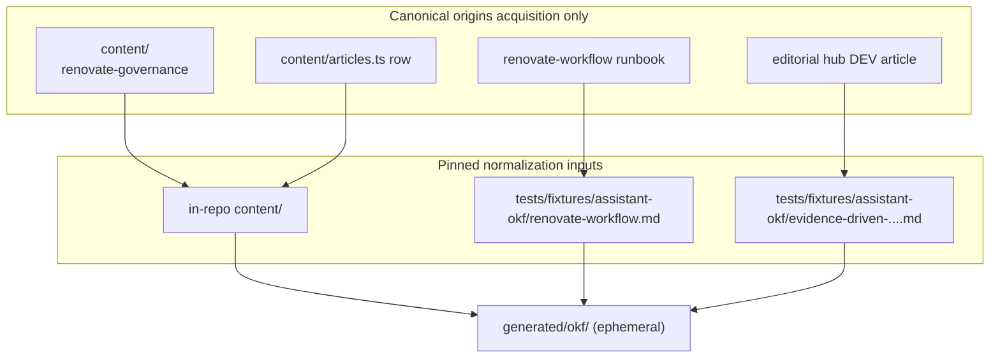

# Shipped

**Archived 2026-10-06.**

| Slice                        | Delivered                                                                                                                                            |
| ---------------------------- | ---------------------------------------------------------------------------------------------------------------------------------------------------- |
| plan-review                  | [#19](https://github.com/mastermichaelt/portfolio/pull/19) — plan artifact for three-source OKF normalization experiment                             |
| okf-normalization-experiment | [#20](https://github.com/mastermichaelt/portfolio/pull/20) — producers, ephemeral `generated/okf/`, test fixtures, findings doc, normalization tests |
| plan-closure                 | This PR — verify slice todos, `# Shipped` note, archive plan                                                                                         |

**Durable artifacts (remain active):**

- [`docs/assistant/okf-normalization-experiment.md`](../../../docs/assistant/okf-normalization-experiment.md) — experiment findings and architectural conclusion
- [`scripts/assistant/okf/`](../../../scripts/assistant/okf/) — source producers and `npm run okf:build`
- [`tests/fixtures/assistant-okf/`](../../../tests/fixtures/assistant-okf/) — representative external-source test inputs

This plan is archived. Next assistant work proceeds via just-in-time `.cursor/plans/` from [`architecture-direction.md`](../../../docs/assistant/architecture-direction.md) — retrieval-unit derivation, production acquisition, and assistant runtime remain future slices.

---

# Assistant OKF normalization experiment

## Recommended execution authority

| Slice                        | Recommended authority | Agent instruction                                      |
| ---------------------------- | --------------------- | ------------------------------------------------------ |
| plan-review                  | Plan-only PR          | Do not implement. Stop after opening the plan-only PR. |
| okf-normalization-experiment | Open PR only          | Do not merge. Stop after opening the PR.               |
| plan-closure                 | Open PR only          | Do not merge. Stop after opening the PR.               |

Repo default: **Open PR only** ([planning-standards.md](.cursor/standards/planning-standards.md)).

## Repository topology (default)

Integration branch: `main`. Each slice starts from latest `origin/main`; branch diff represents only that slice; PR base is `main`.

---

## Investigation summary (inputs to this plan)

### OKF v0.2 — what the spec actually supports

Read the current [OKF specification (v0.2 draft)](https://github.com/GoogleCloudPlatform/knowledge-catalog/blob/main/okf/SPEC.md). Key facts for this experiment:

| Capability                | Spec reality                                                                                                            | Implication for us                                                                                             |
| ------------------------- | ----------------------------------------------------------------------------------------------------------------------- | -------------------------------------------------------------------------------------------------------------- |
| **Bundle shape**          | Directory tree of UTF-8 `.md` files with YAML frontmatter; distributable as git repo                                    | Shipped as ephemeral local bundle under `generated/okf/` (gitignored), not committed as production corpus      |
| **Conformance**           | Only hard requirements: parseable frontmatter + non-empty `type` on every concept; reserved `index.md` / `log.md` rules | Validation is lightweight; focus on mapping quality, not schema registry                                       |
| **`type`**                | Free-form string, not centrally registered                                                                              | Use descriptive types (`Case Study Block`, `Published Article`, `Runbook`) — no portfolio type registry needed |
| **Provenance**            | `sources[]` with required `resource` per entry; optional `id`, `title`, credibility signals                             | Maps cleanly to portfolio URLs, GitHub paths, DEV URLs, inventory paths                                        |
| **Per-claim attribution** | Markdown footnotes keyed to `sources[].id`                                                                              | Maps to `CaseFigure` and contract lines if we include figure-bearing portfolio content later                   |
| **Trust / lifecycle**     | Optional `generated`, `verified`, `status`, `stale_after`                                                               | Producers stamp `generated.by` (e.g. `process:portfolio-okf-producer`)                                         |
| **Cross-links**           | Bundle-relative markdown links (`/path/concept.md`)                                                                     | Link portfolio case ↔ repo runbook ↔ DEV article concepts                                                      |
| **`resource`**            | Canonical URI for underlying asset                                                                                      | Portfolio routes (`https://michaeltruong.ai/projects/...`), DEV URL, GitHub raw URL                            |
| **Extensions**            | Producers MAY add arbitrary frontmatter keys; consumers MUST preserve unknown keys                                      | Prefer standard fields first; only add `x_portfolio_*` if a concrete source demonstrates a gap                 |
| **Attested Computation**  | First-class for sanctioned metrics                                                                                      | Out of scope for this experiment unless a figure-bearing portfolio block is added                              |
| **Non-goals**             | No storage, embeddings, query infra, fixed taxonomy                                                                     | Confirms retrieval metadata must not leak into OKF                                                             |

**v0.2 additions over v0.1** that matter: provenance/trust/lifecycle families, actor convention (`human:`, `process:`, `agent/tool`), `references/` convention for mirrored external material.

### Representative sources chosen

Three sources, one per architecture source class, chosen to exercise **different structural shapes** while staying on one **coherent knowledge thread** (Renovate governance) so overlap vs complementarity is observable during manual inspection.



#### 1. Portfolio — `renovate-governance` supporting case

- **Primary:** [`content/supporting-cases.ts`](content/supporting-cases.ts) → `renovateGovernance` object
- **Secondary (same producer pass):** [`content/articles.ts`](content/articles.ts) row for slug `evidence-driven-dependency-upgrades` (catalog metadata only — no body)

**Why selected:**

| Shape exercised                                                      | Evidence                                                                |
| -------------------------------------------------------------------- | ----------------------------------------------------------------------- |
| Typed narrative blocks (`prose`, `architecture`, `contract`, `note`) | Unlike flat article catalog or repo markdown                            |
| Presentation metadata (`ordinal`, `navLabel`, `category`)            | Tests what stays in OKF vs is dropped as UI-only                        |
| `architecture` block referencing ecosystem canvas                    | Forces decision: link out, do not embed layout coordinates              |
| Non-rendered verbatim provenance map (`supportingCaseSourceProse`)   | Tests whether review aids become `sources` or are intentionally dropped |
| Cross-links to routes and field reports                              | `elsewhere`, artifact rows, `relatedProjectSlug`                        |

**Not chosen as primary portfolio source (document in inspection report):**

- [`content/project-cases.ts`](content/project-cases.ts) — richer `CaseFigure` + inventory `source` provenance; better for a follow-up if figure attribution is the main open question
- [`content/ecosystem.ts`](content/ecosystem.ts) — graph shape; defer until a second experiment or explicit graph-normalization slice

#### 2. Project repository — Renovate runbook

- **Canonical origin:** `../renovate-workflow/docs/renovate-workflow.md` (sibling checkout) or `https://raw.githubusercontent.com/multipliers-dev/renovate-workflow/main/docs/renovate-workflow.md` (public mirror for acquisition only)
- **Normalization input:** representative test fixture under `tests/fixtures/assistant-okf/renovate-workflow.md` (not a persisted assistant corpus)

**Why selected:**

- Deliberately ingestible per [architecture-direction.md](docs/assistant/architecture-direction.md) (architecture/operator doc, not agent skills or plans)
- Already cited as external evidence in portfolio redesign baseline
- Operator voice + sectioned markdown + mermaid — different from curated case-study blocks
- Complements portfolio summary with operational detail (prerequisites, packet YAML, merge guards)

#### 3. Published writing — DEV field report

- **Canonical origin:** `../editorial-workflow/docs/dev.to/published/evidence-driven-dependency-upgrades.md` (sibling hub; portfolio [`articles.ts`](content/articles.ts) names this hub as master)
- **Live URL (provenance only):** `https://dev.to/michaeltruong/upgrades-dont-have-to-be-a-blind-trust-exercise-13mj` (`devto_article_id: 4056883`)
- **Normalization input:** representative test fixture under `tests/fixtures/assistant-okf/evidence-driven-dependency-upgrades.md` (not a persisted assistant corpus)

**Why selected:**

- Full first-person narrative with incident detail (Vite major upgrade) — shape portfolio summaries cannot represent
- Pairs with `relatedProjectSlug: "renovate-governance"` and the repo runbook
- YAML frontmatter (Notion, DEV ids, sync timestamps) exercises metadata beyond portfolio `Article` type

### Source inputs (experiment-only; no production ingestion)

Normalization must be **deterministic**: the same commit always normalizes the same input bytes. Canonical sources remain authoritative; OKF is a transient normalized intermediate representation.

```text
canonical sources (portfolio content/, representative test fixtures)
        ↓
source-specific producers
        ↓
OKF normalization                          (okf:build — local inputs only)
        ↓
transient OKF concepts                     (generated/okf/ — gitignored)
        ↓
retrieval-unit derivation                  [future]
        ↓
embeddings / vector index                  [future]
```

**Do not** implement `okf:build` as “sibling checkout if present, else fetch from network.” Two developers on the same commit must not produce different normalized output because their local checkouts differ.

| Source      | Canonical origin                                        | Normalization input (okf:build)                                       | What we are NOT building                             |
| ----------- | ------------------------------------------------------- | --------------------------------------------------------------------- | ---------------------------------------------------- |
| Portfolio   | In-repo `content/` (pinned by this git commit)          | `content/supporting-cases.ts`, `content/articles.ts`                  | CMS, live site scrape                                |
| Repo doc    | Sibling checkout or public mirror (provenance only)     | `tests/fixtures/assistant-okf/renovate-workflow.md`                   | Runtime network fetch during build; whole-repo crawl |
| DEV article | Sibling editorial hub or live DEV URL (provenance only) | `tests/fixtures/assistant-okf/evidence-driven-dependency-upgrades.md` | Runtime network fetch during build; DEV feed crawler |

Representative external fixtures are **test/experiment inputs**, updated manually when tests need a new sample. No `okf:snapshot` or fixture-refresh command shipped — production multi-repo/DEV acquisition remains undecided.

---

## Experiment boundary

### In scope

```text
canonical inputs (content/ + test fixtures)
        ↓
source-specific producers (portfolio | repo | dev)
        ↓
OKF v0.2 concept documents + bundle index
        ↓
ephemeral inspectable output (generated/okf/) + durable findings doc
```

**Deliverables (implementation slice — as shipped):**

| Path                                             | Purpose                                                                                                                      |
| ------------------------------------------------ | ---------------------------------------------------------------------------------------------------------------------------- |
| `scripts/assistant/okf/`                         | Producer scripts + shared OKF writer helpers                                                                                 |
| `generated/okf/`                                 | Ephemeral OKF bundle from `npm run okf:build` (gitignored; concepts, `index.md`, `manifest.json`)                            |
| `docs/assistant/okf-normalization-experiment.md` | Durable experiment findings (mapping report, granularity rationale, architectural conclusion)                                |
| `tests/fixtures/assistant-okf/`                  | Representative external-source test inputs (repo runbook, DEV article) — not a persisted assistant corpus                    |
| `package.json` scripts                           | `npm run okf:build` (normalization from local inputs only; no network)                                                       |
| Tests                                            | Producer boundaries, OKF conformance, deterministic ephemeral build, fixture input hashing — not committed corpus assertions |

**Producer boundaries:**

- **Portfolio producer** — reads typed `content/` imports; maps portfolio structure into OKF concepts where source semantics justify it. **Concept granularity is an experiment output**, not a plan assumption — documented in `docs/assistant/okf-normalization-experiment.md` with rationale and alternatives considered.
- **Repo producer** — reads the **test fixture** markdown; maps meaningful document structure into OKF concepts where source semantics justify it. **Do not assume every `##` heading becomes one concept** — headings may or may not align with knowledge boundaries; record whether they were useful boundaries in the findings doc.
- **DEV producer** — reads the **test fixture**; separates YAML frontmatter metadata from body; documents strip/preserve choices for HTML comments in the findings doc; sets `resource` to canonical DEV URL

**OKF concepts ≠ retrieval units.** Canonical OKF knowledge and future retrieval-unit derivation are separate layers per [architecture-direction.md](docs/assistant/architecture-direction.md). This experiment learns concept boundaries; it does not pre-commit chunk sizes or heading-based splits because they look convenient for retrieval.

**Inspectable questions the experiment must answer:**

1. What source material entered (test fixture hashes + ephemeral `generated/okf/manifest.json` after local build)
2. How each input maps to OKF concepts (findings doc + local `generated/okf/` layout)
3. Provenance / source identity (`sources`, `resource`, `generated`)
4. What was preserved vs lost vs awkward (findings doc table per source)
5. Whether any OKF extension was actually necessary (default: none; document pressure)
6. **What concept granularity was chosen and why** — per source class, document the mapping decision, alternatives considered (e.g. whole document vs sections vs blocks), and whether boundaries felt natural or awkward. Note implications for future retrieval-unit derivation without implementing it.

### Explicitly out of scope

- Embeddings, vector stores, semantic search, LangChain, RAG, LLM generation
- `app/api/` routes, chat UI, SSE/streaming, web retrieval
- Evaluation infrastructure, persistent vector infra, production ingestion pipelines
- Automatic indexing of whole repositories or DEV/GitHub crawling
- Changes to browsable portfolio pages or `PortfolioRepository` public contract
- Postgres / Neon / storage layer decisions
- Normalizing ecosystem graph, project-workflows layout coordinates, or codenames scroll experience

### Extension policy (during implementation)

For each apparent mismatch:

1. Verify base OKF (`sources`, `resource`, `tags`, `generated`, links, optional frontmatter) does not already cover it
2. Prefer standard semantics
3. Only add smallest `x_portfolio_*` key if a representative source demonstrates a real gap
4. Document gap + rationale in the findings doc even when no extension is added

**Anticipated pressure points** (likely resolvable without extensions):

| Pressure                                 | Likely OKF mapping                                                                                                  |
| ---------------------------------------- | ------------------------------------------------------------------------------------------------------------------- |
| Portfolio route identity                 | `resource: https://michaeltruong.ai/projects/renovate-governance#b04`                                               |
| Inventory fact ids (`CaseFigure.source`) | `sources[].resource` pointing at sibling inventory path + footnote `id`                                             |
| UI-only fields (`navLabel`, `ordinal`)   | Omit from OKF or nest under optional `x_portfolio_presentation` only if inspection proves loss blocks understanding |
| `architecture` block canvas data         | Link to ecosystem entities; do not embed React Flow positions                                                       |
| Editorial HTML comments in DEV body      | Strip from body; note in findings doc                                                                               |
| Article catalog vs full body             | Two linked concepts sharing `resource` / cross-links                                                                |

---

## Slice — plan-review

**Recommended authority:** Plan-only PR

**Rationale:**

- First implementation encounter with OKF; plan must be reviewed before producers or corpus land
- Expected diff is plan artifact only

**Agent instruction:** Do not implement. Stop after opening the plan-only PR.

**Goal:** Land [`.cursor/plans/assistant-okf-normalization-experiment.plan.md`](.cursor/plans/assistant-okf-normalization-experiment.plan.md) for review.

**Acceptance:**

- Plan references architecture direction, prior art, OKF spec findings, representative sources, acquisition strategy, experiment boundary, acceptance criteria
- No implementation files (`scripts/assistant/`, `assistant-corpus/`, etc.)
- `plan-review` marked `completed` in frontmatter in same PR

---

## Slice — okf-normalization-experiment

**Status:** completed ([PR #20](https://github.com/mastermichaelt/portfolio/pull/20))

**Recommended authority:** Open PR only

**Rationale:**

- Single bounded experiment; one PR is sufficient
- Produces inspectable ephemeral output and durable findings for manual review before any retrieval work

**Agent instruction:** Do not merge. Stop after opening the PR.

**Prerequisite:** `plan-review` merged.

**Goal:** Implement the smallest useful OKF normalization experiment for the three representative sources.

**Shipped layout:**

```
scripts/assistant/okf/               # producers + build
tests/fixtures/assistant-okf/        # representative repo + DEV test inputs
docs/assistant/okf-normalization-experiment.md   # durable findings
generated/okf/                       # ephemeral OKF bundle (gitignored; not committed)
  index.md
  manifest.json
  portfolio/                         # OKF concepts from content/
  repo/                              # OKF concepts from repo fixture
  writing/                           # OKF concepts from DEV fixture
```

**Architectural outcome:** Generated OKF is a transient intermediate representation, not an independent system of record. Canonical knowledge remains at originating sources. Retrieval units, embeddings, and vector indexes are future, rebuildable derivatives. No persistent OKF storage was introduced.

**Acceptance criteria (met):**

| Criterion                           | Pass condition                                                                                                                                              |
| ----------------------------------- | ----------------------------------------------------------------------------------------------------------------------------------------------------------- |
| OKF fits source types               | Each of 3 classes has ≥1 conformant concept; findings doc records per-class verdict (15 concepts total)                                                     |
| Extensions required?                | Documented **no** with evidence                                                                                                                             |
| Producer boundaries                 | Three separate producer modules; portfolio reads `content/` only                                                                                            |
| Inspectability                      | `npm run okf:build` → `generated/okf/`; findings doc + local concept spot-checks; build reads only in-repo `content/` and test fixtures — no network I/O    |
| Determinism                         | Same commit → same input bytes → same OKF output; tests verify deterministic ephemeral generation                                                           |
| Architecture direction still valid? | Findings doc recommends proceed with OKF as normalization layer; optional second experiment for figures/ecosystem only if concrete blocker                  |
| Concept granularity learned         | Findings doc documents per-source mapping decisions, alternatives, and natural vs awkward boundaries — without conflating OKF concepts with retrieval units |
| Ephemeral generated output          | `generated/okf/` gitignored; no committed generated OKF, retrieval units, embeddings, or vector indexes                                                     |
| Merge-safe                          | `npm run lint`, `typecheck`, `test`, `format:check` pass; no assistant runtime wired into Next.js app                                                       |
| Layer separation                    | No embeddings, vectors, APIs, UI; portfolio presentation unchanged                                                                                          |

**Verification:**

```bash
npm run okf:build
npm run test          # includes OKF normalization tests
npm run typecheck
npm run lint
npm run format:check
```

Manual: read `docs/assistant/okf-normalization-experiment.md` and spot-check concepts under `generated/okf/` after a local build.

**Do not:**

- Add semantic retrieval, LangChain, OpenAI, or vector dependencies
- Modify `app/` routes for assistant behavior
- Invent speculative OKF extensions without demonstrated gap
- Build production ingestion for repos or DEV
- Commit generated OKF as a duplicated production corpus

Mark `okf-normalization-experiment` `completed` in plan frontmatter in same PR.

---

## Plan closure (docs-only PR)

**Recommended authority:** Open PR only

**Rationale:** Docs-only archival after experiment merges.

**Agent instruction:** Do not merge. Stop after opening the PR.

**Prerequisite:** `okf-normalization-experiment` merged.

1. Verify implementation todo `completed`
2. Add `# Shipped` closure note with merged PR link(s)
3. Move plan to `.cursor/plans/archive/2026-10-06-assistant-okf-normalization-experiment.plan.md`
4. Mark `plan-closure` `completed`

---

## Agent prompts (copy/paste for Cursor)

### plan-review

```text
@.cursor/plans/assistant-okf-normalization-experiment.plan.md

Execute only plan-review. Do not start okf-normalization-experiment or later slices.

Authority: Plan-only PR — commit the plan artifact only; do not implement. Stop after opening the plan-only PR.

Topology: start from latest origin/main; branch represents only the plan artifact; PR base must be main.

Deliverables: plan file under .cursor/plans/; mark plan-review completed in frontmatter in the same PR.

Verification: plan satisfies repo planning standards; no implementation changes included.
```

### okf-normalization-experiment

```text
@.cursor/plans/assistant-okf-normalization-experiment.plan.md

Implement slice okf-normalization-experiment only. Prerequisite: plan-review merged. Do not start plan-closure. Do not archive the plan.

Authority: Open PR only — implement and open the PR; do not merge.

Topology: start from latest origin/main; branch represents only this slice; PR base must be main.

Deliverables: scripts/assistant/okf producers, tests/fixtures/assistant-okf/ (representative external test inputs), ephemeral generated/okf/ output from npm run okf:build (gitignored), docs/assistant/okf-normalization-experiment.md (durable findings incl. concept-granularity rationale), normalization behavior tests. Mark okf-normalization-experiment completed in plan frontmatter in this PR.

Do not: runtime network fetch inside okf:build; committed generated OKF corpus; okf:snapshot or production ingestion; heading/block splits chosen for retrieval convenience; embeddings, vector stores, semantic search, LangChain, RAG, LLM calls, assistant API routes, chat UI, SSE, web retrieval, or changes to browsable portfolio presentation.

Verification: npm run okf:build; npm run test; npm run typecheck; npm run lint; npm run format:check; manual read of docs/assistant/okf-normalization-experiment.md and spot-check generated/okf/ locally.
```

### plan-closure

```text
@.cursor/plans/assistant-okf-normalization-experiment.plan.md

Execute only plan-closure.

Authority: Open PR only — docs-only archive PR; do not merge.

Prerequisites: okf-normalization-experiment merged and marked completed in frontmatter.

Topology: start from latest origin/main; branch represents only this slice; PR base must be main.

Deliverables: verify slice todos, add # Shipped note, move plan to .cursor/plans/archive/2026-10-06-assistant-okf-normalization-experiment.plan.md, mark plan-closure completed.

Verification: confirm okf-normalization-experiment PR is merged before archiving.
```
