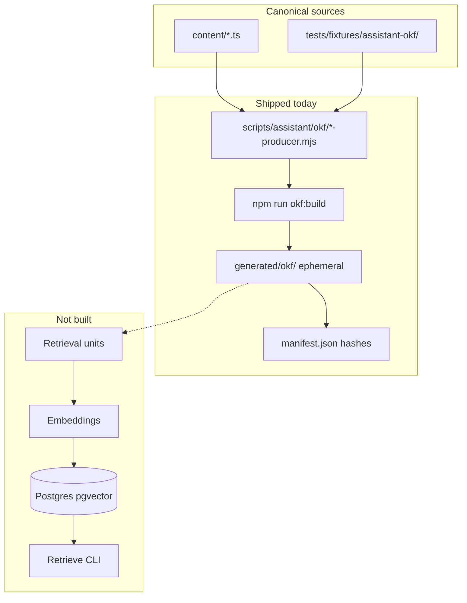

# Shipped

**Archived 2026-10-08.**

| Slice                    | Delivered                                                                                               |
| ------------------------ | ------------------------------------------------------------------------------------------------------- |
| plan-review              | [#30](https://github.com/mastermichaelt/portfolio/pull/30) — plan artifact                              |
| doc-reconcile            | [#31](https://github.com/mastermichaelt/portfolio/pull/31) — architecture doc reconciliation            |
| corpus-expansion         | [#32](https://github.com/mastermichaelt/portfolio/pull/32) — About + project OKF producers              |
| retrieval-units          | [#33](https://github.com/mastermichaelt/portfolio/pull/33) — 1:1 derivation (infrastructure validation) |
| db-foundation            | [#34](https://github.com/mastermichaelt/portfolio/pull/34) — Postgres + pgvector schema                 |
| neon-deployment          | [#35](https://github.com/mastermichaelt/portfolio/pull/35) — hosted Neon operator workflow              |
| embeddings-adapter       | [#36](https://github.com/mastermichaelt/portfolio/pull/36) — OpenAI embeddings adapter                  |
| ingest-sync              | [#38](https://github.com/mastermichaelt/portfolio/pull/38) — idempotent ingest                          |
| retrieve-cli             | [#40](https://github.com/mastermichaelt/portfolio/pull/40) — inspectable retrieval CLI                  |
| structure-aware-chunking | [#41](https://github.com/mastermichaelt/portfolio/pull/41) — structure-aware 1:N units                  |
| retrieval-eval           | [#43](https://github.com/mastermichaelt/portfolio/pull/43) — retrieval eval harness                     |
| plan-closure             | This PR — findings doc, verify slice todos, `# Shipped` note, archive plan                              |

**Durable artifacts (remain active):**

- [`docs/assistant/vector-retrieval-experiment.md`](../../../docs/assistant/vector-retrieval-experiment.md) — experiment findings
- Assistant CLI pipeline on `main` (`okf:build`, `assistant:derive`, `assistant:ingest`, `assistant:retrieve`) — see [assistant-database.md](../../../docs/assistant/assistant-database.md)
- [`tests/fixtures/assistant-retrieval/`](../../../tests/fixtures/assistant-retrieval/) — eval fixtures

**Follow-on (shipped):** [`corpus-coverage-expansion.md`](../../../docs/assistant/corpus-coverage-expansion.md) / [archived plan](2026-10-08-assistant-corpus-coverage-expansion.plan.md); [cross-repository corpus](2026-10-08-assistant-cross-repository-corpus.plan.md).

---

# Portfolio assistant vector retrieval experiment

## Recommended execution authority

| Slice                    | Recommended authority | Agent instruction                                      |
| ------------------------ | --------------------- | ------------------------------------------------------ |
| plan-review              | Plan-only PR          | Do not implement. Stop after opening the plan-only PR. |
| doc-reconcile            | Open PR only          | Do not merge. Stop after opening the PR.               |
| corpus-expansion         | Open PR only          | Do not merge. Stop after opening the PR.               |
| retrieval-units          | Open PR only          | Do not merge. Stop after opening the PR.               |
| db-foundation            | Open PR only          | Do not merge. Stop after opening the PR.               |
| embeddings-adapter       | Open PR only          | Do not merge. Stop after opening the PR.               |
| neon-deployment          | Open PR only          | Do not merge. Stop after opening the PR.               |
| ingest-sync              | Open PR only          | Do not merge. Stop after opening the PR.               |
| retrieve-cli             | Open PR only          | Do not merge. Stop after opening the PR.               |
| structure-aware-chunking | Open PR only          | Do not merge. Stop after opening the PR.               |
| retrieval-eval           | Open PR only          | Do not merge. Stop after opening the PR.               |
| plan-closure             | Open PR only          | Do not merge. Stop after opening the PR.               |

Repo default: **Open PR only** ([planning-standards.md](../../standards/planning-standards.md)).

**Execution order (remaining):** `retrieve-cli` → **`structure-aware-chunking`** → `retrieval-eval` → `plan-closure`. **`ingest-sync` is granularity-agnostic** — do not add chunking there. Do not expand OKF producers for full-site coverage in this plan. Historical 1:1 derivation remains in Git history (`retrieval-units`); production retrieval uses structure-aware units after `structure-aware-chunking` + re-ingest.

**Follow-on milestone (separate plan):** [assistant-corpus-coverage-expansion.plan.md](2026-10-08-assistant-corpus-coverage-expansion.plan.md) — uses the retrieval-unit strategy validated here; start only after this experiment is archived. When `plan-closure` merges, every todo in _this_ plan is complete (no pending implementation slices in the archived file).

## Repository topology (default)

Integration branch: `main`. Each slice starts from latest `origin/main`; branch diff represents only that slice; PR base is `main`.

---

## Architecture documentation reconciliation

### Documents inspected

| Document                   | Path                                                                                                      | Role                                           |
| -------------------------- | --------------------------------------------------------------------------------------------------------- | ---------------------------------------------- |
| Architecture direction     | [docs/assistant/architecture-direction.md](../../../docs/assistant/architecture-direction.md)             | Primary intended-system doc                    |
| OKF experiment findings    | [docs/assistant/okf-normalization-experiment.md](../../../docs/assistant/okf-normalization-experiment.md) | Shipped normalization evidence                 |
| Prior art                  | [docs/assistant/prior-art.md](../../../docs/assistant/prior-art.md)                                       | Historical reference (nyaomaru); not normative |
| Site architecture overview | [docs/architecture/overview.md](../../../docs/architecture/overview.md)                                   | Milestone 5 / Postgres note                    |
| Product constraints        | [PRODUCT.md](../../../PRODUCT.md)                                                                         | Static MVP, no chatbot yet                     |

### Alignment assessment

**Already aligned with this experiment**

- Five-layer separation: canonical sources → OKF → storage → embeddings/index → RAG consumers
- OKF is a **normalization/interchange boundary**, not canonical storage or the vector index
- OKF concepts ≠ retrieval units; embeddings are **disposable projections** rebuildable from sources
- Corpus-only semantic retrieval before generation; inspectable pipeline; provenance-backed citations (future)
- Shipped OKF producers under [scripts/assistant/okf/](../../../scripts/assistant/okf/); `npm run okf:build` → gitignored [generated/okf/](../../../generated/okf/)
- No `app/api/` routes, no LangChain, no chat UI in current milestone

**Conflicts / stale assumptions to reconcile**

| Location                                                                                                                | Stale content                                                            | Required update                                                                                                                                                               |
| ----------------------------------------------------------------------------------------------------------------------- | ------------------------------------------------------------------------ | ----------------------------------------------------------------------------------------------------------------------------------------------------------------------------- |
| [architecture-direction.md](../../../docs/assistant/architecture-direction.md) § "Simple semantic RAG first" (line 232) | **In-memory vector store first**; pgvector deferred                      | Supersede for this experiment: **Postgres + pgvector is the retrieval backbone**; in-memory is no longer the target for this slice family                                     |
| [architecture-direction.md](../../../docs/assistant/architecture-direction.md) (lines 248–254)                          | "Next experiment" still reads as OKF normalization                       | Mark OKF normalization **shipped**; next experiment is **vector retrieval**                                                                                                   |
| [architecture-direction.md](../../../docs/assistant/architecture-direction.md) (line 234)                               | LangChain as reasonable learning path                                    | Record **explicit non-use** for this experiment (per prompt); keep as historical hypothesis only if mentioned                                                                 |
| [architecture-direction.md](../../../docs/assistant/architecture-direction.md) "Current implementation"                 | Omits shipped OKF normalization                                          | Add OKF producers as current assistant infrastructure (dev tooling only)                                                                                                      |
| [docs/architecture/overview.md](../../../docs/architecture/overview.md) (line 14)                                       | "no assistant implementation yet"                                        | Split: OKF normalization shipped; retrieval/embeddings/chat still future                                                                                                      |
| Neon references in overview / AGENTS.md                                                                                 | Conflate site `PortfolioRepository` Postgres with assistant vector store | Clarify **two Postgres concerns**: (a) future site content persistence, (b) assistant embedding index (this experiment) — may share Neon provider, different schema/lifecycle |
| [okf-normalization-experiment.md](../../../docs/assistant/okf-normalization-experiment.md)                              | Ends at "retrieval-unit derivation [future]"                             | Add pointer to this experiment; preserve OKF-as-transient finding                                                                                                             |

**Documentation slice:** `doc-reconcile` (slice 1) updates the above **before** implementation slices that depend on pgvector as the chosen store. Do not erase OKF experiment history; add a new experiment findings doc at closure.

---

## Decision inventory

### Established by existing architecture (keep)

- OKF v0.2 as normalization format; minimal extensions only
- Canonical knowledge remains at originating sources (`content/`, repos, published writing)
- `PortfolioRepository` / pages do not depend on retrieval infrastructure
- Assistant scripts live outside the Next.js app bundle (CLI/dev tooling pattern like `okf:build`)
- Just-in-time multi-PR plan under `.cursor/plans/` using [_template.plan.md](../_template.plan.md)
- Vitest for unit/integration tests; coverage gate applies only to `repositories/**` today

### Established by this plan (non-negotiable)

- Real **Postgres + pgvector** (not in-memory similarity)
- Direct primitives only — **no LangChain, LlamaIndex, Pinecone, etc.**
- Thin **OpenAI embeddings** adapter; model validated against fixed index schema (not arbitrarily interchangeable dimensions)
- **Inspectable retrieval CLI**; no answer generation / chat UI / Responses API
- Idempotent ingestion with change detection; vector DB is **not** source of truth
- **Exact search only** — no ANN index in this experiment

### Still to decide during implementation (flagged, not silently chosen)

| Decision                                                               | Recommendation                                                                                                                                                                            | Resolve in slice                       |
| ---------------------------------------------------------------------- | ----------------------------------------------------------------------------------------------------------------------------------------------------------------------------------------- | -------------------------------------- |
| Local Postgres vs Neon hosted index                                    | **Both:** `docker-compose.yml` for local dev/CI verification; **Neon** as explicit hosted assistant retrieval target (`neon-deployment` slice before ingest)                              | `db-foundation` + `neon-deployment`    |
| `pg` vs `postgres.js` driver                                           | `pg` (mature, straightforward migrations)                                                                                                                                                 | `db-foundation`                        |
| Embedding representation                                               | **`text-embedding-3-small` @ 1536 dimensions** — fixed in schema; model change = migration + full re-embed                                                                                | `db-foundation` + `embeddings-adapter` |
| Distance metric                                                        | Cosine via pgvector `<=>` operator                                                                                                                                                        | `retrieve-cli` + docs                  |
| CI without `DATABASE_URL`                                              | Skip pgvector integration tests when unset; unit tests always run                                                                                                                         | `db-foundation`                        |
| OKF→retrieval unit cardinality                                         | **Structure-aware 1:N** for production retrieval (`structure-aware-chunking`); shipped 1:1 (`retrieval-units`) was infrastructure validation only — not maintained as a parallel strategy | `structure-aware-chunking`             |
| Expanded OKF granularity for About/experiment-measurement/codenames-ai | Per-source producers with shape-correct body helpers (`CaseBlock.heading`, About entry bullets); shared infra only where fields match                                                     | `corpus-expansion`                     |

---

## Current baseline (from inspection)



**Experiment corpus (bounded):** ~35 OKF concepts after slice `corpus-expansion` — Renovate + About + selected project cases + pinned repo/DEV fixtures. **Not** full portfolio coverage.

**Slice `corpus-expansion` (shipped):** bounded producers for **About**, **`experiment-measurement`**, and **`codenames-ai`** so eval exercises heterogeneous shapes without full-site ingestion.

**Retrieval-unit strategy:** slice `retrieval-units` shipped **1 OKF concept → 1 retrieval unit** to validate embeddings, ingest, and pgvector — preserved in Git history, **not** a retrieval strategy we maintain. **Structure-aware 1:N** (`structure-aware-chunking`) is the intended production approach.

**Follow-on content scope:** [assistant-corpus-coverage-expansion.plan.md](2026-10-08-assistant-corpus-coverage-expansion.plan.md). Ingestion machinery is granularity-agnostic; expand OKF coverage and re-ingest with structure-aware derivation.

---

## Target architecture (this experiment)

```text
Canonical portfolio sources (content/ + fixtures)
        ↓
Existing + expanded OKF producers (okf:build)
        ↓
Retrieval-unit derivation (OKF → 1:N structure-aware units; ingest-agnostic)
        ↓
OpenAI embeddings (thin adapter)
        ↓
Postgres + pgvector (derived index only)
        ↓
Vector similarity search (cosine distance, exact search)
        ↓
Inspectable top-K evidence + provenance (CLI)
```

**Canonical vs derived**

| Artifact                     | Canonical?     | Location                    |
| ---------------------------- | -------------- | --------------------------- |
| `content/`, repo/DEV sources | Yes            | Git                         |
| OKF concepts                 | No (transient) | `generated/okf/` gitignored |
| Retrieval units (in-memory)  | No             | Derived at ingest           |
| Embeddings / vector rows     | No             | Postgres (rebuildable)      |

---

## Retrieval unit design

### Layering (canonical → OKF → units → vectors)

| Layer                                    | Role                                             | Chunking?                                                               |
| ---------------------------------------- | ------------------------------------------------ | ----------------------------------------------------------------------- |
| Canonical sources (`content/`, fixtures) | Evidence of record                               | No                                                                      |
| OKF concepts (`generated/okf/`)          | Normalized, inspectable concepts                 | **No** — do not split or rewrite OKF solely for retrieval               |
| Retrieval units                          | Embedding + search payloads                      | **Yes** — optimized for semantic retrieval, 1:N per concept when needed |
| `ingest-sync`                            | Upsert/skip/delete by `unit_id` + `content_hash` | **Agnostic** to how many units each concept produces                    |

### Derivation input

Read OKF concept files from `generated/okf/{portfolio,repo,writing,about}/**/*.md` (parse YAML frontmatter + body using existing [yaml.mjs](../../../scripts/assistant/okf/yaml.mjs)).

### Historical 1:1 derivation (shipped — slice `retrieval-units`)

**1 OKF concept → 1 retrieval unit** with `unit_id = unit/{okf_concept_id}`. This validated derivation, ingest, and pgvector persistence. **Not maintained** as a production retrieval strategy — see structure-aware derivation below. Do not add dual derivation modes or parallel indexes solely to benchmark against 1:1.

### Structure-aware derivation (slice `structure-aware-chunking` — production strategy)

**`ingest-sync` syncs whatever `assistant:derive` emits** for the target `DATABASE_URL`; chunking lives in retrieval derivation only, not OKF normalization. After this slice merges: `okf:build` → `assistant:derive` → `assistant:ingest` on the authoritative assistant index (orphan cleanup retires obsolete `unit_id`s as today).

**1 OKF concept → 1..N retrieval units** where appropriate:

- **Short, semantically coherent** concepts may remain a **single** unit.
- **Long or multi-topic** concepts split into **meaningful sections** using document structure: headings, paragraph boundaries, list blocks, and other semantic cues already present in OKF body markdown (including `CaseBlock.heading`, runbook section headings, article structure).
- **Token limits** are **safeguards only** (cap oversized sections, avoid model/context blowups) — not the primary split boundary.
- **Do not** implement a generic, corpus-agnostic chunking framework; implement **structure-aware rules for this portfolio’s OKF shapes**.
- **Do not** change canonical content modules or OKF producers/normalization to “fit” chunking — chunking lives in `scripts/assistant/retrieval/` only.

**Per-unit provenance (required):** parent `okf_concept_id`, canonical `resource` / `sources`, `section_heading` (when applicable), `chunk_index` / `chunk_count` (or equivalent when split), and stable `content_hash` over the unit’s `text`.

**Deterministic IDs:** stable `unit_id` per unit — single-chunk concepts may use `unit/{okf_concept_id}`; multi-chunk concepts use `unit/{okf_concept_id}#…` suffix scheme (document in code + plan slice; stable across rebuilds). `ingest-sync` skip/upsert and **orphan cleanup** remove retired ids when derivation changes (`unit_id ∉ derived set`).

### Retrieval unit schema (in-memory / pre-persist)

```ts
// Conceptual — implement as plain objects in scripts/assistant/
{
  unit_id: string;           // stable, deterministic
  okf_concept_id: string;    // e.g. "portfolio/renovate-governance-b04"
  okf_version: string;
  source_class: "portfolio" | "repo" | "writing" | "about";
  type: string;              // from OKF frontmatter
  title: string;
  resource: string;          // canonical URL
  sources: Array<{id, title, resource}>;
  tags: string[];
  text: string;              // embedding input
  content_hash: string;      // sha256 of canonical text
  section_heading?: string;  // when split by structure
  chunk_index?: number;
  chunk_count?: number;
  metadata: Record<string, unknown>; // filterable facets (includes provenance fields above)
}
```

### Stable `unit_id`

Deterministic and URL-safe; **no hash in ID** (content changes via `content_hash`). Single-unit concepts: `unit/{okf_concept_id}`. Additional chunks: `unit/{okf_concept_id}#…` suffix scheme defined in `structure-aware-chunking` (document in code; stable across rebuilds).

### Embedding text composition

Prefer evidence-bearing text, not raw frontmatter duplication:

```text
{title}

{body_markdown}
```

Store `type`, `tags`, `resource`, `sources` relationally / JSON for filtering — not repeated in embedding text unless eval shows benefit.

### Corpus expansion producer sketch (slice `corpus-expansion`)

| Source module                                                                          | Producer module                                                                 | Proposed OKF concepts (bounded)                                                     |
| -------------------------------------------------------------------------------------- | ------------------------------------------------------------------------------- | ----------------------------------------------------------------------------------- |
| [content/about.ts](../../../content/about.ts)                                          | `about-producer.mjs`                                                            | `about/summary` + one concept per experience/independent entry (`about/{entry.id}`) |
| [content/project-cases.ts](../../../content/project-cases.ts) `experiment-measurement` | `project-case-producer.mjs`                                                     | `portfolio/experiment-measurement-case` + one concept per `CaseBlock`               |
| [content/project-cases.ts](../../../content/project-cases.ts) `codenames-ai`           | `project-case-producer.mjs`                                                     | `portfolio/codenames-ai-case` + one concept per `CaseBlock`                         |
| Existing Renovate corpus                                                               | [portfolio-producer.mjs](../../../scripts/assistant/okf/portfolio-producer.mjs) | Unchanged                                                                           |

**Do not mechanically reuse [portfolio-producer.mjs](../../../scripts/assistant/okf/portfolio-producer.mjs) block logic for project cases.** That producer targets `SupportingCase` blocks (`SupportingProseBlock` / `SupportingArchitectureBlock` with `type`, `lead`, and architecture-specific fields). [content/project-cases.ts](../../../content/project-cases.ts) uses `ProjectCase` + `CaseBlock` — a different shape.

#### Project-case producer (`project-case-producer.mjs`)

Read `ProjectCase` values from `content/project-cases.ts` for slugs `experiment-measurement` and `codenames-ai`.

**OKF IDs** (reuse only the _naming_ pattern from portfolio-producer, not its block-type branching):

- Overview: `portfolio/{slug}-case`
- Block: `portfolio/{slug}-{block.id}-{block.category.toLowerCase()}` (e.g. `portfolio/experiment-measurement-b01-attribution`)

**Case overview body** — reuse the _overview composition_ idea (lead, aside, elsewhere) where `ProjectCase` fields match `SupportingCase` (`lead`, `aside`, `elsewhere`). Do **not** copy architecture-block handling; project cases have no `architecture` blocks. Include `artifacts` as a prose summary only if needed for inspectability; do not embed artifact row `id` values as canonical evidence.

**CaseBlock → OKF body** — implement a dedicated `caseBlockBody(block)` helper. Each `CaseBlock` is a single homogeneous block (no `type` discriminator). Preserve evidence-bearing fields in this order:

```text
{block.heading}          ← primary uncertainty sentence (required; must appear in body)

{block.body joined}      ← narrative paragraphs

Contract: {block.contract}

{optional CaseNote from block.note — label, lines, closing}

{optional figure lines — value, name, scope only; omit CaseFigure.source}
```

Do **not** call `proseBody()` from portfolio-producer (expects `lead`, not `heading`). Do **not** branch on `block.type === "prose"` / `"architecture"`.

**Frontmatter:** `type: "Project Case Block"` (or similar free-form OKF type); `resource: {SITE_URL}/projects/{slug}#{block.id}`; `sources` pointing at the project case route.

#### About producer (`about-producer.mjs`)

Read [content/about.ts](../../../content/about.ts) — a career-record page, not a block-structured case study.

**OKF IDs:**

- `about/summary` — both `summary[]` paragraphs
- `about/{entry.id}` for each `experience.entries[]` and `independent.entries[]` entry (e.g. `about/atlassian-em-2020`, `about/codenames-ai`)

**About entry body** — dedicated `aboutEntryBody(entry)`:

```text
{role} · {org} ({dateRange})

{bullets joined}

{optional figure lines — value, name, scope only; omit source inventory}
```

Do not invent block ids or split a single entry into multiple concepts unless eval later proves retrieval misses.

**Frontmatter:** `type: "About Experience"` or `"About Independent Work"`; `resource: {SITE_URL}/about` (section-level provenance; entry identity carried in concept id + title).

#### Generated corpus hygiene (required in this slice)

[writer.mjs](../../../scripts/assistant/okf/writer.mjs) `cleanGeneratedConcepts` currently removes only `portfolio/`, `repo/`, `writing/`. **This slice must extend cleanup to every generated namespace**, including `about/`, so removed or renamed concepts cannot leave stale `.md` files.

Also update in the same slice:

- [manifest.mjs](../../../scripts/assistant/okf/manifest.mjs) `listConceptFiles` — include `about/`
- [build.mjs](../../../scripts/assistant/okf/build.mjs) `renderIndex` — add an About concepts section; wire new producers into `buildOkfCorpus`
- [constants.mjs](../../../scripts/assistant/okf/constants.mjs) — document new content-module inputs in manifest metadata if applicable

Exclude from all producers: `CaseFigure.source` / inventory fact ids, ecosystem graph, timeline, production-line (unless eval gap remains after expansion).

#### Corpus-expansion tests ([tests/okf-normalization.test.ts](../../../tests/okf-normalization.test.ts))

Extend existing OKF tests with **specific** coverage for the failure modes above:

1. **CaseBlock evidence preservation** — for at least one `experiment-measurement` block concept, assert the rendered body contains that block's `heading` verbatim and at least one `body[]` paragraph; assert `contract` text is present when the source block has one.
2. **No orphaned About files** — build to a temp corpus with a stub/about concept, rebuild with that concept removed from the producer output, assert `about/` contains no leftover `.md` for the removed id.
3. **Deterministic rebuild across namespaces** — temp-dir build with fixed `generatedAt` still produces matching `bundle_sha256` after corpus expansion; `listConceptFiles` enumerates `portfolio/`, `repo/`, `writing/`, and `about/`.
4. **Producer boundaries** — minimum concept counts per namespace prefix (`about/`, `portfolio/experiment-measurement-*`, `portfolio/codenames-ai-*`, existing renovate/repo/writing counts unchanged).
5. **Render conformance** — every new concept has non-empty `type`, `sources`, `resource`, `generated`.

---

## Embedding boundary

New module: `scripts/assistant/embeddings/`

### Fixed index representation (explicit constraint)

This experiment indexes **`text-embedding-3-small` at 1536 dimensions**. That pairing is not an arbitrary runtime choice — it is the **configured embedding representation** baked into the pgvector column type (`vector(1536)`).

Changing embedding model or dimensionality is an **index/schema migration**: alter or recreate the vector column, rebuild the derived store from canonical sources, and re-embed everything. Do not imply that env vars can swap models/dimensions interchangeably while the schema stays `vector(1536)`.

| Concern       | Approach                                                                                                                                                                                                                                                                                      |
| ------------- | --------------------------------------------------------------------------------------------------------------------------------------------------------------------------------------------------------------------------------------------------------------------------------------------- |
| Provider      | OpenAI Embeddings API via `fetch` or minimal official SDK (add only if justified)                                                                                                                                                                                                             |
| Config        | `OPENAI_API_KEY` (project-scoped key for OpenAI project `portfolio-assistant` — see operator prerequisite); optional `ASSISTANT_EMBEDDING_MODEL` **validated at startup** against the supported index config (default and only supported value for this experiment: `text-embedding-3-small`) |
| Dimensions    | **1536 — constant**, matching `vector(1536)` in migration; not a separate env knob                                                                                                                                                                                                            |
| Batching      | Batch requests (e.g. 32–64 texts) with size guard                                                                                                                                                                                                                                             |
| Retries       | Transient errors: limited exponential backoff                                                                                                                                                                                                                                                 |
| Invalidation  | Store `embedding_model` on each row; re-embed when `content_hash` changes or when index representation changes (migration)                                                                                                                                                                    |
| Skip re-embed | Ingest compares `(content_hash, embedding_model)` before calling API                                                                                                                                                                                                                          |
| Startup guard | Fail fast if configured model ≠ supported index model, or if API returns wrong dimension count                                                                                                                                                                                                |

No answer generation, no chat completions.

Update [.env.example](../../../.env.example) with documented assistant vars (keys gitignored). Document the model/dimension migration constraint in architecture docs during `doc-reconcile`.

---

## Postgres + pgvector schema

New: `db/migrations/` (timestamped SQL, pattern from savepoints repo — no ORM required).

### Extension + table (minimum)

```sql
CREATE EXTENSION IF NOT EXISTS vector;

CREATE TABLE assistant_retrieval_units (
  unit_id            text PRIMARY KEY,
  okf_concept_id     text NOT NULL,
  okf_version        text NOT NULL,
  source_class       text NOT NULL,
  type               text NOT NULL,
  title              text NOT NULL,
  resource           text NOT NULL,
  retrieval_text     text NOT NULL,
  content_hash       text NOT NULL,
  embedding_model    text NOT NULL,
  embedding          vector(1536) NOT NULL,  -- fixed index representation: text-embedding-3-small
  sources            jsonb NOT NULL DEFAULT '[]',
  metadata           jsonb NOT NULL DEFAULT '{}',
  embedded_at        timestamptz NOT NULL,
  created_at         timestamptz NOT NULL DEFAULT now(),
  updated_at         timestamptz NOT NULL DEFAULT now()
);

CREATE INDEX assistant_retrieval_units_source_class_idx
  ON assistant_retrieval_units (source_class);
CREATE INDEX assistant_retrieval_units_okf_concept_id_idx
  ON assistant_retrieval_units (okf_concept_id);
```

### Relational vs JSON

| Field                                                                                   | Storage            | Why                                         |
| --------------------------------------------------------------------------------------- | ------------------ | ------------------------------------------- |
| `unit_id`, `okf_concept_id`, `source_class`, `type`, `title`, `resource`, hashes, model | Relational columns | Stable filters, upsert keys, inspectability |
| `sources`                                                                               | `jsonb`            | OKF array shape; provenance display         |
| `tags`, block ids, eval hints                                                           | `metadata jsonb`   | Extensible without migrations               |
| `embedding`                                                                             | `vector(n)`        | pgvector native ops                         |

Optional `assistant_ingestion_runs` table for observability (run id, okf bundle hash, counts inserted/updated/deleted/skipped, timestamps) — recommended for experiment learning.

### Vector index strategy

**Do not add an ANN index during this experiment.** Use **exact search** — sequential scan + `ORDER BY embedding <=> $query` — to establish the retrieval-quality baseline. At ~30–80 units after corpus expansion, exact search is expected to be fast enough; the learning goal is understanding what pgvector returns, not optimizing query latency yet.

Document in experiment findings (closure slice):

- **Storing vectors in pgvector** = typed `vector` column + distance operators
- **Exact search** = our baseline for this experiment; every query compares against all stored vectors
- **ANN index (HNSW / IVFFlat)** = a later **optimization** with a recall/performance trade-off — not a milestone tied to an arbitrary row-count threshold. Whether ANN pays off depends on dimensions, hardware, filtering, workload, recall requirements, and measured query latency — evaluate only after exact-search baseline and real workload data exist

Do **not** add HNSW or IVFFlat in any slice of this experiment. Closure doc should describe HNSW/IVFFlat as scaling options and state that the decision to experiment with ANN should be driven by **measured corpus size, query latency, and future workload requirements**.

### Connection / migrations

- `scripts/assistant/db/client.mjs` — `pg` Pool from `DATABASE_URL` (assistant retrieval only; no site `PortfolioRepository` coupling)
- `scripts/assistant/db/migrate.mjs` — apply `db/migrations/*.sql` in order (provider-neutral; no localhost assumptions)
- `scripts/assistant/db/verify.mjs` — schema verification CLI (`npm run assistant:db:verify`)
- Operator runbook: [docs/assistant/assistant-database.md](../../../docs/assistant/assistant-database.md)

**Deployment topology:**

| Target                           | Role                                        | How                                                                                                        |
| -------------------------------- | ------------------------------------------- | ---------------------------------------------------------------------------------------------------------- |
| Local Docker Postgres + pgvector | Default dev + migration verification        | `docker-compose.yml` (`pgvector/pgvector:pg16`); `.env.example` local `DATABASE_URL`                       |
| Neon Postgres + pgvector         | Persistent hosted assistant retrieval index | `DATABASE_URL` via secrets; same migrations via `assistant:db:migrate`; verified via `assistant:db:verify` |

Site `PortfolioRepository` persistence (future Milestone 4) remains a **separate** connection config and migration lifecycle even if both use Neon as provider.

**CI:** integration tests run when `DATABASE_URL` is set; otherwise skip with explicit message (keeps default CI green). Neon is not required in CI.

---

## Operator prerequisite — OpenAI Embeddings API (first live ingestion)

**Not a new architecture component or PR slice.** Same experiment boundaries: `text-embedding-3-small`, `vector(1536)`, existing embeddings adapter, and schema unchanged. Required before the **first live** `npm run assistant:ingest` that calls the OpenAI Embeddings API (unit tests with mocked `fetch` remain unchanged; CI does not need a key).

**Separation from Codenames:** Create or select a dedicated OpenAI API **project** named `portfolio-assistant`. Do not reuse the OpenAI **Default** project (or its keys) used by Codenames AI — separate billing, usage visibility, and blast radius.

**Operator workflow (human/account actions):**

1. In the OpenAI platform, create or select the `portfolio-assistant` API project.
2. Generate a **project-scoped** API key with access to the **Embeddings** API (not a personal or org-wide key tied to another project).
3. Store the key only in gitignored `.env.local` (local) or runtime secrets (e.g. Cursor Cloud / CI when explicitly configured) as `OPENAI_API_KEY`. **Never commit** the key, key IDs, or secret values.
4. Configure a modest **project budget** and **usage alerts** on `portfolio-assistant` before bulk ingest experiments.
5. **Confirm model access:** run a one-off embeddings smoke (adapter or minimal API call) and verify `text-embedding-3-small` returns **1536** dimensions before the first full ingest. Fail closed if the project lacks Embeddings access or returns wrong dimensions.
6. **Document** the steps above in the assistant operator runbook: [docs/assistant/assistant-database.md](../../../docs/assistant/assistant-database.md) (add an OpenAI section parallel to hosted Neon — credentials stay out of the repo). The `ingest-sync` slice owns this documentation deliverable alongside the ingest pipeline.

**Automation boundary:** If OpenAI project/key/budget actions require dashboard steps the agent cannot perform safely, stop and hand off exact human steps — do not invent credentials or commit placeholders.

**Pairs with:** hosted Neon prerequisite (`neon-deployment`) — first persistent ingest needs both `DATABASE_URL` (assistant retrieval) and `OPENAI_API_KEY` (`portfolio-assistant` project).

---

## Ingestion and synchronization

### Pipeline

```text
npm run okf:build
  → deriveRetrievalUnits(generated/okf/)
  → for each unit:
        if DB row missing OR content_hash/model mismatch:
            embed(text) → upsert
        else: skip (count as unchanged)
  → delete DB rows whose unit_id ∉ derived set
  → record ingestion run metadata
```

CLI: `npm run assistant:ingest` (wraps `node scripts/assistant/ingest.mjs`).

**Granularity contract:** `ingest-sync` calls derivation and syncs the **derived unit set** only. It does not encode 1:1 vs 1:N policy. Chunking changes belong in retrieval derivation (`structure-aware-chunking`), followed by re-ingest.

### Sync cases

| Case                                                 | Behavior                                                       |
| ---------------------------------------------------- | -------------------------------------------------------------- |
| New unit                                             | Insert + embed                                                 |
| Unchanged `(unit_id, content_hash, embedding_model)` | Skip API call                                                  |
| Changed content                                      | Re-embed + update row                                          |
| Removed OKF concept or retired chunk `unit_id`       | Delete row (hard delete; orphan cleanup via derived set)       |
| Failed embedding                                     | Fail run with unit_id surfaced; do not partial-delete siblings |
| Safe rerun                                           | Idempotent upserts; deterministic derived set                  |

### Provenance chain

Log in ingestion output: `canonical source → okf_concept_id → unit_id → content_hash → embedding_model`.

Attach OKF `manifest.json` `bundle_sha256` to ingestion run record.

---

## Retrieval CLI

`npm run assistant:retrieve -- "question text"`

Flow:

1. Embed question (same model as corpus)
2. SQL:

```sql
SELECT
  unit_id,
  title,
  resource,
  retrieval_text,
  sources,
  metadata,
  (embedding <=> $1::vector) AS cosine_distance
FROM assistant_retrieval_units
ORDER BY embedding <=> $1::vector
LIMIT $2;
```

3. Print JSON or formatted table: `rank`, `cosine_distance`, `similarity = 1 - cosine_distance` (document that pgvector cosine distance is in `[0, 2]` for normalized vectors; OpenAI embeddings are unit-normalized so interpret accordingly)

**No LLM.** Purpose is to inspect what pgvector returns.

Optional flags: `--top-k 5`, `--filter-source-class portfolio`, `--json`.

---

## Retrieval evaluation

New: `tests/assistant-retrieval-eval.test.ts` + `tests/fixtures/assistant-retrieval/eval-cases.json`

**Design (slice `retrieval-eval`):** evaluate **structure-aware retrieval** on the ingested assistant index (`DATABASE_URL`) after `structure-aware-chunking` + re-ingest. Use representative questions and expected evidence — not a formal 1:1 vs chunked comparison. Goals: find retrieval weaknesses, tune chunk boundaries, and record failure modes (over-splitting, missing context, wrong section, irrelevant matches).

| Dimension            | What to measure                                                                   |
| -------------------- | --------------------------------------------------------------------------------- |
| **Parent relevance** | Correct parent `okf_concept_id` appears in top-K                                  |
| **Section / chunk**  | Relevant `unit_id` or `section_heading` when the question targets a subsection    |
| **Ranking**          | Rank of first acceptable parent hit; optional `min_parent_rank` / `min_unit_rank` |
| **Specificity**      | Top hit is the right evidence, not merely the right concept                       |
| **Failures**         | Document misses, over-splitting, and negative-query inspection outcomes           |

### Eval fixture contract

Matchers use **`okf_concept_id`**, **`unit_id`** (including chunked `unit/{okf_concept_id}#…` ids), and **section metadata** — not the assumption that every acceptable hit is `unit/{okf_concept_id}`.

**Per-case fields:**

| Field                      | Required           | Purpose                                                                     |
| -------------------------- | ------------------ | --------------------------------------------------------------------------- |
| `id`                       | yes                | Stable case id                                                              |
| `question`                 | yes                | Embed + retrieve text                                                       |
| `kind`                     | yes                | `positive` \| `negative_inspection` \| `corpus_gap`                         |
| `top_k`                    | yes                | Top-K for assertions                                                        |
| `expected_parent_concepts` | yes for `positive` | OKF concept ids (no `unit/` prefix) — parent-level relevance                |
| `expected_unit_any_of`     | optional           | Exact `unit_id` or prefix globs for chunk-level specificity                 |
| `expected_sections`        | optional           | Section heading substrings when the question targets a block/heading        |
| `min_parent_rank`          | optional           | Max acceptable rank (1-based) for first parent-concept hit                  |
| `min_unit_rank`            | optional           | Max acceptable rank for `expected_unit_any_of` match                        |
| `require_specificity`      | optional           | When true, section/unit expectations are required for pass, not parent-only |

**Matching rules:**

- **Parent relevance:** map each retrieved row to `okf_concept_id`; match `expected_parent_concepts` (exact id equality).
- **Unit / chunk specificity:** prefix glob or exact match on `unit_id`; chunked units use the `#…` suffix scheme.
- **Negative inspection:** no parent expectations; capture distances and titles for manual/soft review.

### Refined eval cases (post corpus expansion)

Parent concepts anchor relevance; `expected_unit_any_of` and `expected_sections` refine chunk-level expectations where needed.

| Question                                                              | `expected_parent_concepts`                                                                                             | Notes / optional specificity                                |
| --------------------------------------------------------------------- | ---------------------------------------------------------------------------------------------------------------------- | ----------------------------------------------------------- |
| What experimentation infrastructure did Michael work on at Atlassian? | `portfolio/experiment-measurement-b04-onboarding`, `about/atlassian-swe-2024`, `portfolio/experiment-measurement-case` | optional units for onboarding block                         |
| Has Michael managed engineers?                                        | `about/atlassian-em-2020`                                                                                              |                                                             |
| Why did Michael return to individual-contributor engineering?         | `about/summary`                                                                                                        |                                                             |
| What experience does Michael have with attribution?                   | `portfolio/experiment-measurement-b01-attribution`, `about/atlassian-em-2020`                                          | `expected_sections` / chunk `unit_id` for attribution block |
| What has Michael built with AI?                                       | `portfolio/codenames-ai-case`, `portfolio/codenames-ai-b01-validation`, `about/codenames-ai`                           |                                                             |
| What developer infrastructure has Michael worked on?                  | prefix families via multiple parent ids or globs on `expected_unit_any_of` for renovate portfolio + repo concepts      |                                                             |
| What has Michael written about agent memory?                          | _(none — `kind: corpus_gap`)_                                                                                          | document weak/absent evidence                               |

Example fixture entry:

```json
{
  "id": "attribution-experience",
  "question": "What experience does Michael have with attribution?",
  "kind": "positive",
  "top_k": 5,
  "expected_parent_concepts": [
    "portfolio/experiment-measurement-b01-attribution",
    "about/atlassian-em-2020"
  ],
  "expected_unit_any_of": [
    "unit/portfolio/experiment-measurement-b01-attribution"
  ],
  "expected_sections": ["Attribution"],
  "min_parent_rank": 3
}
```

### Positive eval assertions (avoid brittle floats)

- At least one top-K hit matches `expected_parent_concepts` within `top_k`; optional `min_parent_rank`
- When `require_specificity` or unit/section fields are set: assert `expected_unit_any_of` and/or `expected_sections` within `top_k`; optional `min_unit_rank`
- Emit per-case diagnostics (ranks, matched ids, headings) to guide chunk-boundary improvements
- Skip entire eval suite when `DATABASE_URL` and/or `OPENAI_API_KEY` unset (prefer skip + manual gate for this experiment)

### Negative / out-of-corpus eval (inspect scores, do not assert absence)

Vector search **always returns the nearest vectors** for a top-K query — even when none are actually relevant. A nonsense or unsupported question does not naturally produce "no results" unless a similarity threshold is introduced (deferred to a later experiment).

Include an explicit **negative inspection case**, not a `must_not_include` assertion:

```text
"What is Michael's experience designing nuclear reactors?"
        ↓
pgvector still returns top-K
        ↓
inspect cosine_distance / similarity per hit
        ↓
are the results obviously irrelevant to the question?
```

**Eval approach for this case:**

- Run retrieve; capture top-K with distances
- Record observations in eval output (manual review or soft assertion: e.g. best-hit distance is worse than positive-case baselines, or top hits are semantically unrelated by title/resource inspection)
- **Do not** assert that particular `unit_id`s are absent from top-K — that would be misleading

**Architectural follow-on (closure doc, not implemented here):** does grounded answer generation need a **retrieval confidence / distance threshold** before passing evidence to an LLM?

Run after structure-aware corpus is ingested to the assistant index (`assistant:ingest` with `DATABASE_URL`) in dev/CI-with-secrets.

---

## Experiment closure deliverables

New doc: `docs/assistant/vector-retrieval-experiment.md` answering closure questions (storage model, pgvector representation, sync, cosine meaning, metadata filtering, **exact search as baseline vs ANN as later optimization**, embedding model/dimension as schema constraint, dedicated vector DB tradeoffs, OKF boundary, eval results including negative-query distance inspection, readiness for grounded generation and retrieval thresholds).

Archive plan to `.cursor/plans/archive/` per repo convention.

---

## Implementation slices (merge-safe PRs)

### Slice — `doc-reconcile`

**Purpose:** Align architecture docs with Postgres+pgvector retrieval experiment before code builds on stale in-memory-first guidance.

**Files:** [docs/assistant/architecture-direction.md](../../../docs/assistant/architecture-direction.md), [docs/architecture/overview.md](../../../docs/architecture/overview.md), [docs/assistant/okf-normalization-experiment.md](../../../docs/assistant/okf-normalization-experiment.md) (pointer only)

**Approach:** Update sections listed in reconciliation table; add "Vector retrieval experiment (in progress)" subsection with target pipeline diagram; preserve prior in-memory hypothesis in changelog as superseded.

**Tests:** Docs-only; `npm run format:check`

**Depends on:** plan-review merged

**Stop:** PR opened; no implementation code

---

### Slice — `corpus-expansion`

**Purpose:** Bounded OKF producers for About + `experiment-measurement` + `codenames-ai` so retrieval eval has heterogeneous content — with shape-correct mapping per source type.

**Files:**

- New [scripts/assistant/okf/about-producer.mjs](../../../scripts/assistant/okf/about-producer.mjs)
- New [scripts/assistant/okf/project-case-producer.mjs](../../../scripts/assistant/okf/project-case-producer.mjs) — **separate from** [portfolio-producer.mjs](../../../scripts/assistant/okf/portfolio-producer.mjs); do not extend renovate producer for `CaseBlock` shapes
- [scripts/assistant/okf/build.mjs](../../../scripts/assistant/okf/build.mjs) — wire producers; extend index grouping
- [scripts/assistant/okf/manifest.mjs](../../../scripts/assistant/okf/manifest.mjs) — `listConceptFiles` includes `about/`
- [scripts/assistant/okf/writer.mjs](../../../scripts/assistant/okf/writer.mjs) — `cleanGeneratedConcepts` cleans `about/` (and any other new namespace) before rewrite
- [scripts/assistant/okf/constants.mjs](../../../scripts/assistant/okf/constants.mjs) — manifest input metadata for new content modules
- [tests/okf-normalization.test.ts](../../../tests/okf-normalization.test.ts)

**Approach:**

- `CaseBlock` bodies via dedicated `caseBlockBody()` preserving `heading`, `body[]`, `contract`, optional `note` / figure lines — **not** `proseBody()` or `block.type` branching
- About entries via dedicated `aboutEntryBody()` — no faux block structure
- Reuse shared infrastructure only where shapes match: `renderConcept`, `writeConcepts`, `SITE_URL` helpers, manifest hashing, overview-level fields shared between `ProjectCase` and `SupportingCase` (`lead`, `aside`, `elsewhere`)
- Extend generated-corpus cleanup and enumeration to all namespaces

**Tests:** CaseBlock heading preservation; About orphan cleanup on rebuild; deterministic `bundle_sha256` across all namespaces; producer boundaries; render conformance (see Corpus expansion producer sketch above)

**Depends on:** `doc-reconcile` merged

**Stop:** `npm run okf:build` produces expanded inspectable corpus; tests green; no stale files under `generated/okf/about/` after concept removal

---

### Slice — `retrieval-units`

**Purpose:** Derive stable retrieval units from OKF concepts (no DB, no API).

**Files:** `scripts/assistant/retrieval/derive-units.mjs`, `scripts/assistant/retrieval/unit-schema.mjs` (JSDoc typedefs), `npm run assistant:derive` (inspect JSON to stdout or `generated/retrieval-units.json` gitignored)

**Approach:** Parse OKF corpus; emit unit objects with `content_hash`; **1:1 mapping** — infrastructure validation only; production retrieval moves to structure-aware derivation in `structure-aware-chunking` (this slice’s shipped behavior stays in Git history).

**Tests:** `tests/assistant-retrieval-units.test.ts` — deterministic IDs/hashes, required provenance fields, counts match OKF concepts (historical 1:1 contract; chunking tests land in `structure-aware-chunking`)

**Depends on:** `corpus-expansion`

**Stop:** CLI prints derived units from live `okf:build` output

---

### Slice — `db-foundation`

**Purpose:** Postgres + pgvector schema, portable migrations, local docker compose, connection helper, schema verification CLI.

**Files:** `db/migrations/20261007100000_assistant_pgvector.sql`, `docker-compose.yml`, `scripts/assistant/db/*`, [docs/assistant/assistant-database.md](../../../docs/assistant/assistant-database.md), [.env.example](../../../.env.example), `npm run assistant:db:migrate`, `npm run assistant:db:verify`

**Approach:** `CREATE EXTENSION IF NOT EXISTS vector`; create `assistant_retrieval_units` with `vector(1536)`; btree filter indexes only — **no ANN index**; provider-neutral migration runner driven entirely by `DATABASE_URL` (no localhost assumptions in migration/database code); local Docker remains default dev path; document that the same migrations apply to hosted Neon in `neon-deployment`; schema verify command checks extension, migration state, table, `vector(1536)`, and absence of ANN indexes.

**Tests:** `tests/assistant-db.test.ts` — shared schema verification passes after migrate (skip if no `DATABASE_URL`)

**Depends on:** `doc-reconcile` merged

**Stop:** `docker compose up` + migrate + verify succeeds locally

**Does not include:** Neon provisioning, hosted migrate/verify execution, ingest, embeddings API, retrieve CLI

---

### Slice — `embeddings-adapter`

**Purpose:** Thin OpenAI embedding client with batching/retries; validate model against fixed index config (`text-embedding-3-small`, 1536 dims).

**Files:** `scripts/assistant/embeddings/openai-embeddings.mjs`, `scripts/assistant/embeddings/index-config.mjs` (supported model + dimension constants), config reader

**Tests:** `tests/assistant-embeddings.test.ts` — mock `fetch`; batching splits; error propagation; reject unsupported model; reject wrong dimension count (no live API in CI)

**Depends on:** `doc-reconcile` merged

**Stop:** Unit tests pass; manual smoke with API key optional

---

### Slice — `neon-deployment`

**Purpose:** Deploy assistant retrieval schema to hosted Neon; prove connectivity and schema; document operator workflow. **No ingest, no embeddings API, no retrieve CLI.**

**Prerequisite:** `db-foundation` merged (migrations + verify CLI exist).

**Files:** [docs/assistant/assistant-database.md](../../../docs/assistant/assistant-database.md) (operator workflow — may be introduced in `db-foundation`, completed/verified here), optional architecture-direction clarification

**Operator workflow (human/account actions):**

1. Provision or select a **dedicated** Neon database/branch for the assistant retrieval index (not site `PortfolioRepository` persistence).
2. Obtain connection string(s): direct for migration/extension setup if Neon recommends; pooled acceptable for later runtime.
3. Configure `DATABASE_URL` via gitignored `.env` or secrets — **never commit** connection strings.
4. Run `npm run assistant:db:migrate` against Neon (same repo migrations; do not hand-create tables in Neon console).
5. Run `npm run assistant:db:verify` (or documented SQL equivalents) — confirm `vector` extension, migration recorded, `assistant_retrieval_units`, `vector(1536)`, no ANN index.
6. Record minimal connectivity smoke (verify CLI covers this).
7. Document that `assistant:ingest` and `assistant:retrieve` (later slices) use this same `DATABASE_URL` assistant retrieval connection.

**Automation boundary:** If Neon provisioning requires account/dashboard actions the agent cannot perform safely, stop and hand off exact human steps — do not invent credentials or fall back to local-only for hosted deployment.

**Tests:** Docs/operator verification; optional CI skip (Neon secrets not in CI). Re-run `assistant:db:verify` against Neon as acceptance.

**Depends on:** `db-foundation` merged

**Blocks:** First **live** ingest to hosted Neon (`ingest-sync` acceptance) — hosted persistent index must exist before first real embed+upsert run against Neon

**Stop:** Neon assistant database migrated and verified; operator workflow documented

---

### Slice — `ingest-sync`

**Purpose:** End-to-end `okf:build → derive → embed → upsert → delete stale`.

**Operator prerequisites (human, before first live ingest acceptance):** Hosted Neon workflow complete (`neon-deployment`); OpenAI `portfolio-assistant` project, key, budget/alerts, and `text-embedding-3-small` smoke per [Operator prerequisite — OpenAI Embeddings API](#operator-prerequisite--openai-embeddings-api-first-live-ingestion).

**Files:** `scripts/assistant/ingest.mjs`, optional `ingestion-runs` migration, `npm run assistant:ingest`, [docs/assistant/assistant-database.md](../../../docs/assistant/assistant-database.md) (OpenAI Embeddings API operator section — no secrets in repo)

**Tests:** `tests/assistant-ingest.test.ts` — mock embeddings; verify skip on unchanged hash, update on change, delete orphan; integration path with real DB when `DATABASE_URL` set

**Depends on:** `retrieval-units`, `db-foundation`, `embeddings-adapter`, **`neon-deployment`** (hosted Neon assistant index migrated and verified)

**Granularity:** **Agnostic** — sync whatever derivation returns; no chunking logic in this slice.

**Stop:** Repeatable ingest with skip counts logged against hosted Neon (local Docker remains valid for dev); operator runbook documents OpenAI setup; first live ingest verification uses `DATABASE_URL` + `OPENAI_API_KEY` from `portfolio-assistant` only after model-access smoke passes

---

### Slice — `retrieve-cli`

**Purpose:** Inspectable semantic search over pgvector.

**Files:** `scripts/assistant/retrieve.mjs`, `npm run assistant:retrieve`

**Tests:** `tests/assistant-retrieve.test.ts` — seeded vectors (fixed small embeddings) assert ordering/rank fields; document `<=>` meaning in script `--help` and doc comment

**Depends on:** `ingest-sync`

**Stop:** CLI returns ranked JSON for a query against ingested corpus

**Does not include:** chunking, derivation changes, or eval fixtures

---

### Slice — `structure-aware-chunking`

**Purpose:** Implement **structure-aware 1:N retrieval-unit derivation** as the production strategy — without changing OKF normalization or `ingest-sync` semantics.

**Files (indicative):** `scripts/assistant/retrieval/` (extend `derive-units.mjs`; update unit schema/metadata), `npm run assistant:derive`, tests under `tests/assistant-retrieval-units.test.ts` or dedicated chunking tests

**Approach:**

- Replace derivation output with structure-aware rules per [Structure-aware derivation](#structure-aware-derivation-slice-structure-aware-chunking--production-strategy) (headings, paragraphs, semantic boundaries; token caps as safeguards).
- Preserve parent `okf_concept_id`, canonical source, section heading, chunk position, and `sources` provenance on each unit.
- Deterministic `unit_id` + `content_hash` per unit; obsolete ids removed on re-ingest via existing orphan cleanup.
- Re-ingest authoritative assistant index after merge (`okf:build` → `assistant:derive` → `assistant:ingest`).
- **Post-re-ingest retrieve regression:** rerun `assistant:retrieve` against the chunked index (representative queries + `--filter-source-class` when applicable) and confirm ranking order, cosine distance fields, provenance (`okf_concept_id`, `sources`, section/chunk metadata in output), and source-class filtering still behave as before chunking — chunking must not break the retrieve CLI contract.

**Tests:** Deterministic IDs/hashes across rebuilds; short concept → 1 unit; long/multi-section concept → multiple units; chunk metadata present; no OKF producer output changes for the same `okf:build`. Extend or add retrieve tests as needed so post-re-ingest ranking/metadata/filter regressions are caught in CI when `DATABASE_URL` is set (otherwise document manual verification in the PR).

**Depends on:** `retrieve-cli` merged

**Does not include:** `ingest-sync` semantic changes, dual derivation modes for benchmarking, parallel 1:1 indexes, embedding model/schema change, ANN indexes, LangChain/LlamaIndex, OKF producer edits, generative answers, generic chunking framework, eval harness (slice `retrieval-eval`)

**Stop:** `assistant:derive` emits structure-aware units (>1 unit for at least one bounded-corpus long concept); `assistant:ingest` syncs with correct orphan behavior; **post-re-ingest `assistant:retrieve` regression verified** (ranking, metadata/provenance fields, source filtering); tests green

---

### Slice — `retrieval-eval`

**Purpose:** Representative question suite with top-K assertions against **structure-aware** ingested index — surface weaknesses and guide chunk-boundary tuning.

**Files:** `tests/fixtures/assistant-retrieval/eval-cases.json`, `tests/assistant-retrieval-eval.test.ts`

**Approach:**

- Prerequisites: `structure-aware-chunking` merged and corpus re-ingested on `DATABASE_URL`.
- For each fixture: run retrieve; assert per [Eval fixture contract](#eval-fixture-contract) (parent concept, optional section/chunk specificity, ranking).
- Record failure modes: over-splitting, missing context, wrong section, irrelevant top hits. Negative inspection (nuclear-reactor) captures distances; no `must_not_include`.

**Tests:** Self-contained eval test file; skipped without `DATABASE_URL` + `OPENAI_API_KEY`

**Depends on:** `structure-aware-chunking` merged and structure-aware corpus ingested

**Does not include:** comparative 1:1 vs chunked eval, dual derivation modes, separate eval databases, answer generation

**Stop:** Eval output documents per-case pass/fail, parent/chunk diagnostics, and actionable failure notes for derivation tuning

---

### Slice — `plan-closure`

**Purpose:** Experiment findings doc + plan archive.

**Files:** `docs/assistant/vector-retrieval-experiment.md`, move plan to `.cursor/plans/archive/`

**Approach:** Answer closure questions with measured results from `retrieval-eval` (structure-aware retrieval quality, failure modes, chunk-boundary lessons); update architecture-direction "What we have learned so far". State that the experiment corpus is **bounded**; structure-aware 1:N is the **production retrieval strategy** for follow-on indexing. Link [assistant-corpus-coverage-expansion.plan.md](2026-10-08-assistant-corpus-coverage-expansion.plan.md) as the **next active plan**.

**Tests:** Docs-only

**Depends on:** `retrieve-cli`, `structure-aware-chunking`, `retrieval-eval`, and all prior implementation slices merged

**Does not include:** OKF producer expansion for full portfolio coverage (follow-on plan above)

**Stop:** Closure PR opened; **all frontmatter todos in this plan `completed`** (no pending implementation slices remain in the archived file)

---

## Suggested npm scripts (cumulative)

```json
"okf:build": "...",
"assistant:derive": "node scripts/assistant/retrieval/derive-units.mjs",
"assistant:db:migrate": "node scripts/assistant/db/migrate.mjs",
"assistant:db:verify": "node scripts/assistant/db/verify.mjs",
"assistant:ingest": "node scripts/assistant/ingest.mjs",
"assistant:retrieve": "node scripts/assistant/retrieve.mjs"
```

---

## Explicit non-goals (this plan)

- Chatbot UI, answer generation, Responses API, conversation memory, agents, tool calling
- Reranking, hybrid lexical+semantic search
- LangChain / LlamaIndex / dedicated vector SaaS
- ANN indexes (HNSW / IVFFlat) — exact search only in this experiment
- Retrieval distance/confidence thresholds (observed in negative eval; implemented later)
- Vercel API routes, public assistant endpoints
- Full portfolio ingestion in this experiment — deferred to [assistant-corpus-coverage-expansion.plan.md](2026-10-08-assistant-corpus-coverage-expansion.plan.md) after archive
- Generic retrieval chunking frameworks — structure-aware rules for this OKF corpus only (`structure-aware-chunking`)
- Modifying canonical content or OKF normalization solely to accommodate retrieval chunking

**Next experiment (out of scope for this plan):** question → retrieval → evidence assembly → OpenAI Responses API → grounded answer + citations

---

## Risk notes

- **Eval depends on OpenAI + Postgres in dev** — acceptable for learning experiment; CI remains green via skips
- **Agent-memory question may lack corpus evidence** — record as retrieval gap, not a test failure to paper over
- **Embedding cost** — small corpus; ingest skip logic keeps reruns cheap; chunking increases unit count — monitor on re-ingest
- **Chunk boundaries need iteration** — `retrieval-eval` failure cases feed back into derivation tuning; eval is diagnostic, not a proof that chunking beats 1:1
- **Re-ingest after derivation changes** — orphan cleanup retires old `unit_id`s; plan eval runs against the current structure-aware index only
- **Do not import assistant scripts into `app/`** — keeps static Vercel deploy secret-free

---

## Agent prompts (copy/paste for Cursor)

### plan-review

```text
@.cursor/plans/assistant-vector-retrieval-experiment.plan.md

Execute only plan-review. Do not start doc-reconcile or later slices.

Authority: Plan-only PR — commit the plan artifact only; do not implement. Stop after opening the plan-only PR.

Topology: start from latest origin/main; branch represents only the plan artifact; PR base must be main.

Deliverables: plan file under .cursor/plans/; mark plan-review completed in frontmatter in the same PR.

Verification: plan satisfies repo planning standards; no implementation changes included.
```

### doc-reconcile

```text
@.cursor/plans/assistant-vector-retrieval-experiment.plan.md

Implement slice doc-reconcile only. Prerequisite: plan-review merged. Do not start corpus-expansion or later slices. Do not archive the plan.

Authority: Open PR only — implement and open the PR; do not merge.

Topology: start from latest origin/main; branch represents only this slice; PR base must be main.

Deliverables: architecture doc updates per plan reconciliation table. Mark doc-reconcile completed in plan frontmatter in this PR.

Do not: OKF producers, retrieval units, embeddings, pgvector schema, ingest/retrieve CLIs, or assistant runtime code.

Verification: npm run format:check.
```

### corpus-expansion

```text
@.cursor/plans/assistant-vector-retrieval-experiment.plan.md

Implement slice corpus-expansion only. Prerequisite: doc-reconcile merged. Do not start retrieval-units or later slices. Do not archive the plan.

Authority: Open PR only — implement and open the PR; do not merge.

Topology: start from latest origin/main; branch represents only this slice; PR base must be main.

Deliverables: about-producer.mjs and project-case-producer.mjs (CaseBlock-aware, not portfolio-producer block.type reuse); writer.mjs cleanGeneratedConcepts extended for about/; manifest listConceptFiles + build index updated; okf tests covering CaseBlock heading preservation, About orphan cleanup, and deterministic rebuild across all namespaces. Mark corpus-expansion completed in plan frontmatter in this PR.

Do not: retrieval units, embeddings, pgvector, ingest/retrieve, or full portfolio ingestion.

Verification: npm run okf:build; npm run test; npm run typecheck; npm run lint; npm run format:check; confirm rebuild removes stale about/ concepts.
```

### retrieval-units

```text
@.cursor/plans/assistant-vector-retrieval-experiment.plan.md

Implement slice retrieval-units only. Prerequisite: corpus-expansion merged. Do not start db-foundation or later slices (except db-foundation may proceed in parallel after doc-reconcile). Do not archive the plan.

Authority: Open PR only — implement and open the PR; do not merge.

Topology: start from latest origin/main; branch represents only this slice; PR base must be main.

Deliverables: retrieval-unit derivation from OKF concepts, assistant:derive CLI, unit tests. Mark retrieval-units completed in plan frontmatter in this PR.

Do not: OpenAI API calls, Postgres/pgvector, ingest pipeline, or retrieve CLI.

Verification: npm run okf:build; npm run assistant:derive; npm run test; npm run typecheck; npm run lint; npm run format:check.
```

### db-foundation

```text
@.cursor/plans/assistant-vector-retrieval-experiment.plan.md

Implement slice db-foundation only. Prerequisite: doc-reconcile merged. Do not start ingest-sync or later slices. Do not archive the plan.

Authority: Open PR only — implement and open the PR; do not merge.

Topology: start from latest origin/main; branch represents only this slice; PR base must be main.

Deliverables: pgvector migration (vector(1536), no ANN index), docker-compose, portable migrate CLI, schema verify CLI, DATABASE_URL in .env.example, docs/assistant/assistant-database.md (local path + Neon operator workflow stub), db tests (skip without DATABASE_URL). Mark db-foundation completed in plan frontmatter in this PR.

Do not: Neon provisioning execution, embeddings API, ingest, retrieve, or app/ routes.

Verification: docker compose up; npm run assistant:db:migrate; npm run assistant:db:verify; npm run test; npm run format:check.
```

### neon-deployment

```text
@.cursor/plans/assistant-vector-retrieval-experiment.plan.md

Execute slice neon-deployment only. Prerequisite: db-foundation merged. Do not start ingest-sync or later slices. Do not archive the plan.

Authority: Open PR only — implement and open the PR; do not merge.

Topology: start from latest origin/main; branch represents only this slice; PR base must be main.

Deliverables: complete hosted Neon operator workflow in docs/assistant/assistant-database.md; run npm run assistant:db:migrate and npm run assistant:db:verify against Neon (human configures DATABASE_URL via secrets); document connection config for future assistant:ingest and assistant:retrieve. Mark neon-deployment completed in plan frontmatter in this PR.

Do not: hand-create schema in Neon console, ingest retrieval units, OpenAI embeddings API, retrieve CLI, or app/ routes. Stop at Neon account provisioning if human action is required — report exact steps.

Verification: npm run assistant:db:verify against Neon DATABASE_URL; npm run format:check.
```

### embeddings-adapter

```text
@.cursor/plans/assistant-vector-retrieval-experiment.plan.md

Implement slice embeddings-adapter only. Prerequisite: doc-reconcile merged. Do not start ingest-sync or later slices. Do not archive the plan.

Authority: Open PR only — implement and open the PR; do not merge.

Topology: start from latest origin/main; branch represents only this slice; PR base must be main.

Deliverables: OpenAI embeddings adapter with fixed index config validation (text-embedding-3-small, 1536 dims), unit tests with mocked fetch. Mark embeddings-adapter completed in plan frontmatter in this PR.

Do not: Postgres writes, ingest pipeline, retrieve CLI, or answer generation.

Verification: npm run test; npm run typecheck; npm run lint; npm run format:check.
```

### ingest-sync

```text
@.cursor/plans/assistant-vector-retrieval-experiment.plan.md

Implement slice ingest-sync only. Prerequisites: retrieval-units, db-foundation, embeddings-adapter, neon-deployment merged. Before first live assistant:ingest acceptance, operator completes OpenAI portfolio-assistant project setup per plan section "Operator prerequisite — OpenAI Embeddings API (first live ingestion)" (dedicated project, project-scoped Embeddings key in .env.local/secrets as OPENAI_API_KEY, budget/alerts, text-embedding-3-small smoke — no committed credentials). Do not start retrieve-cli or later slices. Do not archive the plan.

Authority: Open PR only — implement and open the PR; do not merge.

Topology: start from latest origin/main; branch represents only this slice; PR base must be main.

Deliverables: idempotent assistant:ingest pipeline (derive → embed → upsert → delete stale), ingestion run metadata, tests; document OpenAI operator workflow in docs/assistant/assistant-database.md (parallel to Neon section; never commit keys or secret values). Mark ingest-sync completed in plan frontmatter in this PR.

Do not: retrieve CLI, eval suite, chat UI, answer generation, or changes to embedding model, vector schema, or slice boundaries.

Verification: npm run assistant:ingest (with DATABASE_URL + OPENAI_API_KEY from portfolio-assistant after model smoke); npm run test; npm run format:check.
```

### retrieve-cli

```text
@.cursor/plans/assistant-vector-retrieval-experiment.plan.md

Implement slice retrieve-cli only. Prerequisite: ingest-sync merged. Do not start structure-aware-chunking, retrieval-eval, or plan-closure. Do not archive the plan.

Authority: Open PR only — implement and open the PR; do not merge.

Topology: start from latest origin/main; branch represents only this slice; PR base must be main.

Deliverables: assistant:retrieve CLI with inspectable top-K output and documented cosine distance (<=>). Mark retrieve-cli completed in plan frontmatter in this PR.

Do not: structure-aware chunking, answer generation, eval suite, or app/ API routes.

Verification: npm run assistant:retrieve -- "test query"; npm run test; npm run format:check.
```

### structure-aware-chunking

```text
@.cursor/plans/assistant-vector-retrieval-experiment.plan.md

Implement slice structure-aware-chunking only. Prerequisite: retrieve-cli merged. Do not start retrieval-eval or plan-closure. Do not archive the plan.

Authority: Open PR only — implement and open the PR; do not merge.

Topology: start from latest origin/main; branch represents only this slice; PR base must be main.

Deliverables: structure-aware 1:N retrieval-unit derivation (deterministic unit_id, content_hash, provenance metadata); tests; re-ingest via assistant:ingest on DATABASE_URL; post-re-ingest assistant:retrieve regression (ranking, metadata/provenance, --filter-source-class) documented in PR. Mark structure-aware-chunking completed in plan frontmatter in this PR.

Do not: ingest-sync semantic changes, dual derivation modes for benchmarking, OKF producer/normalization edits, embedding model or vector(1536) schema changes, ANN indexes, LangChain/LlamaIndex, generic chunking frameworks, generative answers, or retrieval-eval harness.

Verification: npm run okf:build; npm run assistant:derive; npm run test; npm run format:check; npm run assistant:ingest when secrets configured; then npm run assistant:retrieve (and filter flags) against chunked index — confirm retrieve-cli contract unchanged.
```

### retrieval-eval

```text
@.cursor/plans/assistant-vector-retrieval-experiment.plan.md

Implement slice retrieval-eval only. Prerequisites: structure-aware-chunking merged and structure-aware corpus ingested on DATABASE_URL. Do not start plan-closure. Do not archive the plan.

Authority: Open PR only — implement and open the PR; do not merge.

Topology: start from latest origin/main; branch represents only this slice; PR base must be main.

Deliverables: eval fixtures per plan (parent concepts, chunked unit_ids, sections); harness asserts structure-aware retrieval quality and records failure modes; negative nuclear-reactor inspection (distances, no must_not_include). Mark retrieval-eval completed in plan frontmatter in this PR.

Do not: comparative 1:1 vs chunked eval, dual derivation modes, separate eval databases, answer generation, ANN indexes, or plan archive.

Verification: npm run test (with DATABASE_URL + OPENAI_API_KEY when running eval integration); npm run format:check.
```

### plan-closure

```text
@.cursor/plans/assistant-vector-retrieval-experiment.plan.md

Execute only plan-closure.

Authority: Open PR only — docs-only archive PR; do not merge.

Prerequisites: all implementation slices merged and marked completed in frontmatter.

Topology: start from latest origin/main; branch represents only this slice; PR base must be main.

Deliverables: docs/assistant/vector-retrieval-experiment.md (structure-aware eval results, failure modes, chunk-boundary lessons); verify all experiment slice todos completed; add # Shipped note; move plan to .cursor/plans/archive/2026-10-07-assistant-vector-retrieval-experiment.plan.md; mark plan-closure completed. Link follow-on plan assistant-corpus-coverage-expansion.plan.md (remains active under .cursor/plans/ — not archived with this experiment).

Verification: confirm all prerequisite implementation PRs are merged and every experiment todo except plan-closure is completed before archiving.
```
