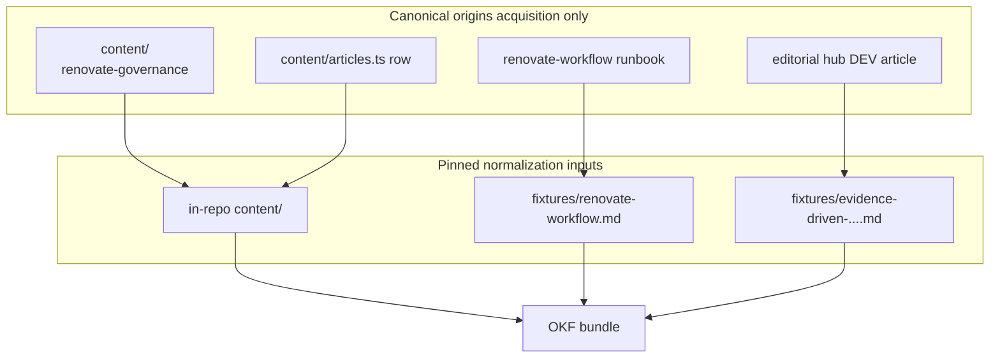

# Assistant OKF normalization experiment

## Recommended execution authority

| Slice                        | Recommended authority | Agent instruction                                      |
| ---------------------------- | --------------------- | ------------------------------------------------------ |
| plan-review                  | Plan-only PR          | Do not implement. Stop after opening the plan-only PR. |
| okf-normalization-experiment | Open PR only          | Do not merge. Stop after opening the PR.               |
| plan-closure                 | Open PR only          | Do not merge. Stop after opening the PR.               |

Repo default: **Open PR only** ([planning-standards.md](.cursor/standards/planning-standards.md)).

## Repository topology (default)

Integration branch: `main`. Each slice starts from latest `origin/main`; branch diff represents only that slice; PR base is `main`.

---

## Investigation summary (inputs to this plan)

### OKF v0.2 — what the spec actually supports

Read the current [OKF specification (v0.2 draft)](https://github.com/GoogleCloudPlatform/knowledge-catalog/blob/main/okf/SPEC.md). Key facts for this experiment:

| Capability                | Spec reality                                                                                                            | Implication for us                                                                                             |
| ------------------------- | ----------------------------------------------------------------------------------------------------------------------- | -------------------------------------------------------------------------------------------------------------- |
| **Bundle shape**          | Directory tree of UTF-8 `.md` files with YAML frontmatter; distributable as git repo                                    | Committed corpus under e.g. `assistant-corpus/` is idiomatic                                                   |
| **Conformance**           | Only hard requirements: parseable frontmatter + non-empty `type` on every concept; reserved `index.md` / `log.md` rules | Validation is lightweight; focus on mapping quality, not schema registry                                       |
| **`type`**                | Free-form string, not centrally registered                                                                              | Use descriptive types (`Case Study Block`, `Published Article`, `Runbook`) — no portfolio type registry needed |
| **Provenance**            | `sources[]` with required `resource` per entry; optional `id`, `title`, credibility signals                             | Maps cleanly to portfolio URLs, GitHub paths, DEV URLs, inventory paths                                        |
| **Per-claim attribution** | Markdown footnotes keyed to `sources[].id`                                                                              | Maps to `CaseFigure` and contract lines if we include figure-bearing portfolio content later                   |
| **Trust / lifecycle**     | Optional `generated`, `verified`, `status`, `stale_after`                                                               | Producers stamp `generated.by` (e.g. `process:portfolio-okf-producer`)                                         |
| **Cross-links**           | Bundle-relative markdown links (`/path/concept.md`)                                                                     | Link portfolio case ↔ repo runbook ↔ DEV article concepts                                                      |
| **`resource`**            | Canonical URI for underlying asset                                                                                      | Portfolio routes (`https://michaeltruong.ai/projects/...`), DEV URL, GitHub raw URL                            |
| **Extensions**            | Producers MAY add arbitrary frontmatter keys; consumers MUST preserve unknown keys                                      | Prefer standard fields first; only add `x_portfolio_*` if a concrete source demonstrates a gap                 |
| **Attested Computation**  | First-class for sanctioned metrics                                                                                      | Out of scope for this experiment unless a figure-bearing portfolio block is added                              |
| **Non-goals**             | No storage, embeddings, query infra, fixed taxonomy                                                                     | Confirms retrieval metadata must not leak into OKF                                                             |

**v0.2 additions over v0.1** that matter: provenance/trust/lifecycle families, actor convention (`human:`, `process:`, `agent/tool`), `references/` convention for mirrored external material.

### Representative sources chosen

Three sources, one per architecture source class, chosen to exercise **different structural shapes** while staying on one **coherent knowledge thread** (Renovate governance) so overlap vs complementarity is observable during manual inspection.



#### 1. Portfolio — `renovate-governance` supporting case

- **Primary:** [`content/supporting-cases.ts`](content/supporting-cases.ts) → `renovateGovernance` object
- **Secondary (same producer pass):** [`content/articles.ts`](content/articles.ts) row for slug `evidence-driven-dependency-upgrades` (catalog metadata only — no body)

**Why selected:**

| Shape exercised                                                      | Evidence                                                                |
| -------------------------------------------------------------------- | ----------------------------------------------------------------------- |
| Typed narrative blocks (`prose`, `architecture`, `contract`, `note`) | Unlike flat article catalog or repo markdown                            |
| Presentation metadata (`ordinal`, `navLabel`, `category`)            | Tests what stays in OKF vs is dropped as UI-only                        |
| `architecture` block referencing ecosystem canvas                    | Forces decision: link out, do not embed layout coordinates              |
| Non-rendered verbatim provenance map (`supportingCaseSourceProse`)   | Tests whether review aids become `sources` or are intentionally dropped |
| Cross-links to routes and field reports                              | `elsewhere`, artifact rows, `relatedProjectSlug`                        |

**Not chosen as primary portfolio source (document in inspection report):**

- [`content/project-cases.ts`](content/project-cases.ts) — richer `CaseFigure` + inventory `source` provenance; better for a follow-up if figure attribution is the main open question
- [`content/ecosystem.ts`](content/ecosystem.ts) — graph shape; defer until a second experiment or explicit graph-normalization slice

#### 2. Project repository — Renovate runbook

- **Canonical origin:** `../renovate-workflow/docs/renovate-workflow.md` (sibling checkout) or `https://raw.githubusercontent.com/multipliers-dev/renovate-workflow/main/docs/renovate-workflow.md` (public mirror for acquisition only)
- **Normalization input:** committed fixture under `assistant-corpus/fixtures/` (see acquisition pipeline below)

**Why selected:**

- Deliberately ingestible per [architecture-direction.md](docs/assistant/architecture-direction.md) (architecture/operator doc, not agent skills or plans)
- Already cited as external evidence in portfolio redesign baseline
- Operator voice + sectioned markdown + mermaid — different from curated case-study blocks
- Complements portfolio summary with operational detail (prerequisites, packet YAML, merge guards)

#### 3. Published writing — DEV field report

- **Canonical origin:** `../editorial-workflow/docs/dev.to/published/evidence-driven-dependency-upgrades.md` (sibling hub; portfolio [`articles.ts`](content/articles.ts) names this hub as master)
- **Live URL (provenance only):** `https://dev.to/michaeltruong/upgrades-dont-have-to-be-a-blind-trust-exercise-13mj` (`devto_article_id: 4056883`)
- **Normalization input:** committed fixture under `assistant-corpus/fixtures/` (see acquisition pipeline below)

**Why selected:**

- Full first-person narrative with incident detail (Vite major upgrade) — shape portfolio summaries cannot represent
- Pairs with `relatedProjectSlug: "renovate-governance"` and the repo runbook
- YAML frontmatter (Notion, DEV ids, sync timestamps) exercises metadata beyond portfolio `Article` type

### Source acquisition (experiment-only; no permanent ingestion)

Normalization must be **deterministic**: the same commit always normalizes the same input bytes. Acquisition and normalization are separate steps.

```text
real external source
        ↓
explicit acquisition / snapshot step   (manual; not part of okf:build)
        ↓
pinned input fixture                   (committed)
        ↓
normalization                          (okf:build — fixtures only)
        ↓
OKF bundle
```

**Do not** implement `okf:build` as “sibling checkout if present, else fetch from network.” Two developers on the same commit must not produce different normalized output because their local checkouts differ.

| Source      | Acquisition (refresh fixtures)                                                    | Normalization input (okf:build)                                    | What we are NOT building                             |
| ----------- | --------------------------------------------------------------------------------- | ------------------------------------------------------------------ | ---------------------------------------------------- |
| Portfolio   | N/A — already pinned by this git commit                                           | In-repo `content/` via domain types / `StaticPortfolioRepository`  | CMS, live site scrape                                |
| Repo doc    | Copy from sibling checkout **or** pin raw GitHub URL at known commit SHA          | `assistant-corpus/fixtures/renovate-workflow.md`                   | Runtime network fetch during build; whole-repo crawl |
| DEV article | Copy from sibling editorial hub **or** DEV API `4056883` for one-off verification | `assistant-corpus/fixtures/evidence-driven-dependency-upgrades.md` | Runtime network fetch during build; DEV feed crawler |

**Fixture refresh** is a separate, documented command (e.g. `npm run okf:snapshot`) run only when deliberately updating inputs. It writes fixtures + updates `assistant-corpus/fixtures/manifest.json` with origin path/URL, origin commit or sync timestamp, and content SHA-256. That manifest is the acquisition record; `assistant-corpus/manifest.json` records what normalization consumed.

Sibling checkouts and live URLs exist for **source acquisition and verification**, not for deterministic normalization.

---

## Experiment boundary

### In scope

```text
pinned inputs (content/ + committed fixtures)
        ↓
source-specific producers (portfolio | repo | dev)
        ↓
OKF v0.2 concept documents + bundle index
        ↓
inspectable output (committed corpus + manifest + inspection report)
```

**Deliverables (implementation slice):**

| Path                             | Purpose                                                                                                                            |
| -------------------------------- | ---------------------------------------------------------------------------------------------------------------------------------- |
| `scripts/assistant/okf/`         | Producer scripts + shared OKF writer helpers                                                                                       |
| `assistant-corpus/`              | Generated OKF bundle (committed)                                                                                                   |
| `assistant-corpus/index.md`      | Bundle root with `okf_version: "0.2"`                                                                                              |
| `assistant-corpus/manifest.json` | Input provenance + build metadata                                                                                                  |
| `assistant-corpus/INSPECTION.md` | Human-readable mapping report (preserved / lost / awkward / extension pressure)                                                    |
| `package.json` scripts           | `npm run okf:build` (normalization from pinned inputs only); `npm run okf:snapshot` (optional fixture refresh; documented, manual) |
| Tests                            | Conformance (every concept has `type`), manifest completeness, stable concept ids, build determinism from fixtures                 |

**Producer boundaries:**

- **Portfolio producer** — reads [`StaticPortfolioRepository`](repositories/static-portfolio-repository.ts) or typed `content/` imports; maps portfolio structure into OKF concepts where source semantics justify it. **Concept granularity is an experiment output**, not a plan assumption — e.g. one case-level concept vs per-block concepts is a decision to document in `INSPECTION.md` with rationale and alternatives considered.
- **Repo producer** — reads the **pinned fixture** markdown; maps meaningful document structure into OKF concepts where source semantics justify it. **Do not assume every `##` heading becomes one concept** — headings may or may not align with knowledge boundaries; record whether they were useful boundaries in `INSPECTION.md`.
- **DEV producer** — reads the **pinned fixture**; separates YAML frontmatter metadata from body; documents strip/preserve choices for HTML comments in `INSPECTION.md`; sets `resource` to canonical DEV URL

**OKF concepts ≠ retrieval units.** Canonical OKF knowledge and future retrieval-unit derivation are separate layers per [architecture-direction.md](docs/assistant/architecture-direction.md). This experiment learns concept boundaries; it does not pre-commit chunk sizes or heading-based splits because they look convenient for retrieval.

**Inspectable questions the bundle must answer:**

1. What source material entered (fixture manifest + normalization manifest)
2. How each input maps to OKF concepts (INSPECTION.md + directory layout)
3. Provenance / source identity (`sources`, `resource`, `generated`)
4. What was preserved vs lost vs awkward (INSPECTION.md table per source)
5. Whether any OKF extension was actually necessary (default: none; document pressure)
6. **What concept granularity was chosen and why** — per source class, document the mapping decision, alternatives considered (e.g. whole document vs sections vs blocks), and whether boundaries felt natural or awkward. Note implications for future retrieval-unit derivation without implementing it.

### Explicitly out of scope

- Embeddings, vector stores, semantic search, LangChain, RAG, LLM generation
- `app/api/` routes, chat UI, SSE/streaming, web retrieval
- Evaluation infrastructure, persistent vector infra, production ingestion pipelines
- Automatic indexing of whole repositories or DEV/GitHub crawling
- Changes to browsable portfolio pages or `PortfolioRepository` public contract
- Postgres / Neon / storage layer decisions
- Normalizing ecosystem graph, project-workflows layout coordinates, or codenames scroll experience

### Extension policy (during implementation)

For each apparent mismatch:

1. Verify base OKF (`sources`, `resource`, `tags`, `generated`, links, optional frontmatter) does not already cover it
2. Prefer standard semantics
3. Only add smallest `x_portfolio_*` key if a representative source demonstrates a real gap
4. Document gap + rationale in `INSPECTION.md` even when no extension is added

**Anticipated pressure points** (likely resolvable without extensions):

| Pressure                                 | Likely OKF mapping                                                                                                  |
| ---------------------------------------- | ------------------------------------------------------------------------------------------------------------------- |
| Portfolio route identity                 | `resource: https://michaeltruong.ai/projects/renovate-governance#b04`                                               |
| Inventory fact ids (`CaseFigure.source`) | `sources[].resource` pointing at sibling inventory path + footnote `id`                                             |
| UI-only fields (`navLabel`, `ordinal`)   | Omit from OKF or nest under optional `x_portfolio_presentation` only if inspection proves loss blocks understanding |
| `architecture` block canvas data         | Link to ecosystem entities; do not embed React Flow positions                                                       |
| Editorial HTML comments in DEV body      | Strip from body; note in INSPECTION.md                                                                              |
| Article catalog vs full body             | Two linked concepts sharing `resource` / cross-links                                                                |

---

## Slice — plan-review

**Recommended authority:** Plan-only PR

**Rationale:**

- First implementation encounter with OKF; plan must be reviewed before producers or corpus land
- Expected diff is plan artifact only

**Agent instruction:** Do not implement. Stop after opening the plan-only PR.

**Goal:** Land [`.cursor/plans/assistant-okf-normalization-experiment.plan.md`](.cursor/plans/assistant-okf-normalization-experiment.plan.md) for review.

**Acceptance:**

- Plan references architecture direction, prior art, OKF spec findings, representative sources, acquisition strategy, experiment boundary, acceptance criteria
- No implementation files (`scripts/assistant/`, `assistant-corpus/`, etc.)
- `plan-review` marked `completed` in frontmatter in same PR

---

## Slice — okf-normalization-experiment

**Recommended authority:** Open PR only

**Rationale:**

- Single bounded experiment; one PR is sufficient
- Produces inspectable artifacts for manual review before any retrieval work

**Agent instruction:** Do not merge. Stop after opening the PR.

**Prerequisite:** `plan-review` merged.

**Goal:** Implement the smallest useful OKF normalization experiment for the three representative sources.

**Implementation sketch** (directory layout is illustrative — actual concept tree follows granularity decisions documented in `INSPECTION.md`):

```
assistant-corpus/
  index.md
  manifest.json                      # normalization inputs + output hashes
  INSPECTION.md                      # mapping report incl. granularity rationale
  fixtures/
    manifest.json                    # acquisition record (origin, SHA, timestamp)
    renovate-workflow.md             # pinned repo doc
    evidence-driven-dependency-upgrades.md   # pinned DEV article
  portfolio/                         # OKF concepts from content/
  repo/                              # OKF concepts from repo fixture
  writing/                           # OKF concepts from DEV fixture
```

**Acceptance criteria (decision gate after merge):**

| Criterion                           | Pass condition                                                                                                                                                                               |
| ----------------------------------- | -------------------------------------------------------------------------------------------------------------------------------------------------------------------------------------------- |
| OKF fits source types               | Each of 3 classes has ≥1 conformant concept; INSPECTION.md records per-class verdict                                                                                                         |
| Extensions required?                | Documented yes/no with evidence; default expectation is **no** extensions                                                                                                                    |
| Producer boundaries                 | Three separate producer modules; portfolio does not read repo/DEV files directly                                                                                                             |
| Inspectability                      | `manifest.json` + `INSPECTION.md` + readable markdown concepts; `npm run okf:build` reads only in-repo `content/` and committed fixtures — no network I/O                                    |
| Determinism                         | Same commit → same fixture bytes → same OKF output; fixture manifest records acquisition provenance separately                                                                               |
| Architecture direction still valid? | INSPECTION.md ends with explicit recommendation: proceed / adjust direction / need second experiment (e.g. figures or ecosystem)                                                             |
| Concept granularity learned         | INSPECTION.md documents per-source mapping decisions, alternatives, and whether boundaries (blocks, headings, whole doc) felt natural — without conflating OKF concepts with retrieval units |
| Merge-safe                          | `npm run lint`, `typecheck`, `test`, `format:check` pass; no assistant runtime wired into Next.js app                                                                                        |
| Layer separation                    | No embeddings, vectors, APIs, UI; portfolio presentation unchanged                                                                                                                           |

**Verification:**

```bash
npm run okf:build
npm run test          # includes OKF conformance tests
npm run typecheck
npm run lint
npm run format:check
```

Manual: read `assistant-corpus/INSPECTION.md` and spot-check 2 concepts per source class for provenance and link integrity.

**Do not:**

- Add semantic retrieval, LangChain, OpenAI, or vector dependencies
- Modify `app/` routes for assistant behavior
- Invent speculative OKF extensions without demonstrated gap
- Build production ingestion for repos or DEV

Mark `okf-normalization-experiment` `completed` in plan frontmatter in same PR.

---

## Plan closure (docs-only PR)

**Recommended authority:** Open PR only

**Rationale:** Docs-only archival after experiment merges.

**Agent instruction:** Do not merge. Stop after opening the PR.

**Prerequisite:** `okf-normalization-experiment` merged.

1. Verify implementation todo `completed`
2. Add `# Shipped` closure note with merged PR link(s)
3. Move plan to `.cursor/plans/archive/2026-10-06-assistant-okf-normalization-experiment.plan.md`
4. Mark `plan-closure` `completed`

---

## Agent prompts (copy/paste for Cursor)

### plan-review

```text
@.cursor/plans/assistant-okf-normalization-experiment.plan.md

Execute only plan-review. Do not start okf-normalization-experiment or later slices.

Authority: Plan-only PR — commit the plan artifact only; do not implement. Stop after opening the plan-only PR.

Topology: start from latest origin/main; branch represents only the plan artifact; PR base must be main.

Deliverables: plan file under .cursor/plans/; mark plan-review completed in frontmatter in the same PR.

Verification: plan satisfies repo planning standards; no implementation changes included.
```

### okf-normalization-experiment

```text
@.cursor/plans/assistant-okf-normalization-experiment.plan.md

Implement slice okf-normalization-experiment only. Prerequisite: plan-review merged. Do not start plan-closure. Do not archive the plan.

Authority: Open PR only — implement and open the PR; do not merge.

Topology: start from latest origin/main; branch represents only this slice; PR base must be main.

Deliverables: scripts/assistant/okf producers, committed assistant-corpus/fixtures/ (pinned inputs), committed OKF bundle with manifest.json and INSPECTION.md (incl. concept-granularity rationale), npm run okf:build (fixtures-only; no network), optional npm run okf:snapshot (documented fixture refresh), conformance tests. Mark okf-normalization-experiment completed in plan frontmatter in this PR.

Do not: runtime network fetch inside okf:build; heading/block splits chosen for retrieval convenience; embeddings, vector stores, semantic search, LangChain, RAG, LLM calls, assistant API routes, chat UI, SSE, web retrieval, production ingestion pipelines, or changes to browsable portfolio presentation.

Verification: npm run okf:build; npm run test; npm run typecheck; npm run lint; npm run format:check; manual read of INSPECTION.md.
```

### plan-closure

```text
@.cursor/plans/assistant-okf-normalization-experiment.plan.md

Execute only plan-closure.

Authority: Open PR only — docs-only archive PR; do not merge.

Prerequisites: okf-normalization-experiment merged and marked completed in frontmatter.

Topology: start from latest origin/main; branch represents only this slice; PR base must be main.

Deliverables: verify slice todos, add # Shipped note, move plan to .cursor/plans/archive/2026-10-06-assistant-okf-normalization-experiment.plan.md, mark plan-closure completed.

Verification: confirm okf-normalization-experiment PR is merged before archiving.
```
