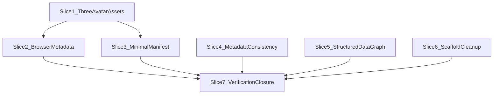

# Web identity and metadata layer — michaeltruong.ai

**Repo:** [portfolio](https://github.com/mastermichaelt/portfolio) (Next.js 16 App Router, `main` as of inspection)

**Baseline already shipped (do not regress):**

- Canonical origin via [`lib/site.ts`](lib/site.ts) (`https://michaeltruong.ai`, `NEXT_PUBLIC_SITE_URL`)
- [`app/layout.tsx`](app/layout.tsx) `metadataBase`, title template, root OG/Twitter defaults
- Per-route `alternates.canonical` on all indexable pages
- [`app/robots.ts`](app/robots.ts) preview `disallow: /`
- [`app/sitemap.ts`](app/sitemap.ts) + [`lib/sitemap-paths.ts`](lib/sitemap-paths.ts) (9 URLs)
- [`components/PersonJsonLd.tsx`](components/PersonJsonLd.tsx) Person schema
- [`app/opengraph-image.tsx`](app/opengraph-image.tsx) / [`app/twitter-image.tsx`](app/twitter-image.tsx) (1200×630)
- Only icon today: [`app/favicon.ico`](app/favicon.ico) (likely default Next scaffold; no manifest, no `viewport` export)

**Known gap to fix:** homepage [`app/page.tsx`](app/page.tsx) sets a **shorter** `description` but does not override `openGraph`/`twitter` descriptions — crawlers inherit the **longer** layout copy on `/`.

**Complexity benchmark:** [Codenames AI](https://github.com/mastermichaelt/codenames-ai-guesser) `frontend/public/` icon set — use as an **asset-count** reference only. Do **not** copy its Vite/HTML wiring; the portfolio uses Next.js App Router metadata conventions.

---

## Implementation strategy

### Three final icon assets — no overbuilt pipeline

Use **three reviewed PNG design artifacts** sharing one pixel-art identity. Do **not** build an elaborate generation subsystem for three small assets. Do **not** add sizes merely because generic favicon generators include them.

| Asset                        | Size    | Role                                                                   |
| ---------------------------- | ------- | ---------------------------------------------------------------------- |
| `favicon-16x16.png`          | 16×16   | Browser favicon — aggressively simplified for readability              |
| `apple-touch-icon.png`       | 180×180 | Apple touch icon — richer avatar/owl detail where effective            |
| `android-chrome-192x192.png` | 192×192 | Manifest / browser identity — richer avatar/owl detail where effective |

**Explicitly not required:**

- 32×32, 48×48, or 512×512 icons
- Multi-size `.ico` or generated `favicon.ico`
- `app/icon.png` unless Slice 2 inspection of Next.js conventions establishes a concrete need beyond the 16×16 PNG
- Redundant duplicate sizes or maskable variants (unless a concrete browser requirement emerges during Slice 2/3 inspection)

**Do not** use raw photographic portrait crops or downscales as favicon output — visual testing rejected that direction.

### Visual direction (selected)

Pixel-art **portrait/avatar** of Michael — clean modern **16-bit / Pixel Remaster** style, derived from [`public/portrait-michael-1200.jpg`](public/portrait-michael-1200.jpg).

- **Prefer over:** MT monogram; direct photo shrink/crop
- **Recognizable traits:** dark hair, black rectangular glasses, smiling face, dark shirt
- **Owl:** part of the preferred larger composition; include beside Michael at 180×192 where visually effective; **omit from 16×16** if it harms readability
- **Do not** materially alter Michael's appearance or invent identifying characteristics

**MT monogram** remains a **fallback candidate only** if the pixel avatar fails favicon legibility review — not the default path.

### Asset-source strategy

One coherent pixel-art identity; **size-specific simplification is explicitly allowed**.

- The **16×16** favicon prioritizes recognizable silhouette (hair, glasses, face/smile where possible) and clean contrast — minor details may be removed; owl may be omitted.
- The **180×180** and **192×192** assets preserve the richer selected composition, including the owl where effective.
- All three must clearly represent the **same** pixel-art identity, but larger assets are **not** required to be literal upscales of the 16×16 sprite, and the 16×16 asset must **not** retain details that only work at larger sizes.

**Canonical artwork (optional):** a richer-resolution source file (e.g. `lib/brand/avatar-pixel-source.png`) may document the preferred larger composition. The three committed PNGs are the **final deliverables**; derivation between sizes may be manual design judgment, not forced integer scaling.

**Reproducibility (optional, lightweight):**

- A small `lib/brand/README.md` documenting reference portrait, likeness constraints, owl policy, and how the three outputs relate is **required**.
- A lightweight script (`npm run generate:icons` / `check:icons`) is **optional** — add only if it provides real reproducibility value (e.g. copying/normalizing from a single source into output paths). If the three PNGs are better treated as reviewed design artifacts, that is acceptable.
- **`sharp` is not required** — retain only if a concrete derivation step needs it. No `png-to-ico` or ICO tooling.

**Runtime icons:** do **not** add `app/icon.tsx` / `app/apple-icon.tsx` `ImageResponse` routes (separate concern from OG images).

| Layer                | Mechanism                                                                                             |
| -------------------- | ----------------------------------------------------------------------------------------------------- |
| **Final assets**     | Three PNGs (committed; paths finalized in Slice 1, wired in Slice 2)                                  |
| **Browser delivery** | Determined in Slice 2 — inspect Next.js App Router file conventions vs `metadata.icons` (see Slice 2) |
| **Manifest**         | `app/manifest.ts` → single `android-chrome-192x192.png` entry                                         |
| **Social preview**   | Unchanged: `opengraph-image.tsx` / `twitter-image.tsx`                                                |

### Bugbot findings — structurally resolved

| Former issue                              | Resolution                                                                                                                |
| ----------------------------------------- | ------------------------------------------------------------------------------------------------------------------------- |
| 180px cannot be integer upscale from 16px | **Removed** integer-only upscale constraint; 180×180 and 192×192 are independently authored or size-appropriately derived |
| Sharp cannot emit ICO                     | **Removed** `favicon.ico` requirement entirely; favicon is **16×16 PNG** via cleanest Next.js mechanism (Slice 2)         |

---

## Slice sequence and PR boundaries



| Slice                            | Recommended PR                  | Rationale                                                         |
| -------------------------------- | ------------------------------- | ----------------------------------------------------------------- |
| 1 — Pixel-avatar identity assets | **Own PR (PR 1)**               | Artwork review before `<head>` wiring                             |
| 2 — Browser metadata integration | **Combine with slice 3 (PR 2)** | Manifest needs icon paths; same surfaces                          |
| 3 — Minimal manifest             | **PR 2** (with slice 2)         | Depends on slice 1 assets                                         |
| 4 — Metadata consistency         | **Own PR (PR 3)**               | Copy + layout metadata; independent of icons                      |
| 5 — Structured data graph        | **Own PR (PR 4)**               | JSON-LD evolution; independent                                    |
| 6 — Scaffold cleanup             | **Combine with PR 4 or PR 5**   | Trivial                                                           |
| 7 — Verification + plan closure  | **Docs-only closure PR**        | Per [planning standards](.cursor/standards/planning-standards.md) |

**Recommended execution authority:** Open PR only for all implementation slices; stop after opening each PR.

---

## Slice 1 — Pixel-avatar identity assets

**Objective:** Establish and review the **three final pixel-art avatar PNGs**. No layout/manifest/viewport wiring yet.

**Files / surfaces:**

- **Add** three committed final assets (exact paths may use `public/` to align with Codenames naming, or `lib/brand/` if preferred — document choice in README):
  - `favicon-16x16.png` (16×16)
  - `apple-touch-icon.png` (180×180)
  - `android-chrome-192x192.png` (192×192)
- **Add** `lib/brand/README.md` — reference portrait path, likeness constraints, owl inclusion policy, size-specific simplification notes, optional source-artwork path, MT monogram fallback policy
- **Optional:** `lib/brand/avatar-pixel-source.png` (or similar) — richer canonical artwork for the 180/192 compositions; not a runtime asset unless Slice 2 places it
- **Optional:** lightweight `scripts/` helper + `npm run generate:icons` / `check:icons` — only if reproducibility value is clear; not mandatory
- **Optional fallback only:** MT monogram asset — **only** if pixel avatar fails 16×16 legibility review
- **Add** `tests/brand-icons.test.ts` — asserts three files exist, correct dimensions (16, 180, 192), non-trivial byte size

**Dependencies:** None

**Boundaries:**

- Do **not** edit [`app/layout.tsx`](app/layout.tsx), add `manifest.ts`, or `viewport` export
- Do **not** change OG/Twitter image routes
- Do **not** add PWA/service worker
- Do **not** commit `favicon.ico`, 32×32, 48×48, 512×512, or other redundant sizes
- Do **not** use raw photographic portrait crops as final icon output
- Do **not** materially alter Michael's appearance or invent traits
- Do **not** use external paid image generation for final assets
- Do **not** remove [`app/favicon.ico`](app/favicon.ico) yet — Slice 2 replaces scaffold favicon when wiring

**Tests / checks:**

- `npm test` (brand-icons dimension/existence tests)
- Optional: `npm run check:icons` if a script is added
- Manual: review all three at intended display size — same pixel-art identity; 16×16 readable (hair, glasses, smile); owl present at 180/192 if selected; owl omitted at 16×16 if needed

**Acceptance criteria:**

- Exactly **three** final PNG assets at 16×16, 180×180, and 192×192
- Pixel-art avatar identity — not photoreal, not MT monogram (unless documented fallback)
- `lib/brand/README.md` documents provenance and size-specific simplification rules
- No runtime icon generation routes; no ICO; no mandatory `sharp`
- **No production `<head>` wiring** in this slice — artwork review gate before Slice 2

**Must remain unchanged:** robots, sitemap, JSON-LD, route metadata, OG image; existing `app/favicon.ico` until Slice 2

**Production impact on merge:** **None to browser identity** — assets land in-repo for review; production favicon/manifest wiring deferred to Slice 2.

**PR:** Own PR — merge-safe (design artifacts + docs + tests only)

---

## Slice 2 — Browser metadata integration

**Objective:** Wire the three assets via the **cleanest single Next.js App Router mechanism**; add viewport metadata; remove scaffold `favicon.ico`.

**Pre-implementation inspection (required):** Read current Next.js 16 metadata file conventions for this repo (`app/icon.*`, `app/apple-icon.*`, `metadata.icons`, `public/` static paths). Choose **one** wiring strategy — do not duplicate icon declarations across file conventions **and** explicit `metadata.icons`.

**Likely patterns (confirm at implementation — not prescriptive):**

| Asset            | Candidate mechanisms                                                                                                                                 |
| ---------------- | ---------------------------------------------------------------------------------------------------------------------------------------------------- |
| 16×16 favicon    | `app/icon.png` (if 16×16 PNG is supported as favicon), or `public/favicon-16x16.png` + `metadata.icons`, or Next `app/favicon` route — **no `.ico`** |
| 180×180 Apple    | `app/apple-icon.png` file convention, or `metadata.icons` → `apple-touch-icon.png`                                                                   |
| 192×192 manifest | Referenced from `app/manifest.ts` (Slice 3); may remain in `public/`                                                                                 |

**Files / surfaces:**

- **Remove** scaffold [`app/favicon.ico`](app/favicon.ico) when PNG favicon wiring is confirmed
- Place or reference slice-1 PNGs per chosen mechanism
- **Add** to [`app/layout.tsx`](app/layout.tsx):

```ts
import type { Viewport } from "next";

export const viewport: Viewport = {
  themeColor: [
    { media: "(prefers-color-scheme: light)", color: "#f2efe8" },
    { media: "(prefers-color-scheme: dark)", color: "#121110" },
  ],
  colorScheme: "dark light",
};
```

- Add `metadata.icons` **only if** file conventions alone do not emit correct favicon + apple-touch-icon links

**Dependencies:** Slice 1 merged

**Boundaries:**

- No `app/icon.tsx` / dynamic icon routes
- No manifest yet (slice 3) except shared asset paths
- No theme-color JavaScript — viewport metadata only
- No duplicate competing `<link rel="icon">` tags

**Tests / checks:**

- Extend `tests/site.test.ts` or add `tests/head-identity.test.ts`
- Manual post-deploy: favicon URL, apple-touch-icon URL return 200 with correct dimensions (16 and 180)

**Acceptance criteria:**

- Production `<head>` exposes favicon (16×16 PNG) and apple-touch-icon (180×180)
- `theme-color` with light/dark media queries; `color-scheme` present
- Scaffold `favicon.ico` removed; no `.ico` dependency
- Single coherent wiring mechanism — no duplicate icon declarations

**Must remain unchanged:** OG/Twitter images, robots, sitemap, Person JSON-LD content

**PR:** Combine with slice 3

---

## Slice 3 — Minimal manifest (identity only, not PWA)

**Objective:** Add a web manifest for name/colors/icons identity. **Not** installable-app behavior.

**Files / surfaces:**

- **Add** [`app/manifest.ts`](app/manifest.ts) (`MetadataRoute.Manifest`):

| Field              | Value                                                                                      |
| ------------------ | ------------------------------------------------------------------------------------------ |
| `name`             | `Michael Truong`                                                                           |
| `short_name`       | `Michael Truong`                                                                           |
| `description`      | Short homepage description (slice 4 constant — interim copy OK; align when slice 4 merges) |
| `start_url`        | `/`                                                                                        |
| `display`          | `browser` (explicitly **not** `standalone`)                                                |
| `background_color` | `#121110`                                                                                  |
| `theme_color`      | `#121110`                                                                                  |
| `icons`            | Single entry: `android-chrome-192x192.png` at 192×192, `purpose: "any"`                    |

- **Do not** add 512×512 or maskable icons unless inspection identifies a concrete requirement
- **Do not** add service worker, install prompts, or `mobile-web-app-capable`

**Dependencies:** Slice 1 (`android-chrome-192x192.png`)

**Boundaries:** No `display_override`, offline scope, or `sw.js`

**Tests / checks:**

- Unit test: manifest fields + single icon path/size
- Production: manifest URL returns JSON; 192×192 icon URL returns 200

**Acceptance criteria:**

- Manifest served with `display: browser`
- Exactly one manifest icon (192×192)
- Not an installable PWA

**PR:** Combined with slice 2

---

## Slice 4 — Metadata consistency and completeness

**Objective:** Fix homepage social description drift; add author/creator metadata; add curated `metadata.keywords` for completeness; centralize copy.

**Files / surfaces:**

- **Add** `lib/site-metadata.ts`:
  - `SITE_NAME`, `SITE_TAGLINE`, `HOME_DESCRIPTION`, `SITE_DEFAULT_DESCRIPTION`
  - `SITE_KEYWORDS` — curated array; portfolio-grounded; no permutations/stuffing/marketing claims; **metadata completeness/compatibility, not ranking optimization**
- **Update** [`app/page.tsx`](app/page.tsx) — OG/Twitter descriptions match `HOME_DESCRIPTION`
- **Update** [`app/layout.tsx`](app/layout.tsx) — `authors`, `creator`, `keywords`
- **Update** [`app/manifest.ts`](app/manifest.ts) `description` if slice 3 merged

**Dependencies:** None (parallel with PR 2 after slice 1)

**Boundaries:** No verification tokens; no per-project OG images; keep `SITE_KEYWORDS` short

**Tests / checks:** Unit tests for `HOME_DESCRIPTION`, bounded `SITE_KEYWORDS`; render checks for description/keywords alignment

**Acceptance criteria:**

- Homepage description consistent across `description`, `og:description`, `twitter:description`
- Layout exposes `authors`, `creator`, `keywords`

**PR:** Own PR (PR 3)

---

## Slice 5 — Structured data graph (Person + WebSite + ProfilePage)

**Objective:** Evolve [`components/PersonJsonLd.tsx`](components/PersonJsonLd.tsx) into a single linked `@graph`.

**Proposed shape** (claims from [`content/profile.ts`](content/profile.ts) only):

```ts
@graph: [
  { "@type": "WebSite", "@id": websiteId, publisher: { "@id": personId }, ... },
  { "@type": "ProfilePage", "@id": profilePageId, mainEntity: { "@id": personId }, isPartOf: { "@id": websiteId }, ... },
  { "@type": "Person", "@id": personId, ... },
]
```

**Dependencies:** Slice 4 merged (for `HOME_DESCRIPTION`)

**Boundaries:** One JSON-LD block; no `SearchAction`; no invented claims

**PR:** Own PR (PR 4)

---

## Slice 6 — Scaffold cleanup

Remove verified-unused starter SVGs from `public/` (`next.svg`, `vercel.svg`, `globe.svg`, `window.svg`, `file.svg`). Do not remove portrait JPEGs.

**PR:** Combine with PR 4 or PR 5

---

## Slice 7 — End-to-end verification and plan closure

**Verification checklist (production `https://michaeltruong.ai`):**

| Check                                      | Method                                                              |
| ------------------------------------------ | ------------------------------------------------------------------- |
| `<head>` favicon + apple-touch-icon links  | View source / curl                                                  |
| Favicon PNG (16×16)                        | HTTP 200; visual legibility (hair, glasses, smile; no owl required) |
| `apple-touch-icon.png` (180×180)           | HTTP 200; richer avatar; owl if designed in                         |
| `android-chrome-192x192.png` (192×192)     | HTTP 200; manifest icon resolves                                    |
| Same pixel-art identity across three sizes | Visual — coherent, not forced upscale                               |
| `theme-color` (light + dark media)         | View source                                                         |
| `color-scheme`                             | View source                                                         |
| Manifest link + JSON                       | `display: browser`; single 192 icon                                 |
| Canonical on `/`                           | `link[rel=canonical]`                                               |
| Title + description on `/`                 | Match `HOME_DESCRIPTION`                                            |
| `meta name="keywords"`                     | Matches curated `SITE_KEYWORDS`                                     |
| `og:*` + `twitter:*` on `/`                | Description matches; 1200×630 image resolves                        |
| JSON-LD graph                              | Rich Results Test; 3 linked entities                                |
| `/robots.txt`, `/sitemap.xml`              | Unchanged behavior                                                  |
| Preview deploy                             | `VERCEL_ENV=preview` → robots disallow                              |
| CI                                         | `npm run check` green                                               |

**PR:** Docs-only plan-closure PR

---

## Risks and open decisions

| Risk                                     | Mitigation                                                                                   |
| ---------------------------------------- | -------------------------------------------------------------------------------------------- |
| 16×16 favicon illegibility               | Aggressive simplification; omit owl; MT monogram fallback only if avatar fails review        |
| Inconsistent identity across three sizes | PR review compares all three side-by-side; README documents intentional size-specific detail |
| Appearance drift or invented traits      | Derive from `portrait-michael-1200.jpg`; side-by-side in PR; no generative retouching        |
| Next.js icon wiring ambiguity            | Slice 2 starts with convention inspection; one mechanism only                                |
| Duplicate icon `<link>` tags             | Verify rendered HTML; prefer file conventions OR `metadata.icons`, not both                  |
| `themeColor` vs stored theme             | Dual media on `prefers-color-scheme`; stored theme may diverge (documented)                  |
| Manifest mistaken for PWA                | `display: browser`; no SW                                                                    |

**Resolved:** pixel-art avatar (not MT monogram, not photo crop); three assets only; no ICO; no integer-upscale constraint; no mandatory `sharp`.

**Open at Slice 1 review:** owl inclusion at 180/192 vs omission at 16×16.

---

## Explicitly out of scope

- Service worker, offline caching, install prompts, standalone display
- Crawler fallback HTML; runtime SPA SEO
- Per-project OG images; sitemap `lastModified`
- Search Console verification (unless token provided)
- Raw photographic portrait favicon (direct crop/downscale)
- MT monogram (except documented fallback)
- 32×32, 48×48, 512×512 icons; multi-size `.ico`; generic PWA icon conventions

---

## Agent prompts (copy/paste for Cursor)

### Slice 1 — Pixel-avatar identity assets

Implement slice 1 only from `@.cursor/plans/web-identity-metadata.plan.md`. Create exactly three final PNGs: `favicon-16x16.png` (16×16), `apple-touch-icon.png` (180×180), `android-chrome-192x192.png` (192×192) — pixel-art avatar derived from `public/portrait-michael-1200.jpg` (dark hair, black rectangular glasses, smile, dark shirt; owl at larger sizes where effective, omit at 16×16 if needed; Pixel Remaster style; no invented traits). Add `lib/brand/README.md` with provenance and size-specific simplification rules. Optional source artwork and optional lightweight script only if clearly valuable — no mandatory `sharp`, no ICO, no extra sizes. Do **not** wire layout/manifest/viewport or remove `app/favicon.ico` yet. Open PR; do not merge. Mark slice-1 todo completed.

### Slice 2+3 — Browser identity + manifest

Implement slices 2 and 3 only from `@.cursor/plans/web-identity-metadata.plan.md` after slice 1 is on `main`. **Inspect** Next.js 16 icon conventions first; wire three PNGs via one clean mechanism (no duplicate declarations). Remove scaffold `app/favicon.ico`; favicon is 16×16 PNG. Add `export const viewport` (dual media themeColor + colorScheme). Add `app/manifest.ts` with `display: browser` and single `android-chrome-192x192.png` icon. No SW/PWA. Open PR; do not merge. Mark slice-2 and slice-3 todos completed.

### Slice 4 — Metadata consistency

Implement slice 4 only from `@.cursor/plans/web-identity-metadata.plan.md`. Add `lib/site-metadata.ts` (including curated `SITE_KEYWORDS`), fix homepage OG/Twitter descriptions to match `HOME_DESCRIPTION`, add `authors`/`creator`/`metadata.keywords` in layout. Keywords: metadata completeness only. Open PR; do not merge. Mark slice-4 todo completed.

### Slice 5 — JSON-LD graph

Implement slice 5 only from `@.cursor/plans/web-identity-metadata.plan.md` after slice 4 is on `main`. Evolve Person JSON-LD to linked `@graph` (WebSite, ProfilePage, Person) with stable `@id` refs. Open PR; do not merge. Mark slice-5 todo completed.

### Slice 6 — Cleanup

Implement slice 6 only from `@.cursor/plans/web-identity-metadata.plan.md`. Remove unused starter SVGs after grep verification. Open PR; do not merge. Mark slice-6 todo completed.

### Plan closure

Implement plan-closure only from `@.cursor/plans/web-identity-metadata.plan.md`. Run verification checklist, add `# Shipped` note, archive plan. Docs-only PR; do not merge.
