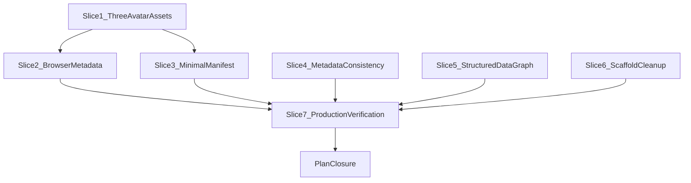

# Web identity and metadata layer — michaeltruong.ai

**Repo:** [portfolio](https://github.com/mastermichaelt/portfolio) (Next.js 16 App Router, `main` as of inspection)

**Baseline already shipped (do not regress):**

- Canonical origin via [`lib/site.ts`](lib/site.ts) (`https://michaeltruong.ai`, `NEXT_PUBLIC_SITE_URL`)
- [`app/layout.tsx`](app/layout.tsx) `metadataBase`, title template, root OG/Twitter defaults
- Per-route `alternates.canonical` on all indexable pages
- [`app/robots.ts`](app/robots.ts) preview `disallow: /`
- [`app/sitemap.ts`](app/sitemap.ts) + [`lib/sitemap-paths.ts`](lib/sitemap-paths.ts) (9 URLs)
- [`components/PersonJsonLd.tsx`](components/PersonJsonLd.tsx) Person schema
- [`app/opengraph-image.tsx`](app/opengraph-image.tsx) / [`app/twitter-image.tsx`](app/twitter-image.tsx) (1200×630)
- Only icon today: [`app/favicon.ico`](app/favicon.ico) (likely default Next scaffold; no manifest, no `viewport` export)

**Known gap to fix:** homepage [`app/page.tsx`](app/page.tsx) sets a **shorter** `description` but does not override `openGraph`/`twitter` descriptions — crawlers inherit the **longer** layout copy on `/`.

**Complexity benchmark:** [Codenames AI](https://github.com/mastermichaelt/codenames-ai-guesser) `frontend/public/` icon set — use as an **asset-count** reference only. Do **not** copy its Vite/HTML wiring; the portfolio uses Next.js App Router metadata conventions.

---

## Implementation strategy

### Three final icon assets — no overbuilt pipeline

Use **three reviewed PNG design artifacts** sharing one pixel-art identity. Do **not** build an elaborate generation subsystem for three small assets. Do **not** add sizes merely because generic favicon generators include them.

| Asset                        | Size    | Role                                                                   |
| ---------------------------- | ------- | ---------------------------------------------------------------------- |
| `favicon-32x32.png`          | 32×32   | Browser favicon source — simplify details where needed for legibility  |
| `apple-touch-icon.png`       | 180×180 | Apple touch icon — richer avatar/owl detail where effective            |
| `android-chrome-192x192.png` | 192×192 | Manifest / browser identity — richer avatar/owl detail where effective |

**Favicon display testing:** the favicon **source raster is 32×32**, but must be **visually reviewed at approximately 16 CSS px** (browser-tab presentation). Do **not** require a 16×16 source raster — visual testing showed 16×16 is too constrained for hair, glasses, expression, and face clarity.

**Explicitly not required:**

- 16×16 favicon source raster (rejected after visual testing)
- 48×48 or 512×512 icons
- Multi-size `.ico` or generated `favicon.ico`
- `app/icon.png` unless Slice 2 inspection of Next.js conventions establishes a concrete need beyond `favicon-32x32.png`
- Redundant duplicate sizes or maskable variants (unless a concrete browser requirement emerges during Slice 2/3 inspection)

**Do not** use raw photographic portrait crops or downscales as favicon output.

### Visual direction (selected)

Pixel-art **portrait/avatar** of Michael — clean modern **16-bit / Pixel Remaster** style, derived from [`public/portrait-michael-1200.jpg`](public/portrait-michael-1200.jpg).

- **Prefer over:** MT monogram; direct photo shrink/crop; 16×16 source raster
- **Recognizable traits:** dark hair, black rectangular glasses, smiling face, dark shirt
- **Owl:** part of the preferred larger composition at 180×192; **optional at favicon size** — omit from 32×32 if it hurts readability
- **Do not** materially alter Michael's appearance or invent identifying characteristics

**MT monogram** remains a **fallback candidate only** if the pixel avatar fails favicon legibility review — not the default path.

### Asset-source strategy

One coherent pixel-art identity; **size-specific simplification is explicitly allowed**.

- The **32×32** favicon prioritizes recognizable hair, glasses, expression, and face at favicon scale — simplify details where necessary; owl may be omitted.
- The **180×180** and **192×192** assets preserve the richer selected composition, including the owl where effective.
- All three must clearly represent the **same** pixel-art identity. Larger assets are **not** required to be literal upscales of the 32×32 sprite.

**Canonical artwork (optional):** a richer-resolution source file (e.g. `lib/brand/avatar-pixel-source.png`) may document the preferred larger composition. The three committed PNGs are the **final deliverables**; derivation between sizes may be manual design judgment, not forced integer scaling.

**Reproducibility (optional, lightweight):**

- `lib/brand/README.md` documenting reference portrait, likeness constraints, owl policy, 32×32 vs 16 CSS px display testing, and how the three outputs relate is **required**.
- A lightweight script (`npm run generate:icons` / `check:icons`) is **optional** — add only if it provides real reproducibility value.
- **`sharp` is not required** — retain only if a concrete derivation step needs it. No `png-to-ico` or ICO tooling.

**Runtime icons:** do **not** add `app/icon.tsx` / `app/apple-icon.tsx` `ImageResponse` routes.

| Layer                | Mechanism                                                                              |
| -------------------- | -------------------------------------------------------------------------------------- |
| **Final assets**     | Three PNGs (committed in Slice 1; wired in Slice 2)                                    |
| **Browser delivery** | Determined in Slice 2 — inspect Next.js 16 App Router conventions; one clean mechanism |
| **Manifest**         | `app/manifest.ts` → single `android-chrome-192x192.png` entry                          |
| **Social preview**   | Unchanged: `opengraph-image.tsx` / `twitter-image.tsx`                                 |

---

## Slice sequence and PR boundaries

| Slice                            | Recommended PR                  | Rationale                                    |
| -------------------------------- | ------------------------------- | -------------------------------------------- |
| 1 — Pixel-avatar identity assets | **Own PR (PR 1)**               | Artwork review before `<head>` wiring        |
| 2 — Browser metadata integration | **Combine with slice 3 (PR 2)** | Manifest needs icon paths; same surfaces     |
| 3 — Minimal manifest             | **PR 2** (with slice 2)         | Depends on slice 1 assets                    |
| 4 — Metadata consistency         | **Own PR (PR 3)**               | Copy + layout metadata; independent of icons |
| 5 — Structured data graph        | **Own PR (PR 4)**               | JSON-LD evolution; independent               |
| 6 — Scaffold cleanup             | **Combine with PR 4 or PR 5**   | Trivial                                      |
| 7 — Production verification      | **Own implementation PR**       | Tests + checklist require code changes       |
| plan-closure                     | **Docs-only closure PR**        | Archive plan after slice 7 merges            |

**Recommended execution authority:** Open PR only for all implementation slices; stop after opening each PR.

---

## Slice 1 — Pixel-avatar identity assets

**Objective:** Establish and review the **three final pixel-art avatar PNGs**. No layout/manifest/viewport wiring yet.

**Files / surfaces:**

- **Add** three committed final assets (paths documented in README; `public/` preferred for Codenames-aligned naming):
  - `favicon-32x32.png` (32×32)
  - `apple-touch-icon.png` (180×180)
  - `android-chrome-192x192.png` (192×192)
- **Add** `lib/brand/README.md` — reference portrait, likeness constraints, owl policy, why favicon is 32×32 not 16×16, 16 CSS px display-test note, MT monogram fallback policy
- **Optional:** `lib/brand/avatar-pixel-source.png` — richer artwork for 180/192 compositions
- **Optional:** lightweight script + `npm run generate:icons` / `check:icons` — only if clear reproducibility value
- **Optional fallback only:** MT monogram — **only** if pixel avatar fails favicon legibility review
- **Add** `tests/brand-icons.test.ts` — asserts three files exist, dimensions (32, 180, 192), non-trivial byte size

**Dependencies:** None

**Boundaries:**

- Do **not** edit layout, manifest, or viewport
- Do **not** change OG/Twitter image routes
- Do **not** commit `favicon.ico`, **16×16**, 48×48, 512×512, or other redundant sizes
- Do **not** use raw photographic portrait crops as final icon output
- Do **not** remove `app/favicon.ico` yet — Slice 2 replaces scaffold favicon when wiring

**Tests / checks:**

- `npm test` (brand-icons tests)
- Manual: review `favicon-32x32.png` at **~16 CSS px** in a browser tab or equivalent preview; review all three at native size for identity coherence
- Manual: hair, glasses, expression readable at favicon presentation size; owl at 180/192 if selected; owl omitted at 32×32 if needed

**Acceptance criteria:**

- Exactly **three** PNG assets at **32×32**, 180×180, and 192×192
- Pixel-art avatar identity — not photoreal, not MT monogram (unless documented fallback)
- Favicon legibility validated at ~16 CSS px display size (32×32 source)
- `lib/brand/README.md` documents provenance and size-specific rules
- No ICO; no mandatory `sharp`; no production `<head>` wiring

**Production impact on merge:** **None** — artwork review gate; wiring deferred to Slice 2.

**PR:** Own PR — merge-safe (design artifacts + docs + tests only)

---

## Slice 2 — Browser metadata integration

**Objective:** Wire the three assets via the **cleanest single Next.js App Router mechanism**; add viewport metadata; remove scaffold `favicon.ico`.

**Pre-implementation inspection (required):** Read Next.js 16 metadata file conventions (`app/icon.*`, `app/apple-icon.*`, `metadata.icons`, `public/` paths). Choose **one** wiring strategy — no duplicate declarations.

**Likely patterns (confirm at implementation — not prescriptive):**

| Asset            | Candidate mechanisms                                                                                              |
| ---------------- | ----------------------------------------------------------------------------------------------------------------- |
| 32×32 favicon    | `app/icon.png` (32×32), or `public/favicon-32x32.png` + `metadata.icons`, or Next file convention — **no `.ico`** |
| 180×180 Apple    | `app/apple-icon.png` file convention, or `metadata.icons` → `apple-touch-icon.png`                                |
| 192×192 manifest | Referenced from `app/manifest.ts` (Slice 3)                                                                       |

**Files / surfaces:**

- **Remove** scaffold [`app/favicon.ico`](app/favicon.ico) when PNG favicon wiring is confirmed
- Place or reference slice-1 PNGs per chosen mechanism
- **Add** `export const viewport` to [`app/layout.tsx`](app/layout.tsx) (dual media `themeColor`: `#f2efe8` / `#121110`; `colorScheme: "dark light"`)
- Add `metadata.icons` **only if** file conventions alone do not emit correct links

**Dependencies:** Slice 1 merged

**Tests / checks:**

- Extend `tests/site.test.ts` or add `tests/head-identity.test.ts`
- Manual: favicon and apple-touch-icon URLs return 200; favicon raster is 32×32; **visual check at ~16 CSS px** in browser tab

**Acceptance criteria:**

- Production `<head>` exposes favicon (32×32 PNG) and apple-touch-icon (180×180)
- `theme-color` + `color-scheme` present
- Scaffold `favicon.ico` removed; single wiring mechanism

**PR:** Combine with slice 3

---

## Slice 3 — Minimal manifest (identity only, not PWA)

**Objective:** Web manifest for identity metadata only — **not** installable-app behavior.

**Files / surfaces:**

- **Add** [`app/manifest.ts`](app/manifest.ts): `name`, `short_name`, `description`, `start_url: /`, `display: browser`, `background_color` / `theme_color` `#121110`, single icon `android-chrome-192x192.png` (192×192, `purpose: any`)
- No 512×512, maskable icons, service worker, or install prompts

**Dependencies:** Slice 1 (`android-chrome-192x192.png`)

**PR:** Combined with slice 2

---

## Slice 4 — Metadata consistency and completeness

Unchanged scope: `lib/site-metadata.ts`, homepage OG/Twitter alignment, `authors`/`creator`/`keywords`, curated `SITE_KEYWORDS` (completeness, not ranking).

**PR:** Own PR (PR 3)

---

## Slice 5 — Structured data graph (Person + WebSite + ProfilePage)

Unchanged scope: single linked `@graph` with stable `@id` refs; no invented claims.

**PR:** Own PR (PR 4)

---

## Slice 6 — Scaffold cleanup

Remove verified-unused starter SVGs from `public/`. Do not remove portrait JPEGs.

**PR:** Combine with PR 4 or PR 5

---

## Slice 7 — Production verification

**Objective:** Add automated web-identity contract tests and run the production verification checklist. **Implementation PR** — not docs-only.

**Files / surfaces:**

- **Add/extend** `tests/web-identity.test.ts` — manifest, robots, sitemap, structured-data graph contracts; brand-icons dimensions (32, 180, 192)
- Run production checklist below against `https://michaeltruong.ai` after slices 1–6 merge

**Dependencies:** Slices 1–6 merged

**Verification checklist (production):**

| Check                                      | Method                                                         |
| ------------------------------------------ | -------------------------------------------------------------- |
| `<head>` favicon + apple-touch-icon links  | View source / curl                                             |
| `favicon-32x32.png` (32×32 source)         | HTTP 200; **visual at ~16 CSS px** (hair, glasses, expression) |
| `apple-touch-icon.png` (180×180)           | HTTP 200; richer avatar; owl if designed in                    |
| `android-chrome-192x192.png` (192×192)     | HTTP 200; manifest icon resolves                               |
| Same pixel-art identity across three sizes | Visual — coherent identity                                     |
| `theme-color` (light + dark media)         | View source                                                    |
| `color-scheme`                             | View source                                                    |
| Manifest                                   | `display: browser`; single 192 icon                            |
| Canonical, title, description on `/`       | Match `HOME_DESCRIPTION`                                       |
| `meta name="keywords"`                     | Matches `SITE_KEYWORDS`                                        |
| `og:*` + `twitter:*` on `/`                | Description + 1200×630 image                                   |
| JSON-LD graph                              | Rich Results Test; 3 linked entities                           |
| `/robots.txt`, `/sitemap.xml`              | Unchanged                                                      |
| Preview deploy                             | `VERCEL_ENV=preview` → robots disallow                         |
| CI                                         | `npm run check` green                                          |

**PR:** Own implementation PR (after slices 1–6)

---

## plan-closure — Docs-only archive

**Objective:** Archive plan after slice 7 merges. **No test or product code changes.**

- Add `# Shipped` note; move plan to `.cursor/plans/archive/`; mark all todos completed

**PR:** Docs-only closure PR

---

## Risks and open decisions

| Risk                                               | Mitigation                                                                          |
| -------------------------------------------------- | ----------------------------------------------------------------------------------- |
| Favicon unclear at ~16 CSS px despite 32×32 source | PR review at tab scale; simplify 32×32 artwork; MT monogram fallback only if needed |
| 16×16 source temptation                            | Document rejection in README; no 16×16 raster in repo                               |
| Inconsistent identity across three sizes           | Side-by-side PR review; README documents size-specific detail                       |
| Appearance drift                                   | Derive from `portrait-michael-1200.jpg`; no generative retouching                   |
| Next.js icon wiring ambiguity                      | Slice 2 inspects conventions first; one mechanism                                   |
| Duplicate icon `<link>` tags                       | Verify rendered HTML                                                                |
| `themeColor` vs stored theme                       | Dual media on `prefers-color-scheme` (documented)                                   |
| Manifest mistaken for PWA                          | `display: browser`; no SW                                                           |

**Resolved:** 16×16 source raster rejected (visual testing); favicon is **32×32 PNG** tested at ~16 CSS px; three assets only; no ICO; no mandatory `sharp`; size-specific artwork allowed.

**Open at Slice 1 review:** owl inclusion at 180/192 vs omission at 32×32 favicon.

---

## Explicitly out of scope

- Service worker, offline caching, install prompts, standalone display
- Crawler fallback HTML; runtime SPA SEO
- Per-project OG images; sitemap `lastModified`
- Search Console verification (unless token provided)
- Raw photographic portrait favicon
- **16×16 favicon source raster** (tested and rejected)
- MT monogram (except documented fallback)
- 48×48, 512×512 icons; multi-size `.ico`; generic PWA icon conventions

---

## Agent prompts (copy/paste for Cursor)

### Slice 1 — Pixel-avatar identity assets

Implement slice 1 only from `@.cursor/plans/web-identity-metadata.plan.md`. Create exactly three PNGs: `favicon-32x32.png` (32×32), `apple-touch-icon.png` (180×180), `android-chrome-192x192.png` (192×192) — pixel-art avatar from `public/portrait-michael-1200.jpg` (dark hair, black rectangular glasses, smile, dark shirt; simplify at 32×32 for legibility; owl optional at favicon size, richer at 180/192; Pixel Remaster style; no invented traits). Validate favicon at **~16 CSS px** display size (32×32 source). Add `lib/brand/README.md`. No 16×16 raster, no ICO, no extra sizes, no mandatory `sharp`. Do **not** wire layout/manifest/viewport or remove `app/favicon.ico`. Open PR; do not merge. Mark slice-1 todo completed.

### Slice 2+3 — Browser identity + manifest

Implement slices 2 and 3 only from `@.cursor/plans/web-identity-metadata.plan.md` after slice 1 is on `main`. **Inspect** Next.js 16 icon conventions first; wire three PNGs via one clean mechanism. Remove scaffold `app/favicon.ico`; favicon is **32×32 PNG**. Add `export const viewport` (dual media themeColor + colorScheme). Add `app/manifest.ts` with `display: browser` and single `android-chrome-192x192.png`. Verify favicon at ~16 CSS px in browser tab. No SW/PWA. Open PR; do not merge. Mark slice-2 and slice-3 todos completed.

### Slice 4 — Metadata consistency

Implement slice 4 only from `@.cursor/plans/web-identity-metadata.plan.md`. Add `lib/site-metadata.ts` (including curated `SITE_KEYWORDS`), fix homepage OG/Twitter descriptions, add `authors`/`creator`/`metadata.keywords`. Open PR; do not merge. Mark slice-4 todo completed.

### Slice 5 — JSON-LD graph

Implement slice 5 only from `@.cursor/plans/web-identity-metadata.plan.md` after slice 4 is on `main`. Evolve Person JSON-LD to linked `@graph` with stable `@id` refs. Open PR; do not merge. Mark slice-5 todo completed.

### Slice 6 — Cleanup

Implement slice 6 only from `@.cursor/plans/web-identity-metadata.plan.md`. Remove unused starter SVGs after grep verification. Open PR; do not merge. Mark slice-6 todo completed.

### Slice 7 — Production verification

Implement slice 7 only from `@.cursor/plans/web-identity-metadata.plan.md` after slices 1–6 are on `main`. Add/extend `tests/web-identity.test.ts` (manifest, robots, sitemap, JSON-LD graph, brand-icon dimensions 32/180/192). Run the production verification checklist in the plan against `https://michaeltruong.ai`. This is an **implementation PR**, not docs-only. Open PR; do not merge. Mark slice-7-verification todo completed.

### Plan closure

Implement plan-closure only from `@.cursor/plans/web-identity-metadata.plan.md` after slice 7 merges. Docs-only: add `# Shipped` note, move plan to `.cursor/plans/archive/`, mark plan-closure completed. Do not add tests or product code. Open PR; do not merge.
