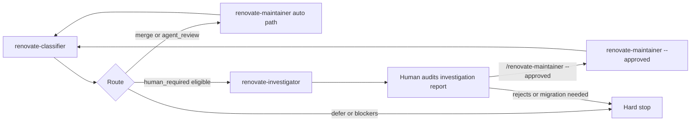

Open Renovate dependency PRs are handled through a **manual four-step ladder**: classify **one** Renovate PR per `/renovate-classifier` run (FIFO over the **active** non-draft queue), investigate when the packet is investigation-eligible (`high_touch_tooling` or `unlisted_package` with only overridable classifier stops; investigation-approved execution remains restricted to dependency-only allowed paths), human-audit the investigation report and run `/renovate-maintainer --approved` when ready, then re-run classify for the next item. Low-risk packets skip investigation and go straight to the maintainer auto path. **Draft Renovate PRs are skipped** by the classifier (and therefore by `/renovate-loop`) until marked ready for review.

**Portable implementation:** this repository owns the ladder (skills, agents, scripts, runbook). Consumer repositories retain `renovate.json`, `.github/workflows/renovate.yml`, and `.agents/renovate-policy.yml`. See [policy-setup.md](policy-setup.md).

**Renovate grouping vs ladder policy:** `renovate.json` may batch updates that share topology (for example GitHub Actions digest pins). `.agents/renovate-policy.yml` defines review risk classes. The classifier evaluates package facts from each PR — it does not treat Renovate `groupName` as a risk label.

**Deployment modes** (configured in consumer `.agents/renovate-policy.yml` → `repo.renovate_branch_prefix` and workflow):

| Mode         | Typical setup                                                                                                               |
| ------------ | --------------------------------------------------------------------------------------------------------------------------- |
| `pat_branch` | Self-hosted Renovate via GitHub Actions + PAT; PRs use `renovate/` branch prefix; authored by PAT owner, not `app/renovate` |
| `github_app` | Hosted Renovate / GitHub App; author is typically `app/renovate`; head branch may differ                                    |

Scheduled runs, webhooks, and other automation are **out of scope** for this product — use the manual path below.

---

## Overview

**Classifier** ([`renovate-classifier`](../skills/renovate-classifier/SKILL.md)) discovers open Renovate PRs, builds an **active** (non-draft) queue, and analyzes **one** PR per run (FIFO lowest active number, or explicit PR number in the active set). Draft Renovate PRs are reported in discovery reconciliation but are not selectable. Before expensive analysis it checks base-branch freshness and runs `gh pr update-branch` when the PR is `BEHIND`. It emits one recommendation plus one YAML **execution packet** with structured `stop_causes` when `stop: true`. It never merges, approves, comments, or closes PRs (except the bounded `gh pr update-branch` write when `BEHIND`).

**Investigator** ([`renovate-investigator`](../skills/renovate-investigator/SKILL.md) / [`.agents/renovate-investigator.md`](../.agents/renovate-investigator.md)) gathers four-step evidence for investigation-eligible packets (`high_touch_tooling` or `unlisted_package`, `stop: true`, overridable `stop_causes` only). It writes a gitignored investigation report and may emit a declarative execution overlay when verdict is `ready_for_human_merge`. Investigation-approved execution remains restricted to dependency-only `allowed_paths`. It has **no merge authority** and never passes `--approved`.

**Maintainer agent** ([`.agents/renovate-maintainer.md`](../.agents/renovate-maintainer.md)) consumes one packet on the **auto path** (`stop: false`) and may merge when policy and CI allow. On the **investigation-approved path**, invoke with **`--approved`** plus the investigator overlay after human audit — packet `merge_authority: denied` stays immutable; effective authority is derived at execute time.

---

Related portfolio case: [Renovate governance ladder](/portfolio/renovate-governance-case.md).
