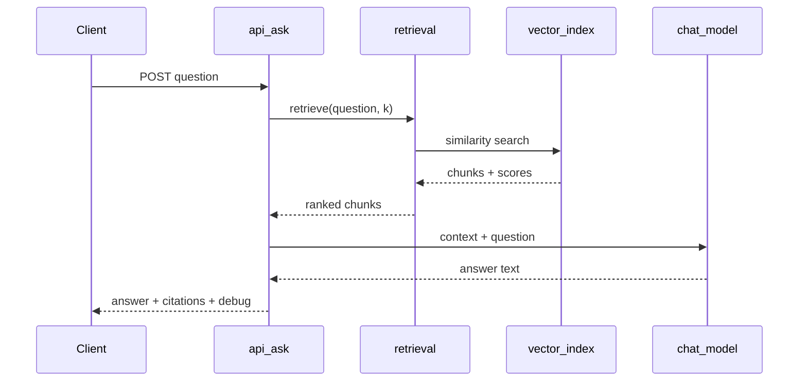

# Portfolio assistant architecture

> **Status:** architecture documentation (2026-10-06). Describes the intended grounded-RAG assistant for [michaeltruong.ai](https://michaeltruong.ai). No assistant code ships with this document.
>
> **Related:** [Architecture overview](./overview.md) · [PRODUCT.md](../../PRODUCT.md)

## Purpose

This document is the **durable architecture record** for a future conversational assistant on the portfolio landing page. It defines product intent, corpus boundaries, retrieval/generation shape, citation contracts, observability expectations, and boundaries that future implementation plans must preserve.

It is **not** an implementation plan. Delivery happens through separate, smaller Cursor plans — see [Implementation roadmap](#implementation-roadmap).

---

## Product intent

The assistant lets visitors ask questions about Michael Truong's published work, experience, projects, and writing. Answers should be grounded in the same evidence the browsable site already presents.

**The assistant is another view over the portfolio knowledge system.** The site is not designed around the chatbot:

- Existing routes (`/`, `/about`, `/projects`, `/articles`, `/ecosystem`) remain independently useful.
- Navigation, case studies, articles, and the ecosystem map are not subordinated to chat.
- The landing-page assistant (when built) is **additive** — prominent, but not a replacement for structured browsing.

**Evidence constraint:** The assistant may only draw on deliberately published portfolio material in `content/`. It must not invent employers, metrics, shipped features, or claims absent from that corpus — consistent with [PRODUCT.md](../../PRODUCT.md).

**Learning posture:** The first working system is partly an experiment. We want to observe real retrieval and generation behaviour before committing to refusal policies, hybrid retrieval, or persistent vector infrastructure.

---

## Position in the system

```text
┌─────────────────────────────────────────────────────────────┐
│  Browsable portfolio (primary)                              │
│  app/ pages → PortfolioRepository → content/ modules        │
└─────────────────────────────────────────────────────────────┘
                              │
                              │ same canonical content
                              ▼
┌─────────────────────────────────────────────────────────────┐
│  Assistant (read projection)                                │
│  corpus builder → chunks + metadata → retrieval → LLM       │
└─────────────────────────────────────────────────────────────┘
```

| Layer                 | Role today                             | Assistant relationship                                                      |
| --------------------- | -------------------------------------- | --------------------------------------------------------------------------- |
| `content/`            | Source of truth for published copy     | **Input** to corpus projection                                              |
| `domain/`             | Presentation model types               | Shapes chunk boundaries and metadata                                        |
| `PortfolioRepository` | Storage-agnostic data access for pages | **Corpus builder reads through repository**; repository interface unchanged |
| `app/` routes         | Server-rendered pages                  | Unchanged; assistant adds a separate API + UI surface later                 |
| PostHog               | Client analytics                       | Orthogonal; optional assistant events later                                 |

**Invariant:** `PortfolioRepository` and page components do not depend on LangChain, embeddings, or vector stores. The assistant imports the repository (or a corpus layer that uses it), not the reverse.

---

## Bounded-corpus RAG architecture (intended v1)

We intend to explore a deliberately small retrieval-augmented generation (RAG) pipeline:

```text
Portfolio content (content/ via PortfolioRepository)
      ↓
knowledge documents (logical sources with metadata)
      ↓
chunking (real boundaries — not one monolithic document)
      ↓
embeddings (OpenAI)
      ↓
vector retrieval (in-memory store, e.g. LangChain MemoryVectorStore)
      ↓
retrieved context + source metadata
      ↓
LLM (OpenAI chat model)
      ↓
answer + visible citations (from metadata, not model-invented URLs)
```

### Intended v1 stack (exploratory)

| Component     | Intended choice                                 | Notes                                                 |
| ------------- | ----------------------------------------------- | ----------------------------------------------------- |
| Runtime       | Next.js App Router, TypeScript                  | Matches existing site                                 |
| Orchestration | LangChain JS                                    | Prior art studied; not mandatory forever              |
| Embeddings    | OpenAI (`text-embedding-3-small` or equivalent) | Cost-effective for learning                           |
| Vector store  | In-memory (`MemoryVectorStore`)                 | Sufficient for bounded corpus; no persistent DB in v1 |
| Chat model    | OpenAI (`gpt-4o-mini` or equivalent)            | Easy to swap after observation                        |
| Corpus        | Projected from `content/`                       | No parallel `profile.json` blob                       |
| API           | `POST /api/ask` (future)                        | First server route with `OPENAI_API_KEY`              |
| Grounding     | Lightweight prompt only                         | No strict refusal gates in v1                         |

### Index lifecycle (v1 hypothesis)

Build the vector index from the projected corpus on first use (module-scoped singleton in a warm server process). Accept serverless cold-start rebuild as an experimental cost. Persistent storage is a later decision driven by observed behaviour, not upfront design.

---

## Reference implementation: `nyaomaru/nyaomaru-portfolio`

Source: [github.com/nyaomaru/nyaomaru-portfolio](https://github.com/nyaomaru/nyaomaru-portfolio)

Relevant files:

| File                                                       | Role                                                        |
| ---------------------------------------------------------- | ----------------------------------------------------------- |
| `features/terminal/server/make-profile-qa-chain.server.ts` | Load documents → retrieve → merge context → invoke chain    |
| `features/terminal/server/profile-qa.ts`                   | `ChatPromptTemplate` with strict context-only system prompt |
| `public/profile.json`                                      | Flat Q&A-oriented profile blob                              |
| `app/routes/api.ask.ts`                                    | `POST { question }` handler                                 |

### Ideas we are borrowing

1. **LangChain composition** — `OpenAIEmbeddings`, `MemoryVectorStore`, `ChatOpenAI`, `ChatPromptTemplate`; retrieval orchestrated outside a single `RunnableSequence`.
2. **Hybrid retrieval concept** — semantic search plus lightweight keyword routing for explicit field questions (`who`, `where`, etc.). Worth studying; **not committed for v1** (semantic-only first).
3. **Server-only API key** — OpenAI credentials never exposed to the client.
4. **Grounding prompt** — instruct the model to answer from supplied context; sufficient for initial exploration without elaborate refusal machinery.

### Patterns we are not copying

| Reference pattern                                          | Our direction                                                                  |
| ---------------------------------------------------------- | ------------------------------------------------------------------------------ |
| Entire `profile.json` as one embedded document             | Real chunk boundaries per content unit (block, role entry, article, entity)    |
| Rebuild `MemoryVectorStore` every request with one doc     | Project many chunks from `content/`; cache index for process lifetime          |
| Keyword map over JSON key substrings                       | Defer to later tuning; v1 focuses on semantic retrieval over structured chunks |
| Remix route + LangChain `kwargs.content` response envelope | Next.js `app/api/ask/route.ts` with `{ answer, citations, debug? }`            |
| Parallel content store (`profile.json`)                    | Single truth in `content/` via `PortfolioRepository`                           |
| No citations or retrieval observability                    | Citations from chunk metadata; dev inspect payload                             |

We do **not** copy its Remix/UI architecture. The portfolio remains Next.js with its established layout and components.

---

## Initial corpus sources

Only **deliberately published visitor-facing** material from `content/`. Exclude agent docs (`PRODUCT.md`, `DESIGN.md`, `.cursor/`), private sibling-repo references, and empty inventories.

### Tier 1 — intended for first corpus

| Module                            | Chunk unit (conceptual)                                    | Canonical URL                                |
| --------------------------------- | ---------------------------------------------------------- | -------------------------------------------- |
| `content/profile.ts`              | Identity, bio, skill clusters                              | `/about`                                     |
| `content/about.ts`                | Per experience entry; skills; education                    | `/about`                                     |
| `content/homepage.ts`             | Hero/thesis; channels; method dimensions; continuity       | `/`                                          |
| `content/projects-index.ts`       | Index intro; tier rows                                     | `/projects`                                  |
| `content/project-cases.ts`        | Per `CaseBlock`; case header/aside                         | `/projects/{slug}`                           |
| `content/supporting-cases.ts`     | Per prose/architecture block                               | `/projects/{slug}`                           |
| `content/codenames-experience.ts` | Per scroll beat / section                                  | `/projects/codenames-ai`                     |
| `content/articles.ts`             | Per article (title, summary, tags, line, argument if lead) | `/articles` (+ external DEV URL in metadata) |
| `content/article-lines.ts`        | Per reasoning-line definition                              | `/articles`                                  |
| `content/ecosystem.ts`            | Per `Entity` (name, kind, summary)                         | `/ecosystem`                                 |

Canonical on-site URLs should be built with [`lib/site.ts`](../../lib/site.ts) `getSiteUrl()`.

### Tier 2 — candidate for corpus tuning (later)

| Module                                         | Reason to defer                                     |
| ---------------------------------------------- | --------------------------------------------------- |
| `content/timeline.ts`                          | Overlaps about/homepage                             |
| `content/production-line.ts`                   | Operational metaphor; lower Q&A signal              |
| `content/project-workflows.ts`, workflow views | Diagram labels; noisy without careful serialization |
| `content/projects.ts`                          | Generic inventory currently empty                   |
| Full relationship graph                        | May duplicate entity summaries                      |

### Explicit exclusions from embeddable text

- `CaseFigure.source` / inventory `factId` — internal review aids; never rendered or cited.
- Agent standards, planning artifacts, dev-only tooling docs.

---

## Document, chunk, and source metadata model

### Knowledge document (logical source)

A **knowledge document** is one publishable unit before splitting:

```typescript
interface KnowledgeDocument {
  sourceId: string; // stable, e.g. "project-case:experiment-measurement:b01"
  sourceType: KnowledgeSourceType;
  title: string; // human label
  canonicalUrl: string; // absolute on-site URL
  section?: string; // navLabel, block category, article line, entity kind
  text: string; // plain text serialized for embedding
}
```

`KnowledgeSourceType` examples: `profile`, `about`, `homepage`, `project-case`, `supporting-case`, `codenames-experience`, `article`, `article-line`, `ecosystem-entity`, `projects-index`.

### Knowledge chunk (retrievable unit)

A **chunk** is what gets embedded and retrieved. For v1, **one chunk per document** unless text exceeds roughly 800–1200 tokens; then split on paragraph boundaries within the same `sourceId` using `chunkIndex`.

```typescript
interface KnowledgeChunk {
  chunkId: string; // `${sourceId}#${chunkIndex}`
  text: string;
  metadata: {
    sourceId: string;
    sourceType: KnowledgeSourceType;
    title: string;
    canonicalUrl: string;
    section?: string;
    chunkIndex: number;
  };
}
```

LangChain `Document` mapping: `pageContent` = `text`; `metadata` = chunk metadata (JSON-serializable).

### Serialization rules

- Flatten `RichText` and string arrays to plain text with sensible newlines.
- Include structural labels in embeddable text (e.g. category, role title) to improve retrieval signal.
- Figures: embed `value`, `name`, `scope` only — omit inventory provenance objects.

### Citation (API-facing)

Citations are **derived from retrieved chunks**, never invented by the model:

```typescript
interface AssistantCitation {
  sourceId: string;
  title: string;
  url: string; // from chunk metadata canonicalUrl
  section?: string;
  excerpt?: string; // truncated retrieved chunk text
}
```

Articles may carry external DEV URLs in metadata for optional display alongside on-site `/articles`.

---

## End-to-end retrieval and generation flow

```text
Visitor question
      │
      ▼
POST /api/ask  (future)
      │ validate body
      ▼
Retrieve top-k chunks (embedding similarity)
      │
      ▼
Assemble context string from chunk texts
      │
      ▼
LLM with grounding prompt + context + question
      │
      ▼
Response: { answer, citations[], debug? }
```



**Intended API contract (future):**

- Request: `{ "question": string }`
- Response: `{ "answer": string, "citations": AssistantCitation[], "debug"?: {...} }`
- `debug` when `NODE_ENV === 'development'` or `ASSISTANT_DEBUG=true`

**Default retriever k:** 4–6 (tunable constant; exact value is experimental).

---

## Architectural properties: citations and observability

These are **first-class requirements**, not optional polish.

### Visible source citations

- Every answer should be able to surface **structured citations** linked to portfolio sources.
- Citation `url` and `title` come from **retrieved chunk metadata**, not from free-form model output.
- UI (future) renders citations as links back into the portfolio.

### Retrieval observability

Development and tuning require inspecting the full pipeline:

| Field         | Purpose                               |
| ------------- | ------------------------------------- |
| `question`    | Input verbatim                        |
| `retrieved[]` | `chunkId`, similarity score, metadata |
| `answer`      | Model output                          |
| `citations[]` | Mapped from retrieved chunks          |

Expose via `debug` in API responses and/or a dev-only inspect command (e.g. `npm run assistant:retrieve`). CI should not require live OpenAI keys; tests use mocks or fixtures.

---

## Decisions, deferrals, and hypotheses

### Decisions we are making now

| Decision                                                           | Rationale                                                             |
| ------------------------------------------------------------------ | --------------------------------------------------------------------- |
| Assistant as read projection over `content/`                       | Preserves single source of truth; no parallel profile blob            |
| Real chunk boundaries with metadata                                | Enables citations and meaningful retrieval (unlike one mega-document) |
| Bounded published corpus only                                      | Matches evidence discipline in PRODUCT.md                             |
| v1: semantic retrieval + in-memory vectors + LangChain JS + OpenAI | Smallest end-to-end system to learn from                              |
| Prompt-only grounding for v1                                       | Observe behaviour before building refusal machinery                   |
| Citations and observability from day one                           | First milestone is partly a learning exercise                         |
| Repository boundary preserved                                      | Pages unchanged; assistant is a leaf capability                       |

### Deliberately deferred

Do **not** build these in the first exploration:

- Strict unsupported-claim rejection, confidence thresholds, mandatory refusals
- Elaborate biographical inference filters
- Structured query classification / routing
- Hybrid structured + semantic retrieval (beyond optional later keyword pass)
- Persistent vector databases (pgvector, Pinecone, Qdrant, etc.)
- Reranking, query rewriting, conversational memory
- Agents / tool calling
- Streaming (unless it falls out naturally)
- RAG evaluation frameworks
- Production-grade hallucination controls beyond a light grounding prompt
- Rate limiting and abuse protection (required before wide public exposure, but not v1 architecture)

### Hypotheses to validate experimentally

Do not decide these upfront — measure after a working vertical slice:

1. **Chunk granularity** — per `CaseBlock` vs splitting long bodies.
2. **Optimal k** — trade-off between recall and token cost.
3. **Corpus noise** — whether ecosystem entities and article-line taxonomy help or dilute.
4. **Article citation URLs** — on-site `/articles` vs external DEV links in citations.
5. **Index lifecycle on Vercel** — cold-start latency; whether in-process cache suffices.
6. **Cost per query** — embedding + retrieval + generation at expected traffic.
7. **Failure modes** — hallucination patterns, empty retrieval, cross-project confusion — informs future grounding policy.
8. **Whether hybrid keyword retrieval** (inspired by nyaomaru) improves explicit factual questions.

---

## Evolutionary direction (non-committal)

Likely progression based on observed behaviour — **not a committed roadmap**:

```text
Explore: basic RAG
         + real chunks, metadata, citations, observability
              ↓ learn from usage
Tune:    retrieval/chunking, corpus expansion, diagnostics
              ↓ identify failure modes
Mature:  optional hybrid retrieval, persistent vectors, reranking,
         grounding/refusal policies, evaluation, cost optimisation
```

We may adopt pgvector, hybrid retrieval, reranking, or strict grounding **only if** usage and failure analysis justify them. This document does not prescribe those technologies.

---

## Architectural boundaries for future plans

Future implementation plans **must preserve**:

1. **`PortfolioRepository` as canonical content access** — corpus builders read through it; do not fork facts into a parallel JSON store.
2. **Additive UX** — assistant does not replace or block existing navigation and page content.
3. **Citation provenance** — URLs and titles in responses trace to chunk metadata, not model invention.
4. **Separation of concerns** — `domain/` types for assistant models; corpus/retrieval/LLM in `lib/assistant/` (or equivalent); API in `app/api/`; UI in `components/assistant/` (future).
5. **No inventory provenance in embeddable text** — `CaseFigure.source` stays internal.
6. **Merge-safe slices** — each plan PR is independently shippable per [planning standards](../../.cursor/standards/planning-standards.md).
7. **Observe before gating** — do not add refusal/confidence infrastructure until retrieval behaviour is understood.
8. **Testability without live OpenAI in CI** — mock embeddings/LLM in automated tests.

Future plans **may** introduce: API routes, LangChain dependencies, `OPENAI_API_KEY`, landing-page UI, PostHog assistant events — each in scoped slices that reference this document.

---

## Implementation roadmap

The following are **roadmap boundaries**, not implementation plans. Each should later receive its own Cursor planning and review cycle.

| Phase                                       | Scope (future plan)                                                                               | Outcome                                              |
| ------------------------------------------- | ------------------------------------------------------------------------------------------------- | ---------------------------------------------------- |
| **1. Corpus / document model**              | Types, corpus projector from `PortfolioRepository`, chunk boundaries, metadata, unit tests        | Deterministic, testable knowledge chunks without LLM |
| **2. First end-to-end RAG vertical slice**  | Embeddings, in-memory index, retrieval, `POST /api/ask`, grounding prompt                         | Curl-able assistant; learn pipeline behaviour        |
| **3. Citations and retrieval diagnostics**  | Structured citation mapping, `debug` payload, dev inspect script                                  | Observable retrieval for tuning                      |
| **4. Landing-page assistant experience**    | Homepage input, suggested questions, citation links; additive to existing layout                  | Visitor-facing assistant without site redesign       |
| **5. Retrieval and grounding improvements** | Driven by observed failure modes — chunk tuning, optional hybrid retrieval, policies, persistence | Only after phases 1–4 inform what is needed          |

Phases may split further (e.g. API before diagnostics) as plans are authored. This document remains the stable reference; individual `.cursor/plans/*.plan.md` files are ephemeral execution handoffs.

---

## Open architectural questions

Questions discovered from the current repository that plans should address when implementing:

1. **Where assistant code lives** — `lib/assistant/` is the likely convention (matches existing `lib/` helpers); confirm in first implementation plan.
2. **First backend secret** — `OPENAI_API_KEY` breaks the static-no-secrets MVP for the ask route; document in `.env.example` and deployment notes.
3. **E2E strategy** — extend Playwright happy-path with mocked API vs opt-in live-key smoke tests.
4. **Article corpus depth** — summaries only vs including line-lead `argument` text; tier-1 includes both where present.
5. **Codenames experience chunking** — scroll beats vs consolidated case narrative; affects retrieval for product questions.
6. **Cross-link with Supabase milestone** — repository migration (architecture overview milestone 4) is independent; assistant corpus builder should remain adapter-agnostic.

---

## Changelog

| Date       | Change                             |
| ---------- | ---------------------------------- |
| 2026-10-06 | Initial architecture documentation |
