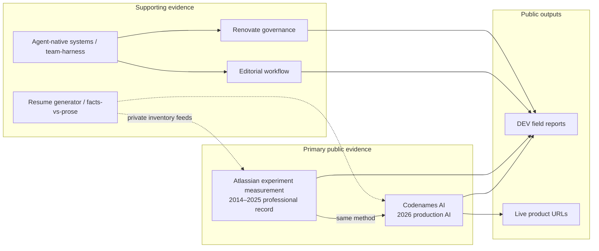

# Content & evidence migration — supporting audit

**Authority:** Executable slices shipped — plan archived at [`.cursor/plans/archive/2026-09-11-content-evidence-migration.plan.md`](../.cursor/plans/archive/2026-09-11-content-evidence-migration.plan.md). This file is the **supporting audit / migration map** and Claude Design handoff for deferred page redesigns (§3–§5).

**Audit date:** 2026-09-11  
**Prerequisite audits:** [`docs/redesign-baseline.md`](redesign-baseline.md) (merged [#42](https://github.com/mastermichaelt/portfolio/pull/42)); Instrument 1b visual direction (merged [#47](https://github.com/mastermichaelt/portfolio/pull/47)).

## Purpose

This document is a **migration map** from the pre-redesign portfolio content model (“recent AI side projects + field reports”) to an **evidence architecture** that presents an experienced senior software engineer whose recent AI work extends a longer-running practice around measurement, verification, experimentation, reliability, explicit contracts, and making uncertain systems dependable.

**Thesis preserved from Instrument 1b:** _Making uncertain systems dependable._

**Out of scope for this pass:** visual redesign, `/projects` or `/projects/[slug]` IA, `/articles`, `/about`, `/ecosystem` layout, route renames, canonical domain, full Atlassian case-study page.

---

## Sources consulted

| Source                                                                                                                                             | Role in this audit                                                                                                                                                                         |
| -------------------------------------------------------------------------------------------------------------------------------------------------- | ------------------------------------------------------------------------------------------------------------------------------------------------------------------------------------------ |
| [`docs/redesign-baseline.md`](redesign-baseline.md)                                                                                                | Primary evidence index; quantitative facts with inventory paths and fact IDs (re-read 2026-09-11)                                                                                          |
| [`content/*`](..), [`content/homepage.ts`](../content/homepage.ts)                                                                                 | Current committed portfolio content                                                                                                                                                        |
| [`DESIGN.md`](../DESIGN.md), [`.cursor/plans/archive/2026-09-11-instrument-1b.plan.md`](../.cursor/plans/archive/2026-09-11-instrument-1b.plan.md) | Presentation constraints (thesis, figure/scope pairs, no fifth project for CH 02)                                                                                                          |
| `mastermichaelt/resumes` (private)                                                                                                                 | Canonical evidence for fact IDs and metric qualifiers. Re-read live `resumes/facts/*.yml` before publishing copy. Projects handoff below re-verified from sibling checkout **2026-09-11**. |
| DEV.to profile + API                                                                                                                               | External positioning surface (tagline, pin set, 15-post corpus) — baseline §2                                                                                                              |

---

## Audit summary (old content → gaps)

Comparison of **current on-site content** against baseline evidence and positioning intent.

### 1. Stale positioning / language from the previous portfolio

| Location                                                       | Issue                                                                                                                                                                                                          | Provenance                                |
| -------------------------------------------------------------- | -------------------------------------------------------------------------------------------------------------------------------------------------------------------------------------------------------------- | ----------------------------------------- |
| Site-wide metadata                                             | Title suffix **“AI engineering systems”** and descriptions lead with “production AI systems, editorial workflows” — reads as AI-product-operator first, not continuity of experimentation/measurement practice | `app/layout.tsx`, `app/page.tsx` metadata |
| [`content/profile.ts`](../content/profile.ts) `bio`            | Ends on “Building production AI systems and publishing… on DEV” — thin Atlassian clause, no measurement/verification through-line                                                                              | vs homepage hero in `content/homepage.ts` |
| [`content/projects.ts`](../content/projects.ts) header comment | Still describes section kinds “after evidence audit” from pre-1b inventory; four projects are all 2026-era independent work                                                                                    | On portfolio                              |
| [`content/articles.ts`](../content/articles.ts) header comment | Points at empty `codenames-ai-guesser/docs/dev.to/published/`; live corpus is `editorial-workflow/docs/dev.to/published/` (15 files)                                                                           | Baseline §2, §6                           |
| DEV.to profile (external)                                      | Tagline: “documenting my **AI retraining journey**…” — conflicts with portfolio continuity framing                                                                                                             | Baseline §2 `DEV.to public profile`       |
| [`PRODUCT.md`](../PRODUCT.md) success criterion                | “production AI products, experimentation discipline, agent harness work” — experimentation is third in a list that reads AI-first                                                                              | On portfolio                              |

### 2. Strong baseline/resume evidence absent or materially underrepresented

| Evidence cluster                         | In inventory (fact / role)                                                                                                                                                                                                                                                                          | On portfolio today                                                                                                             |
| ---------------------------------------- | --------------------------------------------------------------------------------------------------------------------------------------------------------------------------------------------------------------------------------------------------------------------------------------------------- | ------------------------------------------------------------------------------------------------------------------------------ |
| **Experiment measurement & attribution** | `cross-flow-experiment-measurement.yml` `attribution-uplift`; `statsig-reliability.yml` `attribution-window-variance`; `loom-event-pipeline.yml` `data-recovered`, `paid-user-events-preserved`, `experiments-unblocked`; `admin-hub-experimentation.yml` `d1d6ai-increase`, `zero-incident-launch` | Homepage CH 02 panel + 2 figures only; **no** `/projects` case study, ecosystem entity, or About depth                         |
| **Loom acquisition / Post Office ML**    | `loom-acquisition.yml` `okr-10x` (`10x` OKR); `post-office-ml-surfaces.yml` `switcher-impressions` (`2.5 million`), D1D6AI uplifts `77%`/`62%`, `switcher-userid-signup-share` `40%`                                                                                                                | Ledger row mentions “10×” (`loom-acquisition` / `okr-attainment`); other metrics **absent**                                    |
| **AIM program scale**                    | `aim-participation-scale.yml` `matched-count` `3552`, `workforce-share` `~20%`; `aim-sentiment-atlas.yml` `sentiment-score` `86%`, `atlas-projects` `>60000`; `aim-pairing-ops.yml` mentor counts; `aim-cohort-launch.yml` `17` cohorts, `30+` stakeholders                                         | Ledger row (3,552 / ~20%) only; sentiment/Atlas metrics **absent**                                                             |
| **EM delivery**                          | `em-growth-delivery.yml` `direct-reports` `8–10`, `fy22-projects-shipped` `12`, `trust-score-card` `100%`                                                                                                                                                                                           | Ledger row (8–10) only                                                                                                         |
| **Codenames production depth**           | `codenames-ai-telemetry.yml`; `codenames-ai-e2e.yml` `canonical-concept-count` `350`; product docs (JUDGE flow, `ai_pipeline_outcome`, analytics workflow)                                                                                                                                          | Homepage figures (2); case study refuses hard KPIs in outcomes (intentional); **350 concepts**, pipeline vocabulary **absent** |
| **Agent-native engineering systems**     | `ai-engineering-workflows.yml` (`team-harness-plugin`, `cloud-hooks-primitive`, `hook-stack-model`); `cursor-team-marketplace` plugin                                                                                                                                                               | Homepage supporting row → `/ecosystem`; **no** dedicated project or fact-backed copy                                           |
| **Savepoints**                           | `savepoints-durable-capture.yml`; `savepoints/notes/architecture-direction.md` (prototype scope)                                                                                                                                                                                                    | **Invisible** — correctly deferred as non-shipped product                                                                      |
| **Writing scale / credibility**          | `writing-field-reports.yml` `published-report-count` `14`, `dev-followers` `2200+`, `trusted-member`; hub/API **15** posts                                                                                                                                                                          | Trusted Member on `/articles` only; follower count **absent**; 6 hub posts **missing** from `articles.ts`                      |
| **Career timeline**                      | `resumes/roles/*.yml` (7 roles, 2014–present)                                                                                                                                                                                                                                                       | Homepage ledger (7 rows); `content/timeline.ts` **empty**; no `/timeline` route                                                |

### 3. Content overweighting recent independent/AI projects vs 2014–2025 record

| Signal                             | Detail                                                                                                                                                                           |
| ---------------------------------- | -------------------------------------------------------------------------------------------------------------------------------------------------------------------------------- |
| `/projects` inventory              | **Four** case studies — all independent/agent-workflow systems (2026). **Zero** Atlassian professional work as a project slug                                                    |
| `/projects` page copy              | “Four case studies… product, editorial workflow, knowledge architecture, dependency governance” — no employer-scale experimentation narrative                                    | `app/projects/page.tsx`                               |
| `featured` flags                   | `codenames-ai` + `editorial-workflow` still `featured: true` in `content/projects.ts` while homepage demoted editorial to **Supporting work**                                    | Intentional 1b tension; confuses “flagship” semantics |
| Ecosystem (`content/ecosystem.ts`) | 24 entities — **all** map to the four 2026 projects; no Atlassian/Loom/AIM nodes                                                                                                 |
| Article `featured` (3)             | All `year: 2026`, all AI/agent tags — pairs with flagship **projects**, not professional record                                                                                  | `content/articles.ts`                                 |
| Homepage ledger                    | Professional rows exist, but **first row** is “Independent AI product engineer (2026—)” marked `current` — risk of “career restart” reading unless lead copy stresses continuity |

### 4. Residual “AI retraining” narrative vs engineering continuity

| Surface                           | Retraining / pivot read                           | Continuity read (target)                                                                |
| --------------------------------- | ------------------------------------------------- | --------------------------------------------------------------------------------------- |
| DEV tagline                       | “AI retraining journey”                           | External — portfolio cannot fix in-repo; flag for human sync                            |
| Metadata “AI engineering systems” | Product-engineer niche                            | Should subordinate AI to **verification discipline** across eras                        |
| `profile.bio`                     | “Building production AI systems…” as closing beat | Should mirror homepage: Atlassian measurement tenure **then** current AI as same method |
| Four project case studies         | Read as “what I do now” portfolio                 | Need Projects redesign to anchor **Atlassian + Codenames** as co-primary evidence       |
| Empty `timeline.ts`               | Implies career history deferred                   | Ledger partially compensates on home only                                               |

### 5. Duplicated or inconsistent claims

| A                                                | B                                                                        | Conflict                                                |
| ------------------------------------------------ | ------------------------------------------------------------------------ | ------------------------------------------------------- |
| `content/homepage.ts` `hero.lead`                | `content/profile.ts` `bio`                                               | Different framing, emphasis, and length                 |
| `content/homepage.ts` `writing[]` (3 slugs)      | `content/articles.ts` `featured: true` (same 3 slugs — H3 Homepage wins) | Unified in `content-writing-curation`                   |
| Homepage supporting                              | `projects.featured`                                                      | Editorial demoted vs still flagship on `/projects`      |
| Homepage CH 02 `dateRange` `2020 – 2025`         | Role files: SSE 2024–2025, EM 2020–2024, cross-flow facts span SWE+EM    | Acceptable compression — document in human review       |
| Ledger SSE 2019 detail “Informed Pull Requests…” | **Verified** — `growth-engineering-craft.yml` · `informed-pull-requests` | Safe for About optional Growth-craft beat (H6 resolved) |
| `articles.ts` count **9**                        | Hub + DEV API **15**; inventory metrics **14**                           | Three-way canonical tension — do not collapse           |

### 6. Stale project / article selections or prominence

| Item                                                                                                                                   | Recommendation bucket                                                         |
| -------------------------------------------------------------------------------------------------------------------------------------- | ----------------------------------------------------------------------------- |
| 6 missing DEV posts (persist-game-state, agent-portability, experiment-retirement, build-vs-buy, requirements-qa, skills-capabilities) | Add to inventory slice or curated omit — see §5 Articles                      |
| Inferred DEV **pin set** (5 titles) overlaps **zero** with old `featured` articles; partial overlap with new homepage `writing`        | Curation rule needed                                                          |
| `cloud-agent-felt-like-hiring`                                                                                                         | Only article without `relatedProjectSlug` — orphan for Projects cross-link    |
| Resume-generator                                                                                                                       | On `/projects` but not homepage supporting (by design in 1b) — tier ambiguity |

### 7. Claims with insufficient provenance for publication

| Claim                                                     | Location                           | Issue                                                                                                                                                                                                                                                                                          | Action                                                                                          |
| --------------------------------------------------------- | ---------------------------------- | ---------------------------------------------------------------------------------------------------------------------------------------------------------------------------------------------------------------------------------------------------------------------------------------------- | ----------------------------------------------------------------------------------------------- |
| **`175+` monthly active players**                         | `content/homepage.ts` CH 01 figure | **Resolved #52:** site publishes **`175+`** durable floor per live `codenames-ai-telemetry.yml` · `telemetry-model-experiments`; rolling snapshot **`175`** (`monthly-active-players`) — never paste exact count ([#50](https://github.com/mastermichaelt/portfolio/pull/50) interim **150+**) | **Shipped** — homepage **`175+`**; Projects/About redesign align with on-site copy at ship time |
| **`#1` branded search**                                   | Homepage figure                    | Sourced to `branded-search-position` `~1` — OK if scope line kept                                                                                                                                                                                                                              | Safe with qualifier                                                                             |
| **`>10%`, `9%–41%`**                                      | Homepage CH 02                     | Match baseline fact IDs                                                                                                                                                                                                                                                                        | Safe with scope lines                                                                           |
| **Ledger “Informed Pull Requests”**                       | `homepage.ledger` SSE 2019 row     | Not in baseline quantitative table                                                                                                                                                                                                                                                             | Verify fact module before About/Projects reuse                                                  |
| **“Agent-native engineering systems”** supporting summary | Homepage                           | Composite claim across team-harness + MCP integrations — no single fact ID                                                                                                                                                                                                                     | Tie to `ai-engineering-workflows.yml` facts in copy edit or soften                              |

---

## Content problems vs page-design problems

| Content problem (this plan)                                     | Page-design problem (defer to Claude Design)                               |
| --------------------------------------------------------------- | -------------------------------------------------------------------------- |
| Wrong/missing copy, tiers, inventory rows, metadata, provenance | Projects grid layout, case-study TOC, tier badges                          |
| Article corpus sync, `featured` vs homepage `writing` rules     | Articles index layout, series framing, in-site vs outbound                 |
| Profile/bio alignment, skill clusters, timeline facts           | About page structure, contact/identity split                               |
| Atlassian evidence not in `content/projects.ts`                 | Full `/projects/experiment-measurement` (or `/work/…`) case-study template |
| Ecosystem entity gaps (no Atlassian)                            | Entity inventory vs canvases-only IA                                       |
| `timeline.ts` stub population                                   | Whether `/timeline` route exists                                           |

---

## Migration map (target evidence architecture)

**Tier intent (content model, not yet enforced in schema):**

| Tier                      | Systems                                                                   | Public surfaces                                                   |
| ------------------------- | ------------------------------------------------------------------------- | ----------------------------------------------------------------- |
| **First-class**           | Atlassian experiment measurement; Codenames AI                            | Homepage CH 01/02; future Projects redesign hero                  |
| **Supporting**            | Editorial workflow; Renovate governance; agent-native engineering systems | Homepage supporting; `/projects`; ecosystem                       |
| **Infrastructure / meta** | Resume generator (facts-vs-prose)                                         | `/projects` only; mention in About as method, not career headline |
| **Deferred / prototype**  | Savepoints                                                                | Do not promote until product boundary ships                       |

---

## Deliverable buckets

Implementation slices **shipped** — see archived plan [# Shipped](../.cursor/plans/archive/2026-09-11-content-evidence-migration.plan.md#shipped). Buckets below are audit findings and Claude Design handoff prep — not an active execution control surface.

### 1. Content updates safe to land now (no page redesign)

Small, merge-safe slices — copy/module/metadata only; existing pages consume data as-is.

| Slice ID                    | Change                                                                                                                                                                                                                                                          | Files                                                     | Evidence / notes                                                                                                               |
| --------------------------- | --------------------------------------------------------------------------------------------------------------------------------------------------------------------------------------------------------------------------------------------------------------- | --------------------------------------------------------- | ------------------------------------------------------------------------------------------------------------------------------ |
| **S1-metadata**             | Replace “AI engineering systems” default title/description with continuity framing (thesis-adjacent; Atlassian measurement + dependable-systems method; current AI as extension). Keep `Senior Software Engineer` headline fact from `resumes/meta/profile.yml` | `app/layout.tsx`, `app/page.tsx`, OG/Twitter if copy-only | `profile.yml`; baseline §3                                                                                                     |
| **S2-profile-bio**          | Rewrite `profile.bio` to align with homepage `hero.lead` + `leadEmphasis` without strengthening claims — subset or shared source                                                                                                                                | `content/profile.ts`                                      | `homepage.ts`; roles summary                                                                                                   |
| **S3-articles-comment**     | Fix stale corpus path comment; document canonical sync rule (hub `editorial-workflow/docs/dev.to/published/` master, portfolio = curated subset)                                                                                                                | `content/articles.ts` header                              | Baseline §2                                                                                                                    |
| **S4-articles-sync**        | Add 6 missing posts as non-featured rows **or** explicit “omitted from index” list in plan-only follow-up — titles/URLs from baseline table only                                                                                                                | `content/articles.ts`                                     | Baseline §2 hub file table                                                                                                     |
| ~~**S5-featured-flags**~~   | **Removed from safe-now** — `featured` belongs to incumbent `/projects` IA; homepage demotion is already in `content/homepage.ts` `supporting[]`. Tier/`featured` intent → `redesign-prep-projects` slice                                                       | —                                                         | [Runtime audit in plan](../.cursor/plans/archive/2026-09-11-content-evidence-migration.plan.md#runtime-audit-projectsfeatured) |
| ~~**S6-projects-comment**~~ | **Deferred with Projects redesign** — fold tier comments into Claude Design prep, not a standalone PR                                                                                                                                                           | —                                                         | `redesign-prep-projects`                                                                                                       |
| **S7-articles-trusted**     | Optional one-line Trusted Member in `profile` or home `list-note` — only if not crowding hero                                                                                                                                                                   | `content/profile.ts` or `content/homepage.ts`             | `writing-field-reports.yml` `trusted-member`                                                                                   |
| **S8-cross-links**          | Wire `relatedProjectSlug` on case-study pages from `articles[]` (data already exists; page currently ignores it) — **only if** template already supports an “Related writing” block without layout redesign                                                     | `app/projects/[slug]/page.tsx`                            | Baseline §1 “unused relatedProjectSlug” — **confirm** no IA change                                                             |

**Do not in safe-now slices:** new routes, Projects/About/Articles layout, ecosystem entity graph redesign, `tier` schema (defer to Projects slice).

---

### 2. Homepage content corrections / refinements

Preserve 1b structure (hero → two case panels → ledger → supporting + writing). No visual redesign.

| Item                             | Current                                                                        | Proposed direction                                                                                                                                                                                    | Source                                       |
| -------------------------------- | ------------------------------------------------------------------------------ | ----------------------------------------------------------------------------------------------------------------------------------------------------------------------------------------------------- | -------------------------------------------- |
| **Hero lead**                    | “Growth experimentation… 2014–2025. Independent AI… since 2026.”               | Keep dual-era structure; soften “since 2026” isolation — e.g. explicit “same practice” already in `leadEmphasis`; avoid “retraining”, “return to IC”, “pivot”                                         | User intent; `homepage.hero`                 |
| **CH 01 figure MAU**             | **`175+`** (merged [#52](https://github.com/mastermichaelt/portfolio/pull/52)) | H1 resolved: live inventory documents **175+** as durable floor (`telemetry-model-experiments`); homepage restored from interim **150+** ([#50](https://github.com/mastermichaelt/portfolio/pull/50)) | Shipped                                      |
| **CH 01 outcomes on case study** | Refuses hard KPIs                                                              | Optional **one** qualified figure on `/projects/codenames-ai` only if scope component exists in case-study template — else keep homepage-only                                                         | `DESIGN.md` figure/scope rules               |
| **CH 02 title/date**             | “Experiment measurement” `2020 – 2025`                                         | Acceptable; optional subtitle referencing Cross Flow / Growth Experiment Impact Estimation for searchability                                                                                          | `cross-flow-experiment-measurement.yml`      |
| **Ledger ordering**              | Independent 2026 first (`current: true`)                                       | Keep reverse-chron **but** ensure hero lead establishes continuity before ledger scan                                                                                                                 | Content copy                                 |
| **Ledger rows**                  | Missing Loom/Post Office/Admin Hub as separate rows                            | Do **not** add rows without redesign capacity — metrics belong in future Atlassian case study; ledger stays role-centric                                                                              | Baseline §2                                  |
| **Supporting work**              | Editorial third after Renovate + agent-native                                  | Confirm order reflects demotion (editorial last among three)                                                                                                                                          | Current `homepage.supporting`                |
| **Selected writing**             | 3 slugs (analytics, authority, reviewer)                                       | **H3 resolved (Homepage wins):** homepage `writing[]` is canonical; `articles.featured` matches those slugs                                                                                           | `content/homepage.ts`, `content/articles.ts` |
| **Unify writing curation**       | ~~`homepage.writing` ≠ `articles.featured`~~                                   | **Shipped** — `featured: true` on homepage three only; DEV pins remain external                                                                                                                       | `content-writing-curation` slice             |

---

### 3. Content / evidence for upcoming **Projects** redesign

Prepare curated modules — **do not** force into the incumbent four-card grid. Claude Design should treat **Atlassian experiment measurement** and **Codenames AI** as **co-primary** hero case studies; everything else is **supporting** or **infrastructure**, grouped below the fold.

**Tier / `featured` intent (folded from removed `content-project-tiers` slice):**

| Surface                            | Current state                                                           | Redesign intent                                                                           |
| ---------------------------------- | ----------------------------------------------------------------------- | ----------------------------------------------------------------------------------------- |
| Homepage                           | CH 01/02 panels + `supporting[]` already demote Editorial               | Unchanged — do not redesign home in Projects session                                      |
| `/projects` index                  | `listProjects()` renders all four slugs equally; **no** featured filter | Two hero slots (Atlassian + Codenames) + supporting band                                  |
| `content/projects.ts` `featured`   | `codenames-ai` + `editorial-workflow` still `true`                      | **Do not pre-flip** in safe-now slices — `featured` semantics redesigned with Projects IA |
| `tests/content-foundation.test.ts` | Asserts two featured slugs                                              | Update **with** Projects redesign, not standalone                                         |
| Editorial workflow                 | Homepage `supporting[]` (last of three)                                 | **Supporting**, not co-equal with Codenames or Atlassian                                  |

Runtime audit: [plan § Runtime audit: `projects.featured`](../.cursor/plans/archive/2026-09-11-content-evidence-migration.plan.md#runtime-audit-projectsfeatured).

#### A. Atlassian experiment measurement (co-primary — future first-class case study)

**Proposed slug:** `experiment-measurement` (H5 — human pick vs `atlassian-growth-experimentation`).  
**Not** the same as homepage `#experiment-measurement` anchor — full in-site case study is **deferred** to Claude Design; this slice is evidence prep only.

**One-line thesis:** Refuse a reported experiment number until attribution is checkable.

| Section kind                            | Inventory module                                         | Fact IDs to cite                                                                                    | Qualified figures (value · metric name · scope)                                                                                    |
| --------------------------------------- | -------------------------------------------------------- | --------------------------------------------------------------------------------------------------- | ---------------------------------------------------------------------------------------------------------------------------------- |
| Problem                                 | `cross-flow-experiment-measurement.yml`                  | `attribution-formula`, `attribution-uplift`                                                         | `>10%` · prior-approach over-attribution exposed · Cross Flow Growth Experiment Impact Estimation methodology                      |
| StatSig reliability                     | `statsig-reliability.yml`                                | `attribution-window-analysis`, `attribution-window-variance`                                        | `9%–41%` · in-flight experiment uplift variance across StatSig attribution windows                                                 |
| Loom event pipeline                     | `loom-event-pipeline.yml`                                | `loom-attribution-salvage`, `data-recovered`, `paid-user-events-preserved`, `experiments-unblocked` | `20%` lost Cross-flow data recovered; `~50%` paid-user events preserved; `5` in-flight experiments unblocked                       |
| Loom acquisition                        | `loom-acquisition.yml`                                   | `acquisition-onboarding`, `okr-attainment`                                                          | `10×` · OKR attainment vs target · acquisition onboarding scope                                                                    |
| Admin Hub experiments                   | `admin-hub-experimentation.yml`                          | `loom-global-requests-experiment`, `d1d6ai-increase`, `zero-incident-launch`                        | `35%` D1D6AI increase; zero-incident, zero-restart launch across three Cross Flow experiments                                      |
| Post Office / Switcher (stretch module) | `post-office-ml-surfaces.yml`                            | `switcher-impressions`, `d1d6ai-untenanted`, `d1d6ai-tenanted`, `switcher-userid-signup-share`      | `2.5 million` monthly Switcher impressions; D1D6AI `77%`/`62%` (untenanted/tenanted); `40%` Loom signup share from userId Switcher |
| EM delivery scope                       | `em-growth-delivery.yml`                                 | `org-change-leadership`, `direct-reports`, `fy22-projects-shipped`, `trust-score-card`              | `8–10` direct reports; FY22 `12` projects / `3` complex; Trust Score Card `100%`                                                   |
| AIM (leadership parallel)               | `aim-participation-scale.yml`, `aim-sentiment-atlas.yml` | `matched-count`, `workforce-share`, `sentiment-score`, `atlas-projects`                             | `3,552` matched; `~20%` of Atlassians; `86%` Engineering sentiment; highest-followed Atlas project among `>60,000`                 |

**Role spine:** SSE 2019–2020 → EM 2020–2024 → SSE 2024–2025 Growth — `resumes/roles/atlassian-*.yml`. Voice: professional record 2014–2025; EM period as experiment-ops leadership, not a detour from engineering.

**Draft-only (do not paste publicly):** `resumes/stories/billing-grandfathering.yml`, `loom-analytics-alignment.yml`, `technical-bottleneck.yml`.

**Related writing:** None tagged to Atlassian today — omit or add future field report in a later slice.

#### B. Codenames AI (co-primary — elevate within Projects IA)

Existing `content/projects.ts` entry is strong. Redesign should add **qualified figures** as optional `ProjectFigure[]` (mirror homepage `value` + `name` + `scope` model per `DESIGN.md`).

| Figure                  | Fact ID                                                           | Metric / action                         | Scope / qualifier                                                                                                                                                       |
| ----------------------- | ----------------------------------------------------------------- | --------------------------------------- | ----------------------------------------------------------------------------------------------------------------------------------------------------------------------- |
| MAU floor               | `codenames-ai-telemetry.yml` · `telemetry-model-experiments`      | Action text uses **175+** durable floor | **On-site today (post #52):** homepage publishes **`175+`** with durable-floor scope — align case-study copy with homepage at ship time                                 |
| Rolling snapshot        | `monthly-active-players`                                          | `175`                                   | **Never publish** exact count — fact comment forbids pasting into prose                                                                                                 |
| Branded search          | `branded-search-position`                                         | `~1`                                    | Branded Google Search average position · last 28 days                                                                                                                   |
| Language representation | `codenames-ai-e2e.yml` · `canonical-concept-count`                | `350`                                   | Concepts in the classic word set · one playable token per concept per language · word set × language → playable pool · count equality is not a cross-language invariant |
| Validation thesis       | `codenames-ai-e2e.yml` · `model-migrations`, `product-evaluation` | —                                       | Complementary jobs: migration robustness vs live telemetry (`telemetry-model-experiments`) — do not collapse                                                            |

**One-line thesis:** Valid JSON is not a legal move.

Product doc citations for technical sections: `codenames-ai-guesser/docs/judge-ai-validation-flow.md`, `ai-pipeline-outcome.md`, `analytics-workflow.md`. Live URL: codenames-ai.com.

#### C. Supporting work (grouped — not co-equal)

| Slug / system               | Tier           | Inventory                                                                                                | Redesign notes                                                                                                                                                                                     |
| --------------------------- | -------------- | -------------------------------------------------------------------------------------------------------- | -------------------------------------------------------------------------------------------------------------------------------------------------------------------------------------------------- |
| `editorial-workflow`        | Supporting     | `ai-editorial-workflow.yml` · `editorial-lifecycle`, `weekly-publishing-scale`, `published-via-workflow` | Demote visually; DEV series as proof surface; **`15`** reports via workflow (metric) vs hub **15** posts — do not quote **`14`** without H2 resolution; **not** `featured` co-equal with Codenames |
| `renovate-governance`       | Supporting     | `renovate-governance.yml` · `ladder-roles`, `contracts-stop-causes`, `operational-ladder`                | Keep no `outcomes` section (test-enforced); classifier / investigator / maintainer ladder + 2 DEV posts                                                                                            |
| Agent-native / team-harness | Supporting     | `ai-engineering-workflows.yml` · `team-harness-plugin`, `cloud-hooks-primitive`, `hook-stack-model`      | Bridge to `/ecosystem`; optional stub slug (H10) — not co-primary                                                                                                                                  |
| `resume-generator`          | Infrastructure | `resume-builder.yml` · `facts-vs-prose`, `quality-gates`                                                 | Facts-vs-prose method; private repo — no public URL; mention as meta-infrastructure, not career headline                                                                                           |

---

### 4. Content / evidence for upcoming **About** redesign

**Slice:** `redesign-prep-about` (docs-only). Re-verified from sibling `resumes/` checkout **2026-09-11**.

Curate structured inventory facts for the future About Claude Design pass — **do not** paste résumé prose, full metric tables, or the DEV “AI retraining journey” tagline. About should read as **continuity of engineering practice** (Atlassian 2014–2025 + current AI work): measurement, verification, experimentation, explicit contracts. The management period is **visible** as experiment-ops and delivery leadership, **not** framed as leaving engineering or restarting a career.

**Voice constraints (non-negotiable):**

| Avoid                                                                | Prefer                                                                                                             |
| -------------------------------------------------------------------- | ------------------------------------------------------------------------------------------------------------------ |
| “AI retraining”, “career pivot”, “return to IC”, “side-project only” | Same method across eras — homepage thesis: _Making uncertain systems dependable._                                  |
| EM as a detour from engineering                                      | EM as experiment-ops + cross-product Growth delivery (`em-growth-delivery.yml` · `experiment-ops-pioneer-concise`) |
| Independent 2026 as isolated from prior work                         | “Continuing IC work” — current AI extends Atlassian measurement/verification practice                              |
| Bare numbers without scope                                           | Figure + name + scope per `DESIGN.md` when any metric appears                                                      |

#### A. Identity & contact (facts only)

| Field    | Public value             | Inventory source                                             |
| -------- | ------------------------ | ------------------------------------------------------------ |
| Name     | Michael Truong           | `resumes/meta/profile.yml` · `name`                          |
| Headline | Senior Software Engineer | `profile.yml` · `headline` → `profile.ts`                    |
| Location | Sydney, Australia        | `profile.yml` · `location`                                   |
| Email    | michael@multipliers.dev  | `profile.yml` · `email`                                      |
| Links    | LinkedIn, GitHub, DEV    | `profile.yml` · `links` → `profile.links`                    |
| Phone    | _(redacted — omit from public surfaces)_          | `profile.yml` · `phone` — **omit** unless contact IA expands |

#### B. Through-line (thesis-aligned — no new claims)

**Proposed lead (adapt from homepage — do not strengthen):**

> Growth experimentation, attribution and platform measurement at Atlassian, 2014–2025. Independent AI products and agent-native engineering systems since 2026 — the same practice: measure it, validate it, and write down what the system is allowed to do.

| Beat            | Evidence anchor                                                                                                                     |
| --------------- | ----------------------------------------------------------------------------------------------------------------------------------- |
| Thesis          | `content/homepage.ts` · `hero.title` — _Making uncertain systems dependable._                                                       |
| Method phrase   | `hero.leadEmphasis` — same string as metadata/profile continuity slice ([#49](https://github.com/mastermichaelt/portfolio/pull/49)) |
| Visual contract | [`DESIGN.md`](../DESIGN.md) — figure/scope pairs; no bare KPIs                                                                      |

Current on-site `profile.bio` already aligns — About redesign may **reshape layout**, not reintroduce AI-first or retraining framing.

#### C. Professional arc (short — role spine + fact IDs)

Compress to **one scannable arc** (paragraph or timeline strip). Use role dates from `resumes/roles/*.yml`; attach **one** representative fact ID per era — depth lives on homepage ledger and future Projects case study.

| Era (dates)         | Role · org                      | Role ID                         | Representative fact module · fact ID                                                                                                                     | Narrative beat (proposed)                                                                                                                           |
| ------------------- | ------------------------------- | ------------------------------- | -------------------------------------------------------------------------------------------------------------------------------------------------------- | --------------------------------------------------------------------------------------------------------------------------------------------------- |
| 2026—               | Independent AI product engineer | `independent-codenames-ai-2026` | `codenames-ai-telemetry.yml` · `telemetry-model-experiments`                                                                                             | Production AI with live telemetry + controlled model experiments — same verification discipline as Growth experimentation                           |
| 2024 – 2025         | Senior SWE, Growth              | `atlassian-senior-swe-2024`     | `growth-xfn-leadership-2024` · (action); `loom-acquisition.yml` · `okr-attainment` for OKR context                                                       | Cross-functional growth engineering on acquisition onboarding, analytics pipelines, ML surfaces — **do not** paste internal codenames from EM facts |
| 2022 – 2025 (conc.) | Program Lead, AIM               | `atlassian-aim-program-lead`    | `aim-participation-scale.yml` · `participation-scale-concise`                                                                                            | Built engineering platform for mentorship program; scaled participation — **leadership parallel**, not a second career track                        |
| 2020 – 2024         | Engineering Manager, Growth     | `atlassian-em-2020`             | `em-growth-delivery.yml` · `org-change-leadership`, `experiment-ops-pioneer-concise`                                                                     | Managed 8–10 engineers; experiment-ops and delivery through org change — **engineering leadership**, not exit from IC work                          |
| 2019 – 2020         | Senior SWE, Growth              | `atlassian-senior-swe-2019`     | `cross-flow-experiment-measurement.yml` · `attribution-uplift` (thesis); `growth-engineering-craft.yml` · `informed-pull-requests` (optional craft beat) | Experimentation initiatives + Growth craft (Informed Pull Requests, Innovation Week) — H6 verified                                                  |
| 2015 – 2019         | Software Developer              | `atlassian-swe-2015`            | `swe-2015-frontend-growth.yml`, `graduate-purchasing-analytics.yml` (early measurement)                                                                  | Frontend/full-stack across growth, billing, purchasing, onboarding — foundation for later experiment measurement                                    |
| 2014 – 2015         | Graduate Developer              | `atlassian-graduate-2014`       | Ledger graduate row                                                                                                                                      | UNSW Co-op Program Scholar, Software Engineering (2009–2013)                                                                                        |

**Framing note:** Homepage ledger lists independent 2026 first (`current: true`) — About hero/lead must establish **continuity before** reverse-chron scan (same rule as homepage §2).

#### D. Measurement & verification spine (Atlassian — context only)

About should **signal** the professional record without duplicating Projects case-study figures. One sentence + link to `/projects` (post-redesign) or homepage `#experiment-measurement`.

| Thesis (reuse)                                                     | Anchor fact ID                                                                                                 |
| ------------------------------------------------------------------ | -------------------------------------------------------------------------------------------------------------- |
| Refuse a reported experiment number until attribution is checkable | `cross-flow-experiment-measurement.yml` · `attribution-uplift`                                                 |
| StatSig / pipeline context (optional second sentence)              | `statsig-reliability.yml` · `attribution-window-variance`; `loom-event-pipeline.yml` · `experiments-unblocked` |

Full figure table → [§3.A Atlassian experiment measurement](#a-atlassian-experiment-measurement-co-primary--future-first-class-case-study) and [Claude Design handoff — Projects](#claude-design-handoff--projects-session).

#### E. EM scope (optional paragraph — not headline)

Use **concise** inventory lines; avoid internal project codenames (`Silent Bundles`, `BTG`, etc.) in public About copy — prefer `named-growth-projects-concise` over `named-growth-projects`.

| Qualified figure / scope                          | Fact module · fact ID                                                       |
| ------------------------------------------------- | --------------------------------------------------------------------------- |
| `8–10` engineers directly managed                 | `em-growth-delivery.yml` · `direct-reports`                                 |
| FY22 `12` projects shipped / `3` complex          | `em-growth-delivery.yml` · `fy22-projects-shipped`, `fy22-complex-projects` |
| Trust Score Card `100%` (manager review context)  | `em-growth-delivery.yml` · `trust-score-card`                               |
| Experiment-ops practices for cross-product Growth | `em-growth-delivery.yml` · `experiment-ops-pioneer-concise`                 |

#### F. AIM (optional paragraph — concurrent program)

| Qualified figure / scope                                        | Fact module · fact ID                                              |
| --------------------------------------------------------------- | ------------------------------------------------------------------ |
| `3,552` matched mentors and mentees; `~20%` of Atlassians       | `aim-participation-scale.yml` · `matched-count`, `workforce-share` |
| `86%` Engineering positive sentiment                            | `aim-sentiment-atlas.yml` · `sentiment-score`                      |
| Highest-followed Atlas project among `>60,000` company projects | `aim-sentiment-atlas.yml` · `atlas-projects`, `atlas-followership` |

Use `participation-scale-concise` or `sentiment-atlas-concise` for tight layouts — **do not** imply scale caused sentiment (inventory join rule in `aim-participation-scale.yml`).

#### G. Current work (2026—)

| System                   | One-line                                                   | Fact module · fact ID                                                                                     |
| ------------------------ | ---------------------------------------------------------- | --------------------------------------------------------------------------------------------------------- |
| Codenames AI             | Production AI product — valid JSON is not a legal move     | `codenames-ai-telemetry.yml` · `telemetry-model-experiments`; `codenames-ai-e2e.yml` · `model-migrations` |
| Agent-native engineering | Workflows with explicit contracts, authority, verification | `ai-engineering-workflows.yml` · `workflow-contracts`, `team-harness-plugin`, `hook-stack-model`          |
| Field reports            | Weekly DEV series — Trusted Member; editorial system       | `writing-field-reports.yml` · `series-overview`, `trusted-member`, `editorial-system`                     |

**MAU on About:** only if a figure/scope component exists — use **`175+`** durable floor ([#52](https://github.com/mastermichaelt/portfolio/pull/52)), same qualifier as homepage; never **`175`** exact snapshot (`monthly-active-players`).

#### H. Education

| Fact                                                       | Source                                                                                        |
| ---------------------------------------------------------- | --------------------------------------------------------------------------------------------- |
| UNSW Co-op Program Scholar; Software Engineering 2009–2013 | `content/homepage.ts` · ledger `atlassian-graduate-2014` row                                  |
| Internships 2009–2012 (Macquarie, Bamboo, Interview Tools) | `intern-2009-macquarie-log-viewer.yml`, etc. — **omit** from About unless timeline IA expands |

#### I. Skill clusters (revision guidance for `profile.skillClusters`)

Current on-site clusters: Frontend · Experimentation and analytics · Platforms · AI-enabled products.

| Proposed cluster (About / profile)    | Ground in evidence                                                                 |
| ------------------------------------- | ---------------------------------------------------------------------------------- |
| Experimentation & measurement         | `cross-flow-experiment-measurement.yml`, `statsig-reliability.yml`, homepage CH 02 |
| Platforms & growth infrastructure     | `loom-event-pipeline.yml`, `growth-activation-platform.yml`, EM delivery scope     |
| AI-enabled products & agent workflows | `codenames-ai-telemetry.yml`, `ai-engineering-workflows.yml`                       |
| Frontend & developer experience       | `growth-engineering-craft.yml`, `swe-2015-frontend-growth.yml`                     |

Human edit in a **follow-up content PR** after Claude Design — not in this prep slice.

#### J. Growth craft beat (optional — SSE 2019)

**H6 resolved:** ledger “Informed Pull Requests” line is inventory-backed.

| Claim (compressed)                                                            | Fact module · fact ID                                                                                   |
| ----------------------------------------------------------------------------- | ------------------------------------------------------------------------------------------------------- |
| Built Informed Pull Requests — security, a11y, performance audits on PRs/SPAs | `growth-engineering-craft.yml` · `informed-pull-requests`                                               |
| Innovation Week prizes (FY19–FY20)                                            | `growth-engineering-craft.yml` · `innovation-week-prizes`                                               |
| Interview contribution (`17` interviews FY20 metric available)                | `growth-engineering-craft.yml` · `interviews-fy20`; `swe-2019-hiring-mentoring.yml` · `interview-loops` |

Use as **supporting color** in arc — not About headline.

#### K. Omit from About

| Omit                                                | Rationale                                                                                      |
| --------------------------------------------------- | ---------------------------------------------------------------------------------------------- |
| Savepoints prototype                                | `savepoints-durable-capture.yml` · prototype scope — correctly invisible                       |
| Private `resumes/` repo mechanics                   | Meta-infrastructure — mention facts-vs-prose method only if one line on `/projects` cross-link |
| Full Atlassian metric tables                        | Belongs on Projects case study — About signals, Projects proves                                |
| Exact MAU **`175`** snapshot                        | `monthly-active-players` — fact comment forbids prose paste                                    |
| DEV tagline “AI retraining journey”                 | External — H4; portfolio continuity framing only                                               |
| Post Office / Loom figure dump                      | Stretch module — Projects handoff §3.A only if design chooses                                  |
| Follower **`2200+`**                                | H12 — staleness risk; optional promotion on About or Articles redesign                         |
| “Agent-native engineering systems” without fact tie | Composite — cite `ai-engineering-workflows.yml` or soften                                      |

---

## Claude Design handoff — About session

**Slice:** `redesign-prep-about` (docs-only). **Prerequisites merged:** [#49](https://github.com/mastermichaelt/portfolio/pull/49) metadata/profile continuity, [#52](https://github.com/mastermichaelt/portfolio/pull/52) H1 (`175+` on homepage), [#53](https://github.com/mastermichaelt/portfolio/pull/53) Projects prep (tier intent).

Use this brief for the next **About page Claude Design** pass. Goal: an About experience that presents **identity + continuity arc + optional depth bands** — not a résumé dump, not a career-restart narrative.

> **Consumed — direction 2a "Standing Record" shipped.** The About redesign landed the locked 2a convergence (identity rail + numbered chronological practice record; each era ends on a carry-forward mechanism). Resolutions from that pass:
>
> - **Depth bands — superseded.** The "collapsible or below fold" weighting in _Design intent_ below is **not** how 2a ships: §03 (experiment ops & program scale) is **always visible**, never collapsed — a hidden management section reads as concealment, which the voice constraints forbid.
> - **H12 (follower `2200+`) — resolved as omit on About.** No follower count and no phone number on the page.
> - **Loom event-pipeline era gate — resolved keep on 2024–2025.** Live `resumes/facts/loom-event-pipeline.yml` declares `role: atlassian-senior-swe-2024`, so the pipeline-fix carry-forward clause stays on the 2024–2025 SSE era rather than moving to the 2020–2024 EM period.
> - **`175+` durable floor** used for the monthly-active-players figure; exact `175` snapshot never in prose.
> - **Four qualified figures total** (`>10%`, `8–10`, `3,552`, `175+`), each with its scope verbatim; all other metric tables stay on Projects.

### Session entry checklist

1. Read [`DESIGN.md`](../DESIGN.md) — figure value + name + scope; no bare numbers.
2. Read [`PRODUCT.md`](../PRODUCT.md) — continuity framing; thesis _Making uncertain systems dependable._
3. Read current [`content/profile.ts`](../content/profile.ts) and [`app/about/page.tsx`](../app/about/page.tsx) — **design comp only**; copy changes ship in a follow-up content PR.
4. Do **not** edit homepage (Instrument 1b shipped [#47](https://github.com/mastermichaelt/portfolio/pull/47)).
5. Re-read live `resumes/facts/*.yml` before any new quantitative copy ships in a follow-up content PR.

### Design intent

| Layer               | Content                                          | Visual weight                                      |
| ------------------- | ------------------------------------------------ | -------------------------------------------------- |
| **Hero / identity** | Name, headline, location, continuity lead (§4.B) | Primary — mirrors homepage thesis, not DEV tagline |
| **Arc**             | 2014–2025 Atlassian + 2026 independent IC (§4.C) | Secondary — scannable timeline or short paragraphs |
| **Depth bands**     | Optional AIM, EM, Growth craft (§4.E–J)          | Tertiary — collapsible or below fold               |
| **Contact**         | Email, links, skill clusters (§4.A, §4.I)        | Persistent sidebar or card — keep current facts    |

**Primary scan path:** Through-line → arc establishes **same practice** → current work (Codenames + agent workflows + writing) as extension, not reset.

### Proposed section IA (non-binding)

1. **Identity + continuity lead** — adapt §4.B; no “AI engineering systems” suffix (retired [#49](https://github.com/mastermichaelt/portfolio/pull/49)).
2. **Practice arc** — role spine table §4.C; link to homepage ledger anchors and future Projects heroes.
3. **Optional: Leadership parallel** — AIM §4.F + EM §4.E in one band (“Experiment ops & program scale”).
4. **Current work** — Codenames + agent-native + field reports §4.G; link `/projects`, `/ecosystem`, `/articles`.
5. **Contact + focus areas** — revise skill clusters per §4.I in follow-up content PR.

### Curated evidence set (must be citable in follow-up copy PR)

| About beat             | Key fact IDs (inventory path)                                                                                                       |
| ---------------------- | ----------------------------------------------------------------------------------------------------------------------------------- |
| Through-line           | `content/homepage.ts` hero; `DESIGN.md`                                                                                             |
| Arc — independent      | `independent-codenames-ai-2026`; `codenames-ai-telemetry.yml` · `telemetry-model-experiments`                                       |
| Arc — SSE 2024         | `growth-xfn-leadership-2024`; `loom-acquisition.yml` · `okr-attainment`                                                             |
| Arc — AIM              | `aim-participation-scale.yml` · `matched-count`, `workforce-share`; `aim-sentiment-atlas.yml` · `sentiment-score`, `atlas-projects` |
| Arc — EM               | `em-growth-delivery.yml` · `direct-reports`, `experiment-ops-pioneer-concise`, `fy22-projects-shipped`                              |
| Arc — SSE 2019         | `cross-flow-experiment-measurement.yml` · `attribution-uplift`; `growth-engineering-craft.yml` · `informed-pull-requests`           |
| Current — agent-native | `ai-engineering-workflows.yml` · `workflow-contracts`, `team-harness-plugin`                                                        |
| Current — writing      | `writing-field-reports.yml` · `series-overview`, `trusted-member`                                                                   |
| Education              | `atlassian-graduate-2014`; ledger graduate row                                                                                      |

### Explicit non-goals for About Design session

| Non-goal                         | Rationale                                                                                                    |
| -------------------------------- | ------------------------------------------------------------------------------------------------------------ |
| Merge About + Contact routes     | Deferred in content-evidence plan                                                                            |
| Full Atlassian figure table      | Projects redesign §3 / handoff                                                                               |
| Résumé PDF download              | Out of scope                                                                                                 |
| Savepoints promotion             | Prototype — omit                                                                                             |
| Resolve H3 writing curation      | Separate slice — link `/articles` without featured-rule change                                               |
| Resolve H2 post count (14 vs 15) | **Resolved in §5.B** — recommend **15** / `series-overview` wording; optional human confirm on redesign hero |
| Publish exact MAU **`175`**      | Fact comment forbids                                                                                         |
| “Return to IC” / retraining copy | Voice constraints §4                                                                                         |

### Cross-links

- Homepage hero + ledger (`/`) — continuity already established.
- `/projects` — depth after Projects redesign (Atlassian + Codenames co-primary).
- `/ecosystem` — agent-native supporting evidence.
- `/articles` — field reports; Trusted Member qualification verbatim from `trusted-member`.

---

### 5. Content / evidence for **Articles / Writing** redesign

**Slice:** `redesign-prep-articles` (docs-only). Re-verified from sibling `resumes/` checkout and on-portfolio inventory **2026-09-11** (post [#51](https://github.com/mastermichaelt/portfolio/pull/51) corpus sync).

Curate structured evidence for the future **Articles / Writing** Claude Design pass — **do not** edit `/articles` layout, unify curation layers, or invent posts. Writing on this portfolio is **evidence of engineering reasoning** (measurement, contracts, verification, governance) from production work — **not** an “AI retraining journey” diary (external DEV tagline is H4).

**Voice constraints (non-negotiable):**

| Avoid                                                     | Prefer                                                                                                                   |
| --------------------------------------------------------- | ------------------------------------------------------------------------------------------------------------------------ |
| “AI retraining journey”, learning-in-public diary framing | **AI Engineering Field Reports** — lessons from operating real systems (`writing-field-reports.yml` · `series-overview`) |
| Writing as career pivot or side-project log               | Writing as **public trace** of the same method as Projects (uncertain → checkable → contract)                            |
| Bare follower counts without staleness review             | **`2200+`** only with H12 human approval; omit if stale                                                                  |
| Collapsing three curation layers without H3 decision      | Document divergence; **`content-writing-curation`** unifies after human picks a rule                                     |

#### A. Canonical corpus (15 posts — synced)

| Layer                         | Count  | Source / state                                                                                                 |
| ----------------------------- | ------ | -------------------------------------------------------------------------------------------------------------- |
| Hub markdown                  | **15** | `editorial-workflow/docs/dev.to/published/` (counted 2026-09-11)                                               |
| DEV API                       | **15** | `https://dev.to/api/articles?username=michaeltruong`                                                           |
| Portfolio inventory           | **15** | `content/articles.ts` — full corpus listed (merged [#51](https://github.com/mastermichaelt/portfolio/pull/51)) |
| Live inventory metrics        | **15** | `writing-field-reports.yml` · `published-report-count`; `ai-editorial-workflow.yml` · `published-via-workflow` |
| `series-overview` action text | **15** | “Published **15** weekly AI Engineering Field Reports to **2200+** DEV followers…”                             |

**Sync rule (ongoing):** Hub `editorial-workflow/docs/dev.to/published/` is master; portfolio adds curated rows with titles/URLs/summaries from frontmatter only — no invented claims. New posts ship in hub first; portfolio inventory follows in a content slice.

#### B. H2 — public post count (docs resolution)

**Tension (baseline audit):** At plan authoring, inventory metrics said **14** while hub/API held **15** — a lag tension, not two different corpora.

**Recommended public framing (2026-09-11 re-read):**

| Context                       | Recommended wording                                                                                                  | Rationale                                                                                                     |
| ----------------------------- | -------------------------------------------------------------------------------------------------------------------- | ------------------------------------------------------------------------------------------------------------- |
| Full published archive        | **“15 weekly AI Engineering Field Reports”** or **“15 field reports”**                                               | Hub, DEV API, `articles.ts`, and live inventory metrics align at **15** post-corpus sync                      |
| Series / credibility line     | Use `series-overview` action verbatim where space allows — includes **2200+** followers + Trusted Member in one beat | Single inventory-backed sentence; do not split into unsupported superlatives                                  |
| Editorial workflow outcomes   | **`15`** field reports published via the workflow (`published-via-workflow`)                                         | Pairs with editorial system evidence on Projects supporting row                                               |
| Historical / résumé snapshots | **Do not cite “14”** in new portfolio copy unless quoting a frozen historical artifact                               | Baseline captured transient inventory lag; live facts now read **15**                                         |
| Qualified / open-ended        | **Avoid “15+”** unless a 16th post is imminent and copy must not stale quickly — prefer re-read before ship          | “15+” implies growth without a fact ID; use only if human explicitly wants forward-looking copy (H2 residual) |

**H2 status:** **Resolved for docs** with recommendation above. **Optional human call:** confirm hero/series line on Articles redesign comp; re-sync inventory + `series-overview` when post **#16** publishes (count drift risk returns).

#### C. Three curation layers (H3 — resolved: Homepage wins)

**H3 status:** **Resolved** — homepage `writing[]` is the canonical curated set; `articles.featured` matches those three slugs. DEV profile pins remain a separate external signal (5 titles; not mirrored in portfolio `featured`).

| Layer                    | Count | Slugs / titles                                                                                                        | Source                                                        |
| ------------------------ | ----- | --------------------------------------------------------------------------------------------------------------------- | ------------------------------------------------------------- |
| **`homepage.writing`**   | 3     | `active-players-which-sessions-counted`; `agent-plans-authority-handoffs`; `ai-reviewer-kinds-of-reasoning`           | `content/homepage.ts` — each row has an `argument`            |
| **`articles.featured`**  | 3     | Same three slugs as homepage writing                                                                                  | `content/articles.ts` — aligned in `content-writing-curation` |
| **Inferred DEV pin set** | 5     | persist-game-state; agent-portability; active-players; ai-reviewer-kinds-of-reasoning; agent-plans-authority-handoffs | DEV profile HTML “Pinned” block — **not** API field           |

**Overlap matrix (post-H3):**

| Set A → Set B               | Overlap                                                                 |
| --------------------------- | ----------------------------------------------------------------------- |
| Homepage writing ↔ Featured | **3 / 3** — unified                                                     |
| DEV pins ↔ Homepage writing | **3 / 5** — active-players, ai-reviewer-kinds-of-reasoning, agent-plans |
| DEV pins ↔ Featured         | **3 / 5** — same as homepage writing                                    |

**Rejected options (for audit trail):**

2. **Flagship-paired:** one post per first-class system — no Atlassian-tagged post exists today.
3. **DEV-pin-aligned:** 5 pinned titles — homepage would still show 3; featured would not match pin count.

#### D. Inferred DEV pin set (signal, not API fact)

Treat pinning as **profile-page structure** (baseline §2). Titles under the “Pinned” heading before chronological feed (audited 2026-09-11):

| #   | DEV title (pinned)                                               | Portfolio slug                                                           | In `articles.ts` | In homepage writing | In `featured` |
| --- | ---------------------------------------------------------------- | ------------------------------------------------------------------------ | ---------------- | ------------------- | ------------- |
| 1   | The board came back. The highlights lied.                        | `persist-game-state-not-ephemeral-ui-intent`                             | Yes              | No                  | No            |
| 2   | I was solving agent portability at the wrong boundary            | `agent-portability-does-not-require-centralizing-methodology-behind-mcp` | Yes              | No                  | No            |
| 3   | Active players looked real until we asked which sessions counted | `active-players-which-sessions-counted`                                  | Yes              | **Yes**             | **Yes**       |
| 4   | I fixed my AI reviewer. Then I kept solving the wrong problem    | `ai-reviewer-kinds-of-reasoning`                                         | Yes              | **Yes**             | **Yes**       |
| 5   | The agent plan had every step except where to stop               | `agent-plans-authority-handoffs`                                         | Yes              | **Yes**             | **Yes**       |

**Design note:** Articles redesign may surface a “Pinned on DEV” band (5) distinct from homepage “Selected writing” (3) and `/articles` featured badges (3 homepage-aligned) — IA choice, not evidence requirement.

#### E. `argument` field (homepage today → Articles type extension)

| Surface              | Field          | Purpose                                                                                                                             |
| -------------------- | -------------- | ----------------------------------------------------------------------------------------------------------------------------------- |
| Homepage             | `argument`     | One-line **thesis** per selected post — why this report matters for measurement/governance/reasoning (not a duplicate of `summary`) |
| `Article` type today | `summary` only | Compressed opening from frontmatter — scannable on `/articles` log rows                                                             |
| Redesign intent      | `argument?`    | Optional on `Article` for featured/pinned rows — reuse homepage strings when H3 unifies; enables index scan without opening DEV     |

**Current homepage arguments (copy-ready for redesign comp):**

| Slug                                    | `argument` (verbatim from `homepage.writing`)                                                                                       |
| --------------------------------------- | ----------------------------------------------------------------------------------------------------------------------------------- |
| `active-players-which-sessions-counted` | A healthy-looking Active players tile forced a sharper question about which sessions belonged in the metric.                        |
| `agent-plans-authority-handoffs`        | Multi-slice agent plans need explicit authority handoffs and stop lines — not only implementation checklists.                       |
| `ai-reviewer-kinds-of-reasoning`        | After fixing score-first critique, further reviewer gains came from separating kinds of reasoning rather than expanding the rubric. |

#### F. Series framing & inventory facts

| Beat             | Inventory source · fact ID                                                                                                   | Use on Articles redesign                                                                      |
| ---------------- | ---------------------------------------------------------------------------------------------------------------------------- | --------------------------------------------------------------------------------------------- |
| Series name      | `writing-field-reports.yml` · `series-overview`                                                                              | **“AI Engineering Field Reports”** — weekly cadence                                           |
| Editorial method | `writing-field-reports.yml` · `editorial-system`; `ai-editorial-workflow.yml` · `editorial-lifecycle`, `human-publish-gates` | Human-in-the-loop; retrieval → critique → verification — ties to Editorial supporting project |
| Scope            | `writing-field-reports.yml` · `field-report-scope`                                                                           | Agents, LLMs, evaluation, analytics, AI-assisted engineering from production workflows        |
| Publish evidence | `writing-field-reports.yml` · `publish-field-reports`                                                                        | Documents Codenames AI + agent-assisted engineering workflows                                 |

**Follower count (`2200+`):** `dev-followers` metric — **H12** staleness risk; optional promotion on Articles hero or About; omit from safe-now copy unless re-verified on DEV profile.

#### G. Trusted Member (verbatim qualification)

Keep on-site wording aligned with inventory outcome — current `/articles` hero matches closely:

> Recognized as a Trusted Member of the DEV Community, contributing to community moderation and content quality.

| Source                                    | Fact ID                 | Notes                                                                        |
| ----------------------------------------- | ----------------------- | ---------------------------------------------------------------------------- |
| `resumes/facts/writing-field-reports.yml` | `trusted-member`        | Outcome fact — link `https://dev.to/trusted-member#what-is-a-trusted-member` |
| On portfolio                              | `app/articles/page.tsx` | Embedded in lead — **only** on-site Trusted Member surfacing today           |

**Promotion options (design-only — no production change in this slice):**

| Option                            | Tradeoff                                                              |
| --------------------------------- | --------------------------------------------------------------------- |
| Keep Articles-only                | Current state — credible without crowding homepage hero               |
| One-line on homepage writing band | Adds social proof near selected posts — density vs Instrument 1b calm |
| About depth band                  | Pairs with field reports in §4.G — avoid duplicate if both ship       |

#### H. `relatedProjectSlug` cross-links

| Status              | Slugs                                                                                                                                      |
| ------------------- | ------------------------------------------------------------------------------------------------------------------------------------------ |
| **Set (13/15)**     | Most posts tie to `codenames-ai`, `editorial-workflow`, `renovate-governance`, or `resume-generator`                                       |
| **Unset (2/15)**    | `cloud-agent-felt-like-hiring`; `agent-portability-does-not-require-centralizing-methodology-behind-mcp`                                   |
| **Orphan risk**     | `cloud-agent-felt-like-hiring` — assign → `editorial-workflow` or agent-native stub in **`content-writing-curation`** or follow-up PR      |
| **Case-study wire** | `relatedProjectSlug` exists on articles; project pages **do not** render related writing yet — optional `content-related-writing` deferred |

**Project distribution (inventory today):**

| `relatedProjectSlug`  | Post count                                         |
| --------------------- | -------------------------------------------------- |
| `codenames-ai`        | 4                                                  |
| `editorial-workflow`  | 4                                                  |
| `renovate-governance` | 2                                                  |
| `resume-generator`    | 2                                                  |
| _(unset)_             | 2                                                  |
| `agent-portability…`  | 0 project slug — cross-cutting agent/harness theme |

#### I. Writing as engineering evidence (thematic clusters for IA)

Group the 15-post corpus by **reasoning theme** — not by publish date alone — for Claude Design index/filter concepts:

| Theme                         | Example slugs                                                                                                         | Pairs with project tier     |
| ----------------------------- | --------------------------------------------------------------------------------------------------------------------- | --------------------------- |
| **Measurement & telemetry**   | active-players, model-experiments, schema-first-valid-json                                                            | Codenames co-primary        |
| **Governance & authority**    | agent-plans-authority-handoffs, evidence-driven-dependency-upgrades, experiment-repos-retirement                      | Renovate; agent-native      |
| **Editorial & critique**      | reviewers-analysis-before-scoring, ai-reviewer-kinds-of-reasoning, one-example-beats-style-guide, skills-capabilities | Editorial supporting        |
| **Product & pipeline QA**     | ai-workflows-requirements-qa, ai-changed-build-vs-buy, persist-game-state                                             | Resume-generator; Codenames |
| **Agent/harness portability** | cloud-agent-felt-like-hiring, agent-portability                                                                       | Agent-native / editorial    |

**No Atlassian-tagged posts** — professional experiment-measurement record stays on Projects/About/homepage CH 02; do not invent Atlassian field reports for curation balance.

#### J. Explicit non-goals (this slice + Articles Design session)

| Non-goal                                       | Rationale / owner slice                                        |
| ---------------------------------------------- | -------------------------------------------------------------- |
| Unify `homepage.writing` ↔ `articles.featured` | **Shipped** — H3 Homepage wins (`content-writing-curation`)    |
| Edit `/articles` layout or route               | Claude Design session + follow-up content PR                   |
| Rename route to `/writing`                     | Deferred in content-evidence plan                              |
| Host in-site essay bodies                      | Writing exits via DEV (`ExternalLink`) — baseline architecture |
| Fix DEV tagline “AI retraining journey”        | **H4** — external profile only                                 |
| Promote follower **`2200+`** without H12       | Staleness risk                                                 |
| Invent posts or strengthen claims              | Evidence rule — hub frontmatter only                           |
| Resolve pin vs featured vs homepage in prep    | Document only — see §5.C                                       |

#### K. `content-writing-curation` (shipped — H3 Homepage wins)

- **`articles.featured`** matches **`homepage.writing`** three slugs; legacy featured trio cleared
- **`tests/content-foundation.test.ts`** asserts featured slugs equal homepage writing slugs
- DEV pin set unchanged (external profile signal)
- Optional follow-up: assign `relatedProjectSlug` on orphan slugs (e.g. `cloud-agent-felt-like-hiring`)

---

## Claude Design handoff — Articles session

**Slice:** `redesign-prep-articles` (docs-only). **Prerequisites merged:** [#51](https://github.com/mastermichaelt/portfolio/pull/51) articles corpus (15 rows); [#49](https://github.com/mastermichaelt/portfolio/pull/49) continuity metadata; About/Projects prep for cross-links.

Use this brief for the next **Articles / Writing page Claude Design** pass. Goal: an Articles experience that presents writing as **engineering field reports** — public evidence of measurement, verification, and explicit contracts — not a chronological AI diary. Outbound DEV links remain canonical; redesign improves scanability, series framing, and curation clarity.

### Session entry checklist

1. Read [`DESIGN.md`](../DESIGN.md) — calm Instrument 1b system; log-row patterns; no decorative clutter on archive pages.
2. Read [`PRODUCT.md`](../PRODUCT.md) — continuity framing; thesis _Making uncertain systems dependable._
3. Read current [`content/articles.ts`](../content/articles.ts), [`content/homepage.ts`](../content/homepage.ts) `writing[]`, and [`app/articles/page.tsx`](../app/articles/page.tsx) — **design comp only**; copy/curation changes ship in follow-up content PRs.
4. Do **not** edit homepage Instrument 1b composition ([#47](https://github.com/mastermichaelt/portfolio/pull/47)).
5. Do **not** unify featured/homepage writing in the design session — wireframes may show **proposed** post-H3 states as variants; production unification is **`content-writing-curation`**.
6. Re-read live `resumes/facts/writing-field-reports.yml` before any new quantitative copy in a follow-up PR.

### Design intent

| Layer                   | Content                                                                        | Visual weight                                    |
| ----------------------- | ------------------------------------------------------------------------------ | ------------------------------------------------ |
| **Hero / series**       | AI Engineering Field Reports; Trusted Member; optional follower (H12)          | Primary — engineering reasoning, not DEV tagline |
| **Selected / featured** | 3–5 posts max (H3-dependent) with `argument`-style thesis lines                | Secondary — scannable why-this-report            |
| **Full archive**        | 15 outbound log rows (title, year, summary, tags)                              | Tertiary — complete corpus, DEV → affordance     |
| **Cross-links**         | `relatedProjectSlug` → Projects supporting/co-primary (post-Projects redesign) | Inline tags or filter chips — optional           |

**Primary scan path:** Series identity → selected reports prove the method → full archive for depth on DEV.

### Proposed section IA (non-binding)

1. **Hero** — series name + Trusted Member (verbatim §5.G) + one continuity line tying writing to Projects method.
2. **Selected writing** — 3 cards/rows with **`argument`** thesis (homepage strings today if H3 picks homepage-aligned rule).
3. **Optional: Pinned on DEV** — 5-title band if design wants parity with profile pins (distinct from selected 3).
4. **Archive** — all 15 posts; year/tag filters optional; every row exits to DEV.
5. **Footer cross-link** — `/projects` (Editorial supporting), `/ecosystem` (agent-native).

### Curated evidence set (must be citable in follow-up copy PR)

| Articles beat     | Key fact IDs (inventory path)                                                                        |
| ----------------- | ---------------------------------------------------------------------------------------------------- |
| Series            | `writing-field-reports.yml` · `series-overview`, `field-report-scope`                                |
| Editorial method  | `ai-editorial-workflow.yml` · `editorial-lifecycle`, `human-publish-gates`, `published-via-workflow` |
| Credibility       | `writing-field-reports.yml` · `trusted-member`; optional `dev-followers` (H12)                       |
| Corpus size       | **`15`** — `published-report-count`; H2 framing §5.B                                                 |
| Thematic clusters | §5.I — measurement, governance, editorial, pipeline QA, agent portability                            |

### Explicit non-goals for Articles Design session

| Non-goal                                                    | Rationale                                         |
| ----------------------------------------------------------- | ------------------------------------------------- |
| Resolve H3 curation in design PR                            | `content-writing-curation` — human gate           |
| In-site Markdown essays                                     | Architecture — DEV owns body                      |
| Merge Articles into Projects                                | Separate route; cross-link only                   |
| “AI retraining” series framing                              | H4 external tagline; portfolio continuity only    |
| Unify featured flags in Figma-only comp without H3 sign-off | Document as variant; do not ship production flags |
| Atlassian field-report slot                                 | No such posts — do not invent                     |

### Cross-links

- Homepage `#` selected writing band — same 3 slugs until H3 changes them.
- `/projects/codenames-ai`, `/projects/editorial-workflow`, `/projects/renovate-governance` — `relatedProjectSlug` targets.
- `/about` — optional Trusted Member / series mention if not duplicated.
- DEV profile — outbound; tagline sync is H4 (external).

---

### 6. Content to retire or demote

| Item                                                                                      | Action                                                                                                                       | Rationale                                                   |
| ----------------------------------------------------------------------------------------- | ---------------------------------------------------------------------------------------------------------------------------- | ----------------------------------------------------------- |
| `editorial-workflow.featured: true`                                                       | **Do not pre-flip in safe-now** — document in `redesign-prep-projects`; homepage already demotes via `homepage.supporting[]` | `featured` semantics redesigned with Claude Design Projects |
| Old homepage composition artifacts                                                        | **Already retired** (SystemsDiagram off hero)                                                                                | 1b shipped                                                  |
| `articles.featured` triple (model-experiments, evidence-driven-upgrades, reviewers-23/25) | **Replace** when homepage writing rule unified                                                                               | Diverges from homepage                                      |
| Stale `codenames-ai-guesser` corpus comment                                               | **Remove**                                                                                                                   | Misleading provenance                                       |
| “AI engineering systems” as default brand suffix                                          | **Retire** from metadata                                                                                                     | Subordinates professional record                            |
| Ecosystem as primary nav destination                                                      | **Stay retired** (1b)                                                                                                        | Link from supporting note only                              |
| Savepoints as portfolio project                                                           | **Do not add**                                                                                                               | `savepoints-prototype-scope`                                |
| Exact MAU **165**                                                                         | **Do not publish**                                                                                                           | Fact comment forbids                                        |
| Full 24-entity inventory on ecosystem                                                     | **Candidate demotion** in ecosystem redesign                                                                                 | Baseline §7 — content decision deferred to IA pass          |
| Resume-generator on homepage supporting                                                   | **Stay omitted**                                                                                                             | Meta-infrastructure; keep on `/projects`                    |

---

### 7. Unresolved claims / decisions requiring human review

| #   | Decision                                         | Options                                                                                                                                                                                                                                                                                                                                 | Blocking                                                                      |
| --- | ------------------------------------------------ | --------------------------------------------------------------------------------------------------------------------------------------------------------------------------------------------------------------------------------------------------------------------------------------------------------------------------------------- | ----------------------------------------------------------------------------- |
| H1  | **MAU figure on homepage**                       | **Resolved** — live inventory **`175+`** durable floor; site publishes **`175+`** ([#52](https://github.com/mastermichaelt/portfolio/pull/52); interim **150+** [#50](https://github.com/mastermichaelt/portfolio/pull/50))                                                                                                             | Done — `content-homepage-figures`                                             |
| H2  | **Public post count**                            | **Resolved (docs)** — recommend **“15 weekly AI Engineering Field Reports”** / **“15 field reports”** when hub, API, `articles.ts`, and live inventory align ([#51](https://github.com/mastermichaelt/portfolio/pull/51)); do not cite historical **14** in new copy; avoid **“15+”** without human intent; re-sync when post #16 ships | Articles hero, editorial outcomes — optional human confirm on exact hero line |
| H3  | **Writing curation rule**                        | Homepage vs featured vs DEV pins                                                                                                                                                                                                                                                                                                        | S-unify writing, Articles redesign                                            |
| H4  | **DEV profile tagline**                          | Sync to portfolio continuity or keep independent                                                                                                                                                                                                                                                                                        | External only — not in repo                                                   |
| H5  | **Atlassian case study slug & title**            | `experiment-measurement` vs longer name                                                                                                                                                                                                                                                                                                 | Projects redesign                                                             |
| H6  | **Ledger SSE 2019 “Informed Pull Requests”**     | **Resolved** — `growth-engineering-craft.yml` · `informed-pull-requests` (role `atlassian-senior-swe-2019`); optional About beat, not headline                                                                                                                                                                                          | About prep — cite fact ID if used                                             |
| H7  | **Promote Loom/Post Office metrics on homepage** | Extra figures vs case-study-only                                                                                                                                                                                                                                                                                                        | Homepage density vs Projects                                                  |
| H8  | **`tier` schema**                                | Add `first-class \| supporting \| infrastructure` to `Project` vs presentation-only                                                                                                                                                                                                                                                     | Projects redesign                                                             |
| H9  | **Canonical domain**                             | `michaeltruong.dev` vs Vercel default                                                                                                                                                                                                                                                                                                   | Metadata — out of scope                                                       |
| H10 | **Agent-native row**                             | Separate project slug vs ecosystem-only                                                                                                                                                                                                                                                                                                 | Projects inventory                                                            |
| H11 | **Populate `timeline.ts`**                       | Role-derived events vs keep ledger-only on home                                                                                                                                                                                                                                                                                         | Timeline route decision                                                       |
| H12 | **Follower count `2200+` on site**               | Promote vs omit (staleness)                                                                                                                                                                                                                                                                                                             | About / Articles                                                              |

---

## Claude Design handoff — Projects session

**Slice:** `redesign-prep-projects` (docs-only). **Prerequisites merged:** [#49](https://github.com/mastermichaelt/portfolio/pull/49) metadata, [#50](https://github.com/mastermichaelt/portfolio/pull/50) H1 interim, [#52](https://github.com/mastermichaelt/portfolio/pull/52) H1 restore (`175+` on site), [#51](https://github.com/mastermichaelt/portfolio/pull/51) articles corpus.

Use this brief for the next **Projects page Claude Design** pass. Goal: a Projects experience that expresses **Atlassian experiment measurement + Codenames AI** as **co-primary** evidence — the same method (uncertain → checkable → contract) across eras — with **supporting** independent systems grouped below, not four equal 2026 side projects.

### Session entry checklist

1. Read [`DESIGN.md`](../DESIGN.md) — figure value + name + scope; no bare numbers.
2. Read [`PRODUCT.md`](../PRODUCT.md) — continuity framing; thesis _Making uncertain systems dependable._
3. Do **not** edit homepage (Instrument 1b shipped [#47](https://github.com/mastermichaelt/portfolio/pull/47)).
4. Do **not** flip `content/projects.ts` `featured` flags in prep — redesign owns tier semantics.
5. Re-read live `resumes/facts/*.yml` before any new quantitative copy ships in a follow-up content PR.

### Design intent

| Layer               | Systems                                                                   | Visual weight                                               |
| ------------------- | ------------------------------------------------------------------------- | ----------------------------------------------------------- |
| **Co-primary**      | Atlassian experiment measurement; Codenames AI                            | Two hero case-study slots — equal prominence, linked thesis |
| **Supporting band** | Editorial workflow; Renovate governance; agent-native engineering systems | Grouped grid or list — clearly subordinate                  |
| **Infrastructure**  | Resume generator (facts-vs-prose)                                         | Smallest card or footnote — method, not headline            |

**Primary scan path:** Atlassian ↔ Codenames as two instances of the same verification discipline. **Supporting band** proves the method extends into agent workflows, editorial gates, and dependency governance. **Do not** feature Editorial as co-equal (homepage already demotes via `content/homepage.ts` `supporting[]`; incumbent `editorial-workflow.featured: true` is legacy until redesign).

Projects should feel like **depth**; home remains **thesis + ledger**.

### Tier / `featured` intent for redesign

| Decision                      | Guidance                                                                                                               |
| ----------------------------- | ---------------------------------------------------------------------------------------------------------------------- |
| Incumbent `projects.featured` | Leave unchanged until Projects redesign lands — flipping now is churn on a four-card model being replaced              |
| New tier model                | Prefer presentation-only (hero vs supporting vs infrastructure) or optional `tier` schema (H8) — Claude Design chooses |
| Editorial                     | **Supporting** — link DEV series; do not share hero row with Codenames                                                 |
| Test update                   | When redesign ships, update `tests/content-foundation.test.ts` featured assertions to match new semantics              |
| Homepage                      | Independent — `homepage.supporting[]` order already places Editorial last among three                                  |

### Curated evidence set (must appear in IA)

#### 1. Atlassian — experiment measurement & growth platform

**One-line thesis:** Refuse a reported experiment number until attribution is checkable.

| Evidence block                   | Key qualified figures                                                                                              | Fact module · fact ID                                                                                                               |
| -------------------------------- | ------------------------------------------------------------------------------------------------------------------ | ----------------------------------------------------------------------------------------------------------------------------------- |
| Cross Flow attribution audit     | `>10%` prior-approach over-attribution exposed                                                                     | `cross-flow-experiment-measurement.yml` · `attribution-uplift`                                                                      |
| StatSig reliability              | `9%–41%` uplift variance across attribution windows                                                                | `statsig-reliability.yml` · `attribution-window-variance`                                                                           |
| Loom event pipeline              | `20%` lost experiment data recovered; `~50%` paid-user events preserved; `5` experiments unblocked                 | `loom-event-pipeline.yml` · `data-recovered`, `paid-user-events-preserved`, `experiments-unblocked`                                 |
| Loom acquisition OKR             | `10×` vs target                                                                                                    | `loom-acquisition.yml` · `okr-attainment`                                                                                           |
| Admin Hub experiments            | `35%` D1D6AI increase; zero-incident, zero-restart launch (three Cross Flow experiments)                           | `admin-hub-experimentation.yml` · `d1d6ai-increase`, `zero-incident-launch`                                                         |
| Post Office / Switcher (stretch) | `2.5 million` monthly Switcher impressions; D1D6AI `77%`/`62%`; `40%` Loom signup share from userId Switcher       | `post-office-ml-surfaces.yml` · `switcher-impressions`, `d1d6ai-untenanted`, `d1d6ai-tenanted`, `switcher-userid-signup-share`      |
| EM / leadership scope            | `8–10` direct reports; FY22 `12` projects / `3` complex / `100%` trust score                                       | `em-growth-delivery.yml` · `direct-reports`, `fy22-projects-shipped`, `trust-score-card`                                            |
| AIM (leadership parallel)        | `3,552` matched; `~20%` of Atlassians; `86%` engineering sentiment; highest-followed Atlas project among `>60,000` | `aim-participation-scale.yml` · `matched-count`, `workforce-share`; `aim-sentiment-atlas.yml` · `sentiment-score`, `atlas-projects` |

**Voice:** Professional record 2014–2025; EM period visible as experiment-ops leadership, not a detour from engineering.

**Artifacts:** No public case-study URL today — homepage `#experiment-measurement` is the only on-site copy. Design should plan for **in-site case study** (`/projects/experiment-measurement` or H5 slug) with figure/scope components per `DESIGN.md`. **Do not implement** the full case-study page in `redesign-prep-projects` — design + wireframe only.

#### 2. Codenames AI — production AI verification

**One-line thesis:** Valid JSON is not a legal move.

| Evidence block          | Key qualified figures                                                                                                                                                                                                                                                 | Fact module · fact ID                                                           |
| ----------------------- | --------------------------------------------------------------------------------------------------------------------------------------------------------------------------------------------------------------------------------------------------------------------- | ------------------------------------------------------------------------------- |
| Live product            | codenames-ai.com                                                                                                                                                                                                                                                      | On portfolio                                                                    |
| Telemetry / MAU         | **`175+`** on homepage today ([#52](https://github.com/mastermichaelt/portfolio/pull/52)); live inventory action text uses **`175+`** durable floor (`telemetry-model-experiments`); snapshot **`175`** (`monthly-active-players`) — **never publish exact snapshot** | `codenames-ai-telemetry.yml`                                                    |
| Branded search          | `~1` avg position (28d)                                                                                                                                                                                                                                               | `codenames-ai-telemetry.yml` · `branded-search-position`                        |
| Domain depth            | `350` canonical English concepts                                                                                                                                                                                                                                      | `codenames-ai-e2e.yml` · `canonical-concept-count`                              |
| Validation / evaluation | Schema-first (Zod) + domain validators; model migrations as controlled experiments                                                                                                                                                                                    | `codenames-ai-e2e.yml` · `model-migrations`, `product-evaluation`; product docs |
| Writing                 | DEV field reports linked in `content/projects.ts` `evidence[]`                                                                                                                                                                                                        | `writing-field-reports.yml`; editorial corpus                                   |

**Artifacts:** Live URL, DEV series, optional GitHub if public policy allows.

#### 3. Supporting work (grouped — not co-equal)

| System                       | One-line                                                                                  | Proof surface                                            | Key fact IDs                                                                                         |
| ---------------------------- | ----------------------------------------------------------------------------------------- | -------------------------------------------------------- | ---------------------------------------------------------------------------------------------------- |
| **Editorial workflow**       | Human-in-the-loop weekly field reports — retrieval, critique, verification before publish | DEV posts; Notion/repo/DEV ownership model               | `ai-editorial-workflow.yml` · `editorial-lifecycle`, `human-publish-gates`, `published-via-workflow` |
| **Renovate governance**      | Classifier / investigator / maintainer with merge-authority gates                         | 2 DEV posts; portfolio case study                        | `renovate-governance.yml` · `ladder-roles`, `contracts-stop-causes`                                  |
| **Agent-native engineering** | Team-harness plugin, cloud-hooks, four-layer hook stack                                   | `ai-engineering-workflows.yml`; `/ecosystem` walkthrough | `team-harness-plugin`, `cloud-hooks-primitive`, `hook-stack-model`                                   |
| **Resume generator**         | Facts-vs-prose inventory — generation refuses invented claims                             | Private repo; case study on `/projects`                  | `resume-builder.yml` · `facts-vs-prose`, `quality-gates`                                             |

### IA recommendations for Design (non-binding)

- Two **hero case-study slots** (Atlassian, Codenames) + **supporting grid** (2×2 or compact list) + infrastructure footnote.
- Channel ids `CH 01` / `CH 02` may extend to Projects for visual continuity with home.
- Use figure/scope triples for every metric — never bare numbers.
- Link out to DEV for depth; keep case studies scannable.
- Ecosystem link from supporting band, not primary Projects narrative.
- Atlassian hero may use stretch Post Office module as secondary column — optional, not required for MVP.

### Explicit non-goals for Projects Design session

| Non-goal                                                   | Rationale                                                                     |
| ---------------------------------------------------------- | ----------------------------------------------------------------------------- |
| Rename routes to `/work`                                   | Deferred in content-evidence plan                                             |
| Merge About + Contact                                      | Out of scope                                                                  |
| Full ecosystem entity graph on Projects page               | Ecosystem redesign is separate                                                |
| **Savepoints as a case study**                             | Prototype scope — `savepoints-durable-capture.yml`; correctly invisible today |
| **Invent traction KPIs for Codenames**                     | Use inventory fact IDs only; omit if unsupported                              |
| **Implement full Atlassian case-study page in prep slice** | This slice is docs-only; page build is a follow-up after design approval      |
| Flip `editorial-workflow.featured` before redesign         | Folded into tier intent — homepage already demotes                            |
| Publish exact MAU **`175`** snapshot                       | Fact comment forbids                                                          |
| Populate `content/ledger.ts` or delete `timeline.ts`       | Separate deferred slices                                                      |

### Cross-links (optional in design comp only)

- Homepage `#experiment-measurement`, `#codenames-ai` anchors for continuity.
- `/ecosystem` from agent-native supporting row.
- `/articles` from Editorial supporting row — do not resolve H3 writing curation in this session.

---

## Related documents

| Document                                                                                                                                        | Relationship                                                              |
| ----------------------------------------------------------------------------------------------------------------------------------------------- | ------------------------------------------------------------------------- |
| [`.cursor/plans/archive/2026-09-11-content-evidence-migration.plan.md`](../.cursor/plans/archive/2026-09-11-content-evidence-migration.plan.md) | **Archived plan** — shipped slices, authority, agent prompts, human gates |
| [`docs/redesign-baseline.md`](redesign-baseline.md)                                                                                             | Evidence index and §7 open questions                                      |
| [`DESIGN.md`](../DESIGN.md)                                                                                                                     | Visual/evidence qualification constraints                                 |
| [`.cursor/plans/archive/2026-09-11-instrument-1b.plan.md`](../.cursor/plans/archive/2026-09-11-instrument-1b.plan.md)                           | Homepage composition shipped — do not redesign                            |
| [`PRODUCT.md`](../PRODUCT.md)                                                                                                                   | Product positioning — update in `content-metadata-profile` if needed      |
