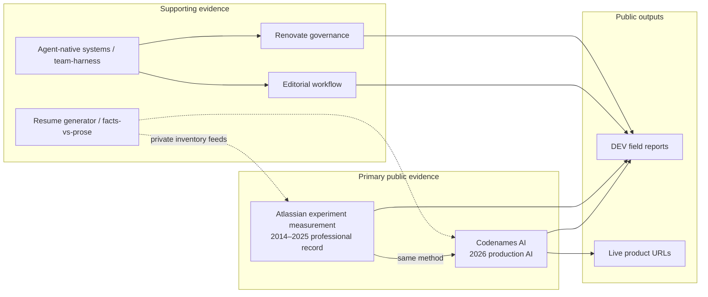

# Content & evidence migration — supporting audit

**Authority:** Executable slices, authority tags, and agent prompts live in [`.cursor/plans/2026-09-11-content-evidence-migration.plan.md`](../.cursor/plans/2026-09-11-content-evidence-migration.plan.md). This file is the **supporting audit / migration map** referenced by that plan.

**Audit date:** 2026-09-11  
**Prerequisite audits:** [`docs/redesign-baseline.md`](redesign-baseline.md) (merged [#42](https://github.com/mastermichaelt/portfolio/pull/42)); Instrument 1b visual direction (merged [#47](https://github.com/mastermichaelt/portfolio/pull/47)).

## Purpose

This document is a **migration map** from the pre-redesign portfolio content model (“recent AI side projects + field reports”) to an **evidence architecture** that presents an experienced senior software engineer whose recent AI work extends a longer-running practice around measurement, verification, experimentation, reliability, explicit contracts, and making uncertain systems dependable.

**Thesis preserved from Instrument 1b:** _Making uncertain systems dependable._

**Out of scope for this pass:** visual redesign, `/projects` or `/projects/[slug]` IA, `/articles`, `/about`, `/ecosystem` layout, route renames, canonical domain, full Atlassian case-study page.

---

## Sources consulted

| Source                                                                                                                                             | Role in this audit                                                                                                                                                                                                  |
| -------------------------------------------------------------------------------------------------------------------------------------------------- | ------------------------------------------------------------------------------------------------------------------------------------------------------------------------------------------------------------------- |
| [`docs/redesign-baseline.md`](redesign-baseline.md)                                                                                                | Primary evidence index; quantitative facts with inventory paths and fact IDs (re-read 2026-09-11)                                                                                                                   |
| [`content/*`](..), [`content/homepage.ts`](../content/homepage.ts)                                                                                 | Current committed portfolio content                                                                                                                                                                                 |
| [`DESIGN.md`](../DESIGN.md), [`.cursor/plans/archive/2026-09-11-instrument-1b.plan.md`](../.cursor/plans/archive/2026-09-11-instrument-1b.plan.md) | Presentation constraints (thesis, figure/scope pairs, no fifth project for CH 02)                                                                                                                                   |
| `mastermichaelt/resumes` (private)                                                                                                                 | **Not directly readable from this environment** (GitHub API 404). All résumé fact IDs below are cited via baseline re-verification; implementation slices must re-read live inventory files before publishing copy. |
| DEV.to profile + API                                                                                                                               | External positioning surface (tagline, pin set, 15-post corpus) — baseline §2                                                                                                                                       |

---

## Audit summary (old content → gaps)

Comparison of **current on-site content** against baseline evidence and positioning intent.

### 1. Stale positioning / language from the previous portfolio

| Location                                                       | Issue                                                                                                                                                                                                          | Provenance                                |
| -------------------------------------------------------------- | -------------------------------------------------------------------------------------------------------------------------------------------------------------------------------------------------------------- | ----------------------------------------- |
| Site-wide metadata                                             | Title suffix **“AI engineering systems”** and descriptions lead with “production AI systems, editorial workflows” — reads as AI-product-operator first, not continuity of experimentation/measurement practice | `app/layout.tsx`, `app/page.tsx` metadata |
| [`content/profile.ts`](../content/profile.ts) `bio`            | Ends on “Building production AI systems and publishing… on DEV” — thin Atlassian clause, no measurement/verification through-line                                                                              | vs homepage hero in `content/homepage.ts` |
| [`content/projects.ts`](../content/projects.ts) header comment | Still describes section kinds “after evidence audit” from pre-1b inventory; four projects are all 2026-era independent work                                                                                    | On portfolio                              |
| [`content/articles.ts`](../content/articles.ts) header comment | Points at empty `codenames-ai-guesser/docs/dev.to/published/`; live corpus is `editorial-workflow/docs/dev.to/published/` (15 files)                                                                           | Baseline §2, §6                           |
| DEV.to profile (external)                                      | Tagline: “documenting my **AI retraining journey**…” — conflicts with portfolio continuity framing                                                                                                             | Baseline §2 `DEV.to public profile`       |
| [`PRODUCT.md`](../PRODUCT.md) success criterion                | “production AI products, experimentation discipline, agent harness work” — experimentation is third in a list that reads AI-first                                                                              | On portfolio                              |

### 2. Strong baseline/resume evidence absent or materially underrepresented

| Evidence cluster                         | In inventory (fact / role)                                                                                                                                                                                                                                                                          | On portfolio today                                                                                                             |
| ---------------------------------------- | --------------------------------------------------------------------------------------------------------------------------------------------------------------------------------------------------------------------------------------------------------------------------------------------------- | ------------------------------------------------------------------------------------------------------------------------------ |
| **Experiment measurement & attribution** | `cross-flow-experiment-measurement.yml` `attribution-uplift`; `statsig-reliability.yml` `attribution-window-variance`; `loom-event-pipeline.yml` `data-recovered`, `paid-user-events-preserved`, `experiments-unblocked`; `admin-hub-experimentation.yml` `d1d6ai-increase`, `zero-incident-launch` | Homepage CH 02 panel + 2 figures only; **no** `/projects` case study, ecosystem entity, or About depth                         |
| **Loom acquisition / Post Office ML**    | `loom-acquisition.yml` `okr-10x` (`10x` OKR); `post-office-ml-surfaces.yml` `switcher-impressions` (`2.5 million`), D1D6AI uplifts `77%`/`62%`, `switcher-userid-signup-share` `40%`                                                                                                                | Ledger row mentions “10×” (`loom-acquisition` / `okr-attainment`); other metrics **absent**                                    |
| **AIM program scale**                    | `aim-participation-scale.yml` `matched-count` `3552`, `workforce-share` `~20%`; `aim-sentiment-atlas.yml` `sentiment-score` `86%`, `atlas-projects` `>60000`; `aim-pairing-ops.yml` mentor counts; `aim-cohort-launch.yml` `17` cohorts, `30+` stakeholders                                         | Ledger row (3,552 / ~20%) only; sentiment/Atlas metrics **absent**                                                             |
| **EM delivery**                          | `em-growth-delivery.yml` `direct-reports` `8–10`, `fy22-projects-shipped` `12`, `trust-score-card` `100%`                                                                                                                                                                                           | Ledger row (8–10) only                                                                                                         |
| **Codenames production depth**           | `codenames-ai-telemetry.yml`; `codenames-ai-e2e.yml` `canonical-concept-count` `350`; product docs (JUDGE flow, `ai_pipeline_outcome`, analytics workflow)                                                                                                                                          | Homepage figures (2); case study refuses hard KPIs in outcomes (intentional); **350 concepts**, pipeline vocabulary **absent** |
| **Agent-native engineering systems**     | `ai-engineering-workflows.yml` (`team-harness-plugin`, `cloud-hooks-primitive`, `hook-stack-model`); `cursor-team-marketplace` plugin                                                                                                                                                               | Homepage supporting row → `/ecosystem`; **no** dedicated project or fact-backed copy                                           |
| **Savepoints**                           | `savepoints-durable-capture.yml`; `savepoints/notes/architecture-direction.md` (prototype scope)                                                                                                                                                                                                    | **Invisible** — correctly deferred as non-shipped product                                                                      |
| **Writing scale / credibility**          | `writing-field-reports.yml` `published-report-count` `14`, `dev-followers` `2200+`, `trusted-member`; hub/API **15** posts                                                                                                                                                                          | Trusted Member on `/articles` only; follower count **absent**; 6 hub posts **missing** from `articles.ts`                      |
| **Career timeline**                      | `resumes/roles/*.yml` (7 roles, 2014–present)                                                                                                                                                                                                                                                       | Homepage ledger (7 rows); `content/timeline.ts` **empty**; no `/timeline` route                                                |

### 3. Content overweighting recent independent/AI projects vs 2014–2025 record

| Signal                             | Detail                                                                                                                                                                           |
| ---------------------------------- | -------------------------------------------------------------------------------------------------------------------------------------------------------------------------------- |
| `/projects` inventory              | **Four** case studies — all independent/agent-workflow systems (2026). **Zero** Atlassian professional work as a project slug                                                    |
| `/projects` page copy              | “Four case studies… product, editorial workflow, knowledge architecture, dependency governance” — no employer-scale experimentation narrative                                    | `app/projects/page.tsx`                               |
| `featured` flags                   | `codenames-ai` + `editorial-workflow` still `featured: true` in `content/projects.ts` while homepage demoted editorial to **Supporting work**                                    | Intentional 1b tension; confuses “flagship” semantics |
| Ecosystem (`content/ecosystem.ts`) | 24 entities — **all** map to the four 2026 projects; no Atlassian/Loom/AIM nodes                                                                                                 |
| Article `featured` (3)             | All `year: 2026`, all AI/agent tags — pairs with flagship **projects**, not professional record                                                                                  | `content/articles.ts`                                 |
| Homepage ledger                    | Professional rows exist, but **first row** is “Independent AI product engineer (2026—)” marked `current` — risk of “career restart” reading unless lead copy stresses continuity |

### 4. Residual “AI retraining” narrative vs engineering continuity

| Surface                           | Retraining / pivot read                           | Continuity read (target)                                                                |
| --------------------------------- | ------------------------------------------------- | --------------------------------------------------------------------------------------- |
| DEV tagline                       | “AI retraining journey”                           | External — portfolio cannot fix in-repo; flag for human sync                            |
| Metadata “AI engineering systems” | Product-engineer niche                            | Should subordinate AI to **verification discipline** across eras                        |
| `profile.bio`                     | “Building production AI systems…” as closing beat | Should mirror homepage: Atlassian measurement tenure **then** current AI as same method |
| Four project case studies         | Read as “what I do now” portfolio                 | Need Projects redesign to anchor **Atlassian + Codenames** as co-primary evidence       |
| Empty `timeline.ts`               | Implies career history deferred                   | Ledger partially compensates on home only                                               |

### 5. Duplicated or inconsistent claims

| A                                                | B                                                                     | Conflict                                                  |
| ------------------------------------------------ | --------------------------------------------------------------------- | --------------------------------------------------------- |
| `content/homepage.ts` `hero.lead`                | `content/profile.ts` `bio`                                            | Different framing, emphasis, and length                   |
| `content/homepage.ts` `writing[]` (3 slugs)      | `content/articles.ts` `featured: true` (3 **different** slugs)        | Two curation layers diverge                               |
| Homepage supporting                              | `projects.featured`                                                   | Editorial demoted vs still flagship on `/projects`        |
| Homepage CH 02 `dateRange` `2020 – 2025`         | Role files: SSE 2024–2025, EM 2020–2024, cross-flow facts span SWE+EM | Acceptable compression — document in human review         |
| Ledger SSE 2019 detail “Informed Pull Requests…” | Not listed in baseline fact table                                     | **Verify** against `resumes/facts/` before reuse off-home |
| `articles.ts` count **9**                        | Hub + DEV API **15**; inventory metrics **14**                        | Three-way canonical tension — do not collapse             |

### 6. Stale project / article selections or prominence

| Item                                                                                                                                   | Recommendation bucket                                                         |
| -------------------------------------------------------------------------------------------------------------------------------------- | ----------------------------------------------------------------------------- |
| 6 missing DEV posts (persist-game-state, agent-portability, experiment-retirement, build-vs-buy, requirements-qa, skills-capabilities) | Add to inventory slice or curated omit — see §5 Articles                      |
| Inferred DEV **pin set** (5 titles) overlaps **zero** with old `featured` articles; partial overlap with new homepage `writing`        | Curation rule needed                                                          |
| `cloud-agent-felt-like-hiring`                                                                                                         | Only article without `relatedProjectSlug` — orphan for Projects cross-link    |
| Resume-generator                                                                                                                       | On `/projects` but not homepage supporting (by design in 1b) — tier ambiguity |

### 7. Claims with insufficient provenance for publication

| Claim                                                     | Location                           | Issue                                                                                                                                                                                                                               | Action                                                                           |
| --------------------------------------------------------- | ---------------------------------- | ----------------------------------------------------------------------------------------------------------------------------------------------------------------------------------------------------------------------------------- | -------------------------------------------------------------------------------- |
| **`175+` monthly active players**                         | `content/homepage.ts` CH 01 figure | Baseline cites `telemetry-model-experiments` action text as **150+** floor; separate metric `monthly-active-players` = **165** with comment “Do not paste this exact count into resume prose.” **175+** not found in baseline table | **Human review** — confirm live `codenames-ai-telemetry.yml` or revert to `150+` |
| **`#1` branded search**                                   | Homepage figure                    | Sourced to `branded-search-position` `~1` — OK if scope line kept                                                                                                                                                                   | Safe with qualifier                                                              |
| **`>10%`, `9%–41%`**                                      | Homepage CH 02                     | Match baseline fact IDs                                                                                                                                                                                                             | Safe with scope lines                                                            |
| **Ledger “Informed Pull Requests”**                       | `homepage.ledger` SSE 2019 row     | Not in baseline quantitative table                                                                                                                                                                                                  | Verify fact module before About/Projects reuse                                   |
| **“Agent-native engineering systems”** supporting summary | Homepage                           | Composite claim across team-harness + MCP integrations — no single fact ID                                                                                                                                                          | Tie to `ai-engineering-workflows.yml` facts in copy edit or soften               |

---

## Content problems vs page-design problems

| Content problem (this plan)                                     | Page-design problem (defer to Claude Design)                               |
| --------------------------------------------------------------- | -------------------------------------------------------------------------- |
| Wrong/missing copy, tiers, inventory rows, metadata, provenance | Projects grid layout, case-study TOC, tier badges                          |
| Article corpus sync, `featured` vs homepage `writing` rules     | Articles index layout, series framing, in-site vs outbound                 |
| Profile/bio alignment, skill clusters, timeline facts           | About page structure, contact/identity split                               |
| Atlassian evidence not in `content/projects.ts`                 | Full `/projects/experiment-measurement` (or `/work/…`) case-study template |
| Ecosystem entity gaps (no Atlassian)                            | Entity inventory vs canvases-only IA                                       |
| `timeline.ts` stub population                                   | Whether `/timeline` route exists                                           |

---

## Migration map (target evidence architecture)

**Tier intent (content model, not yet enforced in schema):**

| Tier                      | Systems                                                                   | Public surfaces                                                   |
| ------------------------- | ------------------------------------------------------------------------- | ----------------------------------------------------------------- |
| **First-class**           | Atlassian experiment measurement; Codenames AI                            | Homepage CH 01/02; future Projects redesign hero                  |
| **Supporting**            | Editorial workflow; Renovate governance; agent-native engineering systems | Homepage supporting; `/projects`; ecosystem                       |
| **Infrastructure / meta** | Resume generator (facts-vs-prose)                                         | `/projects` only; mention in About as method, not career headline |
| **Deferred / prototype**  | Savepoints                                                                | Do not promote until product boundary ships                       |

---

## Deliverable buckets

Implementation order, PR boundaries, and agent prompts: [`.cursor/plans/2026-09-11-content-evidence-migration.plan.md`](../.cursor/plans/2026-09-11-content-evidence-migration.plan.md). Buckets below are audit findings and evidence prep — not the executable control surface.

### 1. Content updates safe to land now (no page redesign)

Small, merge-safe slices — copy/module/metadata only; existing pages consume data as-is.

| Slice ID                | Change                                                                                                                                                                                                                                                          | Files                                                     | Evidence / notes                                                   |
| ----------------------- | --------------------------------------------------------------------------------------------------------------------------------------------------------------------------------------------------------------------------------------------------------------- | --------------------------------------------------------- | ------------------------------------------------------------------ |
| **S1-metadata**         | Replace “AI engineering systems” default title/description with continuity framing (thesis-adjacent; Atlassian measurement + dependable-systems method; current AI as extension). Keep `Senior Software Engineer` headline fact from `resumes/meta/profile.yml` | `app/layout.tsx`, `app/page.tsx`, OG/Twitter if copy-only | `profile.yml`; baseline §3                                         |
| **S2-profile-bio**      | Rewrite `profile.bio` to align with homepage `hero.lead` + `leadEmphasis` without strengthening claims — subset or shared source                                                                                                                                | `content/profile.ts`                                      | `homepage.ts`; roles summary                                       |
| **S3-articles-comment** | Fix stale corpus path comment; document canonical sync rule (hub `editorial-workflow/docs/dev.to/published/` master, portfolio = curated subset)                                                                                                                | `content/articles.ts` header                              | Baseline §2                                                        |
| **S4-articles-sync**    | Add 6 missing posts as non-featured rows **or** explicit “omitted from index” list in plan-only follow-up — titles/URLs from baseline table only                                                                                                                | `content/articles.ts`                                     | Baseline §2 hub file table                                         |
| **S5-featured-flags**   | Set `editorial-workflow.featured: false` to match homepage demotion; keep Codenames featured                                                                                                                                                                    | `content/projects.ts`                                     | 1b homepage supporting order                                       |
| **S6-projects-comment** | Update `content/projects.ts` header to describe tier intent (first-class vs supporting) without schema change                                                                                                                                                   | `content/projects.ts` comment                             | This plan                                                          |
| **S7-articles-trusted** | Optional one-line Trusted Member in `profile` or home `list-note` — only if not crowding hero                                                                                                                                                                   | `content/profile.ts` or `content/homepage.ts`             | `writing-field-reports.yml` `trusted-member`                       |
| **S8-cross-links**      | Wire `relatedProjectSlug` on case-study pages from `articles[]` (data already exists; page currently ignores it) — **only if** template already supports an “Related writing” block without layout redesign                                                     | `app/projects/[slug]/page.tsx`                            | Baseline §1 “unused relatedProjectSlug” — **confirm** no IA change |

**Do not in safe-now slices:** new routes, Projects/About/Articles layout, ecosystem entity graph redesign, `tier` schema (defer to Projects slice).

---

### 2. Homepage content corrections / refinements

Preserve 1b structure (hero → two case panels → ledger → supporting + writing). No visual redesign.

| Item                             | Current                                                          | Proposed direction                                                                                                                                                     | Source                                          |
| -------------------------------- | ---------------------------------------------------------------- | ---------------------------------------------------------------------------------------------------------------------------------------------------------------------- | ----------------------------------------------- |
| **Hero lead**                    | “Growth experimentation… 2014–2025. Independent AI… since 2026.” | Keep dual-era structure; soften “since 2026” isolation — e.g. explicit “same practice” already in `leadEmphasis`; avoid “retraining”, “return to IC”, “pivot”          | User intent; `homepage.hero`                    |
| **CH 01 figure MAU**             | `175+`                                                           | Resolve against inventory — likely **`150+`** from `telemetry-model-experiments` unless live fact file documents 175+                                                  | `codenames-ai-telemetry.yml` — **human review** |
| **CH 01 outcomes on case study** | Refuses hard KPIs                                                | Optional **one** qualified figure on `/projects/codenames-ai` only if scope component exists in case-study template — else keep homepage-only                          | `DESIGN.md` figure/scope rules                  |
| **CH 02 title/date**             | “Experiment measurement” `2020 – 2025`                           | Acceptable; optional subtitle referencing Cross Flow / Growth Experiment Impact Estimation for searchability                                                           | `cross-flow-experiment-measurement.yml`         |
| **Ledger ordering**              | Independent 2026 first (`current: true`)                         | Keep reverse-chron **but** ensure hero lead establishes continuity before ledger scan                                                                                  | Content copy                                    |
| **Ledger rows**                  | Missing Loom/Post Office/Admin Hub as separate rows              | Do **not** add rows without redesign capacity — metrics belong in future Atlassian case study; ledger stays role-centric                                               | Baseline §2                                     |
| **Supporting work**              | Editorial third after Renovate + agent-native                    | Confirm order reflects demotion (editorial last among three)                                                                                                           | Current `homepage.supporting`                   |
| **Selected writing**             | 3 slugs (analytics, authority, reviewer)                         | **Pick one curation rule** (see §7): homepage `writing` vs `articles.featured` vs DEV pins — recommend homepage rule: _measurement + contracts + production telemetry_ | Baseline §2 pin table                           |
| **Unify writing curation**       | `homepage.writing` ≠ `articles.featured`                         | After rule agreed: set `featured: true` on the 3 homepage slugs; remove featured from others                                                                           | `content/articles.ts`, `content/homepage.ts`    |

---

### 3. Content / evidence for upcoming **Projects** redesign

Prepare curated modules — **do not** force into current four-card grid.

#### A. Atlassian experiment measurement (future first-class case study)

**Proposed slug:** `experiment-measurement` (or `atlassian-growth-experimentation` — human pick).  
**Not** the same as homepage `#experiment-measurement` anchor — full case study is redesign-blocked.

| Section kind                             | Evidence to draft (from inventory)                                                                                                                                                                                                                                                                                                        |
| ---------------------------------------- | ----------------------------------------------------------------------------------------------------------------------------------------------------------------------------------------------------------------------------------------------------------------------------------------------------------------------------------------- |
| Problem                                  | Attribution windows / pipeline gaps change experiment readouts — `statsig-reliability.yml` `attribution-window-variance`; `cross-flow-experiment-measurement.yml`                                                                                                                                                                         |
| Role                                     | SSE 2019–2020, EM 2020–2024, SSE 2024–2025 Growth — `resumes/roles/atlassian-*.yml`                                                                                                                                                                                                                                                       |
| Decisions                                | Authored attribution formula for Growth Experiment Impact Estimation; Cross Flow funnel observability audit — `cross-flow-experiment-measurement.yml` `attribution-uplift`                                                                                                                                                                |
| Outcomes (qualified)                     | `>10%` over-attribution exposed; `9%–41%` StatSig window variance; Loom pipeline `20%` data recovered, `~50%` paid-user events preserved, `5` experiments unblocked — `loom-event-pipeline.yml`; Admin Hub `35%` D1D6AI, zero-incident launch — `admin-hub-experimentation.yml`; Loom OKR `10x` — `loom-acquisition.yml` `okr-attainment` |
| Post Office / Switcher (optional module) | `2.5 million` impressions; D1D6AI `77%`/`62%`; `40%` signup share — `post-office-ml-surfaces.yml`                                                                                                                                                                                                                                         |
| Evidence links                           | Internal stories **not** for public paste: `resumes/stories/billing-grandfathering.yml`, `loom-analytics-alignment.yml`, `technical-bottleneck.yml` — use for draft only                                                                                                                                                                  |
| Related writing                          | None directly tagged today — consider future field report or omit                                                                                                                                                                                                                                                                         |

#### B. Codenames AI (elevate within Projects IA)

Existing `content/projects.ts` entry is strong. For redesign, add **qualified figures** as optional `ProjectFigure[]` (mirror homepage model):

| Figure                         | Fact ID                       | Notes              |
| ------------------------------ | ----------------------------- | ------------------ |
| `150+` (or approved floor) MAU | `telemetry-model-experiments` | Not rolling 165    |
| `~1` branded search position   | `branded-search-position`     | Last 28 days scope |
| `350` canonical concepts       | `canonical-concept-count`     | E2E/domain depth   |

Product doc citations for technical sections: `codenames-ai-guesser/docs/judge-ai-validation-flow.md`, `ai-pipeline-outcome.md`, `analytics-workflow.md`.

#### C. Supporting work (Projects redesign tier)

| Slug                        | Tier                                      | Redesign notes                                                                                                                                                     |
| --------------------------- | ----------------------------------------- | ------------------------------------------------------------------------------------------------------------------------------------------------------------------ |
| `editorial-workflow`        | Supporting                                | Demote visually; link to DEV series; weekly cadence from `ai-editorial-workflow.yml` `weekly-publishing-scale` (`14` reports via workflow — qualify vs hub **15**) |
| `renovate-governance`       | Supporting                                | Keep no `outcomes` section (test-enforced); ladder + 2 DEV posts                                                                                                   |
| `resume-generator`          | Infrastructure                            | Frame as facts-vs-prose method; private repo — no URL evidence                                                                                                     |
| Agent-native / team-harness | Supporting (new stub or ecosystem bridge) | Facts: `ai-engineering-workflows.yml` `team-harness-plugin`, `cloud-hooks-primitive`, `hook-stack-model`; plugin `cursor-team-marketplace` v1.10.2                 |

---

### 4. Content / evidence for upcoming **About** redesign

Prepare facts — do not dump full inventory.

| About section (future)   | Curated content                                                                                           | Sources                                                          |
| ------------------------ | --------------------------------------------------------------------------------------------------------- | ---------------------------------------------------------------- |
| Identity                 | Name, Sydney, `michael@multipliers.dev`, Senior SWE                                                       | `resumes/meta/profile.yml` → `profile.ts`                        |
| Through-line             | Measurement, verification, experimentation, explicit contracts — **same** as thesis                       | `DESIGN.md`, homepage hero                                       |
| Professional arc (short) | 2014 graduate → Growth SWE → EM → SSE → independent 2026 **continuing IC work**                           | Role YAMLs; avoid “return from management” framing               |
| AIM (optional paragraph) | Program Lead concurrent 2022–2025; 3,552 matched; ~20% Atlassians; Atlas followership among >60k projects | `aim-participation-scale.yml`, `aim-sentiment-atlas.yml`         |
| EM scope (optional)      | 8–10 direct reports; experiment-ops for cross-product Growth                                              | `em-growth-delivery.yml`                                         |
| Current work             | Codenames in production; agent-native workflows; weekly field reports                                     | `independent-codenames-ai-2026.yml`; `writing-field-reports.yml` |
| Education                | UNSW Co-op, Software Engineering 2009–2013                                                                | Ledger graduate row; DEV profile                                 |
| Skill clusters           | Revise toward measurement/platform/AI-enabled products — align with evidence                              | `profile.skillClusters` — human edit                             |
| Contact                  | Unchanged facts                                                                                           | `profile.links`                                                  |
| **Omit from About**      | Savepoints prototype; private resume repo details; full metric tables                                     |

---

### 5. Content / evidence for **Articles / Writing** redesign

| Topic                        | Detail                                                                                                                                                                                                          |
| ---------------------------- | --------------------------------------------------------------------------------------------------------------------------------------------------------------------------------------------------------------- |
| **Canonical corpus**         | 15 posts — `editorial-workflow/docs/dev.to/published/` + DEV API (baseline §2)                                                                                                                                  |
| **Inventory metric tension** | Resume facts say **14** published (`writing-field-reports.yml` `published-report-count`, `ai-editorial-workflow.yml` `published-via-workflow`); hub has **15** — reconcile before quoting “14” or “15” publicly |
| **Missing 6 slugs**          | Add to `articles.ts` with compressed summaries from frontmatter only — baseline table                                                                                                                           |
| **Pin set (5 titles)**       | Profile HTML structure — use as _signal_, not API fact; decide if Writing page shows “Pinned” subset                                                                                                            |
| **Series framing**           | “AI Engineering Field Reports” — `writing-field-reports.yml` `series-overview`; follower `2200+` if promoted                                                                                                    |
| **`argument` field**         | Homepage already uses per-slug `argument` in `homepage.writing`; extend to `Article` type in redesign for scannable index                                                                                       |
| **Cross-links**              | Every post should have `relatedProjectSlug` where applicable; assign `cloud-agent-felt-like-hiring` → agent-native or editorial                                                                                 |
| **Trusted Member**           | Keep qualification verbatim from `trusted-member` outcome                                                                                                                                                       |

**Proposed writing curation rules (pick one in human review):**

1. **Homepage-aligned:** 3 posts = measurement + governance + production analytics (current homepage slugs)
2. **Flagship-paired:** 1 post per first-class system (Codenames + Atlassian + agent-native) — requires Atlassian-tagged post or accept non-1:1
3. **DEV-pin-aligned:** 5 pinned titles — overlaps portfolio inventory partially

---

### 6. Content to retire or demote

| Item                                                                                      | Action                                         | Rationale                                                                                  |
| ----------------------------------------------------------------------------------------- | ---------------------------------------------- | ------------------------------------------------------------------------------------------ |
| `editorial-workflow.featured: true`                                                       | **Demote** to supporting tier                  | Homepage 1b already demoted; editorial is evidence of method, not co-equal career headline |
| Old homepage composition artifacts                                                        | **Already retired** (SystemsDiagram off hero)  | 1b shipped                                                                                 |
| `articles.featured` triple (model-experiments, evidence-driven-upgrades, reviewers-23/25) | **Replace** when homepage writing rule unified | Diverges from homepage                                                                     |
| Stale `codenames-ai-guesser` corpus comment                                               | **Remove**                                     | Misleading provenance                                                                      |
| “AI engineering systems” as default brand suffix                                          | **Retire** from metadata                       | Subordinates professional record                                                           |
| Ecosystem as primary nav destination                                                      | **Stay retired** (1b)                          | Link from supporting note only                                                             |
| Savepoints as portfolio project                                                           | **Do not add**                                 | `savepoints-prototype-scope`                                                               |
| Exact MAU **165**                                                                         | **Do not publish**                             | Fact comment forbids                                                                       |
| Full 24-entity inventory on ecosystem                                                     | **Candidate demotion** in ecosystem redesign   | Baseline §7 — content decision deferred to IA pass                                         |
| Resume-generator on homepage supporting                                                   | **Stay omitted**                               | Meta-infrastructure; keep on `/projects`                                                   |

---

### 7. Unresolved claims / decisions requiring human review

| #   | Decision                                         | Options                                                                             | Blocking                                     |
| --- | ------------------------------------------------ | ----------------------------------------------------------------------------------- | -------------------------------------------- |
| H1  | **MAU figure on homepage**                       | `175+` vs `150+` vs omit                                                            | S-homepage figure, Codenames project figures |
| H2  | **Public post count**                            | 14 (inventory) vs 15 (hub/API) vs “15+”                                             | Articles copy, editorial outcomes            |
| H3  | **Writing curation rule**                        | Homepage vs featured vs DEV pins                                                    | S-unify writing, Articles redesign           |
| H4  | **DEV profile tagline**                          | Sync to portfolio continuity or keep independent                                    | External only — not in repo                  |
| H5  | **Atlassian case study slug & title**            | `experiment-measurement` vs longer name                                             | Projects redesign                            |
| H6  | **Ledger SSE 2019 “Informed Pull Requests”**     | Verify fact module or soften/remove off-home                                        | About, future timeline                       |
| H7  | **Promote Loom/Post Office metrics on homepage** | Extra figures vs case-study-only                                                    | Homepage density vs Projects                 |
| H8  | **`tier` schema**                                | Add `first-class \| supporting \| infrastructure` to `Project` vs presentation-only | Projects redesign                            |
| H9  | **Canonical domain**                             | `michaeltruong.dev` vs Vercel default                                               | Metadata — out of scope                      |
| H10 | **Agent-native row**                             | Separate project slug vs ecosystem-only                                             | Projects inventory                           |
| H11 | **Populate `timeline.ts`**                       | Role-derived events vs keep ledger-only on home                                     | Timeline route decision                      |
| H12 | **Follower count `2200+` on site**               | Promote vs omit (staleness)                                                         | About / Articles                             |

---

## Claude Design handoff — Projects session

Use this brief for the next **Projects page Claude Design** pass. Goal: a Projects experience that expresses **Atlassian + Codenames + supporting work** as one evidence set — not four equal 2026 side projects.

### Design intent

- **Primary scan path:** Atlassian experiment measurement ↔ Codenames AI as two instances of the same method (uncertain → checkable → contract).
- **Supporting band:** Editorial workflow, Renovate governance, agent-native systems, resume-generator (infrastructure).
- **Do not** redesign homepage (already 1b). Projects should feel like **depth**, home like **thesis + ledger**.

### Curated evidence set (must appear in IA)

#### 1. Atlassian — experiment measurement & growth platform

**One-line thesis:** Refuse a reported experiment number until attribution is checkable.

| Evidence block                   | Key qualified figures                                                                                              | Source                                                       |
| -------------------------------- | ------------------------------------------------------------------------------------------------------------------ | ------------------------------------------------------------ |
| Cross Flow attribution audit     | `>10%` prior-approach over-attribution exposed                                                                     | `cross-flow-experiment-measurement.yml` `attribution-uplift` |
| StatSig reliability              | `9%–41%` uplift variance across attribution windows                                                                | `statsig-reliability.yml` `attribution-window-variance`      |
| Loom event pipeline              | `20%` lost experiment data recovered; `~50%` paid-user events preserved; `5` experiments unblocked                 | `loom-event-pipeline.yml`                                    |
| Loom acquisition OKR             | `10×` vs target                                                                                                    | `loom-acquisition.yml` `okr-attainment`                      |
| Admin Hub experiments            | `35%` D1D6AI increase; zero-incident, zero-restart launch (three Cross Flow experiments)                           | `admin-hub-experimentation.yml`                              |
| Post Office / Switcher (stretch) | `2.5M` monthly Switcher impressions; D1D6AI `77%`/`62%`; `40%` Loom signup share from userId Switcher              | `post-office-ml-surfaces.yml`                                |
| EM / leadership scope            | `8–10` direct reports; FY22 `12` projects / `3` complex / `100%` trust score                                       | `em-growth-delivery.yml`                                     |
| AIM (leadership parallel)        | `3,552` matched; `~20%` of Atlassians; `86%` engineering sentiment; highest-followed Atlas project among `>60,000` | `aim-participation-scale.yml`, `aim-sentiment-atlas.yml`     |

**Voice:** Professional record 2014–2025; EM period visible as experiment-ops leadership, not a detour from engineering.

**Artifacts:** No public case-study URL today — homepage `#experiment-measurement` is the only on-site copy. Design should plan for **in-site case study** with figure/scope components per `DESIGN.md`.

#### 2. Codenames AI — production AI verification

**One-line thesis:** Valid JSON is not a legal move.

| Evidence block          | Key qualified figures                                                              | Source                                           |
| ----------------------- | ---------------------------------------------------------------------------------- | ------------------------------------------------ |
| Live product            | codenames-ai.com                                                                   | On portfolio                                     |
| Validation / evaluation | Schema-first (Zod) + domain validators; model migrations as controlled experiments | `content/projects.ts`; DEV posts                 |
| Telemetry               | `150+` MAU floor (pending H1); `~1` branded search avg position (28d)              | `codenames-ai-telemetry.yml`                     |
| Domain depth            | `350` canonical English concepts                                                   | `codenames-ai-e2e.yml` `canonical-concept-count` |
| Writing                 | 3+ DEV field reports linked in project evidence                                    | `content/projects.ts` `evidence[]`               |

**Artifacts:** Live URL, DEV series, optional GitHub (if public policy allows).

#### 3. Supporting work (grouped, not co-equal)

| System                       | One-line                                                                                  | Proof surface                                            |
| ---------------------------- | ----------------------------------------------------------------------------------------- | -------------------------------------------------------- |
| **Editorial workflow**       | Human-in-the-loop weekly field reports — retrieval, critique, verification before publish | DEV posts; Notion/repo/DEV ownership model               |
| **Renovate governance**      | Classifier / investigator / maintainer with merge authority gates                         | 2 DEV posts; portfolio case study                        |
| **Agent-native engineering** | Team-harness plugin, cloud-hooks, four-layer hook stack                                   | `ai-engineering-workflows.yml`; `/ecosystem` walkthrough |
| **Resume generator**         | Facts-vs-prose inventory — generation refuses invented claims                             | Private repo; case study on `/projects`                  |

### IA recommendations for Design (non-binding)

- Two **hero case-study slots** (Atlassian, Codenames) + **supporting grid** (2×2 or list).
- Channel ids `CH 01` / `CH 02` may extend to Projects for visual continuity with home.
- Use figure/scope triples for Atlassian metrics — never bare numbers.
- Link out to DEV for depth; keep case studies scannable.
- Ecosystem link from supporting band, not primary Projects narrative.

### Explicit non-goals for Projects Design session

- Rename routes to `/work`
- Merge About + Contact
- Full ecosystem entity graph on Projects page
- Savepoints as a case study
- Invent traction KPIs for Codenames

---

## Related documents

| Document                                                                                                                        | Relationship                                                         |
| ------------------------------------------------------------------------------------------------------------------------------- | -------------------------------------------------------------------- |
| [`.cursor/plans/2026-09-11-content-evidence-migration.plan.md`](../.cursor/plans/2026-09-11-content-evidence-migration.plan.md) | **Executable plan** — slices, authority, agent prompts, human gates  |
| [`docs/redesign-baseline.md`](redesign-baseline.md)                                                                             | Evidence index and §7 open questions                                 |
| [`DESIGN.md`](../DESIGN.md)                                                                                                     | Visual/evidence qualification constraints                            |
| [`.cursor/plans/archive/2026-09-11-instrument-1b.plan.md`](../.cursor/plans/archive/2026-09-11-instrument-1b.plan.md)           | Homepage composition shipped — do not redesign                       |
| [`PRODUCT.md`](../PRODUCT.md)                                                                                                   | Product positioning — update in `content-metadata-profile` if needed |
