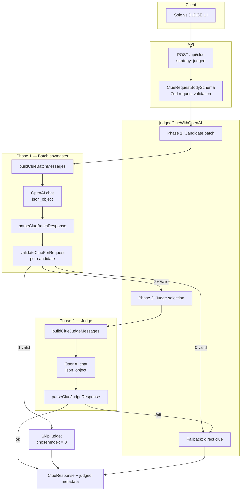
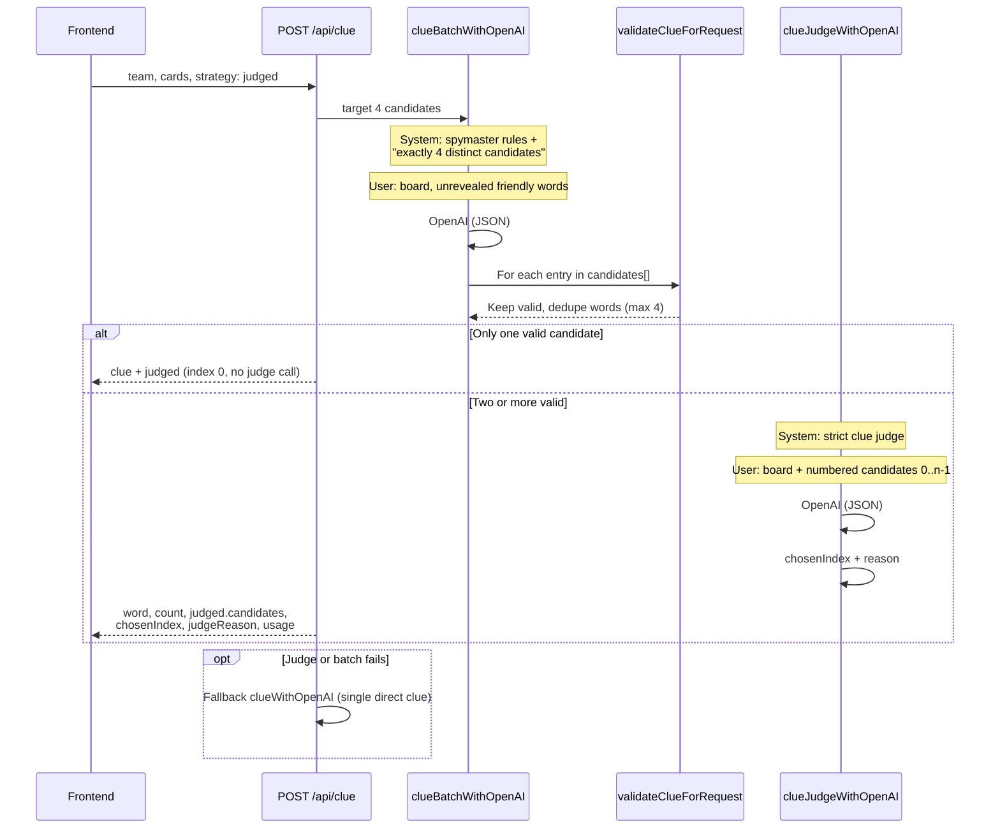

# Judge AI / validation flow (Solo vs JUDGE)

Solo vs **JUDGE** uses `strategy: "judged"` on `POST /api/clue`. The server generates several spymaster clue options in one call, runs **deterministic validation** on each, then a second **Judge** model call picks the safest option. Token usage from both calls is merged into the response.

Entry points: `frontend` (`solo_judge` → `clueStrategyForMode`) → `server/src/server/app.ts` → `getClue` → `getJudgedClue` in `server/src/ai/judgedClue.ts`.

---

## Architecture overview



---

## Prompt chain (two LLM calls)



---

## Validation layers

| Stage          | Module                                      | What it checks                                                                                                                                                                                                                 |
| -------------- | ------------------------------------------- | ------------------------------------------------------------------------------------------------------------------------------------------------------------------------------------------------------------------------------ |
| HTTP body      | `ClueRequestBodySchema`                     | `team`, `cards`, optional `strategy`                                                                                                                                                                                           |
| Batch JSON     | `clueBatchValidation.ts`                    | Valid JSON; `candidates[]` entries parsed with `ClueResponseSchema` (`word`, `count`, optional model `targets[]`)                                                                                                              |
| Per-clue rules | `clueResponseValidation.ts`                 | Single word, letters only, count ≤ max, not on board, no substring/similarity to codenames, team has unrevealed cards; `targets` → `intendedTargets` + `intentStatus` (`ok` \| `missing` \| `invalid`) via `resolveClueIntent` |
| Batch output   | `parseClueBatchResponse`                    | At least one valid candidate after filtering; dedupe by normalized word                                                                                                                                                        |
| Judge JSON     | `clueJudgeValidation.ts`                    | `{ chosenIndex, reason }`; index in `[0, candidateCount)`                                                                                                                                                                      |
| Retry loop     | `openaiClueBatch.ts` / `openaiClueJudge.ts` | Up to 4 attempts on parse/validation failure (same model)                                                                                                                                                                      |

Judge prompt rules (see `codenamesClueJudgePrompt.ts`): pick the clue that best helps the **active team** only; avoid tempting assassin, opponent, or neutral hits; prefer plausible `count`; `reason` must cite only friendly codenames.

---

## Response shape

`ClueResponse` (`server/src/types/game.ts`) — chosen clue fields are duplicated at the top level; `judged.candidates[]` holds every validated `ClueCandidate` from the batch step.

| Field                | Type                                 | Notes                                                                                                          |
| -------------------- | ------------------------------------ | -------------------------------------------------------------------------------------------------------------- |
| `word`, `count`      | string, number                       | Winning clue                                                                                                   |
| `intendedTargets`    | `string[]`                           | Board-cased unrevealed friendly codenames for the chosen clue; empty when intent is missing/invalid            |
| `intentStatus`       | `"ok"` \| `"missing"` \| `"invalid"` | Whether model `targets` were present and passed validation                                                     |
| `judged`             | object                               | Present for `strategy: "judged"`                                                                               |
| `judged.candidates`  | `ClueCandidate[]`                    | Each entry: `word`, `count`, `intendedTargets`, `intentStatus`; optional legacy `pitch` on brainstorm payloads |
| `judged.chosenIndex` | number                               | Index into `candidates`                                                                                        |
| `judged.judgeReason` | string                               | Judge model rationale                                                                                          |
| `usage`              | `GuessTokenUsage`                    | Optional; merged batch + judge (and fallback) calls                                                            |

```json
{
  "word": "LINK",
  "count": 2,
  "intendedTargets": ["BRIDGE", "CHAIN"],
  "intentStatus": "ok",
  "judged": {
    "candidates": [
      {
        "word": "ROPE",
        "count": 1,
        "intendedTargets": ["CABLE"],
        "intentStatus": "ok"
      },
      {
        "word": "LINK",
        "count": 2,
        "intendedTargets": ["BRIDGE", "CHAIN"],
        "intentStatus": "ok"
      }
    ],
    "chosenIndex": 1,
    "judgeReason": "Links two friendly words without tempting assassin or neutrals."
  },
  "usage": {
    "promptTokens": 2400,
    "completionTokens": 120,
    "totalTokens": 2520,
    "cachedPromptTokens": 0,
    "apiCalls": 2
  }
}
```

---

## Related mode: STRANGE

`strategy: "strange"` uses the same batch step (target **6** candidates) but selects via simulated guess outcomes instead of the Judge model (`strangeClue.ts`). Validation for batch candidates is identical.

---

## Key files

| Role          | Path                                                                      |
| ------------- | ------------------------------------------------------------------------- |
| Orchestration | `server/src/ai/judgedClue.ts`                                             |
| Batch LLM     | `server/src/ai/openaiClueBatch.ts`                                        |
| Judge LLM     | `server/src/ai/openaiClueJudge.ts`                                        |
| Batch prompt  | `server/src/lib/prompt/codenamesCluePrompt.ts` (`buildClueBatchMessages`) |
| Judge prompt  | `server/src/lib/prompt/codenamesClueJudgePrompt.ts`                       |
| Clue rules    | `server/src/ai/clueResponseValidation.ts`                                 |
| Batch parse   | `server/src/ai/clueBatchValidation.ts`                                    |
| Judge parse   | `server/src/ai/clueJudgeValidation.ts`                                    |
